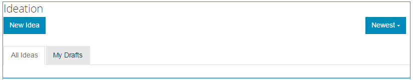

# Fonction d’orientation {#ideation-feature}

## Présentation {#introduction}

La fonctionnalité d’idéation fournit une zone pour les visiteurs de site connectés (membres de la communauté) dans l’environnement de publication pour :

* Créer des idées à partager avec la communauté.
* Vue et commentaires sur les idées.
* Suivez une idée.
* Votez pour une idée.

Cette section de la documentation décrit:

* Ajouter la fonction d’idéation à un site AEM.
* Paramètres de configuration du composant Idéation.

### Adding a Ideation to a Page {#adding-a-ideation-to-a-page}

To add a `Ideation` component to a page in author mode, use the component browser to locate

* `Communities / Ideation`

et faites-le glisser sur une page où l&#39;idée doit apparaître.

For necessary information, visit [Communities Components Basics](/help/communities/basics.md).

When the [required client-side libraries](/help/communities/ideation.md#essentials-for-client-side) are included, this is how the `Ideation` component will appear:

### Configuration d’une idéation {#configuring-an-ideation}

Select the placed `Ideation` component to access and select the `Configure` icon which opens the edit dialog.

#### Onglet Settings {#settings-tab}

Under the **[!UICONTROL Settings]** tab, specify settings for ideas and comments:

* **Autoriser les miniatures de pièces jointes**
* **Taille max. des miniatures de pièces jointes**
* **Taille d’image minimale pour la miniature**
* **Taille maximale de la miniature**
* **Autoriser les membres privilégiés**
* **Membres privilégiés autorisés**
* **Bloquer le contenu généré par l’utilisateur en mode d’édition d’auteur**
* **Titre de conceptualisation**

* Titre d’affichage de l’idée. La valeur par défaut est `Ideation`.
* **Description de la conceptualisation**

   Description à afficher en tant que sous-titre de l’idée. La valeur par défaut n’est pas une description.

* **Sujets par page**

   Définit le nombre d’idées/de publications affichées par page. La valeur par défaut est 10.

* **Modéré**

   Si cette option est cochée, la publication d’idées et de commentaires doit être approuvée avant d’apparaître sur un site de publication. Cette option n’est pas cochée par défaut.

* **Fermé**

   Si cette option est cochée, le forum d&#39;idéations est fermé aux idées et commentaires nouveaux. Cette option n’est pas cochée par défaut.

* **Éditeur de texte enrichi**

   Si cette option est cochée, les idées et les commentaires peuvent être saisis avec des annotations. Cette option n’est pas cochée par défaut.

* **Autoriser le balisage**

   If checked, allow members to add tag labels to their post (see **[!UICONTROL Tag field]** tab). Cette option n’est pas cochée par défaut.

* **Autoriser les transferts de fichiers**

   Si cette option est cochée, autorisez l’ajout de pièces jointes à l’idée ou au commentaire. Cette option n’est pas cochée par défaut.

* **Taille maximale du fichier**

   Ne s’applique que si `Allow File Uploads` la vérification est effectuée. Ce champ limite la taille (en octets) d’un fichier chargé. La valeur par défaut est 104857600 (10 Mo).

* **Types de fichier autorisés**

   Ne s’applique que si `Allow File Uploads` la vérification est effectuée. Liste séparée par des virgules d’extensions de fichiers avec le séparateur &quot;point&quot;. Par exemple : .jpg, .jpeg, .png, .doc, .docx, .pdf. Si des types de fichier sont spécifiés, ceux qui ne sont pas spécifiés ne seront pas autorisés à être téléchargés. Par défaut, aucun type de fichier n’est spécifié, de sorte que tous les types de fichier soient autorisés.

* **Taille max. du fichier image joint**

   N’est pertinent que si l’option Autoriser les téléchargements de fichiers est cochée. Taille maximale en octets pour un fichier image chargé. La valeur par défaut est 2097152 (2 Mo).

* **Permettre des réponses**

   Si cette option est cochée, autorisez les réponses aux commentaires publiés sur l’idée. Cette option n’est pas cochée par défaut.

* **Autoriser le vote**

   Si cette option est cochée, autorisez le vote sur les commentaires d&#39;une idée. Cette option n’est pas cochée par défaut.

* **Autoriser les utilisateurs à supprimer les commentaires et sujets**

   Si cette option est cochée, autorisez les membres à supprimer les commentaires et les idées qu&#39;ils ont publiés. Cette option n’est pas cochée par défaut.

* **Autoriser abonnement**

   Si cette option est cochée, incluez la fonction suivante pour les publications d’idées, ce qui permet aux membres d’être [informés](/help/communities/notifications.md) des nouvelles publications. Cette option n’est pas cochée par défaut.

* **Autoriser les abonnements par courrier électronique**

   Si cette case est cochée, autorisez les membres à être informés des nouvelles publications par courriel ([abonnement](/help/communities/subscriptions.md)). Nécessite `Allow Following` la vérification et la configuration [du](/help/communities/email.md)courrier électronique. Cette option n’est pas cochée par défaut.

* **Autoriser le vote**

   Si cette option est cochée, autorisez le vote sur les commentaires d&#39;une idée. Cette option n’est pas cochée par défaut.

* **Afficher les badges**

   Si cette option est cochée, affichez les [badges](/help/communities/implementing-scoring.md) gagnés et attribués avec l’idée d’un membre. Cette option n’est pas cochée par défaut.

* **N&#39;obtenez pas de réponses sur la page de liste**

* **Autoriser le contenu proposé**

   Si cette option est cochée, l’idée peut être identifiée comme contenu phare. Cette option n’est pas cochée par défaut.

* **Activer la mention**
* **Nombre max. de mentions**
* **Modèle des mentions de l’IU**

#### Onglet Modération utilisateur {#user-moderation-tab}

Under the **[!UICONTROL User Moderation]** tab, specify how the posted ideas and comments (user generated content) are managed. Pour plus d’informations, voir [Modération de contenu généré par les utilisateurs](/help/communities/moderate-ugc.md).

* **Refuser les publications**

   Si cette option est cochée, les modérateurs membres de confiance seront autorisés à refuser les publications et à empêcher que la publication ne s&#39;affiche sur le forum public. Cette option n’est pas cochée par défaut.

* **Fermer/rouvrir les sujets**

   Si cette option est cochée, les modérateurs membres approuvés peuvent fermer une rubrique pour apporter d’autres modifications et commentaires et peuvent également rouvrir une rubrique. Cette option n’est pas cochée par défaut.

* **Marquer les publications**

    Cette option n’est pas cochée par défaut.

* **Marquer la liste de motifs**

   Si cette option est cochée, permettez aux membres de choisir, dans une liste déroulante, la raison pour laquelle ils signalent une rubrique ou un commentaire comme inapproprié. Cette option n’est pas cochée par défaut.

* **Motif de la marque personnalisée**

   Si cette option est cochée, autorisez les membres à entrer leur propre raison de signaler une rubrique ou un commentaire comme inapproprié. Cette option n’est pas cochée par défaut.

* **Seuil de modération**

   Indiquez le nombre de fois où une rubrique ou un commentaire doit être marqué par les membres avant que les modérateurs ne soient avertis. La valeur par défaut est 1 (une fois).

* **Limite de marquage**

   Saisissez le nombre de fois où une rubrique ou un commentaire doit être marqué avant d’être masqué dans la vue publique. Si la valeur est -1, le sujet ou le commentaire marqué est toujours visible pour le public. Dans le cas contraire, cette valeur doit être supérieure ou égale au seuil de modération. La valeur par défaut est 5.

#### Onglet Champ de balise {#tag-field-tab}

Dans l’onglet **[!UICONTROL Champ de balise]**, les balises qui peuvent être appliquées, si l’option est activée dans l’onglet **[!UICONTROL Paramètres]**, sont limitées selon les espaces de noms sélectionnés.

* **Espaces de noms autorisés**

   Pertinent si `Allow Tagging` est coché sous l’onglet **[!UICONTROL Paramètres]** . Les balises pouvant être appliquées se limitent à celles liées aux catégories d’espace de noms cochées. La liste des espaces de nommage inclut &quot;Balises standard&quot; (l’espace de nommage par défaut) ainsi que &quot;Inclure toutes les balises&quot;. La valeur par défaut n’est pas cochée, ce qui signifie que tous les espaces de nommage sont autorisés.

* **Limite de suggestions**

   Entrez le nombre de balises à afficher comme suggestion au membre qui publie sur le forum. Une valeur de **-1** signifie aucune limite. La valeur par défaut est 0.

#### Onglet Paramètres de tri {#sort-settings-tab}

Sous l’onglet Paramètres **[!UICONTROL de]** tri, indiquez comment les commentaires publiés sont triés lorsqu’ils s’affichent.

* **Trier par**

   Cochez toutes les sélections de tri autorisées : `Newest, Oldest, Last Updated, Most Viewed, Most Active, Most Followed and Most Liked`. La valeur par défaut est `Newest, Oldest, Last Updated`.

* **Définir par défaut**

   Appuyez sur la touche Ctrl pour sélectionner l’une des options de tri cochées pour qu’elle s’affiche par défaut. La valeur par défaut est `Newest`.

* **Sélectionner les options de temps pour le tri Analytics**

   Appuyez sur la touche &lt;Entrée> pour sélectionner l’un des `All, Last 24 Hours, Last 7 Days, Last 30 Days`. La valeur par défaut est `All`.

## Expérience des visiteurs {#site-visitor-experience}

### Création d’idées {#creating-idea}

Comme pour toutes les fonctionnalités des Communautés, si elles ne sont pas connectées, un visiteur de site ne peut lire que des idées et vue d&#39;autres opinions (par le biais de commentaires et de votes/appréciations).

Une fois connecté, un membre peut créer une nouvelle idée.

Avant de soumettre l&#39;idée, le membre peut enregistrer un brouillon.

En sélectionnant le `Save as Draft` bouton, un brouillon est enregistré.

Lors de l’affichage des brouillons enregistrés dans l’ `My Drafts` onglet, sélectionnez `Read More` de revenir en mode d’édition :

#### Fournir des commentaires {#providing-feedback}

Une fois l&#39;idée publiée, d&#39;autres membres peuvent se connecter, ouvrir l&#39;idée ( `Read More`) et aimer l&#39;idée, ajoutant ainsi au nombre de votes, et faire des commentaires.

### Informations supplémentaires {#additional-information}

More information may be found on the [Ideation Essentials](/help/communities/ideation.md) page for developers.

Pour des informations sur la modération des sujets et des commentaires publiés, reportez-vous à la section [Modération du contenu généré par l’utilisateur](/help/communities/moderate-ugc.md).

Pour baliser les sujets et les commentaires publiés, voir [Balisage de contenu généré par l’utilisateur](/help/communities/tag-ugc.md).
