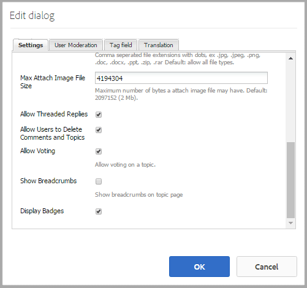
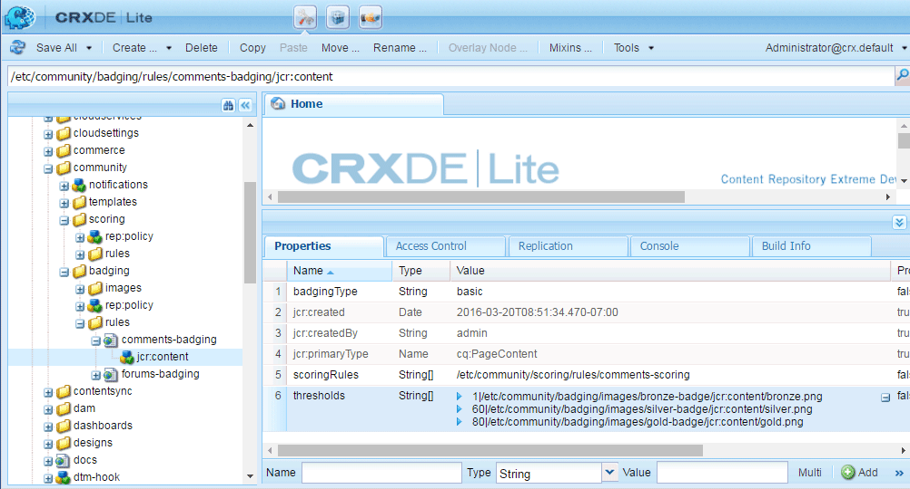
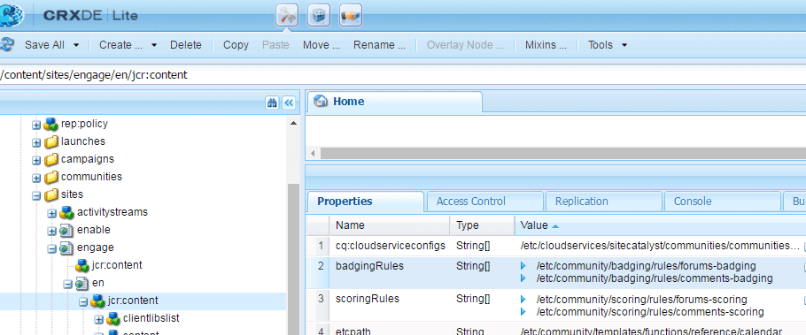
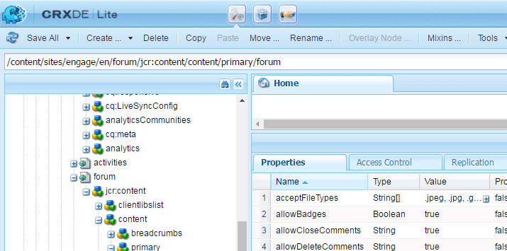
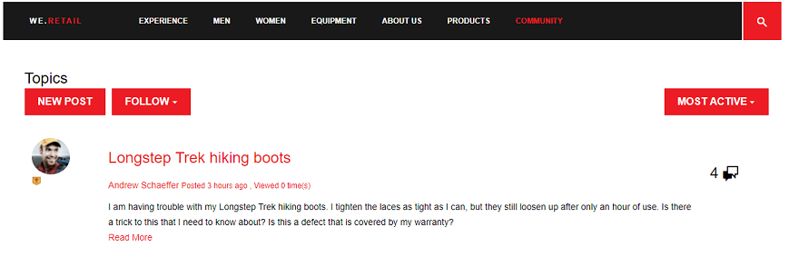

# Notation et badges de Communities {#communities-scoring-and-badges}

## Vue d’ensemble {#overview}

La fonction de notation et de badges d’AEM Communities permet d’identifier et de récompenser les membres de la communauté.

Les principaux aspects de la notation et des badges sont les suivants :

* [Attribuez des badges](#assign-and-revoke-badges) pour identifier le rôle d’un membre dans la communauté.

* [Attribution de badges de base](#enable-scoring) aux membres pour les encourager à participer (quantité de contenu créé).

* [Attribution avancée de badges](/help/communities/advanced.md) pour identifier les membres en tant qu&#39;experts (qualité du contenu créé).

**Notez** l’attribution de badges n’est [pas activée par défaut](/help/communities/implementing-scoring.md#main-pars-text-237875536).

>[!CAUTION]
>
>La structure d’implémentation visible dans CRXDE Lite peut être modifiée une fois que l’interface utilisateur est disponible.

## Badges {#badges}

Les insignes sont placés sous le nom d&#39;un membre pour indiquer son rôle ou sa place dans la communauté. Les badges peuvent être affichés sous forme d’image ou de nom. Lorsqu’il est affiché sous forme d’image, le nom est inclus en tant que texte secondaire pour l’accessibilité.

Par défaut, les badges se trouvent dans le référentiel à l’emplacement suivant :

* `/libs/settings/community/badging/images`

S’ils sont stockés à un autre emplacement, ils doivent être accessibles en lecture à tous.

Les badges sont différenciés dans le contenu créé par l’utilisateur, qu’ils aient été attribués ou gagnés conformément aux règles. Actuellement, les badges attribués apparaissent sous forme de texte et les badges gagnés sous forme d’image.

### Interface utilisateur de gestion des badges {#badge-management-ui}

La console Communautés [Badges](/help/communities/badges.md) permet d’ajouter des badges personnalisés qui peuvent être affichés pour un membre lorsqu’ils sont gagnés (attribués) ou lorsqu’il assume un rôle spécifique dans la communauté (attribué).

### Badges attribués {#assigned-badges}

Les badges basés sur les rôles sont attribués par un administrateur aux membres de la communauté en fonction de leur rôle dans la communauté.

Les badges attribués sont stockés dans le [SRP](/help/communities/srp.md) sélectionné et ne sont pas directement accessibles. Jusqu’à ce qu’une interface utilisateur graphique soit disponible, le seul moyen d’attribuer des badges basés sur les rôles est de le faire avec du code ou cURL. Pour obtenir des instructions sur cURL, consultez la section intitulée [&#x200B; Attribuer et révoquer des badges &#x200B;](#assign-and-revoke-badges).

Cette version comprend trois badges basés sur les rôles :

* **modérateur**
  `/libs/settings/community/badging/images/moderator/jcr:content/moderator.png`

* **gestionnaire de groupe**
  `/libs/settings/community/badging/images/group-manager/jcr:content/group-manager.png`

* **membre privilégié**
  `/libs/settings/community/badging/images/privileged-member/jcr:content/privileged-member.png`

  

### Badges attribués {#awarded-badges}

Les badges basés sur la récompense sont attribués par le service de notation aux membres de la communauté en fonction des règles appliquées à leur activité dans la communauté.

Pour que les badges apparaissent comme une récompense pour l’activité, deux choses doivent se produire :

* Le badge doit être [activé](#enableforcomponent) pour le composant de fonction.
* Les règles de score et de badge doivent être [appliquées](#applytopage) à la page (ou à l’ancêtre) sur laquelle le composant est placé.

Cette version comprend trois badges basés sur la récompense :

* **or**
  `/libs/settings/community/badging/images/gold-badge/jcr:content/gold.png`

* **argent**
  `/libs/settings/community/badging/images/silver-badge/jcr:content/silver.png`

* **bronze**
  `/libs/settings/community/badging/images/bronze-badge/jcr:content/bronze.png`

  

>[!NOTE]
>
>Les règles de notation peuvent être configurées pour attribuer des points négatifs aux publications signalées comme inappropriées et affecter ainsi la valeur de la note. Cependant, une fois qu’un badge est gagné, il ne sera pas automatiquement supprimé en raison d’une réduction du point de score ou de modifications des règles de score.
>
>Les badges attribués peuvent être révoqués de la même manière que les badges attribués. Voir la section [Attribuer et révoquer des badges](#assign-and-revoke-badges). Les améliorations futures incluront une interface utilisateur pour gérer les badges des membres.

### Badges personnalisés {#custom-badges}

Les badges personnalisés peuvent être installés à l’aide de la console [Badges](/help/communities/badges.md) et être attribués ou spécifiés dans des règles de badge.

Une fois installés à partir de la console Badges , les badges personnalisés sont automatiquement répliqués dans l’environnement de publication.

## Activer la notation {#enable-scoring}

La notation n’est pas activée par défaut. Les étapes de base pour configurer et activer la notation et l’attribution de badges sont les suivantes :

* Identifiez les règles pour les points d’apprentissage ([règles de notation](#scoring-rules)).
* Pour les points accumulés par règle de score, attribuez [badges](#badges) ([règles de badges](#badging-rules)).

* [Appliquez les règles de score et de badge à un site communautaire](#apply-rules-to-content).
* [Activer la création de badges pour les fonctionnalités de la communauté](#enable-badges-for-component).

Consultez la section [Test rapide](#quick-test) pour activer la notation pour un site communautaire à l’aide des règles de notation et de badge par défaut pour les forums et les commentaires.

### Application de règles au contenu {#apply-rules-to-content}

Pour activer la notation et les badges, ajoutez les propriétés `scoringRules` et `badgingRules` à n’importe quel nœud de l’arborescence de contenu du site.

Si le site est déjà publié, après avoir appliqué toutes les règles et activé les composants, republiez le site.

Les règles qui s’appliquent à un composant activé pour les badges sont celles qui s’appliquent au nœud actuel ou à son ancêtre.

Si le nœud est de type `cq:Page` (recommandé), ajoutez les propriétés à son nœud `jcr:content` à l’aide de CRXDE|Lite.

| **Propriété** | **Type** | **Description** |
|---|---|---|
| badgingRules | Chaîne | une liste de tableaux de [règles de badge](#badging-rules) |
| scoringRules | Chaîne | une liste de tableaux de [règles de score](#scoring-rules) |

>[!NOTE]
>
>Si une règle de notation semble n’avoir aucun effet sur l’attribution de badges, assurez-vous que la règle de notation n’a pas été bloquée par la propriété scoringRules de la règle de notation. Reportez-vous à la section intitulée [&#x200B; Règles de badge &#x200B;](#badging-rules).

### Activer les badges pour le composant {#enable-badges-for-component}

Les règles de score et de badge sont en vigueur uniquement pour les instances de composants qui ont activé le badge en modifiant la configuration du composant en [mode création](/help/communities/author-communities.md).

Une propriété booléenne, `allowBadges`, active/désactive l’affichage des badges pour une instance de composant. Vous pouvez la configurer dans la [boîte de dialogue de modification de composant](/help/communities/author-communities.md) pour les composants de forum, QnA et de commentaire à l’aide d’une case à cocher intitulée **Afficher les badges**.

#### Exemple : allowBadges pour l’instance du composant Forum {#example-allowbadges-for-forum-component-instance}



>[!NOTE]
>
>Tout composant peut être recouvert pour afficher les badges à l’aide du code HBS disponible dans les forums, QnA et les commentaires, par exemple.

## Règles de notation {#scoring-rules}

Les règles de notation sont la base de la notation pour l’attribution de badges.

Chaque règle de notation est une liste d’une ou de plusieurs sous-règles. Les règles de score sont appliquées au contenu du site de la communauté pour identifier les règles à appliquer lorsque les badges sont activés.

Les règles de score sont héritées, mais ne s’additionnent pas. Par exemple :

* Si page2 contient la règle de score2 et que page1 ancêtre contient la règle de score1.
* Une action sur un composant page2 appelle à la fois règle1 et règle2.
* Si les deux règles contiennent des sous-règles applicables pour la même `topic/verb` :

   * Seule la sous-règle de règle 2 affecte le score.
   * Les scores des deux sous-règles ne sont pas ajoutés.

Lorsqu’il existe plusieurs règles de notation, les notes sont conservées séparément pour chaque règle.

Les règles de score sont des nœuds de type `cq:Page` avec des propriétés sur son nœud `jcr:content` qui spécifient la liste des sous-règles qui le définissent.

Les scores sont stockés dans SRP.

>[!NOTE]
>
>Bonne pratique : nommez de manière unique chaque règle de notation.
>
>Les noms des règles de score doivent être globalement uniques et ne doivent pas se terminer par le même nom.
>
>Exemple de ce qu *il ne faut pas* :
>
>/libs/settings/community/scoring/rules/site1/forums-scoring>/libs/settings/community/scoring/rules/site2/forums-scoring

### Sous-Règles De Notation {#scoring-sub-rules}

Les sous-règles de notation contiennent les propriétés qui détaillent les valeurs de participation à la communauté.

Chaque sous-règle de notation identifie :

* Quelles sont les activités suivies ?
* Quelle fonction communautaire spécifique est concernée ?
* Combien de points sont attribués ?

Par défaut, les points sont attribués au membre qui effectue l’action, sauf si la sous-règle spécifie que le propriétaire du contenu reçoit les points ( `forOwner`).

Chaque sous-règle peut être incluse dans une ou plusieurs règles de notation.

Le nom de la sous-règle suit généralement le modèle d’utilisation d’un *objet*, *objet* et *verbe*. Par exemple :

* member-comment-create
* member-receive-vote

Les sous-règles sont des nœuds de type `cq:Page` avec des propriétés sur son nœud `jcr:content` qui spécifient les [verbes et rubriques](#topics-and-verbs) .

<table>
 <tbody>
  <tr>
   <th>Propriété</th>
   <th>Type</th>
   <th> Description de la valeur</th>
  </tr>
  <tr>
   <td><i><code>VERB</code></i></td>
   <td>Long</td>
   <td>
    <ul>
     <li>obligatoire ; le verbe correspond à une action d’événement</li>
     <li>il doit y avoir au moins une propriété de verbe</li>
     <li>le verbe doit être saisi en MAJUSCULES</li>
     <li>il peut y avoir plusieurs propriétés de verbe, mais pas de doublons</li>
     <li>la valeur est le score à appliquer à cet événement</li>
     <li>la valeur peut être positive ou négative</li>
     <li>Une liste des verbes pris en charge dans cette version se trouve dans la section <a href="#topics-and-verbs">Sujets et verbes</a></li>
    </ul> </td>
  </tr>
  <tr>
   <td><code>topics</code></td>
   <td>Chaîne</td>
   <td>
    <ul>
     <li>facultatif ; limite la sous-règle aux composants de communauté identifiés par des rubriques d’événement</li>
     <li>si spécifié : la valeur est une chaîne à plusieurs valeurs de rubriques d’événement</li>
     <li>Pour obtenir la liste des rubriques de cette version, reportez-vous à la section <a href="#topics-and-verbs">Rubriques et verbes</a></li>
     <li>la valeur par défaut est d’appliquer à toutes les rubriques associées aux verbes</li>
    </ul> </td>
  </tr>
  <tr>
   <td><code>forOwner</code></td>
   <td>Booléen</td>
   <td>
    <ul>
     <li>facultatif ; non pertinent lorsque le membre agit sur du contenu qu’il possède</li>
     <li>si la valeur est true, appliquez le score au propriétaire du contenu sur lequel une action est effectuée</li>
     <li>si la valeur est false, appliquer le score au membre qui effectue l'action</li>
     <li>la valeur par défaut est false</li>
    </ul> </td>
  </tr>
  <tr>
   <td><code>scoringType</code></td>
   <td>Chaîne</td>
   <td>
    <ul>
     <li>facultatif ; identifie le moteur de notation</li>
     <li>si « de base », indique le moteur de notation en fonction de la quantité
      <ul>
       <li>inclus dans la version</li>
      </ul> </li>
     <li>si « avancé », spécifie le moteur de notation en fonction de la qualité et de la quantité
      <ul>
       <li>nécessite un <a href="/help/communities/advanced.md"> package supplémentaire </a></li>
      </ul> </li>
     <li>la valeur par défaut est « de base »</li>
    </ul> </td>
  </tr>
 </tbody>
</table>

### Règles et sous-règles de notation incluses {#included-scoring-rules-and-sub-rules}

Cette version comprend deux règles de notation pour la [fonction Forum](/help/communities/functions.md#forum-function) (une pour chacun des composants Forum et Commentaires de la fonction Forum) :

1. /libs/settings/community/scoring/rules/comments-scoring

   * subRules[] =
/libs/settings/community/scoring/rules/sub-rules/member-comment-create
/libs/settings/community/scoring/rules/sub-rules/member-receive-vote
/libs/settings/community/scoring/rules/sub-rules/member-give-vote
/libs/settings/community/scoring/rules/sub-rules/member-is-mediated

1. /libs/settings/community/scoring/rules/forums-scoring

   * subRules[] =
/libs/settings/community/scoring/rules/sub-rules/member-forum-create
/libs/settings/community/scoring/rules/sub-rules/member-receive-vote
/libs/settings/community/scoring/rules/sub-rules/member-give-vote
/libs/settings/community/scoring/rules/sub-rules/member-is-mediated

**Remarques:**

* Les nœuds `rules` et `sub-rules` sont de type cq:Page.

* `subRules` est un attribut de type chaîne[] sur le nœud `jcr:content` de la règle.

* `sub-rules` peuvent être partagées entre différentes règles de notation.
* `rules` doit se trouver dans un emplacement de référentiel avec des autorisations en lecture pour tout le monde.

   * Les noms des règles doivent être uniques, quel que soit l’emplacement.

### Activer les règles de score personnalisées {#activating-custom-scoring-rules}

Toute modification ou tout ajout apporté aux règles de score ou aux sous-règles dans l’environnement de création doit être installé sur l’instance de publication.

## Règles de badge {#badging-rules}

Les règles de badge lient les règles de score aux badges en spécifiant :

* Règle de notation
* Score nécessaire pour obtenir un badge spécifique

Les règles de badge sont des nœuds de type `cq:Page` avec des propriétés sur son nœud `jcr:content` qui corrélent les règles de score aux scores et aux badges.

Les règles relatives aux badges se composent d’une propriété `thresholds` obligatoire qui consiste en une liste ordonnée de scores mappés aux badges. Les scores doivent être classés par ordre croissant. Par exemple :

* `1|/libs/settings/community/badging/images/bronze-badge/jcr:content/bronze.png`

   * Un badge bronze est attribué pour gagner un point.

* `60|/libs/settings/community/badging/images/silver-badge/jcr:content/silver.png`

   * Un badge argent est attribué lorsque 60 points ont été accumulés.

* `80|/libs/settings/community/badging/images/gold-badge/jcr:content/gold.png`

   * Un badge or est attribué lorsque 80 points ont été accumulés.

Les règles de badge sont associées à des règles de score, qui déterminent la façon dont les points s’accumulent. Consultez la section intitulée [Appliquer des règles au contenu](#apply-rules-to-content).

La propriété `scoringRules` d’une règle de badge limite simplement les règles de score pouvant être associées à cette règle de badge spécifique.

>[!NOTE]
>
>Bonne pratique : créez des images de badge uniques à chaque site AEM.



<table>
 <tbody>
  <tr>
   <th>Propriété</th>
   <th>Type</th>
   <th>Description de la valeur</th>
  </tr>
  <tr>
   <td>seuils</td>
   <td>Chaîne</td>
   <td><em>(obligatoire)</em> Chaîne à plusieurs valeurs de la forme 'nombre|chemin'
    <ul>
     <li>nombre = score</li>
     <li>| = le graphique linéaire vertical (U+007C)</li>
     <li>path = chemin complet vers la ressource image de badge</li>
    </ul> Les chaînes doivent être classées de sorte que les nombres prennent de plus en plus de valeur et qu’aucun espace vide n’apparaisse entre le nombre et le chemin d’accès.<br /> Exemple d’entrée :<br /> <code>80|/libs/settings/community/badging/images/gold-badge/jcr:content/gold.png</code></td>
  </tr>
  <tr>
   <td>badgingType</td>
   <td>Chaîne</td>
   <td><em>(facultatif) </em> identifie le moteur de notation comme étant « de base » ou « avancé ». Si vous souhaitez utiliser le moteur de notation avancé, reportez-vous à la section <a href="/help/communities/advanced.md"> Notation avancée et badges</a>. La valeur par défaut est « de base ».</td>
  </tr>
  <tr>
   <td>scoringRules</td>
   <td>Chaîne</td>
   <td>(<em>facultatif</em>) Chaîne à plusieurs valeurs permettant de limiter la règle de badge aux événements de score identifiés par les règles de score</td>
  </tr>
 </tbody>
</table>

### Règles de badge incluses {#included-badging-rules}

Cette version comprend deux règles de badge qui correspondent aux [règles de notation des forums et des commentaires](#includedscoringrules).

* `/libs/settings/community/badging/rules/comments-badging`

* `/libs/settings/community/badging/rules/forums-badging`

**Remarques:**

* `rules` nœuds sont de type cq:Page.
* `rules` doit se trouver dans un emplacement de référentiel avec des autorisations en lecture pour tout le monde.

   * Les noms des règles doivent être uniques, quel que soit l’emplacement.

### Activation des règles de badge personnalisées {#activating-custom-badging-rules}

Toute modification ou tout ajout apporté aux règles de badge ou aux images dans l’environnement de création doit être installé sur l’instance de publication.

## Affecter et révoquer des badges {#assign-and-revoke-badges}

Les badges peuvent être attribués aux membres à l’aide de la console [membres](/help/communities/members.md#badges-tab) ou par programmation à l’aide de commandes cURL.

Les commandes cURL suivantes indiquent ce qui est nécessaire pour une requête HTTP d’attribution et de révocation de badges. Le format de base est :

cURL -i -X POST -H *header* -u *signin* -F *operation* -F *badge* *member-profile-url*

*header* = « Accepter :application/json »
en-tête personnalisé à transmettre au serveur (obligatoire)

*signin* = administrator-id:password
par exemple, admin:admin

*operation* = « :operation=social:assignBadge » OU « :operation=social:deleteBadge »

*badge* = « badgeContentPath=*badge-image-file* »

*badge-image-file* = emplacement du fichier image de badge dans le référentiel
par exemple, /libs/settings/community/badging/images/moderniator/jcr:content/moderator.png

*member-profile-url* = point d’entrée pour le profil du membre lors de la publication
par exemple, https://&lt;server>:&lt;port>/home/users/community/riley/profile.social.json

>[!NOTE]
>
>Le *member-profile-url* :
>
>* Peut faire référence à une instance de création si le [service de tunnel](/help/communities/users.md#tunnel-service) est activé.
>* Peut être un nom obscur et aléatoire (voir [&#x200B; Liste de contrôle de sécurité](/help/sites-administering/security-checklist.md#verify-that-you-are-not-disclosing-personally-identifiable-information-in-the-users-home-path) concernant l’ID autorisable.

### Exemples : {#examples}

#### Attribuer un badge de modérateur {#assign-a-moderator-badge}

```shell
curl -i -X POST -H "Accept:application/json" -u admin:admin -F ":operation=social:assignBadge" -F "badgeContentPath=/libs/settings/community/badging/images/moderator/jcr:content/moderator.png" /home/users/community/updcs9DndLEI74DB9zsB/profile.social.json
```

#### Révoquer un badge argent attribué {#revoke-an-assigned-silver-badge}

```shell
curl -i -X POST -H "Accept:application/json" -u admin:admin -F ":operation=social:deleteBadge" -F "badgeContentPath=/libs/settings/community/badging/images/silver/jcr:content/silver.png" /home/users/community/updcs9DndLEI74DB9zsB/profile.social.json
```

>[!NOTE]
>
>L’utilisation de cURL pour attribuer et révoquer des badges fonctionne pour n’importe quelle image de badge, mais lorsqu’ils sont attribués au lieu d’être gagnés, ils sont marqués comme étant attribués à des badges et gérés en conséquence.

## Notation et badges pour les composants personnalisés {#scoring-and-badges-for-custom-components}

Des règles de score et de badge peuvent être créées pour les composants personnalisés en associant les rubriques d’événement créées pour le composant à des verbes.

## Sujets et verbes {#topics-and-verbs}

Lorsque les membres interagissent avec les fonctionnalités des communautés, des événements sont envoyés pour déclencher des écouteurs asynchrones, tels que des notifications et des scores.

L’instance SocialEvent d’un composant enregistre les événements comme des `actions` qui se produisent pour un `topic`. SocialEvent inclut une méthode pour renvoyer un `verb` associé à l’action. Il existe une relation *n-1* entre `actions` et `verbs`.

Pour les composants de communautés diffusés, les tableaux suivants décrivent les `verbs` définis pour chaque `topic` disponible pour être utilisé dans les [sous-règles de notation](#scoring-sub-rules).

>[!NOTE]
>
>Une nouvelle propriété booléenne, `allowBadges`, active/désactive l’affichage des badges pour une instance de composant. Vous pouvez le configurer dans les boîtes de dialogue de modification de composant [mises à jour](/help/communities/author-communities.md) via une case à cocher intitulée **Afficher les badges**.

Composant **[Calendrier](/help/communities/calendar.md)**
SocialEvent `topic`= com/adobe/cq/social/calendar

| **Verbe** | **Description** |
|---|---|
| POST | le membre crée un événement de calendrier |
| AJOUTER | commentaires du membre sur un événement de calendrier |
| MISE À JOUR | l’événement ou le commentaire de calendrier du membre est modifié |
| SUPPRIMER | l&#39;événement ou le commentaire de calendrier du membre est supprimé |

Composant **[Comments](/help/communities/comments.md)**
SocialEvent `topic`= com/adobe/cq/social/comment

| **Verbe** | **Description** |
|---|---|
| POST | le membre crée un commentaire |
| AJOUTER | réponses du membre au commentaire |
| MISE À JOUR | le commentaire du membre est modifié |
| SUPPRIMER | le commentaire du membre est supprimé |

**[composant Bibliothèque de fichiers](/help/communities/file-library.md)**
SocialEvent `topic`= com/adobe/cq/social/fileLibrary

| **Verbe** | **Description** |
|---|---|
| POST | Le membre crée un dossier. |
| JOINDRE | le membre télécharge un fichier |
| MISE À JOUR | Le membre met à jour un dossier ou un fichier |
| SUPPRIMER | Le membre supprime un dossier ou un fichier |

Composant **[Forum](/help/communities/forum.md)**
SocialEvent `topic`= com/adobe/cq/social/forum

| **Verbe** | **Description** |
|---|---|
| POST | le membre crée une rubrique de forum |
| AJOUTER | réponses des membres au sujet du forum |
| MISE À JOUR | la rubrique ou la réponse du forum du membre est modifiée |
| SUPPRIMER | le sujet du forum du membre ou la réponse est supprimé |

Composant **[Journal](/help/communities/blog-feature.md)**
SocialEvent `topic`= com/adobe/cq/social/journal

| **Verbe** | **Description** |
|---|---|
| POST | le membre crée un article de blog |
| AJOUTER | commentaires d&#39;un membre sur un article de blog |
| MISE À JOUR | l’article de blog ou le commentaire du membre est modifié |
| SUPPRIMER | l’article de blog ou le commentaire du membre est supprimé |

Composant **[QnA](/help/communities/working-with-qna.md)**
SocialEvent `topic` = com/adobe/cq/social/qna

| **Verbe** | **Description** |
|---|---|
| POST | Le membre crée une question QnA. |
| AJOUTER | Le membre crée une réponse QnA. |
| MISE À JOUR | La question ou réponse QnA du membre est modifiée |
| SÉLECTIONNER | réponse du membre sélectionnée |
| DÉSÉLECTIONNER | la réponse du membre est désélectionnée |
| SUPPRIMER | La question ou la réponse QnA du membre est supprimée |

**[Composant Révisions](/help/communities/reviews.md)**
SocialEvent `topic`= com/adobe/cq/social/review

| **Verbe** | **Description** |
|---|---|
| POST | le membre crée la révision |
| MISE À JOUR | la révision du membre est modifiée |
| SUPPRIMER | l&#39;évaluation du membre est supprimée |

Composant **[Évaluation](/help/communities/rating.md)**
SocialEvent `topic`= com/adobe/cq/social/tally/rating

| **Verbe** | **Description** |
|---|---|
| AJOUTER UNE ÉVALUATION | le contenu du membre a été amélioré |
| SUPPRIMER LA NOTE | le contenu du membre a été rétrogradé |

**[Composante de vote](/help/communities/voting.md)**
SocialEvent `topic`= com/adobe/cq/social/tally/votes

| **Verbe** | **Description** |
|---|---|
| AJOUTER UN VOTE | le contenu du membre a été mis aux voix |
| SUPPRIMER LE VOTE | le contenu du membre a été rejeté |

**Composants activés pour la modération**
SocialEvent `topic`= com/adobe/cq/social/modation

| **Verbe** | **Description** |
|---|---|
| DENY | le contenu du membre est refusé |
| SIGNALER COMME INAPPROPRIÉ | le contenu du membre est marqué |
| SIGNALER-COMME-INAPPROPRIÉ | le contenu du membre n’est pas marqué |
| ACCEPTER | le contenu du membre est approuvé par le modérateur |
| FERMER | le membre ferme le commentaire aux modifications et aux réponses |
| OUVRIR | le membre ouvre à nouveau le commentaire |

### Événements de composant personnalisés {#custom-component-events}

Pour un composant personnalisé, un événement social est instancié afin d’enregistrer les événements du composant en tant que `actions` qui se produisent pour un `topic`.

Pour prendre en charge la notation, l’événement social doit remplacer la méthode `getVerb()` afin qu’un `verb` approprié soit renvoyé pour chaque `action`. Les `verb` renvoyées pour une action peuvent être celles qui sont couramment utilisées (par exemple, `POST`) ou celles qui sont spécialisées pour le composant (par exemple, `ADD RATING`). Il existe une relation *n-1* entre `actions` et `verbs`.

## Résolution des problèmes {#troubleshooting}

### Les badges n’apparaissent pas {#badges-are-not-appearing}

Si des règles de score et de badge ont été appliquées au contenu du site web, mais que des badges ne sont pas attribués pour une activité, assurez-vous que les badges ont été activés pour l’instance de ce composant.

Voir [Activation des badges pour le composant](#enable-badges-for-component).

### La règle de notation est sans effet {#scoring-rule-has-no-effect}

Si des règles de score et de badge ont été appliquées au contenu du site web et que des badges sont attribués à certaines actions, mais pas à d’autres, vérifiez que la règle de badge n’a pas limité les règles de score auxquelles elle s’applique.

Voir la propriété `scoringRules` de [Règles de badge](#badging-rules).

### Frappe Sensible À La Casse {#case-sensitive-typo}

La plupart des propriétés et des valeurs, en particulier les verbes, sont sensibles à la casse. Les verbes doivent être entièrement en MAJUSCULES lorsqu’ils sont utilisés dans une sous-règle de notation.

Si la fonctionnalité ne fonctionne pas comme prévu, assurez-vous que les données ont été correctement saisies.

## Test rapide {#quick-test}

Il est possible d’essayer rapidement de marquer et de badger à l’aide du site [Tutoriel de prise en main](/help/communities/getting-started.md) (engage) :

* Accédez à CRXDE Lite en mode de création.
* Accédez à la page de base :

   * /content/sites/engage/en/jcr:content

* Ajoutez la propriété badgingRules :

   * **Nom** : `badgingRules`
   * **Type** : `String`
   * Sélectionner **Multi**
   * Sélectionnez **Ajouter**
   * Enter `/libs/settings/community/badging/rules/forums-badging`
   * Sélectionner **+**
   * Enter `/libs/settings/community/badging/rules/comments-badging`
   * Sélectionnez **OK**.

* Ajoutez la propriété scoringRules :

   * **Nom** : `scoringRules`
   * **Type** : `String`
   * Sélectionner **Multi**
   * Sélectionnez **Ajouter**
   * Enter `/libs/settings/community/scoring/rules/forums-scoring`
   * Sélectionner **+**
   * Enter `/libs/settings/community/scoring/rules/comments-scoring`
   * Sélectionnez **OK**.

* Sélectionnez **Enregistrer tout**.



Ensuite, assurez-vous que les composants forum et commentaires permettent l’affichage de badges :

* Toujours à l’aide de CRXDE Lite.
* Accédez au composant de forum

   * `/content/sites/engage/en/forum/jcr:content/content/primary/forum`

* Ajoutez la propriété booléenne allowBadges , si nécessaire, et assurez-vous qu’elle est définie sur true.

   * **Nom** : `allowBadges`
   * **Type** : `Boolean`
   * **Valeur** : `true`



Ensuite, [republiez](/help/communities/sites-console.md#publishing-the-site) le site de la communauté.

Enfin,

* Accédez au composant sur l’instance de publication.
* Connectez-vous en tant que membre de la communauté (par exemple, weston.mccall@dodgit.com / mot de passe).
* Publier une nouvelle rubrique de forum.
* La page doit être actualisée pour que le badge s’affiche.

   * Déconnectez-vous et connectez-vous en tant que membre différent de la communauté (par exemple : aaron.mcdonald@mailinator.com/password).

* Sélectionnez le forum.

Cela devrait permettre au membre de la communauté de gagner un badge en bronze visible avec sa publication sur le forum, car le premier seuil de la règle de badge des premiers forums est un score de 1.



## Informations supplémentaires {#additional-information}

Vous trouverez plus d’informations à ce sujet sur la page [Notions fondamentales sur la notation et les badges](/help/communities/configure-scoring.md) destinée aux développeurs.

Pour plus d’informations sur le moteur de notation avancé, voir [Notation avancée et pastilles](/help/communities/advanced.md).

Le tableau des scores configurable [composant](/help/communities/enabling-leaderboard.md) et [fonction](/help/communities/functions.md#leaderboard-function) simplifie l’affichage des membres et de leurs scores sur un site communautaire.
