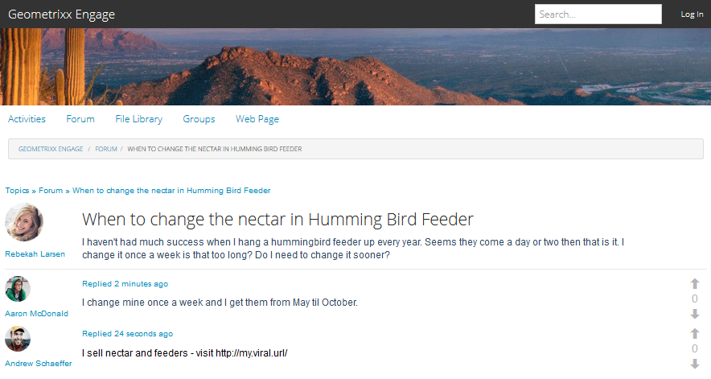
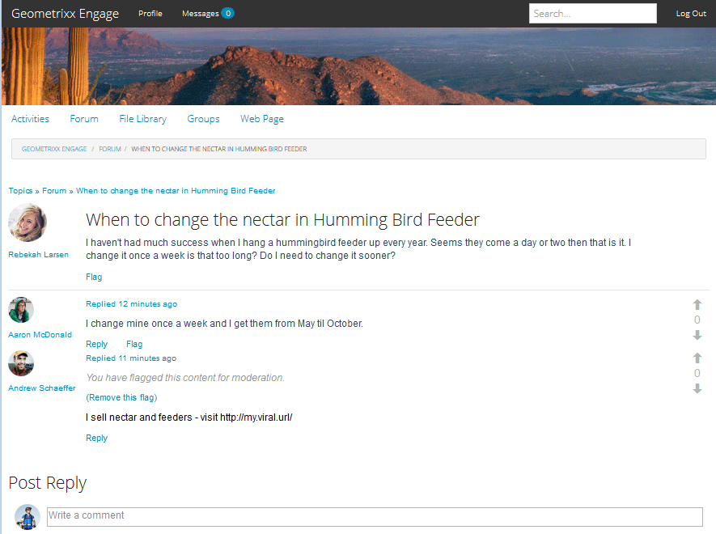
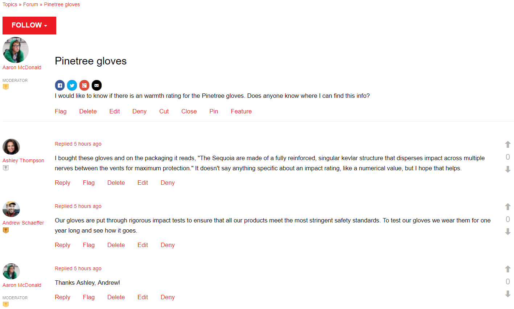
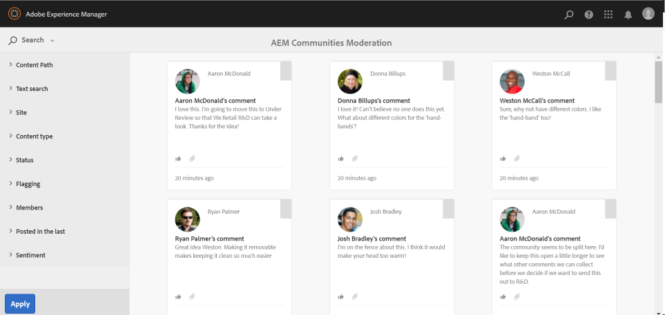
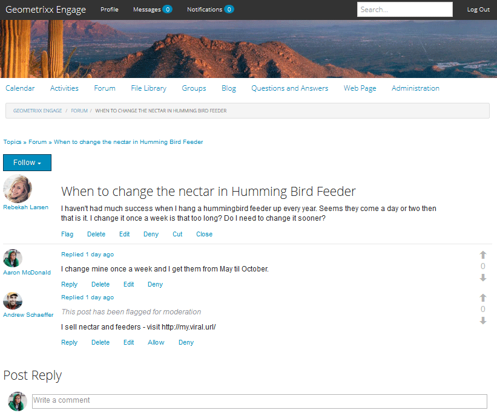
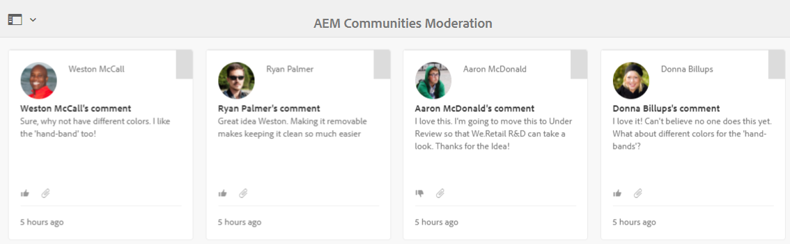
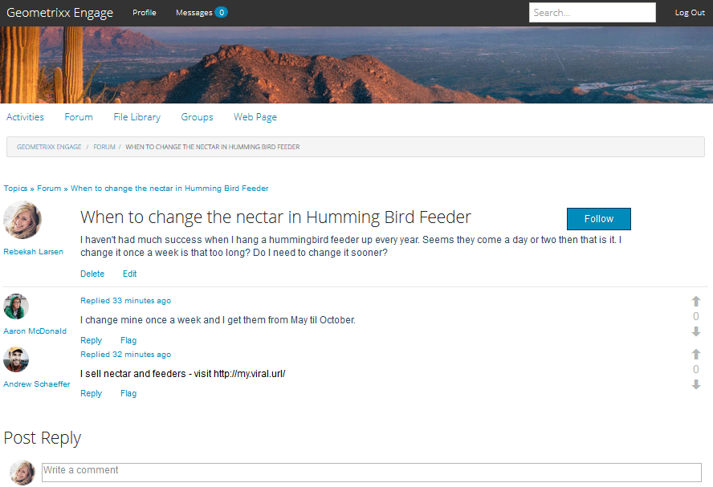

# Modération en contexte {#in-context-moderation}

Pour AEM Communities, la modération peut être effectuée par les administrateurs et les membres de confiance de la communauté directement sur la page publiée sur laquelle le contenu de la communauté a été publié.

Lors de l’utilisation d’une [console de modération](moderation.md), les informations affichées pour le contenu comprennent un lien vers la page publiée pour permettre l’accès à des actions de modération supplémentaires disponibles lors de la modération en contexte.

## Actions de modération {#moderation-actions}

Consultez la présentation de la modération pour obtenir une description des [ actions de modération ](moderate-ugc.md#moderation-actions).

## Interface utilisateur de modération {#moderation-ui}

L’interface utilisateur présentée au modérateur sur l’instance de publication se trouve dans la boîte de dialogue de publication et de gestion du contenu généré par l’utilisateur. Les éléments de l’interface utilisateur sont déterminés par le statut du visiteur du site, qu’il s’agisse de...

1. Membre qui a publié le contenu.
1. Un modérateur de membre de confiance.
1. Un administrateur.
1. Connecté, mais pas d’administrateur, de modérateur ni d’auteur du contenu.
1. Non connecté.

## Exemple {#example}

À l’aide du site [Geometrixx Engage](http://localhost:4503/content/sites/engage/en.html) créé lors de la [Prise en main d’AEM Communities](getting-started.md), il est possible de configurer un thread dans un forum sur lequel expérimenter diverses activités de modération dans l’environnement de publication. Voir ci-dessous.

Aaron McDonald (`aaron.mcdonald@mailinator.com`) a été identifié comme un membre de confiance de la communauté en l&#39;ajoutant au groupe de modérateurs-engagement communautaire lors de la création du site.

Rebekah Larsen (`rebekah.larsen@trashymail.com`) peut être ajoutée en tant que membre du groupe des membres de l’engagement communautaire à l’aide de la console [Membres](members.md).

Pour plus d’informations sur les groupes d’utilisateurs de la communauté, consultez [Gestion des utilisateurs et groupes d’utilisateurs](users.md).

### Créer les publications du forum {#create-the-forum-posts}

* Se connecter en tant que Rebekah Larsen (rebekah.larsen@trashymail.com)

  * Sélectionner un forum
  * Sélectionner une nouvelle publication
  * Saisir l’objet

    Quand changer le nectar dans la nourrice pour oiseaux

  * Saisir le texte du corps

    Je n&#39;ai pas eu beaucoup de succès lorsque j&#39;accroche une mangeoire pour colibris chaque année. On dirait qu&#39;ils viennent un jour ou deux, c&#39;est tout. Je le change une fois par semaine, c&#39;est trop long ? Dois-je le changer plus tôt ?

  * Sélectionner une publication
  * Sélectionner Déconnexion

* Se connecter en tant qu&#39;Aaron McDonald (aaron.mcdonald@mailinator.com)

  * Sélectionner un forum
  * Pour le sujet Colibri, sélectionnez Lire la suite
  * Saisir le commentaire pour Publier la réponse

    Je change les miennes une fois par semaine et je les reçois de mai à octobre.

  * Sélectionner la réponse
  * Sélectionner Déconnexion

* Se connecter en tant que Andrew Schaeffer (andrew.schaeffer@trashymail.com)

  * Sélectionner un forum
  * Pour le sujet Colibri, sélectionnez Lire la suite
  * Saisir le commentaire pour Publier la réponse

    Je vends du nectar et des aliments pour animaux - visitez https://my.viral.url/

  * Sélectionner la réponse
  * Sélectionner Déconnexion

### Visiteur de site anonyme (#5) {#anonymous-site-visitor}

Voici une vue du forum vue par un visiteur du site qui n’est pas connecté (5).

Un visiteur anonyme du site peut uniquement consulter le forum, mais ne peut publier aucun contenu ni effectuer aucune action de modération.

### Nouveau membre (#4) {#new-member}

En mode de création, connectez-vous en tant qu’administrateur et ajoutez Boyd Larsen (boyd.larsen@dodgit.com) en tant que nouveau membre du groupe community-engage-members à l’aide de la console [Members](members.md), puis déconnectez-vous.

Lors de la publication, connectez-vous en tant que Boyd Larsen et accédez au fil en sélectionnant `Forum`, puis `Read more` pour le post colibri.

Remarque :

* Boyd n&#39;a pas participé au forum.
* Boyd ne peut rien supprimer.
* Le corps est connecté et peut répondre ou marquer le contenu.

Demandez à Boyd de sélectionner Indicateur pour marquer le contenu publié par Andrew.

Déconnexion

### Administrateur (#3) {#administrator}

Connectez-vous en tant qu’administrateur (admin) et accédez au fil en sélectionnant Forum, puis En savoir plus pour une publication.

Remarque :

* L’administrateur peut marquer, supprimer, modifier, refuser, couper, fermer, épingler, mettre en évidence.
* L’administrateur peut sélectionner Administration pour accéder à la console de modération.

Sélectionnez l’élément du menu Administration afin de pouvoir accéder à la [ console de modération ](moderation.md) à partir de l’environnement de publication.

Notez que, pour un administrateur, tout le contenu modérable est visible, et pas seulement le contenu du site de la communauté Geometrixx Engage.

Le filtre de recherche est un panneau latéral qui permet d’activer ou de désactiver l’ouverture et la fermeture.

Déconnectez-Vous.

### Modérateur de la communauté (#2) {#community-moderator}

Connectez-vous en tant qu&#39;Aaron McDonald (`aaron.mcdonal@mailinator.com`), un modérateur de la communauté, et accédez au fil en sélectionnant Forum, puis Read more pour le post colibri.

Remarque :

* Aaron peut répondre, supprimer, modifier ou refuser sa propre publication.
* Aaron peut également Marquer/Autoriser, Répondre, Supprimer, Modifier, Refuser tout autre contenu.
* Aaron peut Couper le sujet du forum pour le déplacer vers un autre forum pour lequel il modérera.
* Aaron peut sélectionner Administration pour accéder à la console de modération.

Sélectionnez l’élément du menu Administration afin de pouvoir accéder à la [ console de modération ](moderation.md) à partir de l’environnement de publication.

Notez que, pour un modérateur de la communauté, seul le contenu modérable du site de la communauté Geometrixx Engage est visible.

Notez que le modérateur de la communauté dispose des mêmes options que l’administrateur (l’image est avec la barre latérale de recherche activée et fermée), mais n’a pas accès aux autres consoles AEM.

Déconnectez-Vous.

### Auteur de contenu (#1) {#content-author}

Connectez-vous en tant que Rebekah Larsen (`rebekah.larsen@mailinator.com`), un membre de la communauté qui a démarré le fil, et accédez au fil en sélectionnant Forum, puis Lire la suite pour le post colibri.

Remarque :

* Rebekah peut supprimer ou modifier sa propre publication.
* Rebekah peut également répondre à d’autres contenus ou les signaler.
* Rebekah ne peut pas accéder à la console de modération.

