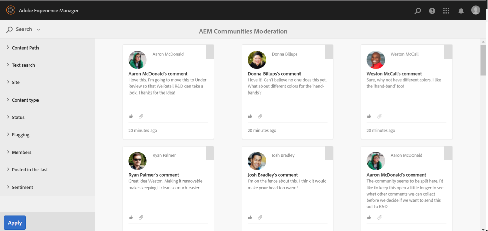

# Modération en contexte {#in-context-moderation}

Pour AEM Communities, la modération peut être effectuée par les administrateurs et les membres de la communauté de confiance directement sur la page publiée sur laquelle le contenu de la communauté a été publié.

Lors de l’utilisation d’une console [de](moderation.md)modération, les informations affichées pour le contenu incluent un lien vers la page publiée afin d’autoriser l’accès à d’autres actions de modération disponibles lors de la modération dans le contexte.

## Actions de modération {#moderation-actions}

Consultez l’aperçu de la modération pour obtenir une description des actions [de](moderate-ugc.md#moderation-actions)modération.

## Interface utilisateur de modération {#moderation-ui}

L’interface utilisateur présentée au modérateur sur l’instance de publication se trouve dans la boîte de dialogue pour la publication et la gestion du contenu généré par l’utilisateur. Les éléments de l&#39;interface utilisateur sont déterminés par l&#39;état du visiteur du site, qu&#39;ils soient ou non...

1. Membre qui a publié le contenu.
1. Un modérateur de membre approuvé.
1. Administrateur.
1. Connecté, mais pas un administrateur, un modérateur ou l’auteur du contenu.
1. Non connecté.

## Exemple {#example}

En utilisant le site [Geometrixx Interagir](http://localhost:4503/content/sites/engage/en.html) créé lors de la [mise en route de AEM Communities](getting-started.md), il est possible de configurer rapidement un thread dans un forum sur lequel expérimenter diverses activités de modération dans l’environnement de publication, comme indiqué ci-dessous.

Aaron McDonald (aaron.mcdonald@mailinator.com) a été identifié comme un membre de confiance de la communauté en l&#39;ajoutant au groupe communautaire-modérateurs-engagés lors de la création du site.

Rebekah Larsen (rebekah.larsen@trashymail.com) peut être ajoutée en tant que membre d&#39;un groupe de membres de la communauté à l&#39;aide de la console Membres.

Pour plus d’informations sur les groupes d’utilisateurs de la communauté, consultez [Gestion des utilisateurs et des groupes](users.md)d’utilisateurs.

### Création de publications de forum {#create-the-forum-posts}

* Connectez-vous en tant que Rebekah Larsen (rebekah.larsen@trashymail.com)

   * Sélectionner un forum
   * Sélectionner une nouvelle publication
   * Entrer l&#39;objet

      Quand changer le nectar dans l&#39;éleveur d&#39;oiseaux de Humming

   * Saisir le corps du texte

      Je n&#39;ai pas eu beaucoup de succès quand j&#39;accroche chaque année un mangeur de colibris. Il semble qu&#39;ils viennent un jour ou deux alors c&#39;est tout. Je le change une fois par semaine est-ce trop long ? Ai-je besoin de le changer plus tôt ?

   * Sélectionner une publication
   * Sélectionner Déconnexion

* Connectez-vous en tant qu’Aaron McDonald (aaron.mcdonald@mailinator.com)

   * Sélectionner un forum
   * Pour la rubrique Colibri, sélectionnez En savoir plus.
   * Saisissez le commentaire pour la réponse de publication.

      Je change la mienne une fois par semaine et je les reçois de mai à octobre.

   * Sélectionner une réponse
   * Sélectionner Déconnexion

* Connectez-vous en tant qu’Andrew Schaeffer (andrew.schaeffer@trashymail.com)

   * Sélectionner un forum
   * Pour la rubrique Colibri, sélectionnez En savoir plus.
   * Saisissez le commentaire pour la réponse de publication.

      Je vends du nectar et des mangeoires - visitez https://my.viral.url/

   * Sélectionner une réponse
   * Sélectionner Déconnexion

### Visiteur de site anonyme (#5) {#anonymous-site-visitor}

Voici une vue du forum vue par un visiteur du site qui n&#39;est pas connecté (5).

Un visiteur de site anonyme ne peut que vue au forum, mais peut ne pas publier de contenu ni effectuer d&#39;actions de modération.

### Nouveau membre (#4) {#new-member}

Sur l’auteur, connectez-vous en tant qu’administrateur et ajoutez Boyd Larsen (boyd.larsen@dodgit.com) en tant que nouveau membre du groupe de membres de la communauté à l’aide de la console Membres, puis déconnectez-vous.

Lors de la publication, connectez-vous en tant que Boyd Larsen et accédez au thread en sélectionnant `Forum`, puis `Read more` pour la publication colibri.

Avis:

* Boyd n&#39;a pas participé au forum.
* Boyd ne peut rien supprimer.
* Boyd est connecté et peut répondre ou marquer le contenu.

Demandez à Boyd de sélectionner Indicateur pour marquer le contenu publié par Andrew.

Déconnexion

### Administrator (#3) {#administrator}

Connectez-vous en tant qu’administrateur (administrateur) et accédez au fil en sélectionnant Forum, puis Lisez plus pour une publication.

Avis:

* L’administrateur peut marquer, Supprimer, Modifier, Refuser, Couper, Fermer, Epingler, Fonction.
* L’administrateur peut sélectionner Administration pour accéder à la console de modération.

Sélectionnez l’option de menu Administration pour accéder à la console [de](moderation.md) modération à partir de l’environnement de publication.

Notez que, pour un administrateur, tout le contenu modérable est visible, et pas seulement le contenu du site de la communauté Geometrixx Engage.

Le filtre de recherche est un panneau latéral qui bascule entre l’ouverture et la fermeture.

Déconnexion.

### Modérateur de la communauté (#2) {#community-moderator}

Connectez-vous en tant qu’Aaron McDonald (aaron.mcdonal@mailinator.com), modérateur de la communauté, et accédez au fil en sélectionnant Forum, puis Lisez plus pour le billet sur les colibris.

Avis:

* Aaron peut répondre, supprimer, modifier ou refuser son propre billet.
* Aaron peut également marquer/autoriser, répondre, supprimer, modifier ou refuser tout autre contenu.
* Aaron peut couper le sujet du forum pour le déplacer vers un autre forum pour lequel il modérait.
* Aaron peut sélectionner Administration pour accéder à la console de modération.

Sélectionnez l’option de menu Administration pour accéder à la console [de](moderation.md) modération à partir de l’environnement de publication.

Notez que, pour un modérateur de communauté, seul le contenu modérable du site de la communauté Geometrixx Engage est visible.

Notez que le modérateur de la communauté dispose des mêmes options que l’administrateur (l’image est avec la barre latérale de recherche basculée fermée), mais aucun accès à d’autres consoles AEM.

Déconnexion.

### Content Author (#1) {#content-author}

Connectez-vous en tant que Rebekah Larsen (rebekah.larsen@mailinator.com), membre de la communauté qui a lancé le fil, et accédez au fil en sélectionnant Forum, puis Lisez plus pour le billet de colibri.

Avis:

* Rebekah peut supprimer ou modifier sa propre publication.
* Rebekah peut également répondre ou marquer d’autres contenus.
* Rebekah ne peut pas accéder à la console de modération.

