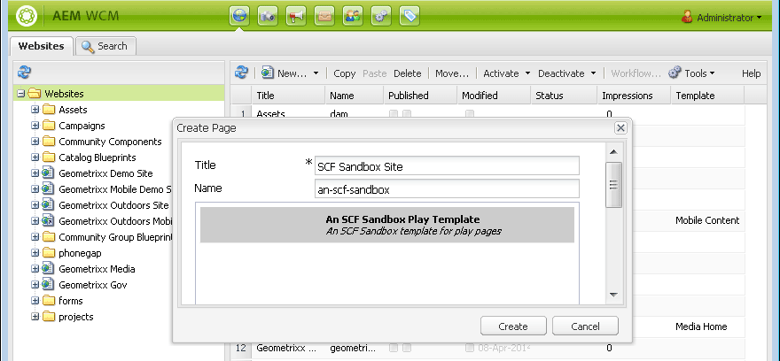

# Contenu sandbox initial {#initial-sandbox-content}

Dans cette section, vous créez les pages suivantes qui utilisent toutes le [modèle de page](initial-app.md#createthepagetemplate) :

* SCF Sandbox Site, qui redirige vers la version anglaise de la page principale.

   * Environnement de test SCF : page principale de la version anglaise du site.

   * Lecture SCF - Enfant de la page principale sur laquelle lire.

Bien que ce tutoriel ne soit pas présenté dans les [copies de langue](../../help/sites-administering/tc-prep.md), il est conçu de sorte que la page racine puisse mettre en oeuvre la détection de la langue souhaitée pour l’utilisateur via l’en-tête HTML et rediriger vers la page principale appropriée pour la langue. La convention consiste à utiliser le code de pays à deux lettres pour le nom de noeud de la page, par exemple &quot;en&quot; pour l’anglais, &quot;fr&quot; pour le français, etc.

## Créer les premières pages {#create-first-pages}

Maintenant qu’il existe un [modèle de page](initial-app.md#createthepagetemplate), nous pouvons établir la page racine du site web dans le répertoire /content .

1. L’interface utilisateur standard fournit actuellement des plans directeurs pour la création de sites. Comme ce tutoriel crée un site simple, l’IU classique est utile.

   Pour passer à l’IU classique, sélectionnez la navigation globale et survolez le côté droit de l’icône Projets . Sélectionnez l’icône *Passer à l’IU classique* qui s’affiche :

   

   La possibilité de passer à l’IU classique doit être [activée par un administrateur](../../help/sites-administering/enable-classic-ui.md).

1. Sur la [page d’accueil de l’IU classique](http://localhost:4502/welcome.html), sélectionnez **[!UICONTROL Sites web]**.

   

   Vous pouvez également accéder directement à l’IU classique des sites web en accédant à [/siteadmin.](http://localhost:4502/siteadmin)

1. Dans le volet de l’explorateur, sélectionnez **[!UICONTROL Sites Web]**, puis, dans la barre d’outils, sélectionnez **[!UICONTROL Nouveau]** > **[!UICONTROL Nouvelle page]**.

   Dans la boîte de dialogue **[!UICONTROL Créer une page]**, saisissez ce qui suit :

   * Titre: `SCF Sandbox Site`
   * Nom : `an-scf-sandbox`
   * Sélectionnez **[!UICONTROL Un modèle SCF Sandbox Play]**
   * Cliquez sur **[!UICONTROL Créer]**

   

1. Dans le volet de l’explorateur, sélectionnez la page que vous venez de créer, `/Websites/SCF Sandbox Site`, puis cliquez sur **[!UICONTROL Nouveau]** > **[!UICONTROL Nouvelle page]** :

   * Titre: `SCF Sandbox`
   * Nom : `en`
   * Sélectionnez **[!UICONTROL Un modèle SCF Sandbox Play]**
   * Cliquez sur **[!UICONTROL Créer]**

1. Dans le volet de l’explorateur, sélectionnez la page que vous venez de créer, `/Websites/SCF Sandbox Site/SCF Sandbox`, puis cliquez sur **[!UICONTROL Nouveau]** > **[!UICONTROL Nouvelle page]**

   * Titre: `SCF Play`
   * Nom : `play`
   * Sélectionnez **[!UICONTROL Un modèle SCF Sandbox Play]**
   * Cliquez sur **[!UICONTROL Créer]**

1. C’est ainsi que le site web apparaît désormais dans la console Sites web . Notez que les pages enfants de l’élément sélectionné dans le volet de l’explorateur s’affichent dans le volet de droite où elles peuvent être gérées.

   

   Il s’agit de la vue référentiel de ce qui a été créé à l’aide de l’outil Site Web et du modèle :

   

## Ajouter le chemin de conception {#add-the-design-path}

Lorsque ` [/etc/designs/an-scf-sandbox](setup-website.md#setupthedesigntreeetcdesigns)` a été créé à l’aide de la section conceptions de la console Outils, la propriété &quot;

* `cq:template="/libs/wcm/core/templates/designpage"`

a été défini, ce qui permet facultativement de référencer des ressources de conception dans un script à l’aide de `currentDesign.getPath()`. Par exemple :

* `% String favIcon = currentDesign.getPath() + "/favicon.ico"; %`

   * Nom : `cq:designPath`
   * Type : `String`
   * Valeur : `/etc/designs/an-scf-sandbox`

* Cliquez sur le vert `[+] Add`

Le référentiel doit se présenter comme suit :

* Cliquez sur **[!UICONTROL Enregistrer tout]**

En cas de problème lors de l’enregistrement de la configuration, reconnectez-vous et configurez-le.

>[!NOTE]
>
>L’utilisation de `cq:designPath` est facultative et n’est pas liée à l’utilisation de [clientlibs](develop-app.md#includeclientlibsintemplate), qui est essentiellement requise, car les composants SCF utilisent [clientlibs](client-customize.md#clientlibs-for-scf) pour gérer leurs JS et CSS.
