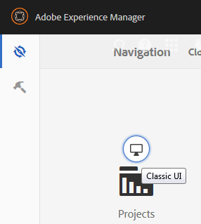
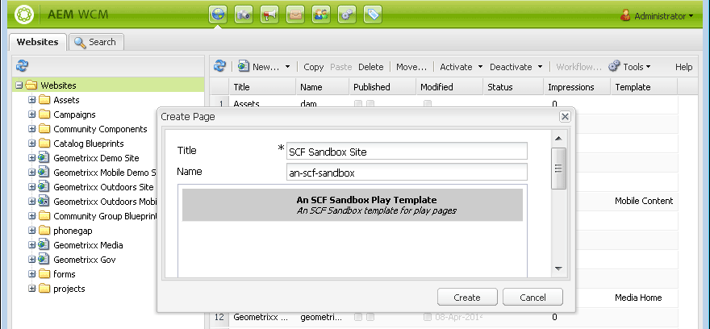
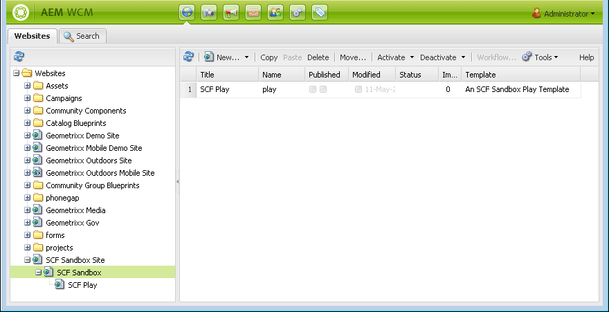
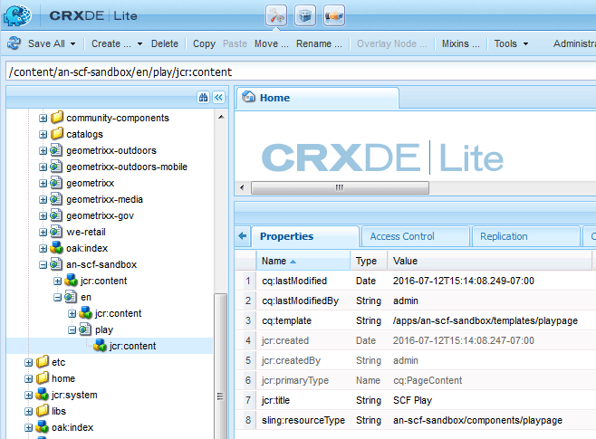
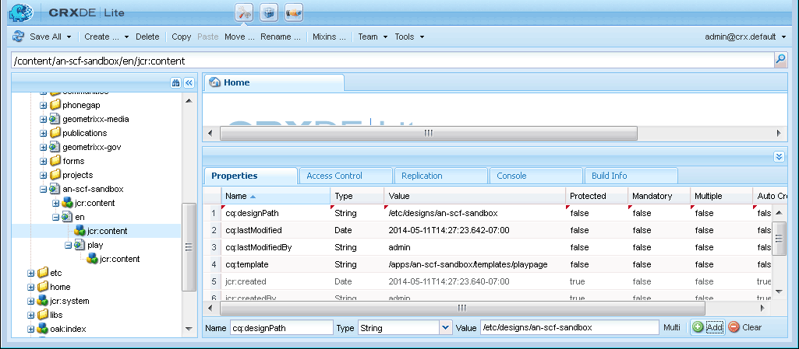

# Contenu initial du sandbox {#initial-sandbox-content}

Dans cette section, vous allez créer les pages suivantes qui utilisent toutes le [modèle de page](initial-app.md#createthepagetemplate) :

* Site Sandbox SCF, qui redirige vers la version anglaise de la page principale.

   * Sandbox SCF : page principale de la version anglaise du site.

   * SCF Play - Enfant de la page principale sur laquelle jouer.

Ce tutoriel n’aborde pas les [copies de langue](../../help/sites-administering/tc-prep.md). Au lieu de cela, il est conçu de sorte que la page racine puisse implémenter la détection de la langue souhaitée par l’utilisateur via l’en-tête HTML et le rediriger vers la page principale appropriée pour la langue. La convention consiste à utiliser le code de pays à deux lettres pour le nom de nœud de la page, par exemple « en » pour l’anglais et « fr » pour le français.

## Créer les premières pages {#create-first-pages}

Maintenant qu’il existe un [modèle de page](initial-app.md#createthepagetemplate), vous pouvez établir la page racine du site web dans le répertoire /content.

1. L’interface utilisateur standard fournit actuellement des plans directeurs pour la création de sites. Comme ce tutoriel permet de créer un site simple, l’IU classique est utile.

   Pour passer à l’interface utilisateur classique, sélectionnez navigation globale et passez la souris sur le côté droit de l’icône Projets . Sélectionnez l’icône *Basculer vers l’IU classique* qui s’affiche :

   

   La possibilité de passer à l’IU classique doit être [activée par un administrateur](../../help/sites-administering/enable-classic-ui.md).

1. Sur la page [Page de bienvenue de l’interface utilisateur classique](http://localhost:4502/welcome.html), sélectionnez **[!UICONTROL Sites web]**.

   

   Vous pouvez également accéder à l’interface utilisateur classique des sites web directement en accédant à [/siteadmin.](http://localhost:4502/siteadmin)

1. Dans le volet de l’explorateur, sélectionnez **[!UICONTROL Sites web]** puis, dans la barre d’outils, sélectionnez **[!UICONTROL Nouveau]** > **[!UICONTROL Nouvelle page]**.

   Dans la boîte de dialogue **[!UICONTROL Créer une page]**, saisissez ce qui suit :

   * Titre : `SCF Sandbox Site`
   * Nom : `an-scf-sandbox`
   * Sélectionnez **[!UICONTROL Modèle de lecture de sandbox SCF]**
   * Cliquer sur **[!UICONTROL Créer]**

   

1. Dans le volet de l’explorateur, sélectionnez la page que vous avez créée, `/Websites/SCF Sandbox Site`, puis cliquez sur **[!UICONTROL Nouveau]** > **[!UICONTROL Nouvelle page]** :

   * Titre : `SCF Sandbox`
   * Nom : `en`
   * Sélectionnez **[!UICONTROL Modèle de lecture de sandbox SCF]**
   * Cliquer sur **[!UICONTROL Créer]**

1. Dans le volet d’exploration, sélectionnez la page que vous avez créée, `/Websites/SCF Sandbox Site/SCF Sandbox`, puis cliquez sur **[!UICONTROL Nouveau]** > **[!UICONTROL Nouvelle page]**

   * Titre : `SCF Play`
   * Nom : `play`
   * Sélectionnez **[!UICONTROL Modèle de lecture de sandbox SCF]**
   * Cliquer sur **[!UICONTROL Créer]**

1. Voici comment le site web s’affiche désormais dans la console Sites web . Notez que les pages enfants de l’élément sélectionné dans le volet de l’explorateur s’affichent dans le volet de droite, où elles peuvent être gérées.

   

   Il s’agit de la vue du référentiel de ce qui a été créé à l’aide de l’outil Site Web et du modèle :

   

## Ajouter le chemin de conception {#add-the-design-path}

Lors de la création de ` [/etc/designs/an-scf-sandbox](setup-website.md#setupthedesigntreeetcdesigns)` à l’aide de la section Conceptions de la console Outils , la propriété «

* `cq:template="/libs/wcm/core/templates/designpage"`

a été défini, ce qui permet de référencer des ressources de conception dans un script à l’aide de `currentDesign.getPath()`. par exemple,

* `% String favIcon = currentDesign.getPath() + "/favicon.ico"; %`

   * Nom : `cq:designPath`
   * Type : `String`
   * Valeur : `/etc/designs/an-scf-sandbox`

* Cliquez sur le `[+] Add` vert

Le référentiel doit se présenter comme suit :

* Cliquez sur **[!UICONTROL Enregistrer tout]**

En cas de problème lors de l’enregistrement de la configuration, reconnectez-vous et configurez à nouveau.

>[!NOTE]
>
>L’utilisation de `cq:designPath` est facultative et n’est pas liée à l’utilisation de [clientlibs](develop-app.md#includeclientlibsintemplate), qui sont requises, car les composants SCF utilisent [clientlibs](client-customize.md#clientlibs-for-scf) pour gérer leurs JS et CSS.
