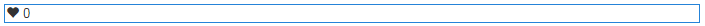

# Utilisation de la mention J&#39;aime {#using-liking}

Le composant `Liking` est un outil utile qui permet aux utilisateurs et aux utilisatrices d’exprimer une opinion sur un élément de contenu particulier, tel qu’un commentaire dans un forum. Avec le composant `Liking`, les membres sélectionnent l&#39;icône de cœur pour indiquer une opinion positive.

## Ajout d’un lien à une page {#adding-liking-to-a-page}

Pour ajouter un composant `Liking` à une page en mode création, utilisez l’explorateur de composants pour localiser .

* `Communities / Liking`

Et faites-le glisser sur une page, par exemple une position relative à la fonction pour que les utilisateurs l’aiment.

Pour plus d’informations, consultez [Principes de base des composants de communautés](basics.md).

Lorsque les [bibliothèques côté client requises](essentials-liking.md#essentials-for-client-side) sont incluses, le composant `Liking` s’affiche de cette manière.

## Configuration des préférences {#configuring-liking}

Sélectionnez le composant de `Liking` placé afin de pouvoir accéder à l’icône de `Configure` qui ouvre la boîte de dialogue de modification et de la sélectionner.

Sous l’onglet **[!UICONTROL Textes et libellés]**, spécifiez les propriétés utilisées pour enregistrer les mentions J’aime.

* **[!UICONTROL Libellé de réponse positive]**

  (*Obligatoire*) Nom de propriété pour une réponse positive.

* **[!UICONTROL Libellé de réponse négative]**

  (*Obligatoire*) Nom de propriété pour une réponse négative.

* **[!UICONTROL Tally Name]**

  (*Obligatoire*) Nom de propriété interne identifiable pour cette instance d’un composant votant.

## Expérience du visiteur du site {#site-visitor-experience}

### Membres {#members}

Les membres peuvent changer leurs goûts à tout moment.

### Anonyme {#anonymous}

La mention aimé anonyme n’est pas prise en charge. Les visiteurs et visiteuses du site doivent s’inscrire (devenir membre) et se connecter pour participer aux mentions J’aime.

## Informations supplémentaires {#additional-information}

Vous trouverez plus d’informations à ce sujet sur la page [Liking Essentials](essentials-liking.md) destinée aux développeurs et développeuses.
