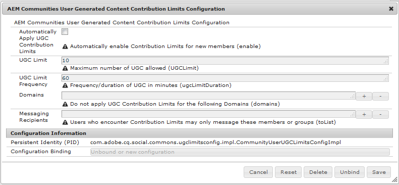

# Limites de contribution des membres {#member-contribution-limits}

## Vue d’ensemble {#overview}

La fonction de limites de contribution permet de limiter les contributions des membres de la communauté afin de les protéger contre le spam.

Lorsqu&#39;un membre est limité, tout poste qui dépasse le nombre autorisé de contributions donne lieu à une alerte indiquant que la limite a été dépassée et que le poste est rejeté. Le membre de la communauté peut alors se rendre au centre de messagerie de la communauté et contacter un gestionnaire de la communauté qui peut supprimer les limites, le cas échéant.

Les limites de contribution peuvent être activées individuellement à partir de la console [Membres](members.md) et/ou configurées pour être automatiquement activées lorsque les visiteurs du site deviennent de nouveaux membres.

À l’aide de la console Membres , les limites de contribution peuvent être supprimées de manière proactive pour un membre par un gestionnaire de communauté à tout moment, ou supprimées de manière réactive lorsqu’un membre envoie un message à un gestionnaire de communauté qui effectue une telle demande.

## Configuration des limites de contribution au contenu générées par l’utilisateur d’AEM Communities {#aem-communities-user-generated-content-contribution-limits-configuration}

Cette configuration OSGi :

* Définit les caractéristiques des plafonds de contribution (nombre de postes dans une période donnée).
* Indique qui le membre peut envoyer un message lorsque la limite a été atteinte.
* Identifie les domaines qui n’ont jamais besoin d’être limités.

Pour accéder à cette configuration OSGi :

* Sur l’éditeur principal :
* Connectez-vous avec des droits d’administrateur.
* Accédez à la [console web](../../help/sites-deploying/configuring-osgi.md).

  * Par exemple, [&#128279;](http://localhost:4503/system/console/configMgr)

* Localisez `AEM Communities User Generated Content Contribution Limits Configuration`.
* Sélectionnez l’icône Modifier .

* **[!UICONTROL Appliquer automatiquement les limites de contribution du contenu créé par l’utilisateur]**

  Si cette option est cochée, définissez automatiquement des limites de contribution pour les utilisateurs lorsqu’ils s’enregistrent en tant que membres de la communauté. Cela se reflète dans le profil du membre de la communauté et peut être activé/désactivé à partir de la console [membres](members.md). Les nouveaux membres dont l’adresse e-mail provient d’une place sur la liste autorisée de domaines ne sont jamais limités.

  La valeur par défaut n’est pas cochée.

* **[!UICONTROL Limite UGC]**

  Nombre maximal de contributions.

  La valeur par défaut est de dix publications.

* **[!UICONTROL Fréquence limite UGC]**

  Période limitant la limite du contenu créé par l’utilisateur.

  La valeur par défaut est de 60 minutes.

* **[!UICONTROL Domaines]**

  Une liste placée sur la liste autorisée d’un ou plusieurs domaines d’e-mail. Sélectionnez l’icône + pour effectuer des entrées supplémentaires.

  Les utilisateurs dont les adresses e-mail se trouvent dans la place sur la liste autorisée de domaines ne sont pas affectés lorsque des limites de contribution du contenu créé par l’utilisateur sont automatiquement appliquées. Par exemple, si la `mycompany.com` de domaine est ajoutée à la liste des domaines, il n’est jamais interdit de publier un membre dont l’adresse e-mail est `me@mycompany.com`.

  La valeur par défaut est une liste autorisée vide.

* **[!UICONTROL Destinataires des messages]**

  Liste d&#39;un ou plusieurs identifiants autorisables des membres pouvant modifier les limites de contribution pour les membres. Sélectionnez l’icône + pour effectuer des entrées supplémentaires.

  Les membres ne peuvent contacter des membres spécifiés que lorsque leur limite a été atteinte.

  Par défaut, aucun destinataire de messagerie n&#39;est envoyé.

Remarque : la configuration par défaut entraîne une limite de dix publications sur une période d’une heure.
