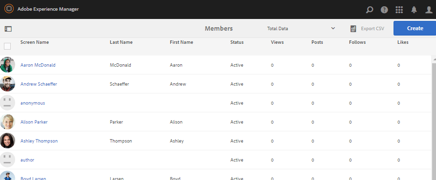
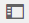
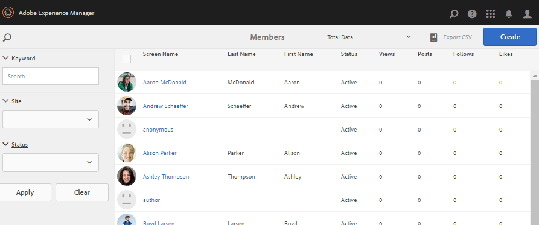
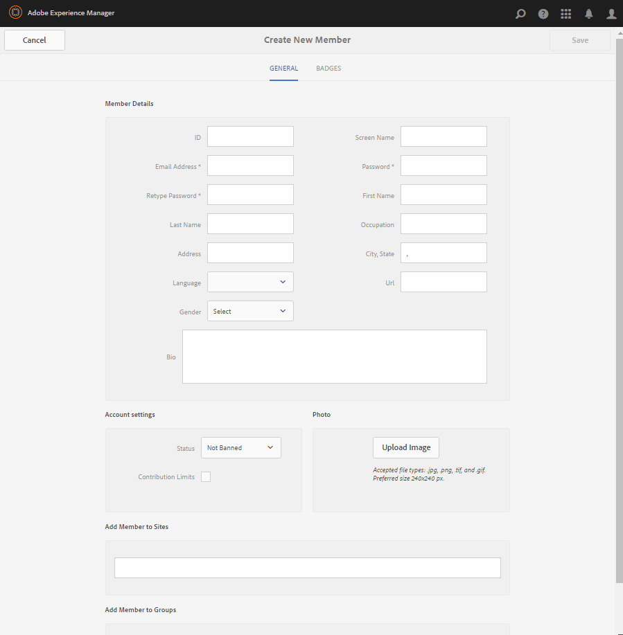
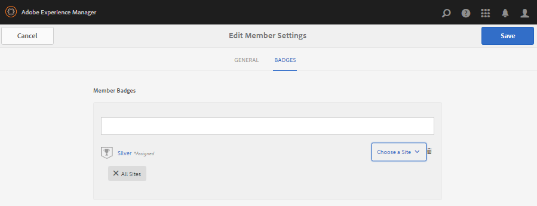
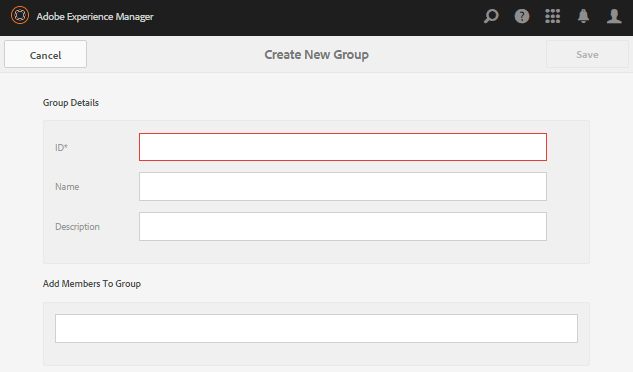

# Consoles de gestion des membres et des groupes {#members-groups-management-consoles}

## Vue d’ensemble {#overview}

Les fonctionnalités d’AEM Communities exigent souvent que les visiteurs du site soient inscrits et connectés avant de participer à une communauté dans l’environnement de publication. Leur enregistrement utilisateur n’existe que dans l’environnement de publication et ils sont généralement appelés *membres* pour les distinguer des *utilisateurs* enregistrés dans l’environnement de création.

### Membres (utilisateurs) sur l’instance de publication {#members-users-on-publish}

Les consoles Membres et groupes de la communauté permettent de créer et de gérer les membres et les groupes de membres enregistrés dans l’environnement *publication* à partir de l’environnement *auteur*. Cela n’est possible que lorsque le [service tunnel](deploy-communities.md#tunnel-service-on-author) est activé.

### Utilisateurs en mode de création {#users-on-author}

Pour gérer les utilisateurs et les groupes enregistrés dans l’environnement *auteur*, il est nécessaire d’utiliser la console de sécurité de la plateforme :

* Dans la navigation globale, sélectionnez **[!UICONTROL Outils]** > **[!UICONTROL Sécurité]** > **[!UICONTROL Utilisateurs]**.
* Dans la navigation globale, sélectionnez **[!UICONTROL Outils]** > **[!UICONTROL Sécurité]** > **[!UICONTROL Groupes]**.

>[!NOTE]
>
>Une fois l’exemple de contenu déployé et activé, de nombreux exemples d’utilisateurs existent dans les environnements de création et de publication. Ces utilisateurs ne seront pas présents lors de l’exécution de avec le mode d’exécution [nosamplecontent](../../help/sites-administering/production-ready.md).

## Console Membres {#members-console}

Dans l’environnement de création, pour accéder à la console Membres afin de gérer les membres inscrits dans l’environnement de publication :

* Dans la navigation globale, sélectionnez **[!UICONTROL Navigation]** > **[!UICONTROL Communities]** > **[!UICONTROL Members]**

>[!CAUTION]
>
>Il ne sera pas possible d’utiliser la console Membres si le [service tunnel](deploy-communities.md#tunnel-service-on-author) n’est pas activé.

### Recherche {#search-features}

Sélectionnez l’icône du panneau latéral sur le côté gauche de l’en-tête du `Members` pour activer/désactiver l’ouverture du panneau latéral de recherche.

Sélectionnez l’icône de recherche sur le côté gauche de l’en-tête de `Members` pour fermer le panneau latéral de recherche.

### Statistiques des membres {#member-statistics}

Les colonnes `Views`, `Posts`, `Follows` et `Likes` sont mises à jour lorsque l’utilisateur est membre d’un ou de plusieurs sites de la communauté pour lesquels Adobe Analytics [est activé](sites-console.md#analytics).

### Exporter CSV {#export-csv}

Si vous sélectionnez le lien `Export CSV`, tous les membres sont téléchargés sous la forme d&#39;une liste de valeurs séparées par des virgules, qui peut être importée dans une feuille de calcul.

Les en-têtes de colonne sont les suivants :

`| Screen Name |Last Name |First Name |Status |Views |Posts |Follows |Likes |`

## Créer un membre {#create-new-member}

Sélectionnez `Create Member` pour créer un utilisateur dans l’environnement de publication.

### GÉNÉRAL - Détails du membre {#general-member-details}

La plupart des champs sont facultatifs, que le membre peut compléter ultérieurement sur son profil.

* **[!UICONTROL ID]**

(*Obligatoire*) L’ID autorisable est l’ID de connexion du membre.
Par défaut, l’ID est défini sur la valeur de l’adresse e-mail requise.
*Une fois créé, l’identifiant ne peut pas être modifié*.

* **[!UICONTROL Adresse électronique]**

(*Obligatoire*) Adresse électronique du membre.
Le membre peut changer son adresse e-mail lors de la mise à jour de son profil.
Si l’identifiant correspond par défaut à l’adresse e-mail, il ne change *pas* lorsque l’adresse e-mail est modifiée.

* **[!UICONTROL Password]**

  (*Obligatoire*) Le mot de passe de connexion.

* **[!UICONTROL Confirmer le mot de passe]**

  (*Obligatoire*) Saisissez à nouveau le mot de passe pour vérification.

* **[!UICONTROL Ajouter un membre à Sites]**

  (*Facultatif*) Faites votre choix parmi les sites communautaires existants pour ajouter le membre au groupe des membres du site communautaire.

* **[!UICONTROL Ajouter un membre à des groupes]**

  (*Facultatif*) Faites votre choix parmi les groupes de membres existants pour ajouter le membre à ce groupe.

* Sélectionnez **[!UICONTROL Enregistrer]**.

### GÉNÉRAL - Paramètres du compte {#general-account-settings}

Sous Paramètres du compte , il est possible pour un administrateur de communauté de :

* **[!UICONTROL Statut]**
   * Interdit
Un membre ne peut pas se connecter, ce qui l’empêche d’afficher des pages ou de participer à des activités qui nécessitent une connexion. Ils peuvent toujours visiter anonymement un site communautaire ouvert.

   * Non interdit
Un membre a un accès complet au site communautaire.

  La valeur par défaut est `Not Banned`.

* **[!UICONTROL Limites de contribution]**

  Si cette case est cochée, la capacité du membre à publier du contenu est limitée.
La valeur par défaut dépend de la configuration des limites de contribution.
Voir [Limites de contribution des membres](limits.md).

* **[!UICONTROL Modifier le mot de passe]**

  Lien présent lors de la modification d’un membre existant. Permet à un administrateur de la communauté de réinitialiser le mot de passe d’un membre.

### GÉNÉRAL - Photo {#general-photo}

Pour fournir un avatar au membre, commencez par sélectionner **[!UICONTROL Télécharger l’image]** et choisissez une image de type .jpg, .png, .tif ou .gif. La taille souhaitée pour une image est de 240 x 240 pixels à 72 ppp.

### GÉNÉRAL - Ajout d’un membre à Sites {#general-add-member-to-sites}

Le membre peut être ajouté à un ou plusieurs groupes de membres des sites communautaires. Commencez par saisir du texte dans la zone de texte.

### GÉNÉRAL - Ajouter un membre à des groupes {#general-add-member-to-groups}

Le membre peut être ajouté à un ou plusieurs groupes de membres. Commencez par saisir du texte dans la zone de texte.

### Onglet BADGES {#badges-tab}

Le panneau `BADGES` permet d’attribuer manuellement des badges et de les révoquer. Les badges peuvent être destinés aux rôles attribués et les badges sont généralement gagnés.

Voir aussi [Notation et badges](implementing-scoring.md).

* **[!UICONTROL Ajouter des badges]**
   * Commencez la saisie pour sélectionner parmi [badges disponibles](badges.md). Une fois le badge sélectionné, choisissez chaque site, ou tous les sites, sur lesquels le badge doit être affiché avec l&#39;avatar du membre.
   * Plusieurs badges et sites peuvent être choisis.
* **[!UICONTROL Supprimer les badges]**
   * Sélectionnez l’icône de corbeille en regard d’un badge pour le supprimer.

## Console Groupes {#groups-console}

La console Groupes, disponible à partir de l’environnement de création, permet la création et la gestion de groupes membres enregistrés dans l’environnement de publication. Elle est particulièrement utile pour les [groupes membres privilégiés](users.md#privilegedmembersgroups).

Pour accéder à la console Groupes :
* Dans la navigation globale, sélectionnez **[!UICONTROL Navigation]** > **[!UICONTROL Communities]** > **[!UICONTROL Groups]**.

>[!CAUTION]
>
>Il ne sera pas possible d’utiliser la console Groupes si le [service tunnel](deploy-communities.md#tunnel-service-on-author) n’est pas activé.

### Créer un groupe {#create-new-group}

Sélectionnez `Add Group` pour créer un groupe dans l’environnement de publication.

Les champs requis pour créer un groupe de membres côté publication sont les suivants :

* **[!UICONTROL ID]**

  (*Obligatoire*) ID de groupe unique.

  *Une fois créé, l’identifiant ne peut pas être modifié.*

* **[!UICONTROL Nom]**

  (*Facultatif*) Nom d’affichage du groupe.

  La valeur par défaut est l’ID.

* **[!UICONTROL Description]**

  (*Facultatif*) Description de l’objectif et des autorisations du groupe.

* **[!UICONTROL Ajouter Des Membres Au Groupe]**

  (*Facultatif*) Sélectionnez les membres côté publication à inclure comme membres initiaux du groupe.

* Sélectionnez **[!UICONTROL Enregistrer]**.

## Administrateurs autorisés {#authorized-administrators}

Lorsque vous travaillez avec des membres dans la console Membres de Communities, il est nécessaire d’être connecté en tant qu’utilisateur avec les autorisations appropriées et pour que l’agent de réplication utilisé par le [service tunnel](deploy-communities.md#tunnel-service-on-author) soit correctement configuré.

S’il n’est pas connecté en tant que `admin`, l’utilisateur connecté doit être membre du groupe d’utilisateurs `administrators`.

Consultez également la section [Agents de réplication sur l’auteur](deploy-communities.md#replication-agents-on-author).
