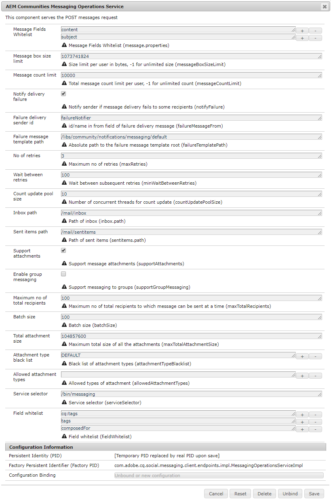
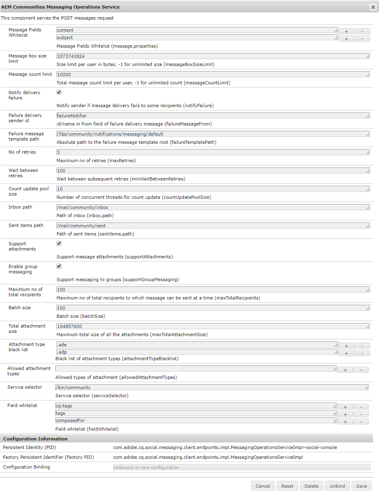
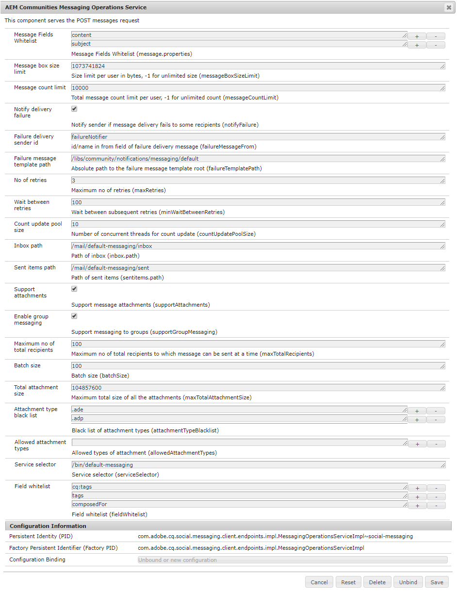

# Configurer la messagerie {#configure-messaging}

## Vue d’ensemble {#overview}

La fonctionnalité de messagerie d’AEM Communities permet aux visiteurs (membres) connectés du site d’envoyer entre eux des messages accessibles lors de leur connexion au site.

La messagerie est activée pour un site communautaire en cochant une case lors de la [création du site communautaire](/help/communities/sites-console.md).

Cette page contient des informations sur la configuration par défaut et les ajustements possibles.

Pour plus d’informations pour les développeurs, voir [Messaging Essentials](/help/communities/essentials-messaging.md).

## Service des opérations de messagerie {#messaging-operations-service}

La configuration [Service des opérations de messagerie ](https://localhost:4502/system/console/configMgr/com.adobe.cq.social.messaging.client.endpoints.impl.MessagingOperationsServiceImpl) identifie le point d&#39;entrée qui gère les requêtes liées à la messagerie, les dossiers que le service doit utiliser pour stocker les messages et, si les messages peuvent inclure des pièces jointes, les types de fichiers autorisés.

Pour les sites de la communauté créés à l’aide de l’`Communities Sites console` , une instance du service existe, avec la boîte de réception définie sur `/mail/inbox`.

### Service d’opérations de messagerie de la communauté {#community-messaging-operations-service}

Comme illustré ci-dessous, une configuration du service existe pour les sites créés avec l’assistant [création de site](/help/communities/sites-console.md). Vous pouvez afficher ou modifier la configuration en sélectionnant l’icône en forme de crayon en regard de la configuration.

### Ajouter une nouvelle configuration {#add-new-configuration}

Pour ajouter une configuration, sélectionnez l’icône plus « **+** » en regard du nom du service :

* **Champs de message**

  Indique les propriétés du composant Composer le message que les utilisateurs et utilisatrices peuvent modifier et conserver. Si de nouveaux éléments de formulaire sont ajoutés, l’ID d’élément doit être ajouté si vous souhaitez le stocker dans SRP. La valeur par défaut est de deux entrées : *subject* et *content*.

* **Limite de taille des messages**

  Nombre maximal d’octets dans la zone de message de chaque utilisateur. La valeur par défaut est *1073741824* (1 Go).

* **Limite du nombre de messages**

  Nombre total de messages autorisés par utilisateur. Une valeur de -1 indique qu&#39;un nombre illimité de messages est autorisé, sous réserve de la limite de taille des boîtes de message. La valeur par défaut est *10000* (10 000).

* **Notifier l’échec de la diffusion**

  Si cette case est cochée, avertir l’expéditeur si la diffusion du message échoue pour certains destinataires. La valeur par défaut est *cochée*.

* **Identifiant de l’expéditeur de la diffusion en échec**

  Nom de l’expéditeur qui apparaît dans le message d’échec de diffusion. La valeur par défaut est *failureNotifier*.

* **Chemin du modèle de message d’échec**

  Chemin d’accès absolu à la racine du modèle de message en échec de diffusion. La valeur par défaut est */etc/notification/messaging/default*.

* **Nombre de reprises**

  Nombre de tentatives de renvoi d’un message dont la diffusion a échoué La valeur par défaut est *3*.

* **Attente entre les reprises**

  Nombre de secondes d’attente entre les tentatives de renvoi du message en cas d’échec de l’envoi. La valeur par défaut est de *100* (secondes).

* **Compter la taille du pool de mise à jour**

  Nombre de threads simultanés utilisés pour la mise à jour du nombre. La valeur par défaut est de *10*.

* **Chemin de la boîte de réception**

  (*Obligatoire*) Chemin d’accès, relatif au nœud de l’utilisateur (/home/users/*username*), à utiliser pour le dossier `inbox`. Le chemin ne doit PAS se terminer par une barre oblique &#39;/&#39;. La valeur par défaut est */mail/inbox*.

* **Chemin des éléments envoyés**

  (*Obligatoire*) Chemin d’accès, relatif au nœud de l’utilisateur (/home/users/*username*), à utiliser pour le dossier `sent items`. Le chemin ne doit PAS se terminer par une barre oblique &#39;/&#39;. La valeur par défaut est */mail/sentitems* .

* **Pièces jointes du support**

  Si cette case est cochée, les utilisateurs peuvent ajouter des pièces jointes à leurs messages. La valeur par défaut est *cochée*.

* **Activer la messagerie de groupe**

  Si cette option est sélectionnée, les utilisateurs enregistrés peuvent envoyer des messages en bloc à un groupe de membres. La valeur par défaut est *désélectionné*.

* **Nombre maximum du nombre total de destinataires**

  Si la messagerie de groupe est activée, spécifiez le nombre maximal de destinataires auxquels le message de groupe peut être envoyé à la fois. La valeur par défaut est de *100*.

* **Taille du lot**

  Nombre de messages à regrouper pour un envoi lors de l&#39;envoi à un grand groupe de destinataires. La valeur par défaut est de *100*.

* **Taille totale de la pièce jointe**

  Si supportAttachments est coché, cette valeur spécifie la taille totale maximale autorisée (en octets) de toutes les pièces jointes. La valeur par défaut est *104857600* (100 Mo).

* **Type de pièce jointe**

  Une liste bloquée d’extensions de nom de fichier, précédée du préfixe « **.** », rejetée par le système. Si elle n’est pas placée sur la liste bloquée, l’extension est autorisée. Les extensions peuvent être ajoutées ou supprimées à l’aide des icônes « **+** » et « **-** ».

* **Types de pièce jointe autorisés**

  **(*Action requise*)** une liste autorisée des extensions de nom de fichier, l’inverse de la. Pour autoriser toutes les extensions de nom de fichier, à l’exception de celles qui sont placées sur la liste bloquée, utilisez l’icône « **-** » pour supprimer l’entrée vide unique.

* **Sélecteur de service**

  (*Obligatoire*) Chemin d’accès absolu (point d’entrée) par lequel le service est appelé (ressource virtuelle). La racine du chemin choisi doit être incluse dans le paramètre de configuration *Chemins d’exécution* des [`Apache Sling Servlet/Script Resolver and Error Handler`](https://localhost:4502/system/console/configMgr/org.apache.sling.servlets.resolver.SlingServletResolver) de configuration OSGi, tels que `/bin/`, `/apps/` et `/services/`. Pour sélectionner cette configuration pour la fonctionnalité de messagerie d’un site, ce point d’entrée est fourni comme valeur de **`Service selector`** pour le `Message List and Compose Message components` (voir [Fonctionnalité de message](/help/communities/configure-messaging.md)).

  La valeur par défaut est */bin/messaging* .

* **Champ**

  Utilisez **Champs de message**.

>[!CAUTION]
>
>Chaque fois qu’une configuration de `Messaging Operations Service` est ouverte pour modification, si `allowedAttachmentTypes.name` avez été supprimée, une entrée vide est ajoutée pour rendre la propriété configurable. Une seule entrée vide désactive les pièces jointes.
>
>Pour autoriser toutes les extensions de nom de fichier, à l’exception de celles qui sont placées sur la liste bloquée, utilisez l’icône « **-** » pour supprimer (à nouveau) l’entrée vide unique avant de cliquer sur **Enregistrer**.

## Messages de groupe {#group-messaging}

Pour permettre aux utilisateurs enregistrés d’envoyer des messages directs en bloc à des groupes d’utilisateurs, veillez à **Activer la messagerie de groupe** dans les deux instances suivantes de la configuration **Services d’opération de messagerie** :

* `com.adobe.cq.social.messaging.client.endpoints.impl.MessagingOperationsServiceImpl~social-console`
* `com.adobe.cq.social.messaging.client.endpoints.impl.MessagingOperationsServiceImpl~social-messaging`

**Service des opérations de messagerie : console sociale**

**Service des opérations de messagerie : messagerie sociale**

## Résolution des problèmes {#troubleshooting}

Une façon de résoudre les problèmes est d’activer [débogage des messages dans le journal.](/help/sites-administering/troubleshooting.md)

Voir aussi [ Enregistreurs et rédacteurs pour les services individuels](/help/sites-deploying/configure-logging.md#loggers-and-writers-for-individual-services).

Le package à surveiller est `com.adobe.cq.social.messaging`.
