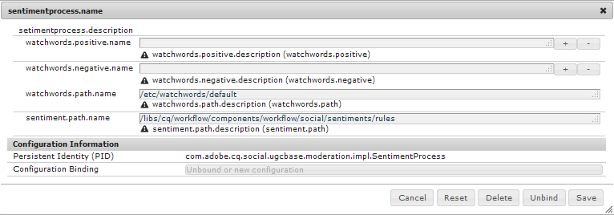

# Modération du contenu de la communauté {#moderating-community-content}

## Présentation {#overview}

Le contenu de la communauté, également connu sous le nom de contenu généré par l’utilisateur (UGC), est créé lorsqu’un membre (connecté au du site) publie le contenu d’un site de la communauté publié par le biais d’une interaction avec l’un des composants de la communauté suivants :

* [Blog](/help/communities/blog-feature.md): les membres publient un article de blog ou un commentaire.
* [Calendrier](/help/communities/calendar.md): les membres publient un de calendrier ou un commentaire.
* [Commentaires](/help/communities/comments.md): les membres publient un commentaire ou répondent à un commentaire.

* [Forum](/help/communities/forum.md): les membres publient un nouveau sujet ou répondent à un sujet.
* [Idée](/help/communities/ideation-feature.md): les membres publient une idée ou un commentaire.
* [QnA](/help/communities/working-with-qna.md): les membres créent une question ou répondent à une question.
* [Critiques](/help/communities/reviews.md): les membres publient un commentaire lors de l’évaluation d’un élément.

La modération de l’UGC est utile pour reconnaître les contributions positives et limiter les contributions négatives (comme le spam et le langage abusif). L’UGC peut être modéré à partir de plusieurs   :

* [Stockage de contenu de la communauté](working-with-srp.md)

* [console de modération en bloc](moderation.md)

   La console Modération est accessible aux administrateurs et aux modérateurs [de](/help/communities/users.md) communauté dans le public  ainsi qu’aux administrateurs dans le de  de l’auteur. Cela est possible lorsque le contenu de la communauté est stocké dans un magasin commun.

* [Modération en contexte](in-context.md)

   La modération dans le  de publication  peut être effectuée par les administrateurs et les modérateurs de la communauté directement sur la page où le contenu a été publié.

## Actions de modération {#moderation-actions}

Les actions qui peuvent être exécutées sur du contenu publié (UGC) varient selon l’identité de l’utilisateur et le  . Le tableau ci-dessous utilise la terminologie suivante pour décrire les différents rôles en fonction de l’identité de l’utilisateur :

* `Admin`

   Utilisateur membre du groupe [communauté-administrateurs](users.md) .

* `Moderator`

   Membre d’un groupe de modérateurs [de](users.md#publishenvironmentusersandgroups) communauté (avec des autorisations [de](in-context.md#moderatorpermissions)modérateur).

* `Creator`

   Utilisateur qui a publié le contenu.

* `Member`

   Utilisateur connecté sans autorisations spéciales.

* `Visitor`

   Utilisateur anonyme.

<table>
 <tbody>
  <tr>
   <td> </td>
   <td><strong>Admin</strong></td>
   <td><strong>Modérateur</strong></td>
   <td><strong>Créateur</strong></td>
   <td><strong>Membre</strong></td>
   <td><strong>Visiteur</strong></td>
   <td><strong>  déclenché</strong></td>
   <td><strong>Prémodéré</strong></td>
  </tr>
  <tr>
   <td><strong>Modifier/  Supprimer</strong></td>
   <td>X</td>
   <td>X</td>
   <td>X</td>
   <td> </td>
   <td> </td>
   <td> </td>
   <td> </td>
  </tr>
  <tr>
   <td><strong>Couper</strong></td>
   <td>X</td>
   <td>X</td>
   <td> </td>
   <td> </td>
   <td> </td>
   <td> </td>
   <td> </td>
  </tr>
  <tr>
   <td><strong>Refuser</strong></td>
   <td>X</td>
   <td>X</td>
   <td> </td>
   <td> </td>
   <td> </td>
   <td>X</td>
   <td> </td>
  </tr>
  <tr>
   <td><strong>Fermer/  rouvrir</strong></td>
   <td>X</td>
   <td>X</td>
   <td> </td>
   <td> </td>
   <td> </td>
   <td>X</td>
   <td>X  </td>
  </tr>
  <tr>
   <td><strong>Indicateur/  Unindicateur</strong></td>
   <td>X</td>
   <td>X</td>
   <td> </td>
   <td>X</td>
   <td> </td>
   <td>X</td>
   <td> </td>
  </tr>
  <tr>
   <td><strong>Autoriser</strong></td>
   <td>X</td>
   <td>X</td>
   <td> </td>
   <td> </td>
   <td> </td>
   <td>X</td>
   <td>X</td>
  </tr>
 </tbody>
</table>

### Modifier / Supprimer {#edit-delete}

Une fois qu’une publication a été créée, elle peut être modifiée ou supprimée par le créateur, un administrateur ou un modérateur de la communauté.

Lorsque l’UGC est supprimé, il est supprimé du référentiel et ne peut pas être récupéré.

### Couper {#cut}

Il est possible pour un administrateur ou un modérateur de communauté de déplacer un ou plusieurs sujets de forum ou questions QnA d’un emplacement à un autre. Cela inclut d’un site communautaire à un autre site communautaire, à condition que le même membre dispose de privilèges de modération sur les deux sites.

En sélectionnant l’action Couper, le contenu est copié dans le Presse-papiers. Plusieurs publications peuvent être copiées et déplacées en tant que groupe vers le nouvel emplacement.

 

À l’autre emplacement, lorsque du contenu est présent dans le Presse-papiers, un bouton Coller est visible en regard de Nouvelle publication avec un numéro identifiant le nombre de publications qui seront collées. Le bouton Coller permet de supprimer le presse-papiers au lieu de le coller.

 

### Refuser {#deny}

Un modérateur peut interdire à UGC de rester visible sur le site publié. Pour les administrateurs et les modérateurs de la communauté, la publication est toujours disponible et annotée comme indésirable.

### Fermer / rouvrir {#close-reopen}

L’action Fermer fonctionne sur l’ensemble du fil de conversation (sujet du forum ou commentaire initial) et inclut toutes les publications ou réponses ultérieures.

Une fois fermé, non seulement les réponses ne sont plus possibles, mais aucune action de modération n’est autorisée.

Pour effectuer toute opération, la rubrique ou le commentaire doit être rouvert.

L’action Fermer/rouvrir peut être entreprise par des administrateurs ou des modérateurs de la communauté.

### Indicateur / Sans indicateur {#flag-unflag}

Le marquage est un moyen pour tout membre connecté, à l’exception du créateur du contenu, d’indiquer qu’il existe un problème avec le contenu d’une publication. Une fois marqué, une icône de désindicateur s’affiche, permettant au même membre de démarquer le contenu.

La modération contextuelle peut être configurée pour permettre aux membres de sélectionner un motif lors du marquage d’une publication. Le des motifs d’indicateur sélectionnables est configurable, y compris la saisie ou non d’un motif personnalisé. La raison de l’indicateur est enregistrée avec l’UGC, mais la raison ne déclenche aucune action particulière. Seul le nombre d’indicateurs déclenche une notification. Le contenu marqué est annoté en tant que tel, de sorte que les modérateurs puissent agir dessus.

Le système effectue le suivi de tous les indicateurs, qui ont été marqués, ainsi que de la raison de l’indicateur et envoie un  lorsque le seuil a été atteint. Si l’UGC est autorisé par un modérateur de communauté, ces indicateurs sont archivés. Après avoir autorisé et archivé, s’il y a eu des signalements ultérieurs, ils seraient archivés comme s’il n’y avait eu aucun signalement antérieur.

### Autoriser {#allow}

L’action Autoriser est une option pour l’UGC qui a été marquée, refusée ou qui n’a pas été approuvée dans un système prémodéré. L’action Autoriser effacera tout état marqué ou refusé/message indésirable présent et archivera toutes les données marquées.

## Concepts courants de modération {#common-moderation-concepts}

### Prémodération {#premoderation}

Lorsque l’UGC est prémodéré, la publication n’apparaît pas sur le site publié tant qu’elle n’a pas été approuvée par une action de modération. Lors de la création d’un site communautaire, cochez la case [Contenu prémodéré](sites-console.md#moderation) pour activer la prémodération pour l’ensemble du site. Une fois les composants placés sur une page, les composants qui prennent en charge la modération peuvent être configurés pour la prémodération à l’aide d’un paramètre dans leur boîte de dialogue de modification :

* [Commentaires](comments.md) et [révisions](reviews.md)dans Modération **** utilisateur > **[!UICONTROL Prémodération]**.

* [Forum](/help/communities/forum.md), [idéation](/help/communities/ideation-feature.md), [QnA](/help/communities/working-with-qna.md)et [calendrierdans Paramètres >](/help/communities/calendar.md)Modéré.********

### Détection des messages indésirables {#spam-detection}

La détection des messages indésirables est une fonctionnalité de modération automatique, qui  des éléments indésirables du contenu généré par l’utilisateur envoyé en les marquant comme des messages indésirables. Une fois activé, il identifie si le contenu généré par l’utilisateur est indésirable ou non basé sur une collection préconfigurée de mots indésirables. Les mots de type spam par défaut sont fournis à la section

`/libs/settings/community/sites/moderation/spamdetector-conf/profiles/spam_words.txt`.

Toutefois, pour personnaliser ou étendre les mots indésirables par défaut, créez un ensemble de mots dans le répertoire /apps suivant la structure des mots indésirables par défaut au moyen d’une [superposition](/help/communities/overlay-comments.md).

Une publication générée par l’utilisateur (sur tous les types de contenu, par exemple les blogs, les forums et les commentaires) contenant des mots indésirables est marquée du texte &quot;Cette publication a été classée comme indésirable&quot; au-dessus de la publication.

Le modérateur peut voir une telle publication et marquer la même pour autoriser ou refuser l’affichage sur le site. Les actions de modération sur ces publications peuvent être exécutées en contexte ou via l’interface utilisateur de modération en bloc.

Pour activer le moteur de détection des messages indésirables, procédez comme suit :

1. Ouvrez [Web Console](https://localhost:4502/system/console/configMgr), en accédant à `/system/console/configMgr`.

1. Localisez la configuration de modération **automatique des communautés** AEM et modifiez-la.
1. Ajouter l&#39;entrée **[!UICONTROL SpamProcess]** .

>[!NOTE]
>
>La détection des messages indésirables n’est mise en oeuvre que pour les paramètres régionaux en anglais.

### Opinion {#sentiment}

L’opinion est calculée en fonction du nombre de mots-clés positifs et négatifs (mots-clés) présents dans une publication (UGC).

Le d’opinions   utilise un ensemble de règles préconfigurées et calcule l’opinion de l’UGC. Les règles par défaut se trouvent à l’emplacement suivant : `/libs/cq/workflow/components/workflow/social/sentiments/rules.`

La valeur générée par les règles est comprise entre 1 (tous les mots négatifs, aucun mot positif) et 10 (tous les mots positifs, aucun mot négatif). Une valeur d’opinion de 5 est une opinion neutre et est la valeur par défaut.

Les règles définies dans le composant /libs sont les suivantes :

* Règle 1 : définissez la valeur sur 1 s’il n’existe aucun mot positif et au moins un mot négatif.
* Règle 2 : définissez la valeur sur 10 s’il n’y a pas de mots négatifs et au moins un mot positif.
* Règle 3 : définissez la valeur sur 3 s’il y a plus de mots négatifs que de mots positifs.
* Article 4 : définissez la valeur sur 8 s’il y a plus de mots positifs que de mots négatifs.

Pour remplacer ou ajouter des règles, créez un ensemble de règles dans le répertoire /apps suivant la structure des règles par défaut. Modifiez la configuration de l’opinion pour identifier l’emplacement des règles.

Une fois analysée, l’opinion est stockée avec l’UGC.

A partir de la console [de modération](/help/communities/moderation.md)en bloc, il est possible de filtrer et de l’UGC selon que l’opinion est négative, neutre ou positive.

#### Watchwords {#watchwords}

Les communautés AEM fournissent un analyseur *de* mots de passe comme étape du processus d’évaluation de l’ [opinion](#sentiment). La contribution à la valeur d’opinion fournie par les mots-clés est due à une comparaison des mots-clés négatifs et positifs utilisés dans le contenu publié, ainsi que des mots interdits.

#### Configuration de l’opinion et des mots de contrôle {#configure-sentiment-and-watchwords}

Le de mots-clés positifs et négatifs peut être personnalisé, tout comme les règles d’opinion.

Le par défaut des mots-clés peut être saisi en tant que propriétés d’un noeud dans le référentiel, comme dans le cas de la valeur par défaut ou en remplaçant la valeur par défaut en configurant le service OSGi `sentimentprocess.name` avec le de mots.

Le fichier **sentimentprocess.name** peut également être modifié pour référencer l’emplacement d’un ensemble personnalisé de règles d’opinion.

Pour configurer l’opinion et les mots de contrôle :

* Connectez-vous à votre instance d’auteur en tant qu’administrateur.
* Open [Web Console](https://localhost:4502/system/console/configMgr).
* Localisez `sentimentprocess.name`.
* Sélectionnez la configuration à ouvrir en mode d’édition.

* **Mots-clés positifs**

   de mots séparé par des virgules, contribuant à une opinion positive qui remplace les valeurs par défaut. La valeur par défaut est un  vide.

* **Mots-clés négatifs**

   de mots séparé par des virgules, contribuant à une opinion négative qui remplace les valeurs par défaut. La valeur par défaut est un  vide.

* **Chemin explicite vers le noeud Watchwords**

   Emplacement du référentiel d’un noeud contenant les propriétés par défaut `positive` et `negative` spécifiant les mots de contrôle par défaut. La valeur par défaut est `/libs/settings/community/watchwords/default`.

* **Règles d’opinion**

   Emplacement du référentiel des règles de calcul de l’opinion en fonction des mots de passe positifs et négatifs. La valeur par défaut est `/libs/cq/workflow/components/workflow/social/sentiments/rules` (toutefois, aucun flux de travail n’est impliqué).

Voici un exemple d’entrée personnalisée pour les mots-clés par défaut, lorsque `Explicit Path to Watchwords Node` est défini sur `/libs/settings/community/watchwords/default`.

### Autorisations du modérateur {#moderator-permissions}

Les autorisations suivantes, lorsqu’elles sont attribuées à la même ressource, sont collectivement appelées `moderator permissions`:

* `Read`
* `Modify`
* `Create`
* `Delete`
* `Replicate`

