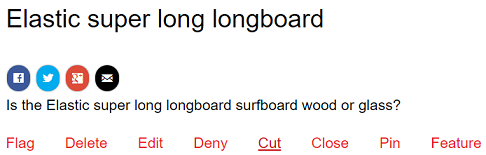
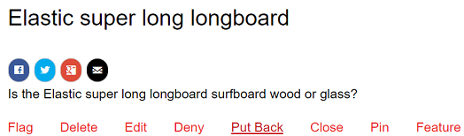
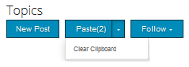
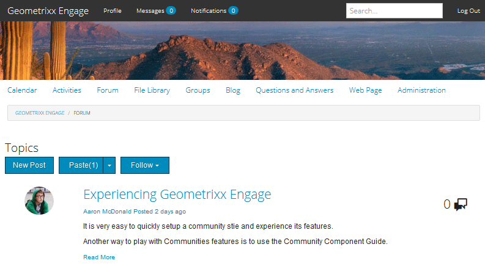
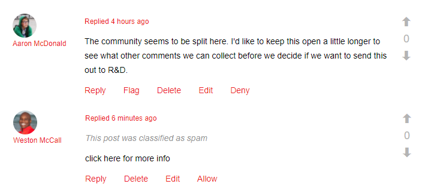
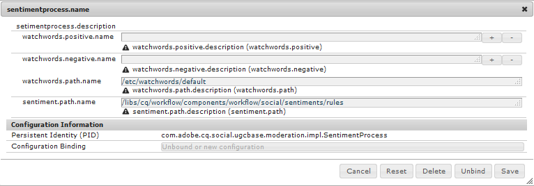
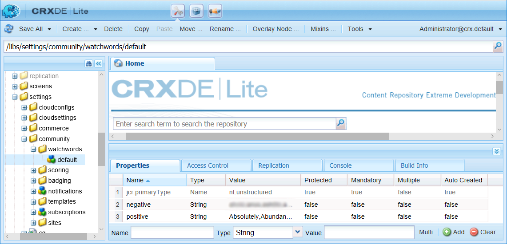

# Modération du contenu de la communauté {#moderating-community-content}

## Vue d’ensemble {#overview}

Le contenu de la communauté, également appelé contenu généré par l’utilisateur, est créé lorsqu’un membre (visiteur connecté) publie du contenu à partir d’un site de communauté publié par le biais d’une interaction avec l’un des composants de communauté suivants :

* [Blog](/help/communities/blog-feature.md) : les membres publient un article de blog ou un commentaire.
* [Calendrier](/help/communities/calendar.md) : les membres publient un événement ou un commentaire de calendrier.
* [Commentaires](/help/communities/comments.md) : les membres publient un commentaire ou répondent à un commentaire.

* [Forum](/help/communities/forum.md) : les membres publient une nouvelle rubrique ou répondent à une rubrique.
* [Idée](/help/communities/ideation-feature.md) : les membres postent une idée ou un commentaire.
* [QnA](/help/communities/working-with-qna.md) : les membres créent une question ou répondent à une question.
* [Avis](/help/communities/reviews.md) : les membres postent un commentaire lors de l&#39;évaluation d&#39;un article.

La modération du contenu créé par l’utilisateur est utile pour reconnaître les contributions positives et limiter les contributions négatives (telles que le spam et le langage abusif). Le contenu créé par l’utilisateur peut être modéré à partir de plusieurs environnements :

* [Stockage de contenu communautaire](working-with-srp.md)

* [Console de modération en bloc](moderation.md)

  La console Modération est accessible aux administrateurs et administratrices et [modérateurs de communauté](/help/communities/users.md) dans l’environnement public et aux administrateurs et administratrices dans l’environnement de création. Cela est possible lorsque le contenu de la communauté est stocké dans un [ magasin commun ](/help/communities/working-with-srp.md).

* [Modération en contexte](in-context.md)

  La modération dans l’environnement de publication peut être effectuée par les administrateurs et les modérateurs de la communauté directement sur la page où le contenu a été publié.

## Actions de modération {#moderation-actions}

Les actions qui peuvent être effectuées sur le contenu publié (UGC) varient en fonction de l’identité de l’utilisateur et de l’environnement. Le tableau ci-dessous utilise la terminologie suivante pour décrire les différents rôles en fonction de l’identité de l’utilisateur :

* `Admin`

  Utilisateur qui est membre du groupe [community-administrators](users.md).

* `Moderator`

  Membre d’un groupe [modérateurs de la communauté](users.md#publishenvironmentusersandgroups) (dispose des [autorisations de modérateur](in-context.md#moderatorpermissions)).

* `Creator`

  L’utilisateur qui a publié le contenu.

* `Member`

  Utilisateur connecté sans autorisations spéciales.

* `Visitor`

  Un utilisateur anonyme.

<table>
 <tbody>
  <tr>
   <td> </td>
   <td><strong>Admin</strong></td>
   <td><strong>Modérateur</strong></td>
   <td><strong>Créateur</strong></td>
   <td><strong>Membre</strong></td>
   <td><strong>Visiteur</strong></td>
   <td><strong>Événement   déclenché</strong></td>
   <td><strong>Prémodéré</strong></td>
  </tr>
  <tr>
   <td><strong>Modifier/  Supprimer</strong></td>
   <td>X</td>
   <td>X</td>
   <td>X</td>
   <td> </td>
   <td> </td>
   <td> </td>
   <td> </td>
  </tr>
  <tr>
   <td><strong>Couper</strong></td>
   <td>X</td>
   <td>X</td>
   <td> </td>
   <td> </td>
   <td> </td>
   <td> </td>
   <td> </td>
  </tr>
  <tr>
   <td><strong>Refuser</strong></td>
   <td>X</td>
   <td>X</td>
   <td> </td>
   <td> </td>
   <td> </td>
   <td>X</td>
   <td> </td>
  </tr>
  <tr>
   <td><strong>Fermer/  Rouvrir</strong></td>
   <td>X</td>
   <td>X</td>
   <td> </td>
   <td> </td>
   <td> </td>
   <td>X</td>
   <td>X  </td>
  </tr>
  <tr>
   <td><strong>Indicateur/  d'indicateur</strong></td>
   <td>X</td>
   <td>X</td>
   <td> </td>
   <td>X</td>
   <td> </td>
   <td>X</td>
   <td> </td>
  </tr>
  <tr>
   <td><strong>Autoriser</strong></td>
   <td>X</td>
   <td>X</td>
   <td> </td>
   <td> </td>
   <td> </td>
   <td>X</td>
   <td>X</td>
  </tr>
 </tbody>
</table>

### Modifier / Supprimer {#edit-delete}

Une fois une publication effectuée, elle peut être modifiée ou supprimée par le créateur, un administrateur ou un modérateur de la communauté.

Lorsque du contenu créé par l’utilisateur est supprimé, il est supprimé du référentiel et ne peut pas être récupéré.

### Couper {#cut}

Il est possible pour un administrateur ou un modérateur de communauté de déplacer un ou plusieurs sujets de forum ou questions QnA d’un emplacement à un autre. Cela inclut d’un site communautaire à un autre site communautaire, à condition que le même membre dispose de droits de modération sur les deux sites.

En sélectionnant l’action Couper , le contenu est copié dans un presse-papiers. Plusieurs publications peuvent être copiées et déplacées en tant que groupe vers le nouvel emplacement.

À l’autre emplacement, lorsque le contenu se trouve dans le presse-papiers, un bouton Coller est visible en regard de Nouvelle publication avec un nombre identifiant le nombre de publications qui seront collées. Le bouton Coller comprend une option permettant d’effacer le Presse-papiers au lieu de le coller.

### Refuser {#deny}

Un modérateur peut interdire au contenu créé par l’utilisateur de rester visible sur le site publié. Pour les administrateurs et les modérateurs de la communauté, la publication est toujours disponible et marquée comme spam.

### Fermer/Rouvrir {#close-reopen}

L’action Fermer fonctionne sur l’ensemble du fil de conversation (un sujet de forum ou le commentaire initial) et inclut toutes les publications ou réponses suivantes.

Lorsqu’elle est fermée, aucune autre réponse ou action de modération n’est autorisée.

Pour effectuer des opérations, la rubrique ou le commentaire doit être rouvert.

L’action Fermer/Rouvrir peut être entreprise par les administrateurs ou les modérateurs de la communauté.

### Indicateur / Annuler l&#39;indicateur {#flag-unflag}

L’indicateur est un moyen utilisé par tout membre connecté, à l’exception du créateur du contenu, pour indiquer qu’il existe un problème avec le contenu d’une publication. Une fois l’indicateur activé, une icône d’annulation de l’indicateur s’affiche, permettant au même membre d’annuler l’indicateur du contenu.

La modération en contexte peut être configurée pour permettre aux membres de sélectionner une raison lorsqu&#39;ils signalent une publication. La liste des motifs d’indicateur sélectionnables est configurable, y compris si un motif personnalisé peut être saisi. Le motif de l’indicateur est enregistré avec le contenu créé par l’utilisateur, mais le motif ne déclenche aucune action particulière. Seul le nombre d’indicateurs déclenche une notification. Le contenu marqué est annoté comme tel, de sorte que les modérateurs puissent agir dessus.

Le système suit tous les indicateurs, qui a marqué et la raison de l’indicateur et envoie un événement lorsque le seuil a été atteint. Si le contenu créé par l’utilisateur est autorisé par un modérateur de communauté, ces indicateurs sont archivés. Après autorisation et archivage, s’il y a des indicateurs ultérieurs, ils sont archivés comme s’il n’y avait pas eu d’indicateurs précédents.

### Autoriser {#allow}

L’action Autoriser est une option pour le contenu créé par l’utilisateur qui a été signalé, refusé ou qui n’a pas été approuvé dans un système prémodéré. L’action Autoriser efface tout statut marqué ou refusé/indésirable présent et archive toutes les données marquées.

## Concepts courants de modération {#common-moderation-concepts}

### Prémodération {#premoderation}

Lorsque du contenu créé par l’utilisateur est prémodéré, la publication n’apparaît sur le site publié que si elle est approuvée par une action de modération. Lors de la création d’un [site communautaire](/help/communities/sites-console.md), en cochant la case [Contenu est prémodéré](sites-console.md#moderation) vous activez la prémodération pour l’ensemble du site. Lorsque des composants sont placés sur une page, les composants qui prennent en charge la modération peuvent être configurés pour la prémodération à l’aide d’un paramètre dans leur boîte de dialogue de modification :

* [Commentaires](comments.md) et [avis](reviews.md)
dans **[!UICONTROL Modération utilisateur]** > **[!UICONTROL Pré-modération]**.

* [Forum](/help/communities/forum.md), [idéation](/help/communities/ideation-feature.md), [QnA](/help/communities/working-with-qna.md) et [calendar](/help/communities/calendar.md)
dans **[!UICONTROL Paramètres]** > **[!UICONTROL Modéré]**.

### Détection de spam {#spam-detection}

La détection du spam est une fonctionnalité de modération automatique qui filtre les éléments indésirables du contenu créé par l&#39;utilisateur en les marquant comme spam. Une fois activé, il identifie si un contenu généré par l’utilisateur est du spam ou non en fonction d’un ensemble préconfiguré de mots de spam. Les mots-clés de spam par défaut sont fournis à l&#39;adresse suivante :

`/libs/settings/community/sites/moderation/spamdetector-conf/profiles/spam_words.txt`.

Toutefois, pour personnaliser ou étendre les mots indésirables par défaut, créez un ensemble de mots dans le répertoire /apps en suivant la structure des mots indésirables par défaut avec [overlay](/help/communities/overlay-comments.md).

Une publication générée par l&#39;utilisateur (sur tous les types de contenu tels que les blogs, les forums et les commentaires) contenant des mots indésirables est marquée du texte « Cette publication a été classée comme indésirable » au-dessus de la publication.

Les modérateurs peuvent voir un tel message et le marquer comme n&#39;apparaissant pas sur le site. Les actions de modération sur ces publications peuvent être effectuées en contexte ou par le biais de l’interface utilisateur de modération en bloc.

Pour activer le moteur de détection de spam, procédez comme suit :

1. Ouvrez [Console web](https://localhost:4502/system/console/configMgr) en accédant à `/system/console/configMgr`.

1. Localisez la configuration **Modération automatique d’** et modifiez-la.
1. Ajoutez l&#39;entrée **[!UICONTROL SpamProcess]**.

>[!NOTE]
>
>La détection de spam n&#39;est implémentée que pour les paramètres régionaux anglais.

### Opinion {#sentiment}

Le sentiment est calculé en fonction du nombre de mots-clés positifs et négatifs ([mots-clés](#configuringwatchwords)) présents dans une publication (contenu créé par l’utilisateur).

L’analyse du sentiment utilise un ensemble de règles préconfigurées et calcule le sentiment du contenu créé par l’utilisateur. Les règles par défaut sont au `/libs/cq/workflow/components/workflow/social/sentiments/rules`.

La valeur générée par les règles va de 1 (tous les mots négatifs, aucun mot positif) à 10 (tous les mots positifs, aucun mot négatif). Une valeur de sentiment de 5 est un sentiment neutre et est la valeur par défaut.

Les règles définies dans le composant /libs sont les suivantes :

* Règle 1 : définissez la valeur sur 1 s’il n’existe aucun mot positif et au moins un mot négatif.
* Règle 2 : définissez la valeur sur 10 s’il n’existe aucun mot négatif et au moins un mot positif.
* Règle 3 : définissez la valeur sur 3 s’il y a plus de mots négatifs que de mots positifs.
* Règle 4 : définissez la valeur sur 8 s’il y a plus de mots positifs que de mots négatifs.

Pour remplacer ou ajouter des règles, créez un ensemble de règles dans le répertoire /apps en suivant la structure des règles par défaut. Modifiez la configuration du sentiment afin de pouvoir identifier l’emplacement des règles.

Une fois analysé, le sentiment est stocké avec le contenu créé par l’utilisateur.

À partir de la [ console de modération en bloc ](/help/communities/moderation.md), il est possible de filtrer et d’afficher le contenu créé par l’utilisateur en fonction du caractère négatif, neutre ou positif du sentiment.

#### Mots-clés {#watchwords}

AEM Communities fournit un *analyseur de mots-clés* comme étape du processus d’évaluation de [sentiment ](#sentiment). La contribution à la valeur de sentiment fournie par les mots-clés est due à une comparaison des mots-clés négatifs et positifs utilisés dans le contenu publié, et des mots interdits.

#### Configuration du Sentiment et des mots-clés {#configure-sentiment-and-watchwords}

La liste des mots-clés positifs et négatifs peut être personnalisée, de même que les règles de sentiment.

La liste de mots-clés par défaut peut être saisie en tant que propriétés d’un nœud dans le référentiel, comme la valeur par défaut ou en remplaçant la valeur par défaut en configurant le `sentimentprocess.name` de service OSGi avec la liste de mots.

Le fichier **sentimentprocess.name** peut également être modifié pour référencer l’emplacement d’un ensemble personnalisé de règles de sentiment.

Pour configurer le sentiment et les mots-clés :

* Connectez-vous à votre instance de création en tant qu’administrateur.
* Ouvrez [Console Web](https://localhost:4502/system/console/configMgr).
* Localisez `sentimentprocess.name`.
* Sélectionnez la configuration pour pouvoir l’ouvrir en mode d’édition.

* **Mots-clés positifs**

  Liste de mots séparés par des virgules contribuant à un sentiment positif qui remplacent les valeurs par défaut. La valeur par défaut est une liste vide.

* **Mots-clés négatifs**

  Liste de mots séparés par des virgules contribuant à un sentiment négatif qui remplacent les valeurs par défaut. La valeur par défaut est une liste vide.

* **Chemin d’accès explicite au nœud des mots d’ordre**

  Emplacement du référentiel d’un nœud contenant les `positive` par défaut et les propriétés de `negative` spécifiant les mots-clés par défaut. La valeur par défaut est `/libs/settings/community/watchwords/default`.

* **Règles De Sentiment**

  Emplacement du référentiel des règles de calcul du sentiment en fonction des mots-clés positifs et négatifs. La valeur par défaut est `/libs/cq/workflow/components/workflow/social/sentiments/rules` (aucun workflow n’est toutefois impliqué).

Voici un exemple d’entrée personnalisée pour les mots-clés par défaut, lorsque `Explicit Path to Watchwords Node` est défini sur `/libs/settings/community/watchwords/default`.

### Autorisations du modérateur {#moderator-permissions}

Les autorisations suivantes, lorsqu’elles sont affectées à la même ressource, sont collectivement appelées `moderator permissions` :

* `Read`
* `Modify`
* `Create`
* `Delete`
* `Replicate`
