# Console de modération {#moderation-console}

Dans AEM Communities, la [modération du contenu de la communauté](/help/communities/moderate-ugc.md) en bloc est possible à partir des environnements de création et de publication par les administrateurs et les modérateurs de la communauté (membres de confiance de la communauté désignés comme modérateurs).

Les administrateurs et administratrices, et les modérateurs et modératrices de communauté, peuvent également effectuer une [modération en contexte](/help/communities/in-context.md) dans l’environnement de publication.

Une fonctionnalité de tous les [sites de la communauté](/help/communities/sites-console.md) est un élément de menu `Administration` disponible pour les utilisateurs qui se connectent avec des privilèges d’administration. Le lien `Administration` permet d’accéder à la console Modération .

Dans la console Modération , les administrateurs et administratrices, et les modérateurs et modératrices de la communauté ont accès à tout le contenu créé par l’utilisateur ou l’utilisatrice (UGC) pour lequel ils sont autorisés à modérer. S’il est autorisé à modérer plusieurs sites, il est possible d’afficher les publications sur tous les sites ou de les filtrer selon les sites des communautés sélectionnées.

Pour plus d’informations, consultez [Gestion des utilisateurs et des groupes d’utilisateurs](/help/communities/users.md).

La console Modération prend en charge les éléments suivants :

* Effectuer des tâches de modération en bloc.
* Recherche de contenu créé par l’utilisateur.
* Affichage des détails du contenu créé par l’utilisateur.
* Affichage des détails de l’auteur UGC.

Les tâches de modération ne peuvent être effectuées que lorsque vous êtes connecté en tant qu’administrateur ou membre avec ` [moderator permissions](/help/communities/in-context.md#identifyingtrustedmembers)`.

## Accès à l’environnement de publication {#publish-environment-access}

L’accès à la console Modération à partir d’un site communautaire publié s’effectue par le biais d’un lien Administration qui s’affiche lorsqu’un modérateur de la communauté est connecté.

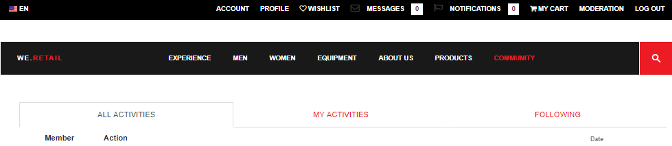

En sélectionnant le lien Administration , la console Modération s’affiche :

## Accès à l’environnement de création {#author-environment-access}

Dans l’environnement de création, pour accéder à la console Modération .

* Dans la navigation globale, sélectionnez **[!UICONTROL Communities]** > **[!UICONTROL Modération]**.

Les tâches de modération ne peuvent être effectuées que lorsque vous êtes connecté en tant qu’administrateur ou membre avec les autorisations [modérateur](/help/communities/in-context.md#identifyingtrustedmembers). Le seul contenu de la communauté affiché est celui que le membre connecté est autorisé à modérer.

>[!NOTE]
>
>Le contenu créé par l’utilisateur de l’environnement de publication n’est visible sur l’auteur que si le fournisseur de services partagés sélectionné implémente un magasin commun. Par exemple, le stockage par défaut est JSRP, qui n’est pas un magasin commun pour l’auteur et la publication. Consultez la section [Stockage de contenu de la communauté](/help/communities/working-with-srp.md).

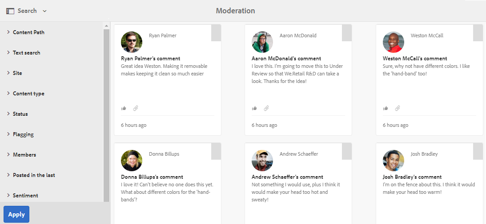

## Interface utilisateur de la console de modération {#moderation-console-ui}

Si l’on excepte le rail de navigation de gauche (qui s’affiche sur l’instance de création, mais pas sur l’instance de publication), l’interface utilisateur de modération comporte les zones principales suivantes :

* **[Barre de navigation supérieure](#top-navigation-bar)**
* **[Barre d’outils](#toolbar)**
* **[Zone de contenu](#content-area)**

### Barre de navigation supérieure {#top-navigation-bar}

La barre de navigation supérieure est constante pour toutes les consoles. Pour plus d’informations, voir [&#x200B; Manipulation de base &#x200B;](/help/sites-authoring/basic-handling.md).

### Barre d’outils {#toolbar}

La barre d’outils, située sous la barre de navigation supérieure, propose le bouton bascule suivant sur le côté gauche :

* [Rail de filtre](/help/communities/moderation.md#filterrail)
ouvre un rail qui permet d’effectuer un choix de propriétés sur lesquelles filtrer le contenu.

La barre d’outils, située sous la barre de navigation supérieure, propose le bouton bascule suivant sur le côté gauche :

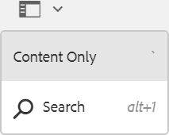

[Rail de filtre](/help/communities/moderation.md#filterrail)
ouvre un rail lors de la sélection de Rechercher , qui permet d’effectuer un choix de propriétés pour filtrer le contenu.

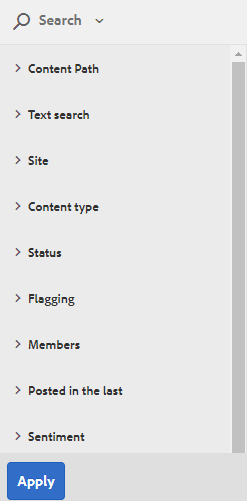

### Zone de contenu {#content-area}

La zone de contenu contient des informations sur le contenu créé par l’utilisateur publié :

* Contenu créé par l’utilisateur publié
* Nom du membre
* Avatar du membre
* Emplacement du poste
* Date de publication
* Nombre de réponses à la publication
* [Sentiment &#x200B;](/help/communities/moderate-ugc.md#sentiment) associé à la publication
* Si elle est approuvée, une coche s’affiche
* S’il existe une pièce jointe, un trombone s’affiche

>[!NOTE]
> 
>La zone de contenu dispose d’un *défilement infini*, ce qui signifie qu’elle vous permet de continuer le défilement jusqu’à ce que vous ayez atteint la fin du contenu. La barre d’outils reste à un emplacement fixe et visible au-dessus de la zone de contenu, même lors du défilement.

### Rail de filtre {#ootbfilters}

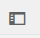

L’icône du panneau latéral ouvre le rail de filtre. Le rail de filtre qui s’affiche à gauche de la zone de contenu fournit différents filtres, chacun ayant un effet immédiat sur le contenu créé par l’utilisateur référencé qui apparaît dans la zone de contenu.

Les filtres de chaque catégorie sont regroupés en **OU** et les filtres des différentes catégories sont **ET**.

Par exemple, si vous cochez les deux cases **Question** et **Réponse**, vous verrez un contenu qui est soit une **Question** *ou* une **Réponse**.

Cependant, si vous cochez **Question** et **En attente**, vous ne verrez que le contenu qui est une **Question** et qui est **En attente**.

>[!NOTE]
>
>Les modérateurs de la communauté peuvent ajouter un signet aux filtres prédéfinis dans l’interface utilisateur de la console de modération. Comme ces filtres sont ajoutés vers la fin de l’URL (en tant que paramètres de chaîne de requête), les modérateurs peuvent revenir ultérieurement aux filtres marqués d’un signet et partager également ces liens.

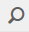

Lorsque le rail de filtre est ouvert, l’icône Rechercher ferme/ferme le panneau latéral. Toutefois, pour fermer le rail de filtre et afficher uniquement le contenu généré par l’utilisateur, cliquez sur l’icône Rechercher , puis sélectionnez l’option Contenu uniquement .

#### Chemin d’accès au contenu {#content-path}

Le chemin d’accès au contenu limite le contenu créé par l’utilisateur de référence affiché aux publications placées dans le référentiel de contenu spécifié.

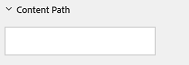

#### Recherche textuelle {#text-search}

La recherche de texte limite le contenu créé par l’utilisateur référencé affiché aux publications contenant le texte saisi.

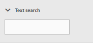

#### Site {#site}

Le site limite le contenu créé par l’utilisateur référencé affiché aux publications sur les sites communautaires sélectionnés. Si aucun site n’est coché, toutes les références au contenu créé par l’utilisateur s’affichent.

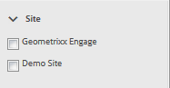

>[!NOTE]
>
>Lorsqu’un administrateur accède à la console de modération en bloc, toutes les références au contenu créé par l’utilisateur s’affichent, y compris les sites qui n’ont pas été créés avec l’assistant [création de sites](/help/communities/sites-console.md), tels que les exemples de Geometrixx.
>
>Lorsqu’un membre de la communauté de confiance accède à la console de modération en bloc sur l’instance de publication, seules les références au contenu créé par l’utilisateur créé pour les sites de la communauté que le membre est autorisé à modérer s’affichent. En outre, il peut être filtré à l’aide du filtre Site.

#### Type de contenu {#content-type}

Type de contenu limite le contenu créé par l’utilisateur référencé affiché aux publications du type de ressource sélectionné. Vous pouvez sélectionner un ou plusieurs des types suivants. Tous les types s’affichent si aucun n’est sélectionné.

* **Commentaire**
* **Sujet du forum**
* **Réponse au forum**
* **Question QnA**
* **Réponse QnA**
* **Article de blog**
* **Commentaire sur le blog**
* **Événement de calendrier**
* **Commentaire sur le calendrier**
* **Dossier de la bibliothèque de fichiers**
* **Document de bibliothèque de fichiers**
* **Idée**
* **Commentaire sur l&#39;idéation**

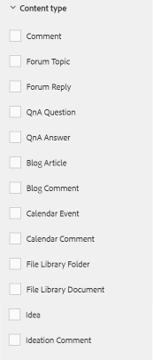

#### Types de contenu supplémentaires {#additional-content-types}

Pour ajouter des ressources supplémentaires sur lesquelles effectuer un filtrage :

* Connectez-vous à votre instance de création en tant qu’administrateur.
* Ouvrez [Console Web](https://localhost:4502/system/console/configMgr).
* Localisez `AEM Communities Moderation Dashboard Filters`.
* Sélectionnez la configuration pour pouvoir l’ouvrir en mode d’édition.
* Saisissez le ResourceType d’un composant sur lequel effectuer le filtrage :

  * Par exemple, pour filtrer sur les composants de vote inclus, saisissez :

    `Voting=social/tally/components/hbs/voting`

  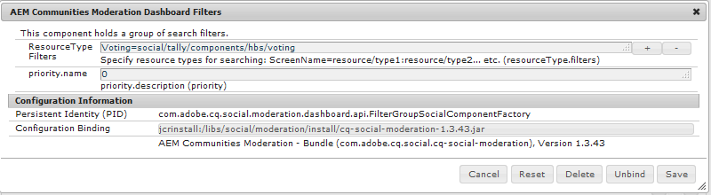

* Sélectionnez Enregistrer.
* Actualisez la console Communities - Modération .

Le résultat est un nouveau filtre sélectionnable pour les `Voting` sous le groupe de filtres `Content Type`.

Lorsque ce filtre est sélectionné, le contenu du tableau de bord affiche le contenu créé par l’utilisateur qui correspond à l’un des types de ressources saisis.

#### Statut {#status}

Le statut limite le contenu créé par l’utilisateur référencé affiché aux publications du statut sélectionné, qui peut être un ou plusieurs des statuts En attente, Approuvé, Refusé ou Fermé, et Brouillon ou Planifié pour les articles de blog, et Répondu ou Non répondu pour les questions QnA. Si aucun n’est sélectionné, tous s’affichent.

>[!NOTE]
>
>Si seul le statut Non répondu est sélectionné, le modérateur voit tout le contenu (pour tous les types de contenu), à l’exception des questions auxquelles une réponse a été donnée. En effet, la propriété responsable de la question à laquelle une réponse est donnée n’existe pas s’il existe des questions sans réponse et d’autres contenus tels que le sujet du forum, l’article de blog ou les commentaires.

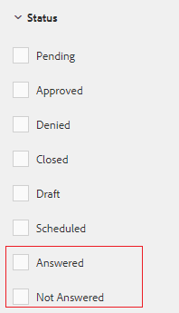

#### Marquage {#flagging}

L’indicateur limite le contenu créé par l’utilisateur référencé affiché aux publications marquées ou masquées.

Une fois qu’un élément de contenu est marqué, il reste marqué jusqu’à ce que vous le supprimiez en sélectionnant à nouveau le bouton **Marquer**. Il n’existe aucun niveau de marquage, tel que important ou suivi.

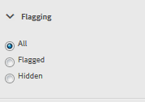

#### Membres {#members}

Membres limite le contenu créé par l’utilisateur référencé affiché au contenu créé par l’utilisateur publié par le nom de membre saisi.

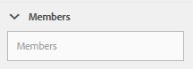

#### Publié au cours du ou des derniers {#posted-in-the-last}

Publié dans la dernière limite le contenu créé par l’utilisateur référencé affiché aux publications effectuées dans la dernière heure, le dernier jour, la dernière semaine, le dernier mois ou la dernière année.

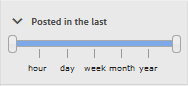

#### Opinion {#sentiment}

[Sentiment &#x200B;](/help/communities/moderate-ugc.md#sentiment) limite le contenu créé par l’utilisateur référencé affiché aux publications dont la valeur de sentiment est positive, négative ou neutre.

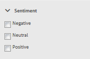

## Filtres personnalisés {#custom-filters}

Outre les filtres prêts à l’emploi dans le [rail de filtres](/help/communities/moderation.md#ootbfilters), d’autres filtres personnalisés sur les métadonnées peuvent être ajoutés à l’interface utilisateur de modération. Les développeurs peuvent utiliser l’exemple de code dans GitHub pour étendre les filtres existants de l’interface utilisateur de modération.

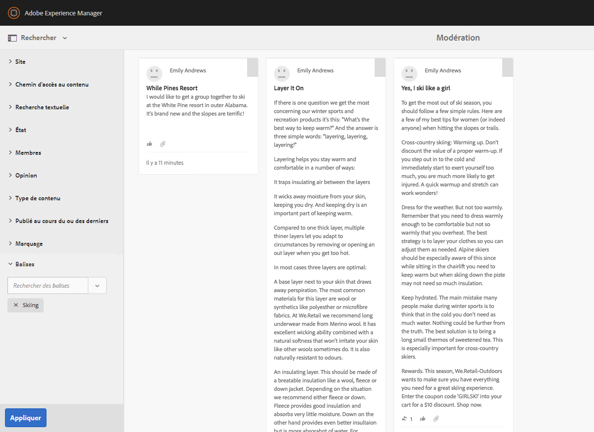

Le [exemple de projet](https://github.com/Adobe-Marketing-Cloud/aem-communities-extensions/tree/main/aem-communities-moderation-filter) sur GitHub implémente le filtre Balise pour filtrer la liste du contenu créé par l’utilisateur selon que les balises spécifiques sont appliquées ou non au contenu généré par l’utilisateur. Vous pouvez suivre l’exemple de code et créer des filtres analogues pour d’autres champs de métadonnées UGC similaires.

Pour installer l’exemple de filtre Balises :

1. Ouvrez le gestionnaire de packages sur les instances d’auteur AEM (`https://[aem-author]:4502/crx/packmgr/index.jsp`) et de publication AEM (`https://[aem-publish]:4503/crx/packmgr/index.jsp`).
1. Créez le package `com.adobe.social.sample.moderation.filter.ui.apps-1.0-SNAPSHOT.zip` à partir du code GitHub, puis installez-le et activez-le.
1. Ouvrez la console des lots sur l’instance d’auteur AEM ( `https://[aem-author]:4502/system/console/bundles`) et l’instance de publication AEM ( `https://[aem-publish]:4503/system/console/bundles`).
1. Créez le package (`[com](https://sample-moderation-filter.com/).adobe.social.sample.moderation.filter.core-1.0-SNAPSHOT.jar`) à partir de GitHub, puis installez-le et activez-le.
1. Accédez au nœud **/apps/social/modation/facettes** sur l’instance de création AEM (`https://[aem-author]:4502/crx/de/index.jsp#/apps/social/moderation/facets`) et de publication AEM (`https://[aem-publish]:4502/crx/de/index.jsp#/apps/social/moderation/facets`).
1. Ajoutez un utilisateur technique **communities-utility-reader** avec des autorisations `jcr:read`.

Pour afficher les filtres personnalisés sur les sites existants de la communauté :

1. Modifier le `Clientlibs` de la page de modération existante `/content/we-retail/us/en/community/moderation/shell3/jcr:content/head/clientlibs.`

   * Ajouter un nouveau `cq.social.hbs.moderation.v2.` de catégorie

1. Accédez à `/content/we-retail/us/en/community/moderation/shell3/jcr:content/rails/searchWell/items/filters.`.

   * Définir sur le nouveau composant `sling:resourceType = social/moderation/v2/filters.`

1. Accédez à `/content/we-retail/us/en/community/moderation/shell3/jcr:content/views/content/items/modcontainer`.

   * Définissez sur le nouveau composant `sling:resourceType = social/moderation/v2/modcontainer`.

## Actions de modération {#moderation-actions}

Les [actions de modération](/help/communities/moderate-ugc.md#moderation-actions) peuvent être effectuées sur une ou plusieurs sélections effectuées dans la zone de contenu ou lors de l’affichage des détails du contenu.

Pour modérer en masse les publications, dans la zone de contenu, cliquez sur l’icône Sélectionner () d’une publication, qui s’affiche lorsque vous pointez dessus avec la souris (bureau) ou lorsque vous appuyez ou maintenez un doigt sur la publication (mobile). Ce faisant, vous passez en mode de sélection multiple et pouvez désormais sélectionner les publications suivantes à modérer en bloc en cliquant simplement dessus. Utilisez les boutons affichés sur la barre d&#39;outils pour effectuer des actions de modération sur les publications sélectionnées. Toutes les actions demandent une confirmation.

Pour modérer une seule publication dans la zone de contenu, pointez dessus avec la souris (bureau) ou appuyez et maintenez un doigt sur la publication (mobile) de sorte que des boutons apparaissent sur la publication. Lorsque vous travaillez sur un seul détail de contenu, seule une action de suppression vous invite à confirmer.

### Modération de plusieurs publications {#moderating-multiple-posts}

Passez en mode de sélection en bloc en cliquant sur l’icône `Select` d’une publication :

Pour quitter le mode de sélection en bloc, sélectionnez l’icône Annuler (x) dans la barre d’outils :

Les actions de modération qui peuvent être effectuées sur plusieurs publications sont les suivantes :

* Refuser
* Supprimer
* Fermer/Rouvrir les publications

Les icônes permettant ces actions n’apparaissent sur la barre d’outils que lorsque plusieurs publications sont sélectionnées.

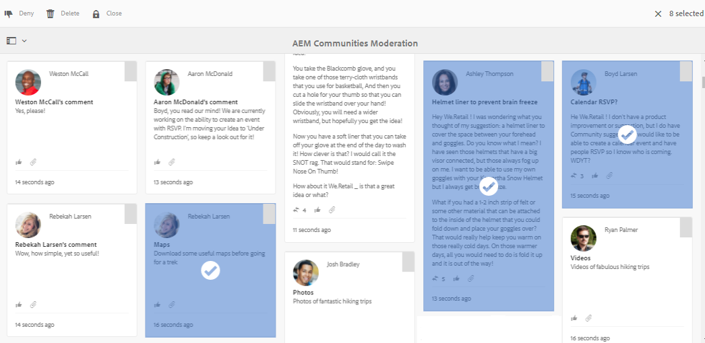

### Modération d’une publication unique {#moderating-a-single-post}

En mode de sélection unique, il est possible de:

* Affichez les détails de l’utilisateur en sélectionnant son nom.
* Affichez la publication en contexte en sélectionnant le lien vers la publication.
* [Répondre](#reply)
* [Autoriser](#allow)
* [Refuser](#deny)
* [Supprimer](#delete)
* [Fermer](#close)
* Afficher [Historique de modération](#moderation-history)
* [Afficher les détails](#viewdetails)

Le texte de la publication est présent sur la vue Carte au-dessus des icônes d’action de modération et en dessous des données indiquant :

* S&#39;il a des réponses, et si oui, précédé du nombre de réponses
* S’il a été marqué
* Si elle a été approuvée
* Lorsque le contenu créé par l’utilisateur a été publié

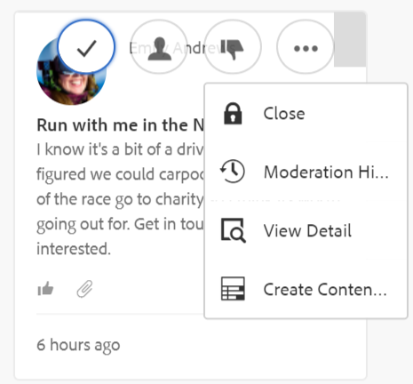

#### Répondre {#reply}

Lorsque vous utilisez une seule publication, une icône Répondre s’affiche si le type de contenu créé par l’utilisateur prend en charge les réponses et est configuré pour autoriser les réponses.

#### Autoriser {#allow}

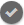

Lorsque vous utilisez une publication unique, l’icône Autoriser s’affiche lorsque la publication a été marquée ou refusée. S’il est marqué, sélectionner Autoriser efface tous les indicateurs.

#### Refuser {#deny}

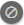

L’action de modération **Refuser** n’est disponible que pour le contenu modéré et n’apparaît pas sur le contenu non modéré, sauf en mode de sélection multiple.

Le contenu qui n’est pas modéré est toujours approuvé.

Le contenu modéré passe initialement à l’état En attente et peut être modifié ultérieurement pour approbation ou refus.

Le contenu qui quitte l’état en attente ne peut jamais revenir à un état en attente. Le contenu marqué comme approuvé ou refusé peut être modifié à tout moment et passer à un autre état.

#### Supprimer {#delete}

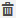

En mode de sélection unique ou en masse, vous pouvez sélectionner des éléments et les supprimer. L’action de suppression entraîne l’affichage d’une boîte de dialogue de confirmation. Une fois supprimés, ces éléments disparaissent immédiatement de la zone de contenu. **Une fois le contenu créé par l’utilisateur supprimé, il est définitivement supprimé du référentiel et ne peut pas être récupéré ultérieurement**.

#### Fermer {#close}

Lorsque vous travaillez avec une publication unique, une icône Fermer s’affiche si le type de contenu créé par l’utilisateur prend en charge la possibilité d’empêcher d’autres publications pour cette ressource.

#### Historique de modération {#moderation-history}

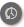

Lorsque vous travaillez avec une seule publication, une icône d’historique de modération s’affiche lorsque vous passez la souris dessus. Si vous sélectionnez l’icône , un volet affiche l’historique des actions entreprises concernant la publication du contenu créé par l’utilisateur.

Pour revenir à l’affichage de la zone de contenu de plusieurs publications UGC, sélectionnez le X dans le coin supérieur droit du volet des détails de l’affichage.

Par exemple :

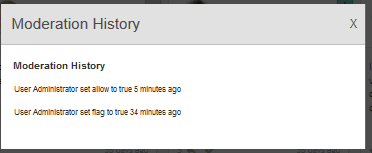

#### Afficher le détail {#view-detail}

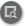

Lorsque vous travaillez avec une seule publication, vous pouvez afficher plus de détails en ouvrant le contenu créé par l’utilisateur en mode détail.

Pour ce faire, pointez sur la publication pour afficher l’icône `View Detail` et sélectionnez-la pour afficher un panneau contenant plus de détails sur la publication.

Pour revenir à l’affichage de la zone de contenu de plusieurs publications UGC, sélectionnez le X dans le coin supérieur droit du volet des détails de l’affichage.

Par exemple :

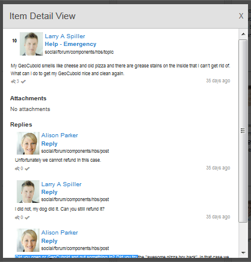
