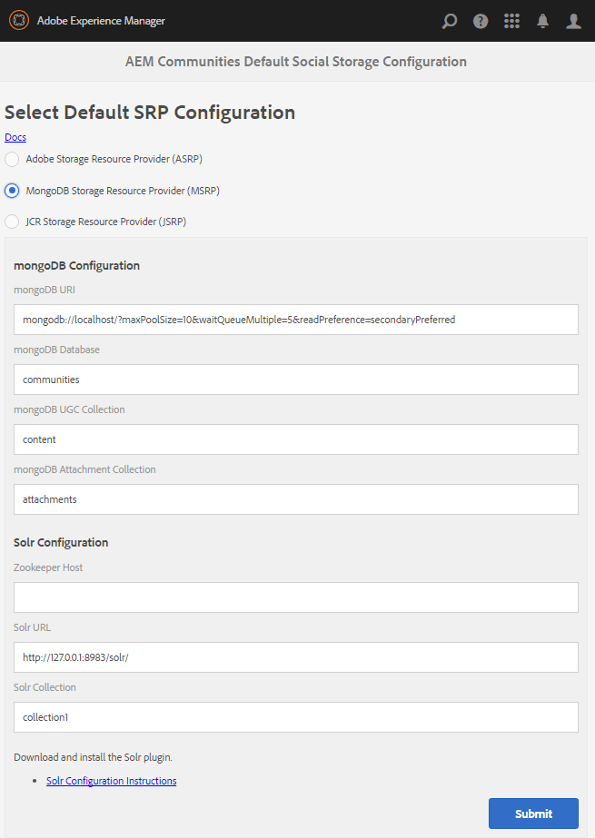

# MSRP - Fournisseur de ressources de stockage MongoDB {#msrp-mongodb-storage-resource-provider}

## À propos de MSRP {#about-msrp}

Lorsqu’AEM Communities est configuré pour utiliser MSRP comme magasin commun, le contenu généré par l’utilisateur est accessible à partir de toutes les instances de création et de publication, sans avoir à effectuer de synchronisation ni de réplication.

Consultez également les sections [Caractéristiques des options SRP](working-with-srp.md#characteristics-of-srp-options) et [Topologies recommandées](topologies.md).

## Exigences {#requirements}

* [MongoDB](https://www.mongodb.org/) :

   * Version 2.6 ou ultérieure
   * Pas besoin de configurer les mongos ou le partage
   * Recommandez vivement l’utilisation d’un [ensemble de répliques](#mongoreplicaset)
   * Peut s’exécuter sur le même hôte qu’AEM ou à distance

* [Apache Solr](https://lucene.apache.org/solr/) :

   * Solr version 7.0
   * Solr nécessite Java 1.7 ou une version ultérieure
   * Aucun service n’est nécessaire
   * Choix des modes d’exécution :
      * Mode autonome
      * [mode SolrCloud](solr.md#solrcloud-mode) (recommandé pour les environnements de production)
   * Choix de la recherche multilingue (MLS) :
      * [Installation de MLS standard](solr.md#installing-standard-mls)
      * [Installation du MLS avancé](solr.md#installing-advanced-mls)

## Configuration de MongoDB {#mongodb-configuration}

### Sélectionner un MSRP {#select-msrp}

La [console de configuration du stockage](srp-config.md) permet de sélectionner la configuration de stockage par défaut, qui identifie l’implémentation de SRP à utiliser.

En mode de création, pour accéder à la console de configuration du stockage :

* Dans la navigation globale, sélectionnez **[!UICONTROL Outils]** > **[!UICONTROL Communautés]** > **[!UICONTROL Configuration de stockage]**.



* Sélectionnez **[!UICONTROL Fournisseur de ressources de stockage (MSRP) MongoDB]**
* **[!UICONTROL Configuration de mongoDB]**

   * **[!UICONTROL URI mongoDB]**

     *default* : mongodb://localhost/?maxPoolSize=10&amp;waitQueueMultiple=5&amp;readPreference=secondaryPreferred

   * **[!UICONTROL base de données mongoDB]**

     *default* : communities

   * **[!UICONTROL collection UGC mongoDB]**

     *default* : contenu

   * **[!UICONTROL collection de pièces jointes mongoDB]**

     *default* : pièces jointes

* **[!UICONTROL SolrConfiguration]**

   * **[Zookeeper](https://cwiki.apache.org/confluence/display/solr/Using+ZooKeeper+to+Manage+Configuration+Files) Host**

     En mode [SolrCloud](solr.md#solrcloud-mode) avec un ZooKeeper externe, définissez cette valeur sur la `HOST:PORT` du ZooKeeper, par exemple *my.server.com:2181*

     Pour un ensemble ZooKeeper, entrez des valeurs de `HOST:PORT` séparées par des virgules, telles que *host1:2181,host2:2181*

     Laissez vide si vous exécutez Solr en mode autonome à l’aide du ZooKeeper interne.
     *Par défaut* : *&lt;blank>*

      * **[!UICONTROL URL Solr]**
URL utilisée pour communiquer avec Solr en mode autonome.
Laissez vide si l’exécution est en mode SolrCloud.
        *Par défaut* : https://127.0.0.1:8983/solr/

      * **[!UICONTROL Collection Solr]**
Nom de la collection Solr.
        *Default* : collection1

* Sélectionnez **[!UICONTROL Envoyer]**.

>[!NOTE]
>
>La base de données mongoDB, dont le nom par défaut est `communities`, ne doit pas être définie sur le nom d’une base de données utilisée pour les [magasins de nœuds ou de données (binaires)](../../help/sites-deploying/data-store-config.md). Voir aussi [Éléments de stockage dans AEM 6.5](../../help/sites-deploying/storage-elements-in-aem-6.md).

### Jeu de Secondaires MongoDB {#mongodb-replica-set}

Pour l’environnement de production, il est vivement recommandé de configurer un ensemble de répliques, un cluster de serveurs MongoDB qui implémente la réplication primaire-secondaire et le basculement automatisé.

Pour en savoir plus sur les ensembles de répliques, consultez la documentation [Réplication](https://docs.mongodb.org/manual/replication/) de MongoDB.

Pour utiliser des ensembles de répliques et apprendre à définir des connexions entre les applications et les instances de MongoDB, consultez la documentation [Format d’URI de chaîne de connexion](https://docs.mongodb.org/manual/reference/connection-string/) de MongoDB.

#### Exemple d’URL pour la connexion à un jeu de Secondaires  {#example-url-for-connecting-to-a-replica-set}

```shell
# Example url for:
# servers "mongoserver1", "mongoserver2", "mongoserver3"
# replica set 'rs0'
# port numbers only necessary if not default port 27017
mongodb://mongoserver1:<mongoport1>,mongoserver2:<mongoport2>,mongoserver3:<mongoport3>/?replicaSet=rs0&maxPoolSize=100&waitQueueMultiple=50&readPreference=secondaryPreferred
```

## Configuration de Solr {#solr-configuration}

Une installation Solr peut être partagée entre le magasin de nœuds (Oak) et le magasin commun (MSRP) à l’aide de différentes collections.

Si les collections Oak et MSRP sont utilisées de manière intensive, un second Solr peut être installé pour des raisons de performances.

Pour les environnements de production, le [mode SolrCloud](solr.md#solrcloud-mode) offre de meilleures performances par rapport au mode autonome (une configuration Solr unique et locale).

Pour plus d’informations sur la configuration, voir [Configuration de Solr pour SRP](solr.md).

### Mise à niveau {#upgrading}

Si vous effectuez une mise à niveau à partir d’une version antérieure configurée avec MSRP, il sera nécessaire de :

1. Effectuez la [ mise à niveau vers AEM Communities ](upgrade.md)
1. Installation de nouveaux fichiers de configuration Solr
   * Pour [MLS standard](solr.md#installing-standard-mls)
   * Pour [MLS avancé](solr.md#installing-advanced-mls)
1. Réindexer le MSRP
Pour plus d&#39;informations, consultez la section [Outil de réindexation MSRP](#msrp-reindex-tool)

## Publication de la configuration {#publishing-the-configuration}

MSRP doit être identifié comme le magasin commun sur toutes les instances de création et de publication.

Pour rendre la configuration identique disponible dans l’environnement de publication, connectez-vous à votre instance de création et procédez comme suit :

* Accédez au menu principal **[!UICONTROL Outils]** > **[!UICONTROL Opérations]** > **[!UICONTROL Réplication]**.
* Sélectionnez **[!UICONTROL Activer l’arborescence]**
* **[!UICONTROL Chemin de début]** :
   * Accéder à `/etc/socialconfig/srpc/`
* Sélectionnez **[!UICONTROL Activer]**

## Gestion des données utilisateur {#managing-user-data}

Pour plus d’informations sur les *utilisateurs*, *profils utilisateur* et *groupes d’utilisateurs*, souvent saisis dans l’environnement de publication, consultez

* [Synchronisation des utilisateurs](sync.md)
* [Gestion des utilisateurs et des groupes d’utilisateurs](users.md)

## Outil de réindexation MSRP {#msrp-reindex-tool}

Il existe un point d’entrée HTTP pour la réindexation de Solr pour MSRP lors de l’installation de nouveaux fichiers de configuration ou de la réparation d’un index Solr endommagé.

Avec cet outil, MongoDB est la source de *vérité* pour MSRP ; les sauvegardes ne doivent être effectuées que sur MongoDB.

L’ensemble de l’arborescence du contenu créé par l’utilisateur peut être réindexé, ou seulement une sous-arborescence spécifique, comme spécifié par le paramètre de données *path*.

Cet outil peut être exécuté à partir de la ligne de commande à l’aide de cURL ou de tout autre outil HTTP.

Lors de la réindexation, il existe un compromis entre la mémoire et les performances contrôlées par le paramètre de données *batchSize*, qui spécifie le nombre d’enregistrements UGC réindexés par lot.

Une valeur par défaut raisonnable est de 5 000 :

* Si la mémoire pose problème, indiquez un nombre plus petit
* Si la vitesse pose problème, indiquez un nombre plus grand pour augmenter la vitesse

### Exécution de l’outil de réindexation MSRP à l’aide de la commande cURL {#running-msrp-reindex-tool-using-curl-command}

La commande cURL suivante indique ce qui est nécessaire pour qu’une requête HTTP réindexe le contenu créé par l’utilisateur stocké dans MSRP.

Le format de base est :

cURL -u *signin* -d *data* *reindex-url*

*signin* = administrator-id:password
Par exemple : admin:admin

*data* = « batchSize=*size*&amp;path=*path »*

*size* = nombre d’entrées UGC à réindexer par opération
`/content/usergenerated/asi/mongo/`

*path* = emplacement racine de l’arborescence du contenu créé par l’utilisateur à réindexer.

* Pour réindexer tout le contenu créé par l’utilisateur, spécifiez la valeur de la propriété `asipath` de .
  `/etc/socialconfig/srpc/defaultconfiguration`
* Pour limiter l’index à un contenu créé par l’utilisateur, spécifiez une sous-arborescence de `asipath`

*reindex-url* = point d’entrée pour la réindexation du SRP
`http://localhost:4503/services/social/datastore/mongo/reindex`

>[!NOTE]
>
>Si vous [réindexez le Solr DSRP](dsrp.md), l’URL est **/services/social/datastore/rdb/reindex**

### Exemple de réindexation MSRP {#msrp-reindex-example}

```shell
curl -s -u admin:admin -d 'batchSize=10000&path=/content/usergenerated/asi/mongo/' http://localhost:4503/services/social/datastore/mongo/reindex
```

## Comment effectuer une démonstration de MSRP {#how-to-demo-msrp}

Pour configurer MSRP pour un environnement de démonstration ou de développement, voir [Comment configurer MongoDB pour la démonstration ](demo-mongo.md).

## Résolution des problèmes {#troubleshooting}

### Contenu créé par l’utilisateur non visible dans MongoDB {#ugc-not-visible-in-mongodb}

Assurez-vous que MSRP a été configuré pour être le fournisseur par défaut en vérifiant la configuration de l’option de stockage . Par défaut, le fournisseur de ressources de stockage est JSRP.

Sur toutes les instances d’AEM de création et de publication, revenez sur la [console de configuration de stockage](srp-config.md) ou vérifiez le référentiel AEM :

* Dans JCR, si [/etc/socialconfig ](http://localhost:4502/crx/de/index.jsp#/etc/socialconfig/)

   * Ne contient pas de nœud [srpc](http://localhost:4502/crx/de/index.jsp#/etc/socialconfig/srpc), ce qui signifie que le fournisseur de stockage est JSRP.
   * Si le nœud srpc existe et contient le nœud [defaultconfiguration](http://localhost:4502/crx/de/index.jsp#/etc/socialconfig/srpc/defaultconfiguration), les propriétés de la configuration par défaut doivent définir MSRP comme fournisseur par défaut.

### UGC disparaît après la mise à niveau {#ugc-disappears-after-upgrade}

Si vous effectuez une mise à niveau à partir d’un site AEM Communities 6.0 existant, tout contenu créé par l’utilisateur préexistant doit être converti conformément à la structure requise pour l’API [SRP](srp.md) après la mise à niveau vers AEM Communities 6.3.

Un outil open source est disponible sur GitHub à cet effet :

* [Outil de migration du contenu créé par l’utilisateur AEM Communities](https://github.com/Adobe-Marketing-Cloud/communities-ugc-migration)

L’outil de migration peut être personnalisé pour exporter du contenu créé par l’utilisateur à partir de versions antérieures des communautés sociales AEM en vue de l’importer dans AEM Communities 6.1 ou une version ultérieure.

### Erreur - champ provider_id non défini {#error-undefined-field-provider-id}

Si l’erreur suivante s’affiche dans les journaux, cela indique que le fichier de schéma Solr n’est pas correctement configuré.

#### JsonMappingException : champ provider_id non défini {#jsonmappingexception-undefined-field-provider-id}

```xml
Caused by: com.fasterxml.jackson.databind.JsonMappingException: undefined field provider_id
at com.fasterxml.jackson.databind.ser.DefaultSerializerProvider.serializeValue(DefaultSerializerProvider.java:129)
at com.fasterxml.jackson.databind.ObjectMapper.writeValue(ObjectMapper.java:1819)
at com.adobe.cq.social.scf.core.BaseSocialComponent.toJSONString(BaseSocialComponent.java:196)
... 124 common frames omitted
```

Pour résoudre l’erreur, lorsque vous suivez les instructions de la section [Installation de MLS standard](solr.md#installing-standard-mls), assurez-vous que :

* Les fichiers de configuration XML ont été copiés vers l’emplacement Solr approprié.
* Solr a été redémarré après le remplacement des fichiers de configuration existants par les nouveaux.

### Échec de la connexion sécurisée à MongoDB {#secure-connection-to-mongodb-fails}

Si une tentative de connexion sécurisée au serveur MongoDB échoue en raison d’une définition de classe manquante, il est nécessaire de mettre à jour le lot de pilotes MongoDB, `mongo-java-driver`, disponible à partir du référentiel Maven public.

1. Téléchargez le pilote à partir de [](https://search.maven.org/#artifactdetails%7Corg.mongodb%7Cmongo-java-driver%7C2.13.2%7Cjar) (version 2.13.2 ou ultérieure).
1. Copiez le lot dans le dossier « crx-quickstart/install » pour une instance AEM.
1. Redémarrez l’instance AEM.

## Ressources {#resources}

* [AEM avec MongoDB](../../help/sites-deploying/aem-with-mongodb.md)
* [Documentation de MongoDB](https://docs.mongodb.org/)
