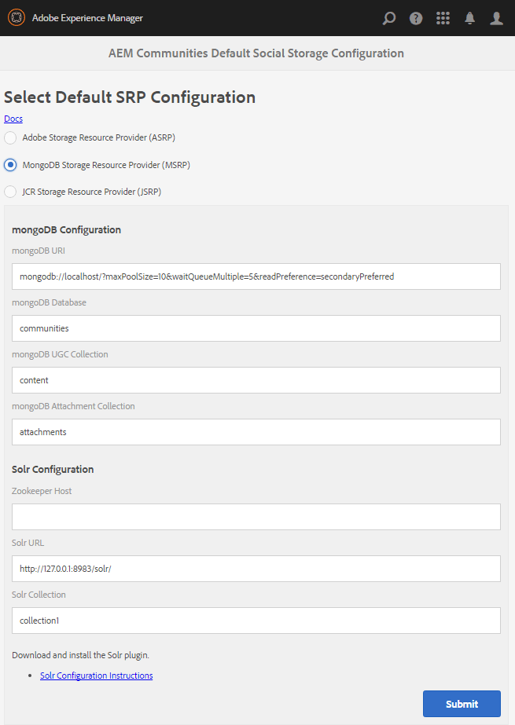

# MSRP - Fournisseur de ressources de stockage MongoDB {#msrp-mongodb-storage-resource-provider}

## À propos de MSRP {#about-msrp}

Lorsqu’AEM Communities est configuré pour utiliser MSRP comme magasin commun, le contenu généré par l’utilisateur est accessible à partir de toutes les instances d’auteur et de publication sans avoir besoin de synchronisation ni de réplication.

Voir aussi [Caractéristiques des options SRP](working-with-srp.md#characteristics-of-srp-options) et [Topologies recommandées](topologies.md).

## Conditions requises {#requirements}

* [MongoDB](https://www.mongodb.org/):

   * Version 2.6 ou ultérieure
   * Pas besoin de configurer des mongos ou des partages
   * fortement recommandé l’utilisation d’un [jeu de réplication](#mongoreplicaset)
   * Peut s’exécuter sur le même hôte que AEM ou à distance

* [Apache Solr](https://lucene.apache.org/solr/):

   * Solr version 7.0
   * Solr nécessite Java 1.7 ou version ultérieure
   * Aucun service requis
   * Choix des modes d’exécution :
      * Mode autonome
      * [Mode SolrCloud](solr.md#solrcloud-mode)  (recommandé pour les environnements de production)
   * Choix de la recherche multilingue (MLS) :
      * [Installation de MLS standard](solr.md#installing-standard-mls)
      * [Installation de MLS avancés](solr.md#installing-advanced-mls)

## Configuration de MongoDB {#mongodb-configuration}

### Sélectionnez MSRP {#select-msrp}

La [console Configuration du stockage](srp-config.md) permet de sélectionner la configuration du stockage par défaut, qui identifie l’implémentation de la SRP à utiliser.

À l’auteur, pour accéder à la console Configuration de stockage :

* Dans la navigation globale, sélectionnez **[!UICONTROL Outils]** > **[!UICONTROL Communautés]** > **[!UICONTROL Configuration du stockage]**.



* Sélectionnez **[!UICONTROL MongoDB Storage Resource Provider (MSRP)]**
* **[!UICONTROL Configuration de mongoDB]**

   * **[!UICONTROL URI de mongoDB]**

      *default* : mongodb://localhost/?maxPoolSize=10&amp;waitQueueMultiple=5&amp;readPreference=secondaryPreferred

   * **[!UICONTROL Base de données mongoDB]**

      *default* : communities

   * **[!UICONTROL Collection UGC mongoDB]**

      *default* : content

   * **[!UICONTROL Collection de pièces jointes mongoDB]**

      *default* : attachments

* **[!UICONTROL SolrConfiguration]**

   * **[](https://cwiki.apache.org/confluence/display/solr/Using+ZooKeeper+to+Manage+Configuration+Files)Hôte Zookeeper**

      Lors de l’exécution en [mode SolrCloud](solr.md#solrcloud-mode) avec un ZooKeeper externe, définissez cette valeur sur la valeur `HOST:PORT` du ZooKeeper, telle que *my.server.com:2181*

      Pour un ensemble ZooKeeper, saisissez des valeurs `HOST:PORT` séparées par des virgules, telles que *host1:2181,host2:2181*.

      Laissez vide si Solr est exécuté en mode autonome à l’aide du ZooKeeper interne.
      *Par défaut* :  *&lt;blank>*

      * **[!UICONTROL Solr]**
URLTURL utilisée pour communiquer avec Solr en mode autonome.
Laissez vide si vous exécutez en mode SolrCloud.

         *Par défaut* : https://127.0.0.1:8983/solr/

      * **[!UICONTROL Solr]**
CollectionNom de la collection Solr.

         *Par défaut* : collection1

* Sélectionnez **[!UICONTROL Envoyer]**

>[!NOTE]
>
>La base de données mongoDB, dont le nom par défaut est `communities`, ne doit pas être définie sur le nom d’une base de données utilisée pour [les magasins de noeuds ou les entrepôts de données (binaire)](../../help/sites-deploying/data-store-config.md). Voir aussi [Éléments de stockage dans AEM 6.5](../../help/sites-deploying/storage-elements-in-aem-6.md).

### Jeu de Secondaires MongoDB {#mongodb-replica-set}

Pour l’environnement de production, il est vivement recommandé de configurer un ensemble de réplications, un groupe de serveurs MongoDB qui implémente la réplication Principale-secondaire et le basculement automatisé.

Pour en savoir plus sur les jeux de réplications, consultez la documentation [Réplication](https://docs.mongodb.org/manual/replication/) de MongoDB.

Pour utiliser des jeux de réplications et apprendre à définir des connexions entre les applications et les instances MongoDB, consultez la documentation [Format URI de chaîne de connexion](https://docs.mongodb.org/manual/reference/connection-string/) de MongoDB.

#### Exemple d’URL pour se connecter à un jeu de Secondaires {#example-url-for-connecting-to-a-replica-set}

```shell
# Example url for:
# servers "mongoserver1", "mongoserver2", "mongoserver3"
# replica set 'rs0'
# port numbers only necessary if not default port 27017
mongodb://mongoserver1:<mongoport1>,mongoserver2:<mongoport2>,mongoserver3:<mongoport3>/?replicaSet=rs0&maxPoolSize=100&waitQueueMultiple=50&readPreference=secondaryPreferred
```

## Configuration de Solr {#solr-configuration}

Une installation Solr peut être partagée entre le magasin de noeuds (Oak) et le magasin commun (MSRP) à l’aide de différentes collections.

Si les collections Oak et MSRP sont utilisées de manière intensive, un second Solr peut être installé pour des raisons de performances.

Pour les environnements de production, le [mode SolrCloud](solr.md#solrcloud-mode) offre de meilleures performances par rapport au mode autonome (une seule configuration Solr locale).

Pour plus d’informations sur la configuration, voir [Configuration Solr pour SRP](solr.md).

### Mise à niveau {#upgrading}

Si vous effectuez une mise à niveau à partir d’une version antérieure configurée avec MSRP, il vous faudra :

1. Effectuez la [mise à niveau vers AEM Communities](upgrade.md)
1. Installation de nouveaux fichiers de configuration Solr
   * Pour [MLS standard](solr.md#installing-standard-mls)
   * Pour [MLS avancé](solr.md#installing-advanced-mls)
1. Réindexation MSRP
Voir la section [Outil de réindexation MSRP](#msrp-reindex-tool)

## Publication de la configuration {#publishing-the-configuration}

MSRP doit être identifié comme le magasin commun sur toutes les instances d’auteur et de publication.

Pour rendre la configuration identique disponible dans l’environnement de publication, connectez-vous à votre instance d’auteur et procédez comme suit :

* Dans le menu principal, accédez à **[!UICONTROL Outils]** > **[!UICONTROL Opérations]** > **[!UICONTROL Réplication]**.
* Sélectionnez **[!UICONTROL Activer l’arborescence]**
* **[!UICONTROL Chemin de début]**:
   * Accédez à `/etc/socialconfig/srpc/`
* Sélectionnez **[!UICONTROL Activer]**

## Gestion des données utilisateur {#managing-user-data}

Pour plus d’informations sur les *utilisateurs*, les *profils utilisateur* et les *groupes d’utilisateurs*, souvent renseignés dans l’environnement de publication, consultez la page

* [Synchronisation des utilisateurs](sync.md)
* [Gestion des utilisateurs et des groupes d’utilisateurs](users.md)

## Outil de réindexation MSRP {#msrp-reindex-tool}

Il existe un point d’entrée HTTP pour la réindexation Solr pour MSRP lors de l’installation de nouveaux fichiers de configuration ou de la réparation d’un index Solr endommagé.

Avec cet outil, MongoDB est la source de *vérité* pour MSRP ; Les sauvegardes ne doivent être effectuées que de MongoDB.

L’arborescence UGC entière peut être réindexée, ou seulement une sous-arborescence spécifique, comme spécifié par le paramètre *path *data .

Cet outil peut être exécuté à partir de la ligne de commande à l’aide de cURL ou de tout autre outil HTTP.

Lors de la réindexation, il existe un compromis entre la mémoire et les performances contrôlées par le paramètre de données *batchSize* , qui spécifie le nombre d’enregistrements UGC réindexés par lot.

Une valeur par défaut raisonnable est 5000 :

* Si la mémoire pose problème, indiquez un nombre plus petit.
* Si la vitesse est un problème, spécifiez un nombre plus grand pour augmenter la vitesse.

### Exécution de l’outil de réindexation MSRP à l’aide de la commande cURL {#running-msrp-reindex-tool-using-curl-command}

La commande cURL suivante indique ce qui est nécessaire pour une requête HTTP de réindexation du contenu généré par l’utilisateur stocké dans MSRP.

Le format de base est le suivant :

cURL -u *signature* -d *data* *reindex-url*

*signature*  = administrator-id:password Par exemple : admin:admin

*data* = &quot;batchSize=*size*&amp;path=*path&quot;*

*size*  = nombre d’entrées UGC à réindexer par opération 
`/content/usergenerated/asi/mongo/`

*path*  = emplacement racine de l’arborescence du contenu créé par l’utilisateur pour la réindexation.

* Pour réindexer tout le contenu généré par l’utilisateur, spécifiez la valeur de la propriété `asipath`de
   `/etc/socialconfig/srpc/defaultconfiguration`
* Pour limiter l’index à un contenu généré par l’utilisateur, spécifiez une sous-arborescence de `asipath`

*reindex-url*  = point de terminaison de la réindexation de la SRP 
`http://localhost:4503/services/social/datastore/mongo/reindex`

>[!NOTE]
>
>Si vous réindexez [DSRP Solr](dsrp.md), l’URL est **/services/social/datastore/rdb/reindex**

### Exemple de réindexation MSRP {#msrp-reindex-example}

```shell
curl -s -u admin:admin -d 'batchSize=10000&path=/content/usergenerated/asi/mongo/' http://localhost:4503/services/social/datastore/mongo/reindex
```

## Démonstration de MSRP {#how-to-demo-msrp}

Pour configurer MSRP pour un environnement de démonstration ou de développement, voir [Comment configurer MongoDB pour la démonstration](demo-mongo.md).

## Résolution des problèmes {#troubleshooting}

### UGC invisible dans MongoDB {#ugc-not-visible-in-mongodb}

Vérifiez que MSRP a été configuré comme fournisseur par défaut en vérifiant la configuration de l&#39;option de stockage. Par défaut, le fournisseur de ressources de stockage est JSRP.

Sur toutes les instances d’AEM de création et de publication, consultez à nouveau la [console Configuration de stockage](srp-config.md) ou vérifiez le référentiel AEM :

* Dans JCR, si [/etc/socialconfig](http://localhost:4502/crx/de/index.jsp#/etc/socialconfig/)

   * Ne contient pas de noeud [srpc](http://localhost:4502/crx/de/index.jsp#/etc/socialconfig/srpc), cela signifie que le fournisseur de stockage est JSRP.
   * Si le noeud srpc existe et contient le noeud [defaultconfiguration](http://localhost:4502/crx/de/index.jsp#/etc/socialconfig/srpc/defaultconfiguration), les propriétés de la configuration par défaut doivent définir MSRP comme fournisseur par défaut.

### Le contenu généré par l’utilisateur disparaît après la mise à niveau {#ugc-disappears-after-upgrade}

Si vous effectuez une mise à niveau à partir d’un site AEM Communities 6.0 existant, tout contenu généré par l’utilisateur préexistant doit être converti pour se conformer à la structure requise pour l’API [SRP](srp.md) après la mise à niveau vers AEM Communities 6.3.

Un outil Open Source est disponible sur GitHub à cet effet :

* [Outil de migration UGC AEM Communities](https://github.com/Adobe-Marketing-Cloud/communities-ugc-migration)

L’outil de migration peut être personnalisé pour exporter le contenu créé par l’utilisateur à partir de versions antérieures d’AEM communautés sociales pour l’importer dans AEM Communities 6.1 ou une version ultérieure.

### Erreur : champ non défini provider_id {#error-undefined-field-provider-id}

Si l’erreur suivante s’affiche dans les journaux, elle indique que le fichier de schéma Solr n’est pas correctement configuré.

#### JsonMappingException : champ non défini provider_id {#jsonmappingexception-undefined-field-provider-id}

```xml
Caused by: com.fasterxml.jackson.databind.JsonMappingException: undefined field provider_id
at com.fasterxml.jackson.databind.ser.DefaultSerializerProvider.serializeValue(DefaultSerializerProvider.java:129)
at com.fasterxml.jackson.databind.ObjectMapper.writeValue(ObjectMapper.java:1819)
at com.adobe.cq.social.scf.core.BaseSocialComponent.toJSONString(BaseSocialComponent.java:196)
... 124 common frames omitted
```

Pour résoudre l’erreur, en suivant les instructions pour [l’installation du MLS standard](solr.md#installing-standard-mls), assurez-vous que :

* Les fichiers de configuration XML ont été copiés à l’emplacement Solr approprié.
* Solr a été redémarré après que les nouveaux fichiers de configuration ont remplacé les fichiers existants.

### Échec de la connexion sécurisée à MongoDB {#secure-connection-to-mongodb-fails}

Si une tentative d’établissement d’une connexion sécurisée au serveur MongoDB échoue en raison d’une définition de classe manquante, il est nécessaire de mettre à jour le lot de pilotes MongoDB, `mongo-java-driver`, disponible à partir du référentiel Maven public.

1. Téléchargez le pilote à partir de [https://search.maven.org/#artifactdetails%7Corg.mongodb%7Cmongo-java-driver%7C2.13.2%7Cjar](https://search.maven.org/#artifactdetails%7Corg.mongodb%7Cmongo-java-driver%7C2.13.2%7Cjar) (version 2.13.2 ou ultérieure).
1. Copiez le lot dans le dossier &quot;crx-quickstart/install&quot; pour une instance AEM.
1. Redémarrez l’instance AEM.

## Ressources {#resources}

* [AEM avec MongoDB](../../help/sites-deploying/aem-with-mongodb.md)
* [Documentation de MongoDB](https://docs.mongodb.org/)
