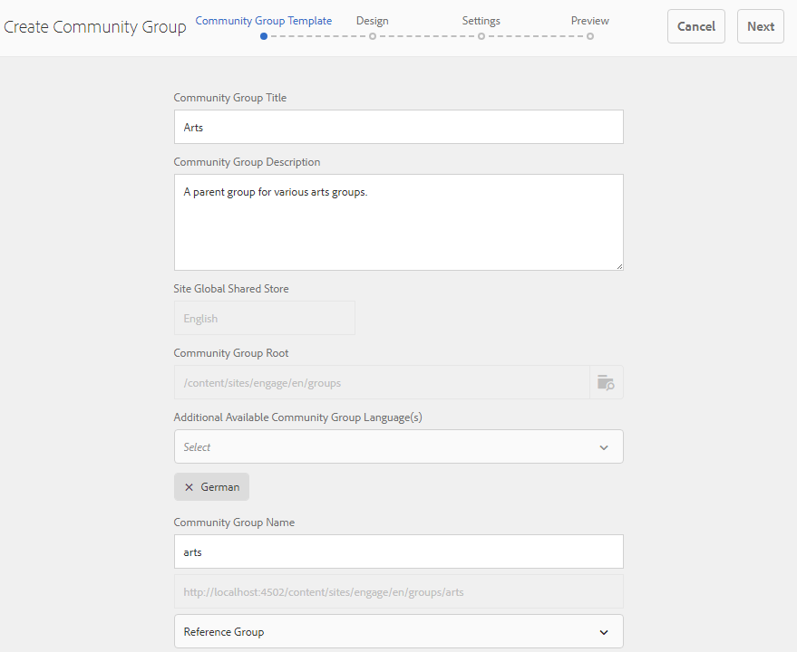

# Création de groupes imbriqués{#authoring-nested-groups}

## Création de groupes sur l’auteur {#creating-groups-on-author}

Sur l’instance d’auteur AEM, à partir de la navigation globale :

* Sélectionnez **[!UICONTROL Communautés]** > **[!UICONTROL Sites]**.
* Sélectionnez **[!UICONTROL engager le dossier]** pour l&#39;ouvrir.
* Sélectionnez la carte du site en anglais **[!UICONTROL Didacticiel de prise en main]**.

   * Sélectionnez l’image de la carte.
   * Ne *pas* sélectionnez une icône.

Le résultat est d&#39;atteindre la console [Groupes](/help/communities/groups.md) :

La fonction de groupes s&#39;affiche sous la forme d&#39;un dossier dans lequel des instances de groupes sont créées. Sélectionnez le dossier Groupes pour l’ouvrir. Le groupe créé lors de la publication est visible.

## Créer le groupe des arts principaux {#create-main-arts-group}

Ce groupe peut être créé car la structure du site pour engager inclut une fonction de groupes. La configuration de la fonction dans `Reference Template` du site autorise par défaut la sélection de tout modèle de groupe activé. Ainsi, le modèle choisi pour ce nouveau groupe est le `Reference Group`.

Ces consoles sont similaires à la console Sites des communautés.

* Sélectionnez **[!UICONTROL Créer un groupe]**.

* **Modèle de groupe de communautés**:

   * **[!UICONTROL Titre]** du groupe communautaire : Arts.
   * **[!UICONTROL Description]** du groupe de la communauté : Groupe parent pour divers groupes artistiques.
   * **[!UICONTROL Racine]** du groupe de communautés :  *laissez comme valeur par défaut*.
   * **[!UICONTROL Langue(s)]** de groupe(s) communautaire(s)disponible(s) supplémentaire(s) : utilisez le menu déroulant pour sélectionner la ou les langues des groupes communautaires disponibles. Le menu affiche toutes les langues dans lesquelles le site de la communauté parent est créé. Les utilisateurs peuvent sélectionner l’une de ces langues pour créer des groupes dans plusieurs paramètres régionaux au cours de cette seule étape. Un même groupe est créé dans plusieurs langues spécifiées dans la console Groupes des sites communautaires respectifs.
   * **[!UICONTROL Nom]** du groupe de la communauté : art.
   * **[!UICONTROL Modèle]** : liste déroulante à sélectionner  `Reference Group.`
   * Sélectionnez **[!UICONTROL Suivant]**.

Passez ensuite aux autres panneaux avec les paramètres suivants :

* **[!UICONTROL Conception]**

   * Modifiez la conception ou autorisez la conception du site parent par défaut.
   * Sélectionnez **[!UICONTROL Suivant]**.

* **[!UICONTROL Paramètres]**

   * **[!UICONTROL Modération]**

      * Laissez vide (hériter du site parent).
   * **[!UICONTROL Abonnement]**

      * Utiliser `Optional Membership.` par défaut

      * **[!UICONTROL Miniature]**
         * `optional.*`
      * **[!UICONTROL Sélectionnez Suivant]**.

* Sélectionnez **[!UICONTROL Créer]**.

### Groupes imbriqués dans le groupe Arts {#nesting-groups-within-arts-group}

Le dossier `groups` contient désormais deux groupes (actualisez la page).

#### Publier le groupe {#publish-group}

Avant de créer des groupes imbriqués dans le groupe `arts`, passez la souris sur la carte `arts` et sélectionnez l’icône de publication pour la publier.

Attendez la confirmation de la publication du groupe.

Le groupe `arts` doit également contenir un dossier `groups`, mais un dossier vide dans lequel de nouveaux groupes peuvent être créés. Accédez au dossier du groupe arts et créez 3 groupes imbriqués, chacun avec un paramètre d’adhésion différent :

1. **[!UICONTROL Visuel]**

   * Titre: `Visual Arts`
   * Nom : `visual`
   * Template: `Reference Group`
   * Adhésion : sélectionnez `Optional Membership`, un groupe public, ouvert à tous les membres.

1. **[!UICONTROL Auditoire]**

   * Titre: `Auditory Arts`
   * Nom : `auditory`
   * Modèle : `Reference Group`
   * Adhésion : sélectionnez `Required Membership`, un groupe ouvert, disponible pour les membres à rejoindre.

1. **[!UICONTROL Historique]**

   * Titre: `Art History`
   * Nom : `history`
   * Modèle : `Reference Group`
   * Adhésion : sélectionnez `Restricted Membership`, un groupe secret, visible uniquement pour les membres invités. Par exemple, invitez [demo user](/help/communities/tutorials.md#demo-users) `emily.andrews@mailinator.com`.

Actualisez la page pour afficher les trois groupes imbriqués (sous-communautés).

Pour accéder aux groupes imbriqués à partir de la console Sites de communautés :

* Sélectionner **[!UICONTROL dossier d&#39;engagement]**
* Sélectionnez **[!UICONTROL Carte du didacticiel de prise en main]**
* Sélectionner le dossier **[!UICONTROL Groupes]**
* Sélectionner **[!UICONTROL carte arts]**
* Sélectionner le dossier **[!UICONTROL Groupes]**

## Groupes de publication {#publishing-groups}

Après la publication du site communautaire principal :

* Publiez chaque groupe individuellement :

   * En attente de confirmation de la publication du groupe.

* Publier le groupe parent avant de publier tout groupe imbriqué dans :

   * Tous les groupes doivent être publiés de manière descendante.

## Expérience sur la publication {#experience-on-publish}

Il est possible d’expérimenter les différents groupes lorsqu’ils sont connectés, par exemple avec les [utilisateurs de démonstration](/help/communities/tutorials.md#demo-users) utilisés pour :

* Membre du groupe Art/Historique : emily.andrews@mailinator.com/password
   * Le groupe restreint (secret), arts/histoire, est visible :
   * Peut afficher les groupes facultatifs (publics).
   * Peut rejoindre des groupes restreints (ouverts).

* Gestionnaire de groupe : aaron.mcdonald@mailinator.com/password

   * Peut afficher les groupes facultatifs (publics).
   * Peut rejoindre des groupes restreints (ouverts).
   * Impossible d&#39;afficher les groupes restreints (secrets).

Accédez aux consoles Communautés [Membres et Groupes](/help/communities/members.md) sur l&#39;auteur pour ajouter d&#39;autres utilisateurs à divers groupes de membres qui correspondent aux groupes communautaires.

