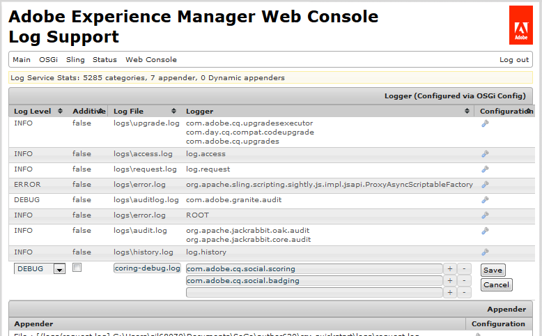

# Notifications de communautés {#communities-notifications}

## Présentation {#overview}

Les communautés AEM fournissent une section de notifications qui affiche les  d’intérêt pour le membre de la communauté connecté.

Les notifications sont semblables à [](/help/communities/essentials-activities.md) et à l’ [](/help/communities/subscriptions.md) , car elles peuvent provenir de :

* Membre publiant du contenu.
* Le membre qui choisit de suivre un autre membre.
* Le membre qui choisit de suivre des sujets, des articles et d’autres fils de contenu spécifiques.
* Le balisage du membre (@mentions) d’un autre membre de la communauté dans un contenu généré par l’utilisateur.

Ce qui distingue les notifications de   et de  de  est :

* Un lien vers la section des notifications est toujours présent dans l’en-tête d’un site communautaire :

   *   a besoin que la fonction [de flux de la](/help/communities/functions.md#activity-stream-function) soit incluse dans la structure du site communautaire.
   *   requiert [la configuration du courrier électronique](/help/communities/email.md).

* La mise en oeuvre des notifications s’effectue par le biais de  évolutives et enfichables :

   *   sont disponibles uniquement sur le Web.
   *   sont disponibles uniquement par courrier électronique.

À compter du [FP1](/help/communities/deploy-communities.md#latestfeaturepack)des Communautés, le de notification disponible est le suivant :

* Le Web , accessible à l’aide du `Notifications` lien.
* Le de messagerie, disponible lorsque le courrier électronique est correctement configuré.

Les futurs  sont mobiles et de bureau.

### Conditions requises {#requirements}

**Configurer le courrier électronique**

Le courrier électronique doit être configuré pour que le de courrier électronique  les notifications soient fonctionnelles.

Pour plus d’informations sur la configuration du courrier électronique, voir [Configuration du courrier électronique](/help/communities/analytics.md).

**Activer le suivi**

Les composants doivent être configurés pour activer les éléments suivants. Les fonctionnalités qui permettent ce qui suit sont [blog](/help/communities/blog-feature.md), [forum](/help/communities/forum.md), [QnA](/help/communities/working-with-qna.md), [calendar, filelibrary etcommentaires.](/help/communities/calendar.md)[](/help/communities/file-library.md)[](/help/communities/comments.md)

**Remarque** :

* Les composants utilisés dans les modèles [de](/help/communities/sites.md) site de la communauté et les modèles [de](/help/communities/tools-groups.md) groupe peuvent déjà être configurés pour suivre.

* Les  membres sont déjà configurés pour permettre aux autres membres de suivre.

## Notifications de suivi {#notifications-from-following}


Le bouton **[!UICONTROL Suivre]** permet de suivre les entrées sous forme de  , de  et/ou de notifications. Chaque fois que le bouton **[!UICONTROL Suivre]** est sélectionné, il est possible d’activer ou de désactiver une sélection. La `Email Subscriptions` sélection n’est présente que lorsqu’elle est configurée.

Si l’une des méthodes suivantes est sélectionnée, le texte du bouton devient **[!UICONTROL Suivant]**. Pour des raisons pratiques, il est possible de choisir `Unfollow All` de désactiver toutes les méthodes.

Le bouton **[!UICONTROL Suivre]** s’affiche :

* Lors de l’affichage du  d’un autre membre.
* Sur une page de présentation principale, telle que les forums, la qnA et les blogs :

   * Suit tous les   pour cette fonction générale.

* Pour une entrée spécifique, telle qu’un sujet de forum, une question de qualité ou un article de blog :

   * Suit tous les   pour cette entrée spécifique.

## Gestion des paramètres de notification {#managing-notification-settings}

En sélectionnant le lien Paramètres de notification dans la page Notifications, chaque membre peut gérer le mode de réception des notifications.

Le  Web est toujours activé.


Le de messagerie électronique, qui repose sur une [configuration appropriée de l’e-mail](/help/communities/email.md), fournit les mêmes paramètres que pour le  Web du.

Le de messagerie est désactivé par défaut.


Il peut être activé par un membre, mais dépend toujours de la configuration du courrier électronique.


## Affichage des notifications {#viewing-notifications}

### Notifications Web {#web-notifications}

Un [assistant a créé un site](/help/communities/sites-console.md) communautaire et inclut désormais un lien vers la `Notifications` fonction dans la barre d’en-tête du site au-dessus de la bannière. Contrairement aux messages, les notifications sont créées pour chaque site de la communauté, tandis que les messages doivent être activés pendant le processus de création du site.

Lors de la visite du site publié, la sélection du `Notifications` lien affichera toutes les notifications du membre.


### Notifications par e-mail {#email-notifications}

Lorsque le de messagerie est activé, le membre reçoit un courrier électronique contenant un lien vers le contenu du Web.



## Personnalisation des notifications par courrier électronique {#customize-email-notifications}

Les entreprises peuvent personnaliser les notifications par courrier électronique en [superposant](/help/communities/client-customize.md#overlays) les modèles dans **/libs/settings/community/templates/email/html**.

Par exemple, pour modifier les notifications par courrier électronique de mentions (pour un composant de communautés), ajoutez une condition **if** pour la **mentionde verbe** dans les modèles des composants pour lesquels vous avez activé la prise en charge de **@mentions** .

Pour modifier le modèle de notifications par courrier électronique pour @mentions dans les commentaires de blog, placez le modèle prêt à l’emploi à l’adresse suivante : **/libs/settings/community/templates/email/html/social.journal.components.hbs.comment/fr**

```java
{{#equals this.verb "mention"}}\
    A new mention <a href="{{objectUrl}}">comment</a> {{#if this.target.properties.[jcr:title]}}to the article "{{{target.displayName}}}" {{/if}}was added by {{{user.name}}} on {{dateUtil this.published format="EEE, d MMM yyyy HH:mm:ss z"}}.\n \
{{/equals}}\
```

