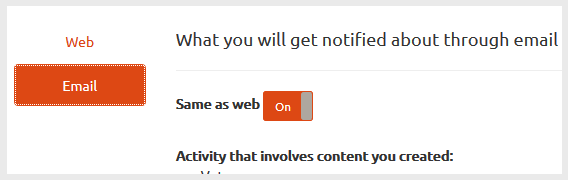

# Notifications des communautés {#communities-notifications}

## Présentation {#overview}

Le AEM Communities fournit une section de notifications qui affiche les événements d’intérêt pour le membre de la communauté qui a signé.

Les notifications sont semblables aux [activités](/help/communities/essentials-activities.md) et aux [abonnements](/help/communities/subscriptions.md) qui peuvent découler :

* Membre qui publie du contenu.
* Le membre qui choisit de suivre un autre membre.
* Membre choisissant de suivre des rubriques, des articles et d’autres fils de contenu spécifiques.
* Le balisage du membre (@mentions) d’un autre membre de la communauté dans un contenu généré par l’utilisateur.

Ce qui distingue les notifications des activités et abonnements est :

* Un lien vers la section des notifications est toujours présent dans l’en-tête d’un site communautaire :

   * Les Activités exigent que la fonction [de flux d&#39;](/help/communities/functions.md#activity-stream-function) activité soit incluse dans la structure du site communautaire.
   * Les Abonnements nécessitent [la configuration du courrier électronique](/help/communities/email.md).

* La mise en oeuvre des notifications s’effectue au moyen de canaux évolutives et enfichables :

   * Les Activités ne sont disponibles que sur le Web.
   * Les Abonnements ne sont disponibles que par courrier électronique.

En ce qui concerne les communautés [FP1](/help/communities/deploy-communities.md#latestfeaturepack), les canaux de notification disponibles sont les suivants :

* canal Web, accessible à l’aide du `Notifications` lien.
* canal de messagerie, disponible lorsque le courrier électronique est correctement configuré.

Les futurs canaux sont mobiles et de bureau.

### Conditions requises {#requirements}

**Configurer le courrier électronique**

Le courrier électronique doit être configuré pour que le canal de courrier électronique pour que les notifications fonctionnent.

Pour obtenir des instructions sur la configuration du courrier électronique, voir [Configuration du courrier électronique](/help/communities/analytics.md).

**Activer le suivi**

Les composants doivent être configurés pour activer les éléments suivants. Les fonctionnalités qui permettent ce qui suit sont [blog](/help/communities/blog-feature.md), [forum](/help/communities/forum.md), [QnA](/help/communities/working-with-qna.md), [calendar, filelibrary et les commentaires.](/help/communities/calendar.md)[](/help/communities/file-library.md)[](/help/communities/comments.md)

**Remarque** :

* Les composants utilisés dans les modèles [de](/help/communities/sites.md) site de la communauté et les modèles [de](/help/communities/tools-groups.md) groupe peuvent déjà être configurés pour être suivis.

* Les profils membres sont déjà configurés pour permettre aux autres membres de suivre.

## Notifications de suivi {#notifications-from-following}


Le bouton **[!UICONTROL Suivre]** permet de suivre les entrées comme activités, abonnements et/ou notifications. Chaque fois que le bouton **[!UICONTROL Suivre]** est sélectionné, il est possible d’activer ou de désactiver une sélection. La `Email Subscriptions` sélection n’est présente que lorsqu’elle est configurée.

Si une méthode de suivi est sélectionnée, le texte du bouton devient **[!UICONTROL Suivant]**. Pour plus de commodité, il est possible de choisir `Unfollow All` de désactiver toutes les méthodes.

Le bouton **[!UICONTROL Suivre]** s’affiche :

* Lors de l’affichage du profil d’un autre membre.
* Sur une page de présentation principale, telle que les forums, la QnA et les blogs :

   * Suit toutes les activités de cette fonction générale.

* Pour une entrée spécifique, telle qu’un sujet de forum, une question sur la qualité de l’expérience ou un article de blog :

   * Suit toutes les activités de cette entrée spécifique.

## Gestion des paramètres de notification {#managing-notification-settings}

En sélectionnant le lien Paramètres de notification dans la page Notifications, chaque membre peut gérer le mode de réception des notifications.

Le canal Web est toujours activé.


Le canal de messagerie électronique, qui repose sur une [configuration appropriée du courrier électronique](/help/communities/email.md), fournit les mêmes paramètres que pour le canal Web.

Le canal de messagerie est désactivé par défaut.


Il peut être activé par un membre, mais dépend toujours de la configuration du courrier électronique.



## Affichage des notifications {#viewing-notifications}

### Notifications Web {#web-notifications}

Un [assistant a créé un site](/help/communities/sites-console.md) communautaire et inclut désormais un lien vers la `Notifications` fonction dans la barre d’en-tête du site au-dessus de la bannière. Contrairement aux messages, les notifications sont créées pour chaque site de la communauté, tandis que les messages doivent être activés pendant le processus de création du site.

Lors de la visite du site publié, la sélection du `Notifications` lien affichera toutes les notifications pour le membre.


### Notifications par e-mail {#email-notifications}

Lorsque le canal de messagerie est activé, le membre reçoit un courrier électronique contenant un lien vers le contenu sur le Web.


## Personnaliser les notifications par courrier électronique {#customize-email-notifications}

Les entreprises peuvent personnaliser les notifications par courrier électronique en [superposant](/help/communities/client-customize.md#overlays) les modèles dans **/libs/settings/community/templates/email/html**.

Par exemple, pour modifier les notifications de mentions par courrier électronique (pour un composant de communautés), ajoutez une condition **if** pour la **mention** de verbe dans les modèles des composants pour lesquels vous avez activé la prise en charge de **@mentions** .

Pour modifier le modèle de notifications électroniques pour @mentions dans les commentaires de blog, placez le modèle prêt à l&#39;emploi à l&#39;adresse suivante : **/libs/settings/community/templates/email/html/social.journal.components.hbs.comment/fr**

```java
{{#equals this.verb "mention"}}\
    A new mention <a href="{{objectUrl}}">comment</a> {{#if this.target.properties.[jcr:title]}}to the article "{{{target.displayName}}}" {{/if}}was added by {{{user.name}}} on {{dateUtil this.published format="EEE, d MMM yyyy HH:mm:ss z"}}.\n \
{{/equals}}\
```

