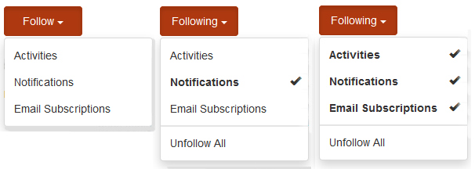
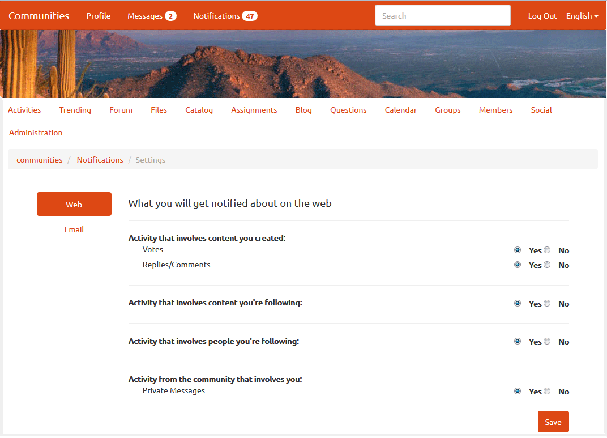
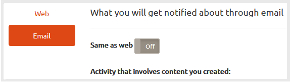
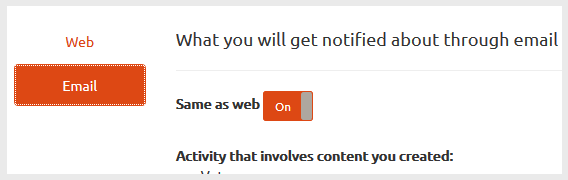
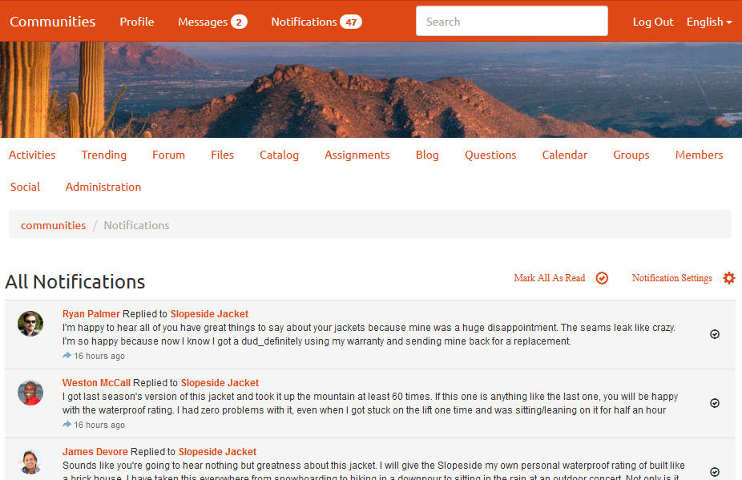
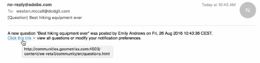

# Notifications Communities {#communities-notifications}

## Vue d’ensemble {#overview}

AEM Communities propose une section de notifications qui affiche les événements présentant un intérêt pour le membre de la communauté connecté.

Les notifications sont similaires aux [activités](/help/communities/essentials-activities.md) et [abonnements](/help/communities/subscriptions.md), dans la mesure où elles peuvent provenir des éléments suivants :

* Contenu de publication du membre.
* Le membre qui choisit de suivre un autre membre.
* Le membre qui choisit de suivre des sujets, des articles et d’autres fils de contenu spécifiques.
* Le membre qui balise (@mention) un autre membre de la communauté dans un contenu généré par l’utilisateur.

Ce qui distingue les notifications des activités et des abonnements est le suivant :

* Un lien vers la section des notifications est toujours présent dans l’en-tête d’un site communautaire :

   * Les activités nécessitent que la fonction [flux d’activités](/help/communities/functions.md#activity-stream-function) soit incluse dans la structure du site communautaire.
   * Les abonnements nécessitent [configuration de l’e-mail](/help/communities/email.md).

* L’implémentation des notifications s’effectue par le biais de canaux évolutifs et enfichables :

   * Les activités ne sont disponibles que sur le Web.
   * Les abonnements ne sont disponibles qu’en utilisant l’e-mail.

Depuis Communities [FP1](/help/communities/deploy-communities.md#latestfeaturepack), les canaux de notification disponibles sont les suivants :

* Canal web accessible à l’aide du lien `Notifications`.
* Le canal e-mail, disponible lorsque l’e-mail est correctement configuré.

Les futurs canaux seront les canaux mobiles et les canaux pour ordinateurs de bureau.

### Exigences {#requirements}

**Configurer l’e-mail**

Les e-mails doivent être configurés pour que le canal e-mail soit fonctionnel pour les notifications.

Pour obtenir des instructions sur la configuration des e-mails, voir [Configuration des e-mails](/help/communities/analytics.md).

**Activer le suivi**

Les composants doivent être configurés pour activer les éléments suivants. Les fonctionnalités qui permettent d’effectuer les opérations suivantes sont [blog](/help/communities/blog-feature.md), [forum](/help/communities/forum.md), [QnA](/help/communities/working-with-qna.md), [calendar](/help/communities/calendar.md) [&#128279;](/help/communities/comments.md), [filelibrary](/help/communities/file-library.md) et &#x200B;comments.

**Remarque** :

* Les composants utilisés dans la communauté [modèles de site](/help/communities/sites.md) et [modèles de groupe](/help/communities/tools-groups.md) peuvent déjà être configurés pour suivre.

* Les profils de membre sont déjà configurés pour permettre à d’autres membres de suivre.

## Notifications des éléments suivants {#notifications-from-following}



Le bouton **[!UICONTROL Suivre]** permet de suivre les entrées sous forme d’activités, d’abonnements et/ou de notifications. Chaque fois que le bouton **[!UICONTROL Suivre]** est sélectionné, il est possible d’activer ou de désactiver une sélection. La sélection `Email Subscriptions` n’est présente que lors de la configuration.

Si l’une des méthodes suivantes est sélectionnée, le texte du bouton devient **[!UICONTROL Suivant]**. Pour des raisons pratiques, il est possible de sélectionner `Unfollow All` pour désactiver toutes les méthodes.

Le bouton **[!UICONTROL Suivre]** s’affiche :

* Lors de l&#39;affichage du profil d&#39;un autre membre.
* Sur une page de fonctionnalités principale, telle que les forums, QnA et les blogs :

   * Suit toutes les activités pour cette fonctionnalité générale.

* Pour une entrée spécifique, telle qu’un sujet de forum, une question QA ou un article de blog :

   * Suit toutes les activités pour cette entrée spécifique.

## Gestion des paramètres de notification {#managing-notification-settings}

En cliquant sur le lien Paramètres de notification de la page Notifications , chaque membre peut gérer la réception des notifications.

Le canal web est toujours activé.



Le canal e-mail, qui repose sur une [configuration de l’e-mail](/help/communities/email.md) appropriée, fournit les mêmes paramètres que pour le canal web.

Le canal e-mail est désactivé par défaut.



Elle peut être activée par un membre, mais dépend toujours de la configuration de l’e-mail.



## Affichage des notifications {#viewing-notifications}

### Notifications Web {#web-notifications}

Un [site communautaire créé par un assistant](/help/communities/sites-console.md) comprend désormais un lien vers la fonction `Notifications` dans la barre d’en-tête du site au-dessus de la bannière. Contrairement aux messages, les notifications sont créées pour chaque site de la communauté, tandis que les messages doivent être activés pendant le processus de création du site.

Lorsque vous visitez le site publié, si vous sélectionnez le lien `Notifications`, toutes les notifications s’affichent pour le membre.



### Notifications par e-mail {#email-notifications}

Lorsque le canal e-mail est activé, le membre reçoit un e-mail contenant un lien vers le contenu sur le web.



## Personnaliser les notifications par e-mail {#customize-email-notifications}

Les organisations peuvent personnaliser les notifications par e-mail en [superposant](/help/communities/client-customize.md#overlays) les modèles dans **/libs/settings/community/templates/email/html**.

Par exemple, pour modifier les mentions dans les notifications par e-mail (pour un composant de communautés), ajoutez une condition **if** pour le verbe **mention** dans les modèles des composants pour lesquels vous avez activé la prise en charge de **@mentions**.

Pour modifier le modèle de notification par e-mail à @mention dans les commentaires de blog, placez le modèle prêt à l’emploi à l’adresse : **/libs/settings/community/templates/email/html/social.journal.components.hbs.comment/en**

```java
{{#equals this.verb "mention"}}\
    A new mention <a href="{{objectUrl}}">comment</a> {{#if this.target.properties.[jcr:title]}}to the article "{{{target.displayName}}}" {{/if}}was added by {{{user.name}}} on {{dateUtil this.published format="EEE, d MMM yyyy HH:mm:ss z"}}.\n \
{{/equals}}\
```
