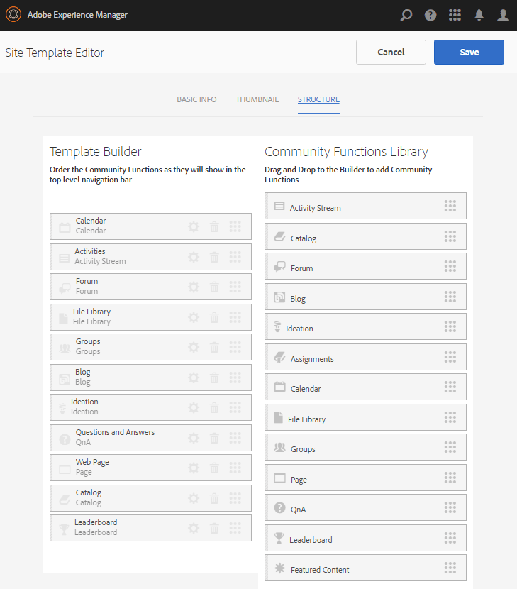
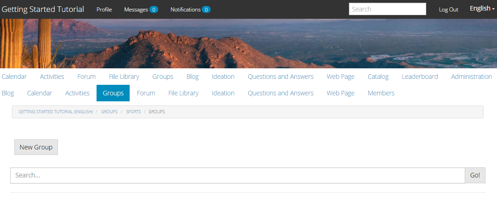

# Expérience du site publié {#experience-the-published-site}

## Accédez au nouveau site sur la publication {#browse-to-new-site-on-publish}

Maintenant que le site de communautés nouvellement créé a été publié, accédez à l’URL affichée lors de la création du site, mais sur le serveur de publication, par exemple :

* URL de création = https://localhost:4502/content/sites/engage/en.html
* URL de publication = https://localhost:4503/content/sites/engage/en.html

Afin de minimiser la confusion quant au membre qui est connecté lors de l’auteur et de la publication, il est conseillé d’utiliser différents navigateurs pour chaque instance.

En arrivant sur le site publié pour la première fois, le visiteur du site n’était généralement pas déjà connecté et était anonyme.

`https://localhost:4503/content/sites/engage/en.html {#http-localhost-content-sites-engage-en-html}`

## Visiteur du site anonyme {#anonymous-site-visitor}

Un visiteur anonyme du site voit les éléments suivants dans l’interface utilisateur :

* Titre du site (tutoriel de prise en main)
* Aucun lien de profil
* Lien vers aucun message
* Lien Aucune notification
* Champ de recherche
* Lien de connexion
* Bannière de marque
* Liens de menu pour les composants inclus dans le modèle de site de référence.

Si vous sélectionnez différents liens, ils sont en lecture seule.

### Empêcher l’accès anonyme sur JCR {#prevent-anonymous-access-on-jcr}

Une limitation connue expose le contenu du site de la communauté aux visiteurs anonymes par le biais du contenu jcr et de json , bien que **autoriser l’accès anonyme** soit désactivé pour le contenu du site. Cependant, ce comportement peut être contrôlé à l’aide de restrictions Sling comme solution de contournement.

Pour protéger le contenu de votre communauté contre l’accès des utilisateurs anonymes par le biais de jcr content et json , procédez comme suit :

1. Sur l’instance AEM Author, accédez à https:// hostname:port/editor.html/content/site/sitename.html.

   >[!NOTE]
   >
   >Ne pas accéder au site localisé.

1. Accédez à **Propriétés de page**.

   

1. Accédez à l’onglet **Avancé**.

1. Activez **Exigence d’authentification**.

   

1. Ajoutez le chemin d’accès de la page de connexion. Par exemple, **/content/......./GetStarted**.
1. Publiez la page.

## Membre de la communauté approuvée {#trusted-community-member}

Cette expérience suppose que [Aaron McDonald](/help/communities/tutorials.md#demo-users) se voit attribuer les rôles de [responsable de communauté et de modérateur](/help/communities/create-site.md#roles). Si ce n’est pas le cas, revenez à l’environnement de création en [modifiant les paramètres du site](/help/communities/sites-console.md#modifying-site-properties) et sélectionnez Aaron McDonald comme responsable de communauté et modérateur.

Dans le coin supérieur droit, sélectionnez `Log in` et signez avec le nom d’utilisateur (aaron.mcdonald@mailinator.com) et le mot de passe (mot de passe). Vous pouvez vous connecter à l’aide des informations d’identification Twitter ou Facebook.

Une fois connecté en tant que membre de la communauté enregistré, remarquez les options de menu suivantes pour cliquer et explorer votre site de communauté :

* **** L&#39;option Profil permet de visualiser et d&#39;éditer votre profil.
*  L’option Messagesvous redirige vers la section Messagerie directe, où vous pouvez :

   1. Affichez les messages directs que vous avez reçus (boîte de réception), envoyés (éléments envoyés) et supprimés (corbeille).
   1. Composer de nouveaux messages directs à envoyer aux individus et aux groupes.

*  L’option Notification vous redirige vers la section des notifications, où vous pouvez afficher vos événements ciblés et modifier les paramètres des notifications.
*  Si vous disposez de droits de modération, l’administration vous redirige vers la page de modération AEM Communities.

Notez que la page Calendrier est la page d’accueil, car le modèle de site de référence sélectionné incluait d’abord la fonction Calendrier , suivie de la fonction Flux d’activités, Forum , etc. Cette structure est visible à partir de la console [Modèle de site](/help/communities/sites.md#edit-site-template) ou lors de la modification des propriétés du site dans l’environnement de création :

>[!NOTE]
>
>Pour plus d’informations sur les composants et les fonctions de Communities, consultez :
>
>* [Composants Communities](/help/communities/author-communities.md)  (pour les auteurs)
>* [Composants, fonctions et fonctionnalités fondamentales](/help/communities/essentials.md)  (pour les développeurs)

### Lien du forum {#forum-link}

Pour afficher la fonction de base du forum, cliquez sur le lien Forum .

Les membres peuvent publier un nouveau sujet ou suivre un sujet.

Les visiteurs du site peuvent afficher les publications et les trier de différentes manières.

### Lien Groupes {#groups-link}

Dans la mesure où Aaron est administrateur de groupe, la sélection du lien Groupes permettra à Aaron de créer un nouveau groupe communautaire en sélectionnant un modèle de groupe, une image, que le groupe soit ouvert ou secret, et en invitant des membres.

Il s’agit d’un exemple dans lequel un groupe est créé dans l’environnement de publication.

Les groupes peuvent également être créés dans l’environnement de création et gérés dans le site de la communauté dans l’environnement de création ([console Groupes communautaires](/help/communities/groups.md)). L’expérience de [création de groupes sur author](/help/communities/nested-groups.md) est présentée dans ce tutoriel.

Création d’un groupe de référence :

1. Sélectionnez **Nouveau groupe**
1. **Onglet Settings**

   * Nom du groupe : `Sports`
   * Description : `A parent group for various sporting groups`.
   * Nom de l’URL de groupe : `sports`
   * Sélectionnez `Open Group` (autoriser tout membre de la communauté à participer en rejoignant).

1. **Onglet Modèle**

   * Sélectionnez `Reference Group` (contient une fonction de groupes dans sa structure pour autoriser les groupes imbriqués).

1. Sélectionnez **Créer un groupe**

   

Une fois le nouveau groupe créé, **sélectionnez le nouveau groupe Sports** afin de lui créer deux groupes (imbriqués). Comme une structure de site ne peut pas commencer par la fonction de groupes, après l’ouverture du groupe Sports, il est nécessaire de sélectionner le lien Groupes :

Le deuxième ensemble de liens, commençant par `Blog`, appartient au groupe actuellement sélectionné, le groupe `Sports`. En sélectionnant le lien Sports `Groups`, il est possible d&#39;imbriquer deux groupes dans le groupe Sports.

Par exemple, ajoutez deux `new groups`.

* Un nommé `Baseball`

   * Laissez-le défini comme `Open Group` (appartenance requise).
   * Sous l’onglet Modèles , sélectionnez `Conversational Group`.

* Un nommé `Gymnastics`

   * Définissez le paramètre sur `Member Only Group` (appartenance limitée).
   * Sous l’onglet Modèles , sélectionnez `Conversational Group`.

**Avis**:

* Une actualisation de la page peut s’avérer nécessaire avant l’affichage des deux groupes.
* Ce modèle n’inclut *pas* la fonction de groupes. Il ne sera donc plus possible d’imbriquer les groupes.
* Sur l’instance de création, la [console Groupes](/help/communities/groups.md) offre un troisième choix : un `Public Group` (abonnement facultatif).

Une fois les deux groupes créés, sélectionnez le groupe Baseball, un groupe ouvert, et notez ses liens :

`Discussions` `What's New` `Members`

Les liens du groupe s&#39;affichent sous les liens du site principal et donnent les résultats suivants :

Sur l’instance de création, avec les privilèges d’administrateur, accédez à la [console Groupes communautaires](/help/communities/members.md) et ajoutez Weston McCall au groupe `Community Engage Gymnastics <uid> Members`.

Continuez à publier, déconnectez-vous en tant qu’Aaron McDonald et affichez les groupes du groupe Sports en tant que visiteur anonyme du site :

* Depuis la page d’accueil
* Choisir le lien `Groups`
* Choisir le lien `Sports`
* Sélectionnez le lien Sports `Groups`

Seul le groupe de baseball sera visible.

Connectez-vous en tant que Weston McCall (weston.mccall@dodgit.com/password) et accédez au même emplacement. Notez que Weston peut `Join` le groupe `Baseball` ouvert et `enter or Leave` le groupe `Gymnastics` privé.

### Lien de page Web {#web-page-link}

Affichez la page Web de base incluse dans le site en sélectionnant le lien Page Web . Les outils de création d’AEM standard peuvent être utilisés pour ajouter du contenu à cette page dans l’environnement de création.

Par exemple, accédez à l’instance **author**, ouvrez le dossier `engage` dans la [console Sites des communautés](/help/communities/sites-console.md), sélectionnez l’icône **Ouvrir le site** pour passer en mode d’édition de l’auteur. Sélectionnez ensuite le mode d&#39;aperçu pour sélectionner le lien `Web Page`, puis le mode d&#39;édition pour ajouter les composants Titre et Texte. Enfin, republiez uniquement la page ou l’ensemble du site.

### Lien de modération {#moderationlink}

Lorsque le membre de la communauté dispose de privilèges de modération, le lien Modération est visible et sa sélection affiche le contenu de la communauté publié et lui permet d’être [modéré](/help/communities/moderate-ugc.md) d’une manière similaire à la [console de modération](/help/communities/moderation.md) dans l’environnement de création.

Utilisez le bouton Précédent du navigateur pour revenir au site publié. La plupart des consoles ne sont pas accessibles à partir de la navigation globale dans l’environnement de publication. 

## Auto-inscription {#self-registration}

Une fois déconnecté, il est possible de créer un nouvel enregistrement d’utilisateur.

* Sélectionner `Log In`
* Sélectionner `Sign up for a new account`

Par défaut, l’adresse électronique est l’identifiant de connexion. Si cette option n’est pas cochée, le visiteur peut saisir son propre identifiant de connexion (nom d’utilisateur). Le nom d’utilisateur doit être unique dans l’environnement de publication.

Après avoir spécifié le nom, l’adresse électronique et le mot de passe de l’utilisateur, la sélection de `Sign Up` crée l’utilisateur et lui permet de le signer.

Une fois connecté, la première page présentée est leur `Profile` page, qu’ils peuvent personnaliser.

Si le membre oublie son identifiant de connexion, il est possible de le récupérer en utilisant son adresse email.

