# Expérience du site publié {#experience-the-published-site}

## Accéder au nouveau site lors de la publication {#browse-to-new-site-on-publish}

Maintenant que le site des communautés nouvellement créé est publié, accédez à l’URL affichée lors de la création du site, mais sur le serveur de publication, par exemple :

* URL de création = https://localhost:4502/content/sites/engage/en.html
* URL de publication = https://localhost:4503/content/sites/engage/en.html

Pour éviter toute confusion quant au membre connecté en mode de création et de publication, il est suggéré d’utiliser des navigateurs différents pour chaque instance.

En arrivant pour la première fois sur le site publié, le visiteur du site n’est généralement pas déjà connecté et est anonyme.

`https://localhost:4503/content/sites/engage/en.html {#http-localhost-content-sites-engage-en-html}`

## Visiteur de site anonyme {#anonymous-site-visitor}

Un visiteur anonyme du site voit les éléments suivants dans l’interface utilisateur :

* Titre du site (tutoriel de prise en main)
* Aucun lien de profil
* Lien Aucun message
* Aucun lien de notification
* Champ de recherche
* Lien de connexion
* La bannière de marque
* Liens de menu pour les composants inclus dans le modèle de site de référence.

Si vous sélectionnez différents liens, vous constatez qu’ils sont en mode lecture seule.

### Empêcher l’accès anonyme sur JCR {#prevent-anonymous-access-on-jcr}

Une limitation connue expose le contenu du site de la communauté aux visiteurs anonymes par le biais du contenu jcr et json , bien que l’option **autoriser l’accès anonyme** soit désactivée pour le contenu du site. Cependant, ce comportement peut être contrôlé à l’aide des restrictions Sling comme solution de contournement.

Pour protéger le contenu de votre site communautaire de l’accès par des utilisateurs et utilisatrices anonymes via du contenu jcr et json , procédez comme suit :

1. Sur l’instance d’auteur AEM, accédez à https:// nom d’hôte:port/editor.html/content/site/sitename.html.

   >[!NOTE]
   >
   >N’accédez pas au site localisé.

1. Accédez à **Propriétés de la page**.

   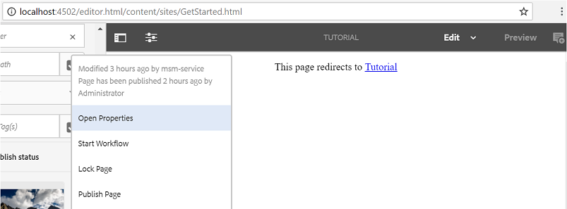

1. Accédez à l’onglet **Avancé**.

1. Activez **Exigence d’authentification**.

   

1. Ajoutez le chemin d’accès à la page de connexion. Par exemple, **/content/......./GetStarted**.
1. Publiez la page.

## Membre de confiance de la communauté {#trusted-community-member}

Cette expérience suppose que [Aaron McDonald](/help/communities/tutorials.md#demo-users) a été affecté aux rôles de [gestionnaire communautaire et modérateur](/help/communities/create-site.md#roles). Dans le cas contraire, revenez à l’environnement de création pour [modifier les paramètres du site](/help/communities/sites-console.md#modifying-site-properties) et sélectionnez Aaron McDonald comme responsable de la communauté et modérateur.

Dans le coin supérieur droit, sélectionnez `Log in` et signez avec le nom d’utilisateur (aaron.mcdonald@mailinator.com) et le mot de passe (mot de passe). Remarquez la possibilité de vous connecter à l’aide des informations d’identification Twitter ou Facebook.

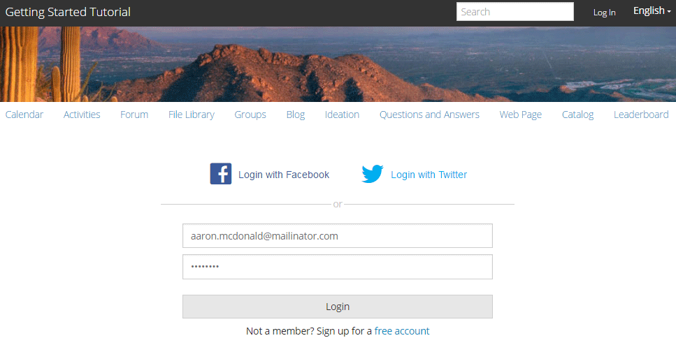

Une fois connecté en tant que membre de la communauté enregistrée, notez les éléments de menu suivants sur lesquels cliquer et explorer votre site de communauté :

* L’option **Profil** vous permet d’afficher et de modifier votre profil.
* L’option [Messages](/help/communities/configure-messaging.md) vous dirige vers la section de messagerie directe, où vous pouvez effectuer les opérations suivantes :

   1. Affichez les messages directs que vous avez reçus (boîte de réception), envoyés (éléments envoyés) et supprimés (corbeille).
   1. Composez de nouveaux messages directs à envoyer aux individus et aux groupes.

* L’option [Notifications](/help/communities/notifications.md) vous dirige vers la section des notifications, où vous pouvez afficher vos événements ciblés et modifier les paramètres de notification.
* Le [Administration](/help/communities/published-site.md#moderationlink) vous dirige vers la page de modération d&#39;AEM Communities, si vous disposez des privilèges de modération.

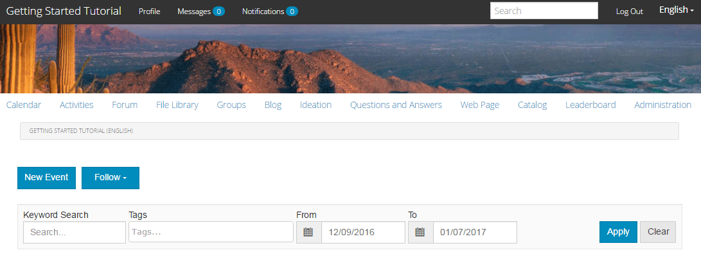

Notez que la page Calendrier est la page d’accueil, car le modèle de site de référence choisi incluait d’abord la fonction Calendrier, suivie de la fonction Flux d’activités, de la fonction Forum, etc. Cette structure est visible à partir de la console [Modèle de site](/help/communities/sites.md#edit-site-template) ou lors de la modification des propriétés du site dans l’environnement de création :

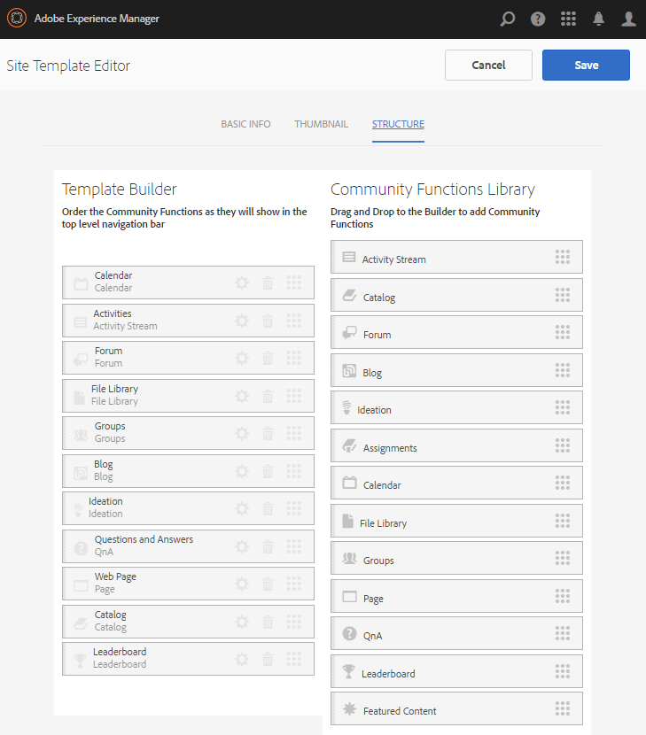

>[!NOTE]
>
>Pour plus d’informations sur les composants et fonctions de Communities, consultez :
>
>* [Composants de Communities](/help/communities/author-communities.md) (pour les auteurs)
>* [Principes de base des composants, fonctions et fonctionnalités](/help/communities/essentials.md) (pour les développeurs)

### Lien du forum {#forum-link}

Affichez la fonctionnalité de forum de base en sélectionnant le lien Forum .

Les membres peuvent publier une nouvelle rubrique ou suivre une rubrique.

Les visiteurs du site peuvent afficher les publications et les trier de différentes manières.

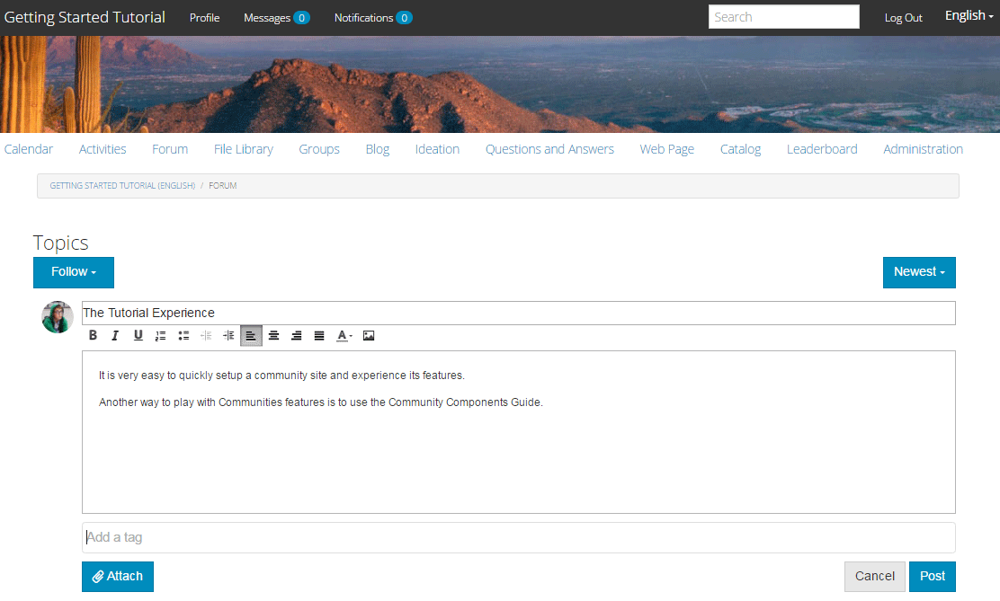

### Lien des groupes {#groups-link}

Puisqu’Aaron est un administrateur de groupe, la sélection du lien Groupes permet à Aaron de créer un groupe communautaire en sélectionnant un modèle de groupe, une image, en indiquant si le groupe est ouvert ou secret et en invitant les membres.

Il s’agit d’un exemple où un groupe est créé dans l’environnement de publication.

Les groupes peuvent également être créés dans l’environnement de création et gérés sur le site de la communauté dans l’environnement de création ([console Groupes de la communauté](/help/communities/groups.md)). L’expérience de [création de groupes sur l’instance de création](/help/communities/nested-groups.md) est abordée dans ce tutoriel.

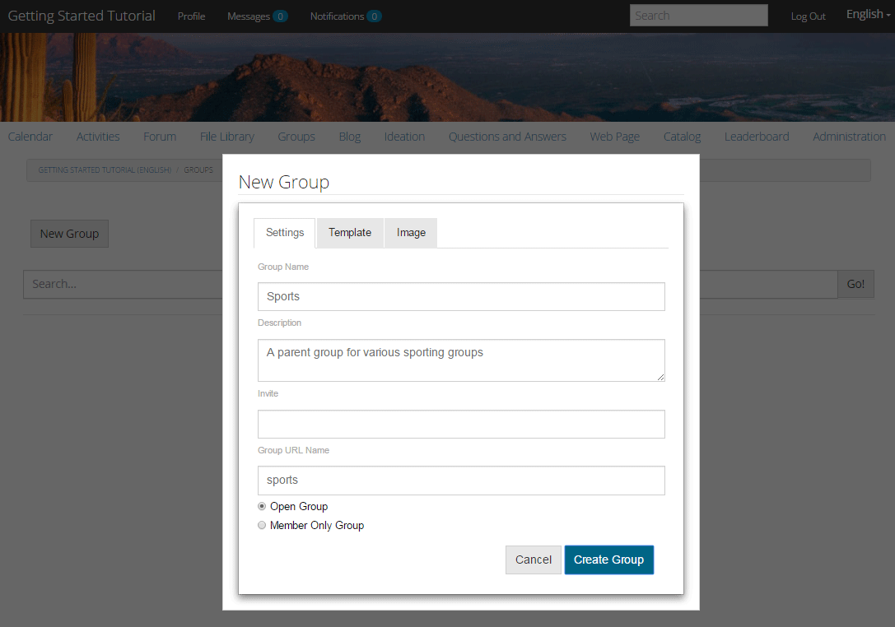

Créez un groupe de référence :

1. Sélectionnez **Nouveau groupe**
1. **Onglet Paramètres**

   * Nom du groupe : `Sports`
   * Description : `A parent group for various sporting groups`.
   * Nom d’URL du groupe : `sports`
   * Sélectionner `Open Group` (autoriser tout membre de la communauté à participer en rejoignant)

1. **Onglet Modèle**

   * Sélectionnez `Reference Group` (contient une fonction de groupes dans sa structure pour autoriser les groupes imbriqués)

1. Sélectionnez **Créer un groupe**

   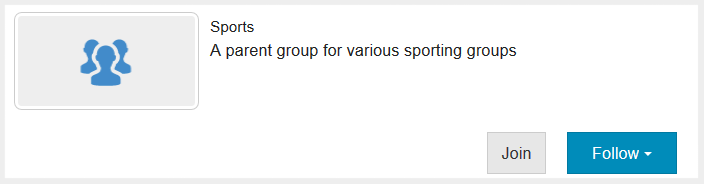

Une fois le nouveau groupe créé, **sélectionnez-le** pour y créer deux groupes (imbriqués). Comme une structure de site ne peut pas commencer par la fonction groupes, après avoir ouvert le groupe Sports, il est nécessaire de sélectionner le lien Groupes :

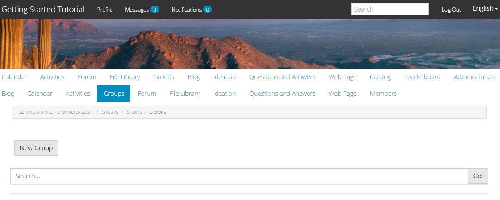

Le deuxième ensemble de liens, commençant par `Blog`, appartient au groupe actuellement sélectionné, le groupe `Sports`. En sélectionnant le lien `Groups` des sports , il est possible d’imbriquer deux groupes dans le groupe Sports .

Par exemple, ajoutez deux `new groups`.

* Un nommé `Baseball`

   * Laissez-la définie en tant que `Open Group` (abonnement requis).
   * Dans l’onglet Modèles , sélectionnez `Conversational Group`.

* Un nommé `Gymnastics`

   * Remplacez son paramètre par `Member Only Group` (appartenance restreinte).
   * Dans l’onglet Modèles , sélectionnez `Conversational Group`.

**Remarque** :

* Il peut s’avérer nécessaire d’actualiser la page avant l’affichage des deux groupes.
* Ce modèle n’inclut *pas* la fonction de groupes, de sorte qu’aucune autre imbrication de groupes n’est possible.
* En mode de création, la [console Groupes](/help/communities/groups.md) offre un troisième choix : une `Public Group` (abonnement facultatif).

Une fois les deux groupes créés, sélectionnez le groupe Baseball, un groupe ouvert, et notez ses liens :

`Discussions` `What's New` `Members`

Les liens du groupe s’affichent sous les liens du site principal et génèrent l’affichage suivant :

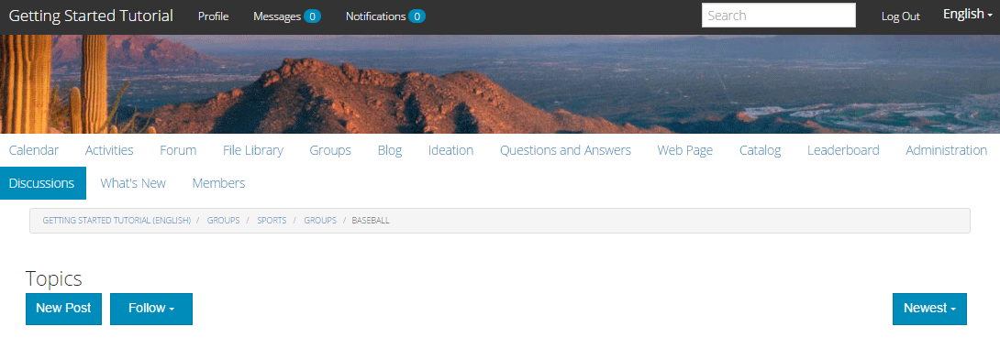

En mode de création - avec les privilèges d’administration, accédez à la console [Groupes de communautés](/help/communities/members.md) et ajoutez Weston McCall au groupe de `Community Engage Gymnastics <uid> Members`.

En poursuivant la publication, déconnectez-vous en tant qu’Aaron McDonald, puis affichez les groupes du groupe Sports en tant que visiteur anonyme du site :

* Depuis la page d’accueil
* Sélectionner `Groups` lien
* Sélectionner `Sports` lien
* Sélectionnez le lien `Groups` des sports .

Seul le groupe de baseball est visible.

Connectez-vous en tant que Weston McCall (weston.mccall@dodgit.com / mot de passe) et accédez au même emplacement. Notez que Weston peut `Join` le groupe de `Baseball` ouvert et `enter or Leave` le groupe de `Gymnastics` privé.

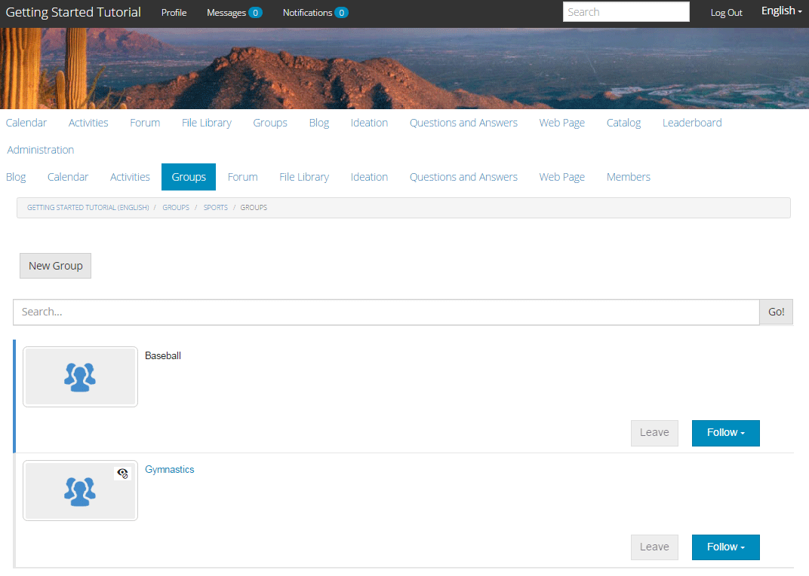

### Lien de la page web {#web-page-link}

Affichez la page web de base incluse dans le site en cliquant sur le lien Page web . Il est possible d’utiliser les outils de création AEM standard pour ajouter du contenu à cette page dans l’environnement de création.

Par exemple, accédez à l’instance **author**, ouvrez le dossier `engage` dans la console [Communities Sites](/help/communities/sites-console.md), puis sélectionnez l’icône **Open Site** pour passer en mode de modification de l’auteur. Sélectionnez ensuite le mode Aperçu pour pouvoir sélectionner le lien `Web Page`, puis sélectionnez le mode d’édition pour ajouter les composants Titre et Texte . Enfin, republiez uniquement la page ou l’ensemble du site.

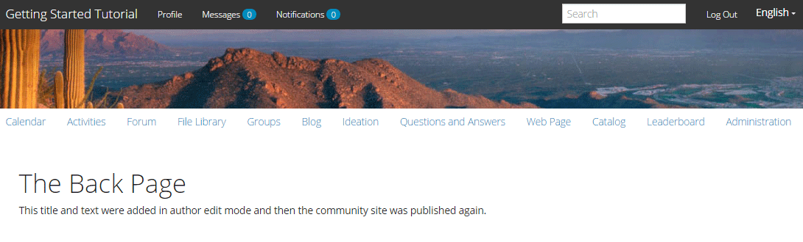

### Lien de modération {#moderationlink}

Lorsque le membre de la communauté dispose de droits de modération, le lien Modération est visible. La sélection du lien affiche le contenu de la communauté publié et permet de le [modérer](/help/communities/moderate-ugc.md) d’une manière similaire à la [console de modération](/help/communities/moderation.md) dans l’environnement de création.

Utilisez le bouton Précédent du navigateur pour revenir au site publié. La plupart des consoles ne sont pas accessibles à partir de la navigation globale dans l’environnement de publication.

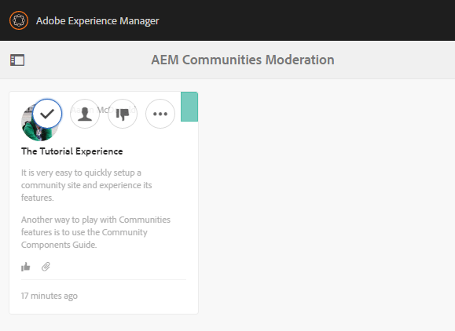

## Auto-Enregistrement {#self-registration}

Après la déconnexion, il est possible de créer un enregistrement d’utilisateur.

* Sélectionnez `Log In`.
* Sélectionnez `Sign up for a new account`.

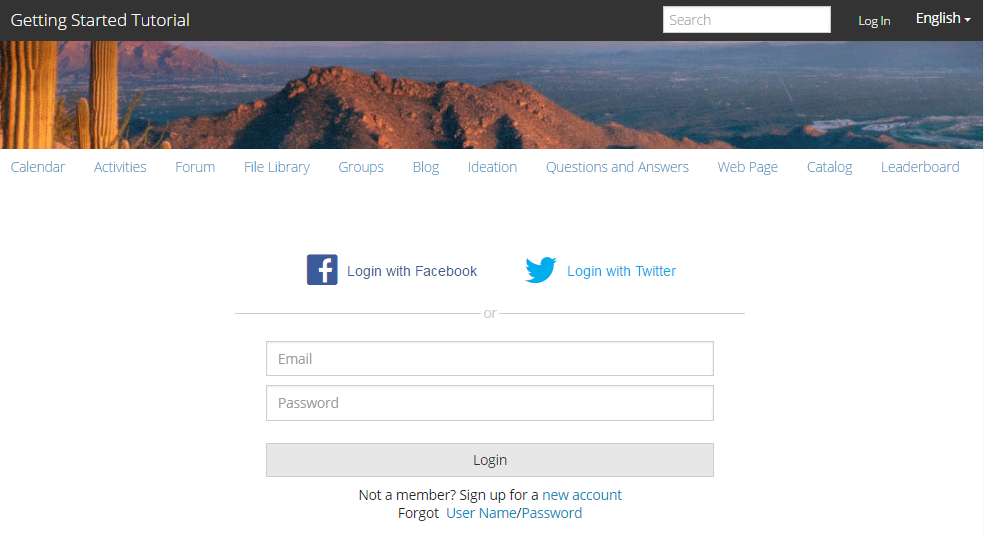

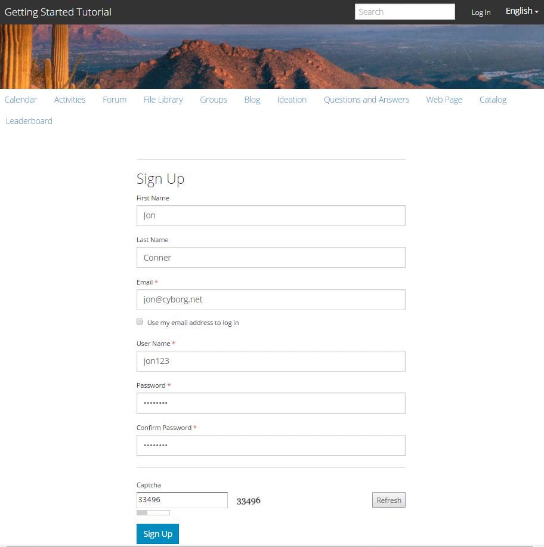

Par défaut, l’adresse e-mail est l’identifiant de connexion. Si cette option n’est pas cochée, le visiteur peut saisir son propre identifiant de connexion (nom d’utilisateur). Le nom d’utilisateur doit être unique dans l’environnement de publication.

Après avoir spécifié le nom, l’adresse e-mail et le mot de passe de l’utilisateur, sélectionnez `Sign Up` pour créer l’utilisateur et lui permettre de signer.

Après s’être connecté, la première page présentée est leur page `Profile`, qu’ils peuvent personnaliser.

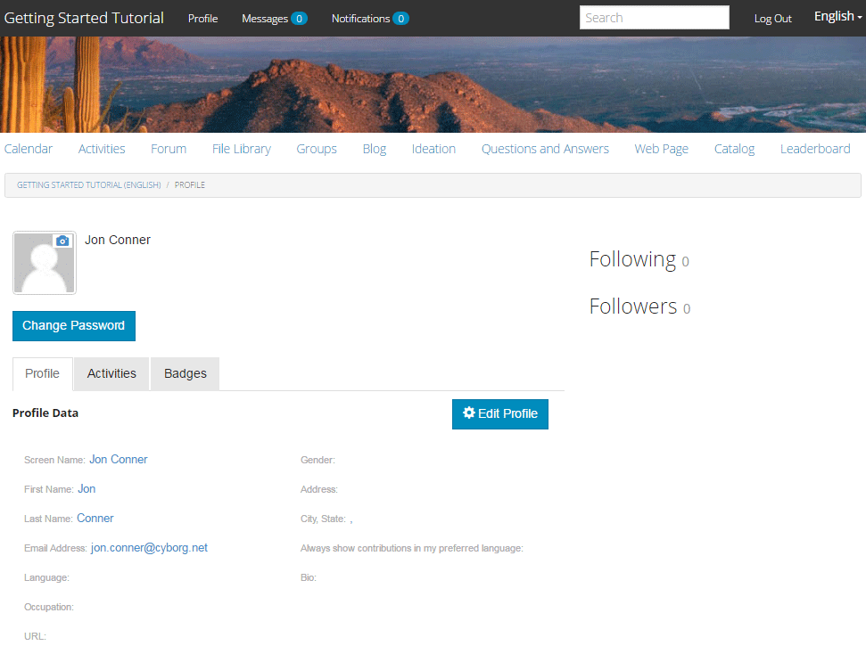

Si le membre oublie son identifiant de connexion, il est possible de le récupérer en utilisant son adresse e-mail.

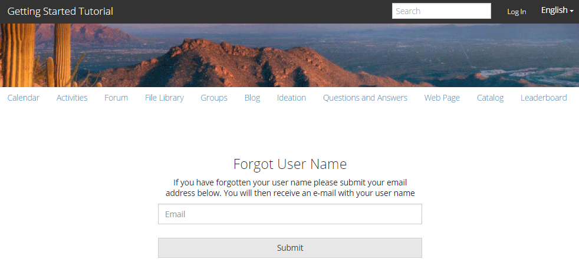
