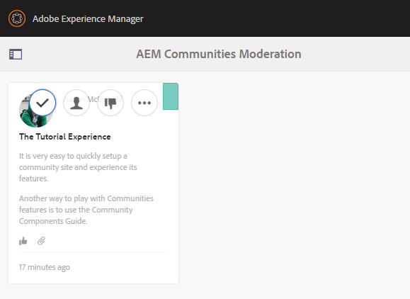

# Expérience du site publié {#experience-the-published-site}

## Accéder au nouveau site lors de la publication {#browse-to-new-site-on-publish}

Maintenant que le site des communautés nouvellement créé a été publié, accédez à l’URL qui s’affiche lors de la création du site, mais sur le serveur de publication, par exemple :

* URL de l’auteur = https://localhost:4502/content/sites/engage/en.html
* URL de publication = https://localhost:4503/content/sites/engage/en.html

Pour éviter toute confusion quant au membre qui est connecté lors de l’auteur et de la publication, il est conseillé d’utiliser différents navigateurs pour chaque instance.

En arrivant sur le site publié, le visiteur du site n’était généralement pas déjà connecté et était anonyme.

`https://localhost:4503/content/sites/engage/en.html {#http-localhost-content-sites-engage-en-html}`

## Visiteur de site anonyme {#anonymous-site-visitor}

Un visiteur de site anonyme voit les éléments suivants dans l’interface utilisateur :

* Titre du site (didacticiel de prise en main)
* Aucun lien de profil
* Aucun lien de message
* Aucun lien de notification
* Champ de recherche
* Lien de connexion
* La bannière de la marque
* Liens de menu pour les composants inclus dans le modèle de site de référence.

Si vous sélectionnez divers liens, vous constaterez qu’ils sont en mode lecture seule.

### Empêcher l’accès anonyme sur JCR {#prevent-anonymous-access-on-jcr}

Une limitation connue expose le contenu du site communautaire à des visiteurs anonymes par le biais de contenu jcr et json, bien que l’ **autorisation d’accès** anonyme soit désactivée pour le contenu du site. Cependant, ce comportement peut être contrôlé à l’aide des restrictions Sling comme solution.

Pour protéger le contenu de votre site communautaire contre l’accès d’utilisateurs anonymes par le biais de contenu jcr et json, procédez comme suit :

1. Sur l’instance d’auteur AEM, accédez à https:// hostname:port/editor.html/content/site/sitename.html.

   >[!NOTE]
   >
   >N’accédez pas au site localisé.

1. Accédez à Propriétés **de** la page.

   

1. Accédez à l’onglet **Avancé**.

1. Enable **Authentication Requirement**.

   

1. Ajoutez le chemin de la page de connexion. For example, **/content/......./GetStarted**.
1. Publiez la page.

## Membre de la Communauté approuvé {#trusted-community-member}

Cette expérience suppose que [Aaron McDonald](/help/communities/tutorials.md#demo-users) se voit attribuer le rôle de gestionnaire et de modérateur communautaire. Dans le cas contraire, revenez à l’environnement d’auteur pour [modifier les paramètres](/help/communities/sites-console.md#modifying-site-properties) du site et sélectionnez Aaron McDonald comme gestionnaire de communauté et modérateur.

Dans le coin supérieur droit, sélectionnez `Log in`et signez avec le nom d’utilisateur (aaron.mcdonald@mailinator.com) et le mot de passe (mot de passe). Vous pouvez vous connecter à l’aide des informations d’identification Twitter ou Facebook.

Une fois connecté en tant que membre enregistré de la communauté, notez les options de menu suivantes pour cliquer et explorer votre site communautaire :

* **L’option profil** vous permet de vue et de modifier votre profil.
* [L&#39;option Messages](/help/communities/configure-messaging.md) vous dirige vers la section Messagerie directe, où vous pouvez :

   1. Vue des messages directs que vous avez reçus (boîte de réception), envoyés (Éléments envoyés) et supprimés (corbeille).
   1. Composez de nouveaux messages directs à envoyer aux individus et aux groupes.

* [L’option Notifications](/help/communities/notifications.md) vous dirige vers la section Notifications, où vous pouvez vue vos événements d’intérêt et modifier les paramètres de notification.
* [Si vous disposez de privilèges de modération, l’administration](/help/communities/published-site.md#moderationlink) vous dirige vers la page de modération AEM Communities.

Notez que la page Calendrier correspond à la page d&#39;accueil, car le modèle de site de référence choisi comprenait d’abord la fonction Calendrier, suivie de la fonction de flux d’Activité, de la fonction de forum, etc. Cette structure est visible à partir de la console Modèle de [site](/help/communities/sites.md#edit-site-template) ou lors de la modification des propriétés du site dans l’environnement d’auteur :

>[!NOTE]
>
>Pour plus d&#39;informations sur les composants et les fonctions des communautés, consultez :
>
>* [Composants](/help/communities/author-communities.md) de communautés (pour les auteurs)
>* [Composants, fonctions et fonctionnalités essentiels](/help/communities/essentials.md) (pour les développeurs)

### Lien du forum {#forum-link}

Vue la fonction de base du forum en sélectionnant le lien du forum.

Les membres peuvent publier un nouveau sujet ou suivre un sujet.

Les visiteurs du site peuvent vue et trier les publications de différentes manières.

### Lien Groupes {#groups-link}

Etant donné qu’Aaron est un administrateur de groupe, la sélection du lien Groupes permettra à Aaron de créer un nouveau groupe communautaire en sélectionnant un modèle de groupe, une image, que le groupe soit ouvert ou secret, et en invitant des membres.

Il s’agit d’un exemple de création d’un groupe dans l’environnement de publication.

Les groupes peuvent également être créés dans l’environnement d’auteur et gérés dans le site communautaire de l’environnement d’auteur (console[Groupes](/help/communities/groups.md)communautaires). La [création de groupes sur l’auteur](/help/communities/nested-groups.md) est décrite dans ce didacticiel.

Créer un groupe de référence :

1. Sélectionner un **nouveau groupe**
1. **Onglet Settings**

   * Nom du groupe : `Sports`
   * Description : `A parent group for various sporting groups`.
   * Nom de l’URL de groupe : `sports`
   * Sélectionnez `Open Group` (autoriser tout membre de la communauté à participer en y participant).

1. **Onglet Modèle**

   * Sélectionner `Reference Group` (contient une fonction de groupes dans sa structure pour autoriser les groupes imbriqués)

1. Sélectionner **Créer un groupe**

   

Une fois le nouveau groupe créé, **sélectionnez le nouveau groupe** Sports afin de créer deux groupes (imbriqués) au sein de celui-ci. Comme une structure de site ne peut pas commencer par la fonction de groupes, après avoir ouvert le groupe Sports, il est nécessaire de sélectionner le lien Groupes :

Le deuxième ensemble de liens, commençant par `Blog`, appartient au groupe actuellement sélectionné, le `Sports` groupe. En sélectionnant le lien Sports `Groups` , il est possible d’imbriquer deux groupes dans le groupe Sports.

Par exemple, ajoutez deux `new groups`.

* Un nom `Baseball`

   * Laissez-le défini comme `Open Group` (adhésion obligatoire).
   * Sous l’onglet Modèles, sélectionnez `Conversational Group`.

* Un nom `Gymnastics`

   * Modifiez son paramètre en `Member Only Group` (adhésion restreinte).
   * Sous l’onglet Modèles, sélectionnez `Conversational Group`.

**Avis**:

* Une actualisation de la page peut s’avérer nécessaire avant l’affichage des deux groupes.
* Ce modèle *n’inclut pas* la fonction de groupes, de sorte qu’il n’est pas possible d’imbriquer davantage de groupes.
* Sur l’interface d’auteur, la console  Groupes propose un troisième choix - un `Public Group` (abonnement facultatif).

Une fois les deux groupes créés, sélectionnez le groupe de baseball, un groupe ouvert, et notez ses liens :

`Discussions` `What's New` `Members`

Les liens du groupe s&#39;affichent sous les liens du site principal et les résultats s&#39;affichent comme suit :

Sur author - with administrative privilèges, accédez à la console [Groupes](/help/communities/members.md) de communautés et ajoutez Weston McCall au `Community Engage Gymnastics <uid> Members` groupe.

Poursuivant sur la publication, déconnectez-vous en tant que Aaron McDonald, et vue des groupes du groupe Sports en tant que visiteur anonyme du site :

* De la page d&#39;accueil
* Select `Groups` link
* Select `Sports` link
* Sélectionner le `Groups` lien Sports

Seul le groupe de baseball sera visible.

Connectez-vous en tant que Weston McCall (weston.mccall@dodgit.com / mot de passe) et accédez au même emplacement. Notez que Weston peut `Join` le groupe ouvert `Baseball` et soit `enter or Leave` le groupe `Gymnastics` privé.

### Lien de page Web {#web-page-link}

Vue de la page Web de base incluse dans le site en sélectionnant le lien Page Web. Les outils de création AEM standard peuvent être utilisés pour ajouter du contenu à cette page dans l’environnement d’auteur.

Par exemple, accédez à l’instance d’ **auteur** , ouvrez le `engage` dossier dans la console [Sites](/help/communities/sites-console.md)Communautés, sélectionnez l’icône **Ouvrir le site** pour passer en mode d’édition d’auteur. Sélectionnez ensuite le mode prévisualisation pour sélectionner le `Web Page` lien, puis le mode d’édition pour ajouter des composants Titre et Texte. Enfin, republiez uniquement la page ou l’ensemble du site.

### Lien de modération {#moderationlink}

Lorsque le membre de la communauté dispose de privilèges de modération, le lien Modération est visible et sa sélection affiche le contenu de la communauté publié et permet sa [modération](/help/communities/moderate-ugc.md) d’une manière similaire à la console [de](/help/communities/moderation.md) modération de l’environnement d’auteur.

Utilisez le bouton Retour du navigateur pour revenir au site publié. La plupart des consoles ne sont pas accessibles à partir de la navigation globale dans l’environnement de publication. 

## Auto-inscription {#self-registration}

Une fois déconnecté, il est possible de créer une nouvelle inscription d’utilisateur.

* Sélectionner `Log In`
* Sélectionner `Sign up for a new account`

Par défaut, l’adresse électronique correspond à l’identifiant de connexion. Si cette option n’est pas cochée, le visiteur peut saisir son propre identifiant de connexion (nom d’utilisateur). Le nom d’utilisateur doit être unique dans l’environnement de publication.

Après avoir spécifié le nom, l’adresse électronique et le mot de passe de l’utilisateur, la sélection `Sign Up` crée l’utilisateur et lui permet de signer.

Une fois connecté, la première page présentée est leur `Profile` page, qu’ils peuvent personnaliser.

Si le membre oublie son ID de connexion, il est possible de récupérer son adresse électronique.

