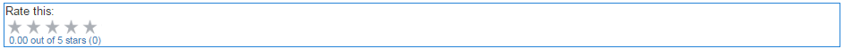
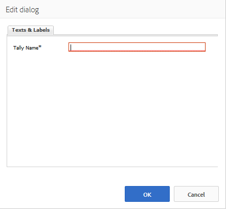

# Utilisation des évaluations {#using-ratings}

Le composant `Rating` est utilisé seul ou avec d’autres fonctionnalités de Communities. Ce composant permet aux membres de la communauté connectés d’exprimer leurs opinions en évaluant le contenu.

## Ajout d’une évaluation à une page {#adding-a-rating-to-a-page}

Pour ajouter un composant de `Rating` à une page en mode création, localisez-le `Communities / Rating` et faites-le glisser sur une page, par exemple en le positionnant par rapport à la fonction pour que les membres puissent l’évaluer.

Pour plus d’informations, consultez [Principes de base des composants de communautés](basics.md).

Lorsque les [bibliothèques côté client requises](rating-basics.md#essentials-for-client-side) sont incluses, le composant `Rating` s’affiche de cette manière.

## Configuration de l’évaluation {#configuring-rating}

Sélectionnez le composant de `Rating` placé afin de pouvoir accéder à l’icône de `Configure` qui ouvre la boîte de dialogue de modification et de la sélectionner.

Sous l’onglet **[!UICONTROL Textes et libellés]**, indiquez l’identifiant interne de l’évaluation.

**[!UICONTROL Tally Name]**
(*Obligatoire*) Nom simple du `Rating` qui identifie de manière unique cette instance. Doit être un nom de nœud valide pour le référentiel.

## Expérience du visiteur du site {#site-visitor-experience}

### Membres {#members}

Une seule évaluation par membre est autorisée. Le membre peut modifier sa note à tout moment.

### Anonyme {#anonymous}

La publication anonyme d’une évaluation n’est pas prise en charge. Les visiteurs et visiteuses du site doivent s’inscrire (devenir membre) et se connecter pour participer.

## Informations supplémentaires {#additional-information}

Vous trouverez plus d’informations à ce sujet sur la page [Rating Essentials](rating-basics.md) destinée aux développeurs et développeuses.
