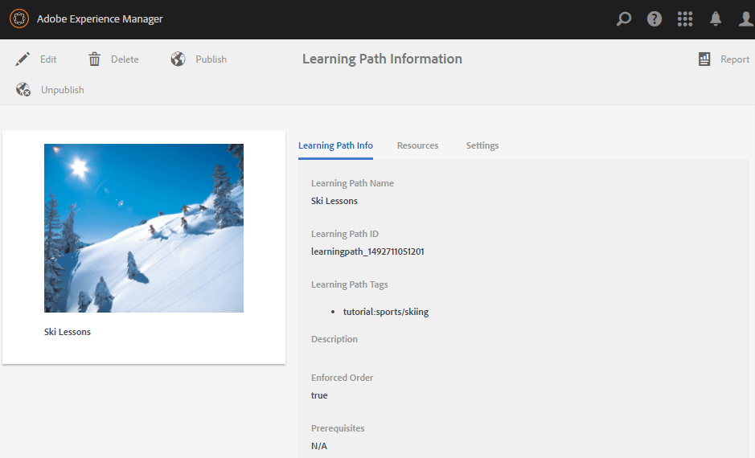

# Créer et attribuer des ressources d’activation {#create-and-assign-enablement-resources}

## Ajouter une ressource d’activation {#add-an-enablement-resource}

Pour ajouter une ressource d’activation au nouveau site de la communauté :

* Connectez-vous en tant qu’administrateur système sur l’instance de création :
   * Par exemple, [http://localhost:4502/](http://localhost:4503/)
* Dans la navigation globale, sélectionnez **[!UICONTROL Communautés]** > **[!UICONTROL Ressources]**

   

   
* Sélectionnez le site de la communauté sur lequel des ressources d’activation sont ajoutées :
   * Sélectionnez **[!UICONTROL Tutoriel d’activation]**.
* Dans le menu, sélectionnez **[!UICONTROL Créer]**.
* Sélectionnez **[!UICONTROL Ressource]**.

### Informations de base {#basic-info}

Renseignez les informations de base de la ressource :

* **[!UICONTROL Nom du site]**

   Définissez sur le nom du site de communauté sélectionné : Tutoriel sur l’activation

* **[!UICONTROL Resource Name&amp;ast;]**

   Leçon de ski 1

* **[!UICONTROL Balises]**

   Tutoriel : Sports / Ski

* **[!UICONTROL Afficher dans le catalogue]**

   Définissez-le sur **On**.

* **[!UICONTROL Description]**

   Glisser sur la neige pour les débutants.

* **[!UICONTROL Ajouter image]**

   Ajoutez une image pour représenter la ressource au membre dans la vue Affectations.

   

* Sélectionnez **[!UICONTROL Suivant]**

### Ajouter du contenu {#add-content}

Bien qu’il s’affiche comme si plusieurs ressources pouvaient être sélectionnées, une seule est autorisée.

Sélectionnez `'+' icon`, dans le coin supérieur droit, pour lancer le processus de choix de la ressource en identifiant la source.

Téléchargez une ressource. Si une ressource vidéo, téléchargez une image personnalisée à afficher avant le début de la lecture de la vidéo ou autorisez la génération d’une miniature à partir de la vidéo (cela peut prendre quelques minutes, il n’est pas nécessaire d’attendre).

* Sélectionnez **[!UICONTROL Suivant]**.

### Paramètres {#settings}

* **[!UICONTROL Paramètres des réseaux sociaux]**

   Laissez les paramètres par défaut pour expérimenter l’évaluation et les commentaires des ressources d’activation par les apprenants.

* **[!UICONTROL Échéance]**

   *(Facultatif)* Une date à laquelle l’affectation doit être terminée peut être sélectionnée.

* **[!UICONTROL Auteur de la ressource]**

   *(Facultatif)* Laissez vide.

* **[!UICONTROL Resource Contact&amp;ast;]**

   *(Obligatoire)* Utilisez le menu déroulant pour sélectionner un membre  `Quinn Harper`.

* **[!UICONTROL Expert de la ressource]**

   *(Facultatif)* Laissez vide.

   **Remarque** : Si les utilisateurs ou les groupes ne sont pas visibles, vérifiez qu’ils ont été ajoutés au  `Community Enable Members` groupe et  ** enregistrés sur l’instance de publication.

   

* Sélectionnez **[!UICONTROL Suivant]**

### Affectations {#assignments}

* **[!UICONTROL Ajouter des cessionnaires]**

   Laissez non défini, car cette ressource d’activation sera ajoutée à un chemin d’apprentissage. Si un apprenant est affecté à la ressource d’activation individuelle ainsi qu’à un fichier learningPath contenant la ressource d’activation, il sera affecté deux fois à la ressource d’activation.

   

* Sélectionnez **[!UICONTROL Créer]**

   

La création réussie de la ressource renvoie à la console Ressources avec la ressource nouvellement créée sélectionnée. Dans cette console, vous pouvez publier, ajouter des apprenants et modifier d’autres paramètres.

Pour charger une nouvelle version de la ressource d’activation, il est recommandé de créer une nouvelle ressource, puis de désinscrire les membres de l’ancienne version et de les inscrire à la nouvelle version.

### Publier la ressource {#publish-the-resource}

Avant que les inscrits puissent voir la ressource affectée, elle doit être publiée :

* Icône Sélectionner le monde `Publish`

L’activation est confirmée par un message de succès :

## Ajout d’une ressource de deuxième activation {#add-a-second-enablement-resource}

Répétez les étapes ci-dessus pour créer et publier une seconde ressource d’activation associée à partir de laquelle un parcours d’apprentissage sera créé.

**** Publiez la deuxième ressource.

Revenez à la liste des ressources du tutoriel d’activation.

*Conseil : Si les deux ressources ne sont pas visibles, actualisez la page.*

## Ajouter un chemin d’apprentissage {#add-a-learning-path}

Un parcours d’apprentissage est un regroupement logique de ressources d’activation qui forment un cours.

* Dans la console Ressources, sélectionnez `+ Create`
* Sélectionnez **[!UICONTROL Chemin d’apprentissage]**

Ajoutez les **[!UICONTROL Informations de base]** :

* **[!UICONTROL Nom du cursus de formation]**

   Leçons de ski

* **[!UICONTROL Balises]**

   Tutoriel : Ski

* **[!UICONTROL Afficher dans le catalogue]**

   Ne pas cocher

* **[!UICONTROL Chargement d’une image]**

   Pour représenter le chemin d’apprentissage dans la console Ressources.

   

* Sélectionnez **[!UICONTROL Suivant]**.

Ignorez le panneau suivant, car il n’existe aucun parcours d’apprentissage prérequis à ajouter.

* Sélectionnez **[!UICONTROL Suivant]**

Dans le panneau Ajouter des ressources :

* Sélectionnez `+ Add Resources` pour sélectionner les 2 ressources de ski à ajouter au parcours d’apprentissage.

   Remarque : Seules les ressources **publiées** peuvent être sélectionnées.

>[!NOTE]
>
>Vous ne pouvez sélectionner que les ressources disponibles au même niveau que le chemin d’apprentissage. Par exemple, pour un parcours d’apprentissage créé dans un groupe, seules les ressources au niveau du groupe sont disponibles ; pour un parcours d’apprentissage créé dans un site communautaire, les ressources de ce site peuvent être ajoutées au chemin d’apprentissage.

* Sélectionnez **[!UICONTROL Envoyer]**.

   

   

* Sélectionnez **[!UICONTROL Suivant]**

   

* **[!UICONTROL Ajouter des cessionnaires]**

   Utilisez le menu déroulant pour sélectionner le groupe `Community Ski Class`, qui doit inclure les membres `Riley Taylor` et `Sidney Croft.`

* **[!UICONTROL Formation Path Contact&amp;ast;]**

   *(Obligatoire)* Utilisez le menu déroulant pour sélectionner un membre  `Quinn Harper`.

* Sélectionnez **[!UICONTROL Créer]**.

   

La création réussie du chemin d’apprentissage revient à la console Ressources avec le nouveau chemin d’apprentissage sélectionné. Dans cette console, vous pouvez publier, ajouter des apprenants et modifier d’autres paramètres.

**** Publiez le chemin d’apprentissage.
