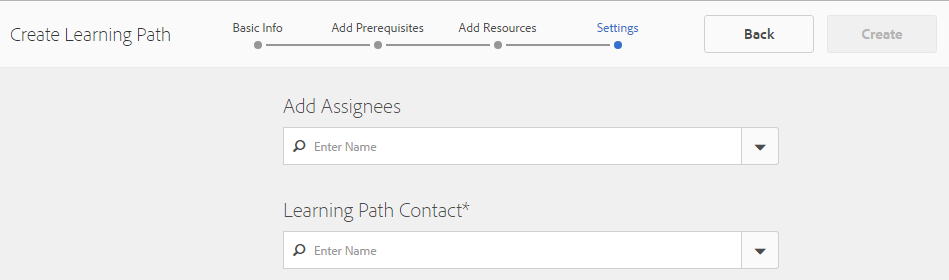
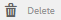

# Console Ressources d’activation{#enablement-resources-console} 

Pour AEM Communities, la console Ressources permet aux [gestionnaires d&#39;activation](users.md) de créer, gérer et affecter des ressources aux membres d&#39;un site communautaire d&#39;activation.

## Conditions préalables {#requirements}

Avant d’ajouter des ressources d’activation pour un site de la communauté, les instances AEM doivent être correctement configurées, notamment :

* SCORM
* FFmpeg

Pour plus d&#39;informations, voir [Configuration de l&#39;activation](enablement.md).

>[!CAUTION]
>
>Si SCORM est installé après la création du site de la communauté, toutes les ressources d’activation présentes avant l’installation de SCORM doivent être recréées.

>[!NOTE]
>
>Avec la sortie de [AEM 6.3](deploy-communities.md#latestfeaturepack) et des packages de fonctionnalités Communautés équivalentes [AEM 6.2 FP3](deploy-communities.md#latestfeaturepack) et [AEM 6.1 FP7](https://docs.adobe.com/content/docs/en/aem/6-1/deploy/communities.html#Latest Feature Pack), la fonction d&#39;activation ne nécessite plus de [base de données MySQL](mysql.md).

## Terminologie {#terminology}

### Resource {#resource}

Les ressources sont essentielles pour une [communauté d&#39;activation](overview.md#enablement-community). Ce sont les matériaux affectés aux membres qui leur permettent d&#39;améliorer leurs compétences.

Caractéristiques d&#39;une ressource :

* Peut être de type :
   * Image (JPG, PNG, GIF, BMP)
   * Vidéo (MP4)
   * Flash (SWF)
   * Document (PDF)
   * Quiz (SCORM)
* Peut être référencé à partir d’un ou de plusieurs chemins d’apprentissage.

### Cursus de formation {#learning-path}

Un parcours d&#39;apprentissage est un ensemble logique de ressources d&#39;activation regroupées pour faciliter l&#39;affectation des membres.

### Groupe de membres {#members-group}

Lors de la création d&#39;un site communautaire, le nom donné au site pour l&#39;URL est utilisé dans la création des groupes d&#39;utilisateurs [spécifiques au site](users.md) configurés avec diverses autorisations pour divers rôles. Tous ces groupes créés automatiquement sont précédés du préfixe `Community <site-name>`.

Un de ces groupes d’utilisateurs est le groupe `Community <site-name> Members`, qui identifie les utilisateurs enregistrés dans l’environnement de publication comme membres de la communauté. Voir le didacticiel [Prise en main de AEM Communities pour l’activation](getting-started-enablement.md) pour un exemple.

Pour [les communautés d&#39;engagement](overview.md#egagementcommunity), il est raisonnable de permettre aux visiteurs du site de s&#39;enregistrer ou d&#39;utiliser la connexion sociale, à ce stade, ils sont automatiquement ajoutés au groupe de membres.

Pour les [communautés d&#39;activation](overview.md#enablement-community), il est recommandé de rendre le site privé, ce qui nécessite qu&#39;un administrateur ajoute des utilisateurs au groupe de membres.

## Accès aux ressources d&#39;activation d&#39;un site communautaire {#accessing-a-community-site-s-enablement-resources}

### Accédez aux ressources des communautés {#navigate-to-communities-resources}

Dans l’environnement d’auteur, pour accéder à la console Ressources

* A partir de la navigation globale : **[!UICONTROL Navigation]** > **[!UICONTROL Communautés]** > **[!UICONTROL Ressources]**

   

### Sélectionner un site communautaire {#select-a-community-site}

La console Ressources des communautés affiche tous les sites communautaires.

Les ressources d’activation sont créées pour un site communautaire spécifique après avoir sélectionné le site dans la console Ressources.

Une fois qu’un site communautaire spécifique est sélectionné, toutes les ressources d’activation et tous les chemins d’apprentissage existants sont accessibles pour la gestion et la modification, et de nouvelles ressources d’activation et de nouveaux chemins d’apprentissage peuvent être créés.

#### Recherche {#search-features}

Sélectionnez l’icône de bascule du panneau latéral pour rechercher une ressource d’activation ou un chemin d’apprentissage. Lorsqu’il est sélectionné, un panneau de recherche s’ouvre sur le côté gauche de la console et fournit une zone de texte dans laquelle les termes de recherche peuvent être entrés.

#### Mode de sélection {#selection-mode}

Pour sélectionner plusieurs ressources d’activation, sélectionnez la première en passant la souris sur la carte et en sélectionnant l’icône en forme de coche. Une fois sélectionnée, toute autre carte est ajoutée au groupe de sélection. Si vous sélectionnez une seconde fois, la carte est désactivée.

## Créer une ressource {#create-a-resource}

Pour ajouter une nouvelle ressource d&#39;activation au site de la communauté

* Sélectionnez l&#39;icône `Create`.
* Dans le sous-menu qui s&#39;affiche, sélectionnez **[!UICONTROL Ressource]**.

Cette opération lance un processus détaillé de :

* Description de la ressource (nom, image de carte et texte).
* Sélection du contenu de la ressource.
* Sélection d&#39;une image de couverture pour la ressource.
* Identification des contacts de ressources.
* Affectation de ressources aux membres.

Lorsque la ressource fait partie d&#39;un cours, d&#39;un parcours d&#39;apprentissage, les membres ne devraient être affectés qu&#39;au chemin d&#39;apprentissage. Des affectations peuvent être ajoutées après la création de la ressource d&#39;activation.

### 1 Informations de base {#basic-info}

* **[!UICONTROL Ajouter image]**

   (*Facultatif*) Image à afficher sur la carte pour la ressource d&#39;activation dans la page des affectations du membre ainsi que dans la console Ressources. L’image est sélectionnée à partir du système de fichiers local du serveur. Si aucune image n’est fournie, une miniature est générée pour la ressource téléchargée.

   ***Remarque*** : La taille d’image recommandée n’est pas de 480 x 480 pixels. En raison de la conception adaptée des cartes à diverses dimensions du navigateur, la taille d’affichage varie de 220 x 165 pixels à 400 x 165 pixels.

* **[!UICONTROL Nom du site]**

   (*readonly*) Site communautaire auquel la ressource est ajoutée.

* **[!UICONTROL Nom de la ressource]**

   (*Obligatoire*) Nom d’affichage de la ressource. Un nom de noeud valide est créé à partir du nom d’affichage.

* **[!UICONTROL Balises]**

   (*Facultatif*) Vous pouvez choisir une ou plusieurs balises qui associent la ressource d&#39;activation à un ou plusieurs catalogues. Voir [Ressources d’activation du balisage](tag-resources.md).

* **[!UICONTROL Afficher dans le catalogue]**

   Si elle n&#39;est pas cochée, la ressource d&#39;activation n&#39;apparaîtra dans aucun catalogue. Si cette case est cochée, la ressource d&#39;activation s&#39;affiche dans tous les catalogues, sauf si [est pré-filtré](catalog-developer-essentials.md#pre-filters) ou si les filtres membres de l&#39;interface utilisateur sont sélectionnés. Cette option n’est pas cochée par défaut.

* **[!UICONTROL Description]**

   (*Facultatif*) Description à afficher pour la ressource d&#39;activation.

* **[!UICONTROL Petite ressource]**

   (*Facultatif*) Sélectionné à partir d’AEM Assets. Image miniature représentant la ressource dans l’environnement de publication, par exemple dans un catalogue.

* **[!UICONTROL Grande ressource]**

   (*Facultatif*) Sélectionné à partir d’AEM Assets. Grande image représentant la ressource dans l’environnement de publication, par exemple sur la page principale d’une ressource.

* **[!UICONTROL Ressource de fragment de contenu]**

   (*Facultatif*) Sélectionné à partir d’AEM Assets. Fragment de contenu qui peut être référencé dans l’environnement de publication, mais qui n’est pas utilisé par défaut.

* Sélectionnez **[!UICONTROL Suivant]**

### 2 Contenu de l&#39;Ajoute {#add-content}

Bien qu&#39;il semble que plusieurs ressources d&#39;activation puissent être sélectionnées, une seule est autorisée.

Sélectionnez `'+' icon`, dans le coin supérieur droit, pour commencer le processus de sélection de la ressource en identifiant la source.

* **[!UICONTROL Transférer depuis mes fichiers locaux]**

   Le téléchargement à partir du système de fichiers local utilise le navigateur de fichiers natif pour sélectionner et télécharger un fichier. Les types de fichier pris en charge sont SCORM.zip (HTML5 ou SWF), MP4 video, SWF, PDF et les types d’image (JPG, PNG, GIF, BMP). Le nom de fichier devient le nom de la ressource, qui est ajouté à la bibliothèque de ressources.

* **[!UICONTROL Parcourir la bibliothèque de ressources]**

   Sélectionnez dans la bibliothèque de fichiers. La sélection est limitée à celles qui sont visibles sur le site communautaire.

* **[!UICONTROL Ajouter une URL externe]**

   Entrez un lien vers le contenu d’apprentissage.

   Dans la boîte de dialogue qui s&#39;ouvre, saisissez :

   * **[!UICONTROL Titre]**

      Nom de la ressource pour la ressource d&#39;activation.

   * **[!UICONTROL URL]**

      URL d’un fichier.

* **[!UICONTROL Ajouter une URL Adobe Connect]**

   Entrez un lien vers une session Adobe Connect.

   Dans la boîte de dialogue qui s&#39;ouvre, saisissez :

   * **[!UICONTROL Titre]**

      Nom de la ressource pour la ressource d&#39;activation.

   * **[!UICONTROL URL]**

      URL d’une session Adobe Connect.

* **[!UICONTROL Définir une ressource externe]**

   Entrez l&#39;emplacement où le matériau doit être présenté. Les valeurs de l’état et du score de réussite sont saisies manuellement (voir [Rapports](reports.md)). Une image de couverture téléchargée peut être utilisée pour fournir des informations supplémentaires.

   Dans la boîte de dialogue qui s&#39;ouvre, saisissez :

   * **[!UICONTROL Titre]**

      Nom de la ressource pour la ressource d&#39;activation.

   * **[!UICONTROL Emplacement]**

      Emplacement d’un site physique, tel qu’une salle de classe.

#### Exemple d&#39;une ressource vidéo ajoutée {#example-of-an-added-video-resource}

* **[!UICONTROL Image de couverture des ressources]**

   L&#39;image de couverture est une image à afficher lors de la première consultation de la ressource d&#39;activation. Par exemple, l’image de couverture s’affiche lorsqu’une ressource vidéo n’est pas encore lue. Si une image personnalisée n’est pas téléchargée, une image par défaut s’affiche. Pour les ressources vidéo, il peut être possible de [générer une miniature](enablement.md#ffmpeg), mais uniquement lorsqu’elle est téléchargée et non lorsque la vidéo est référencée en tant qu’URL. Pour les ressources d’emplacement, l’image peut être utilisée pour fournir des informations supplémentaires.

   La taille recommandée pour l’image de couverture est de 640 x 360 px.

* Sélectionnez **[!UICONTROL Suivant]**.

### 3 Paramètres {#settings}

>[!NOTE]
>
>Les apprenants ne doivent pas être inscrits directement dans les ressources d’activation qui doivent être référencées à partir d’un parcours d’apprentissage. Les apprenants n&#39;ont besoin que d&#39;être inscrits sur le parcours d&#39;apprentissage.
>
>Si un membre est inscrit à la fois dans une ressource et dans un chemin d&#39;apprentissage qui fait référence à cette ressource, ses affectations montreront à la fois la ressource unique et la ressource dans le chemin d&#39;apprentissage.

* **[!UICONTROL Paramètres des réseaux sociaux]**

   Ces paramètres déterminent si les apprenants sont en mesure de fournir des informations concernant la ressource d’activation. Les [paramètres de modération](sites-console.md#moderation) sont ceux du site de la communauté parent.

   * **[!UICONTROL Autoriser les commentaires]**

      Si cette option est cochée, les membres sont autorisés à commenter la ressource. Cette option est cochée par défaut.

   * **[!UICONTROL Autoriser les évaluations]**

      Si cette option est cochée, les membres sont autorisés à évaluer la ressource. Cette option est cochée par défaut.

   * **[!UICONTROL Autoriser l&#39;accès anonyme]**

      Si cette option est cochée, les visiteurs anonymes du site sont autorisés à vue de la ressource dans un catalogue lorsque le site communautaire autorise également l’accès anonyme. Cette option n’est pas cochée par défaut.

* **[!UICONTROL Échéance]**

   *(Facultatif)* Une date de fin de l&#39;affectation peut être sélectionnée.

* **[!UICONTROL Auteur de la ressource]**

   *(Facultatif)* Auteur de la ressource d’activation. Utilisez le menu déroulant pour sélectionner parmi les utilisateurs membres du groupe de membres .

* **[!UICONTROL Contact&amp;ast de la ressource ;]**

   *(Obligatoire)* Personne avec laquelle le membre peut communiquer au sujet de la ressource d&#39;activation. Utilisez le menu déroulant pour sélectionner parmi les utilisateurs membres du groupe de membres .

* **[!UICONTROL Expert de la ressource]**

   *(Facultatif)* Personne à qui le membre peut communiquer pour savoir qui possède l&#39;expertise relative à la ressource d&#39;activation. Utilisez le menu déroulant pour effectuer une sélection parmi les utilisateurs membres du groupe [membres](#members-group).

### 4 Affectations {#assignments}

* **[!UICONTROL Ajouter des cessionnaires]**

   Utilisez le menu déroulant pour sélectionner parmi les [membres](#members-group) - les utilisateurs et les groupes d&#39;utilisateurs (en caractères gras) - qui doivent être inscrits en tant qu&#39;apprenants. Lorsque les membres se connectent au site de la communauté, les ressources d’activation (et les chemins d’apprentissage) dans lesquelles ils sont inscrits s’affichent sur leur [page Affectations](functions.md#assignments-function).

* Sélectionnez **[!UICONTROL Créer]**.

   

La création réussie de la ressource d&#39;activation revient à la console Ressources avec la ressource nouvellement créée sélectionnée. A partir de cette console, il est possible de [gérer la ressource](#managing-a-resource).

## Créer un parcours de formation {#create-a-learning-path}

Pour ajouter un nouveau chemin d’apprentissage au site de la communauté

* Sélectionnez l&#39;icône `Create`
* Dans le sous-menu qui s&#39;affiche, sélectionnez **[!UICONTROL Chemin d&#39;apprentissage]**.

Cette opération lance un processus détaillé de :

* Identification du chemin d’apprentissage.
* Affichage d’une image de carte représentant le chemin d’apprentissage des apprenants.
* Référence aux ressources d’activation à inclure dans le chemin d’apprentissage.
* Vous pouvez également commander les ressources.
* Identification facultative des chemins d’apprentissage prérequis.
* Identification d’un contact de chemin d’apprentissage.
* Inscription de membres.

Pour les ressources d&#39;activation incluses dans un parcours d&#39;apprentissage, les affectations ne doivent être faites que pour le parcours d&#39;apprentissage et non pour les ressources individuelles.

### Informations de base {#basic-info-1}

* **[!UICONTROL Ajouter image]**

   (*Facultatif*) Image à afficher sur la carte pour le chemin d’apprentissage dans la page des affectations du membre ainsi que dans la console Ressources. L’image est sélectionnée à partir du système de fichiers local du serveur. Si aucune image n’est fournie, une miniature est générée pour la ressource téléchargée.

   ***Remarque*** : La taille d’image recommandée n’est plus simplement de 480 x 480 pixels. En raison de la conception adaptée des cartes à diverses dimensions du navigateur, la taille d’affichage varie de 220 x 165 pixels à 400 x 165 pixels.

* **[!UICONTROL Nom du site]**

   (*Lecture seule*) Site communautaire auquel la ressource est ajoutée.

* **[!UICONTROL Nom du cursus de formation]**

   (*Obligatoire*) Nom d’affichage du chemin d’apprentissage. Un nom de noeud valide est créé à partir du nom d’affichage.

* **[!UICONTROL Balises]**

   (*Facultatif*) Une ou plusieurs balises peuvent être sélectionnées pour associer le chemin d’apprentissage à un ou plusieurs catalogues. Voir [Ressources d’activation du balisage](tag-resources.md).

* **[!UICONTROL Afficher dans le catalogue]**

   Lorsqu’elle est désactivée, le chemin d’apprentissage n’apparaît dans aucun catalogue. Si cette option est cochée, le chemin d’apprentissage s’affiche dans tous les catalogues, sauf si [est pré-filtré](catalog-developer-essentials.md#pre-filters) ou si les filtres membres de l’interface utilisateur l’affichent. L&#39;affichage du chemin d&#39;apprentissage dans un catalogue permet indirectement à READ d&#39;accéder à toutes les ressources qu&#39;il contient. Cette option n’est pas cochée par défaut.

* **[!UICONTROL Description]**

   (*Facultatif*) Description à afficher pour la ressource d&#39;activation.

* **[!UICONTROL Petite ressource]**

   (*Facultatif*) Sélectionné à partir d’AEM Assets. Image miniature représentant la ressource dans l’environnement de publication, par exemple dans un catalogue.

* **[!UICONTROL Grande ressource]**

   (*Facultatif*) Sélectionné à partir d’AEM Assets. Grande image représentant la ressource dans l’environnement de publication, par exemple sur la page principale d’une ressource.

* **[!UICONTROL Ressource de fragment de contenu]**

   (*Facultatif*) Sélectionné à partir d’AEM Assets. Fragment de contenu qui peut être référencé dans l’environnement de publication, mais qui n’est pas utilisé par défaut.

* Sélectionnez **[!UICONTROL Suivant]**.

### Ajouter des conditions préalables {#add-prerequisites}

* **[!UICONTROL Cursus de formation prérequis]**

   (*Facultatif*) Lorsque d’autres chemins d’apprentissage publiés sont sélectionnés, ils doivent être terminés avant qu’un apprenant ne puisse sélectionner ce chemin d’apprentissage.

* Sélectionnez **[!UICONTROL Suivant]**.

### Ajouter des ressources {#add-resources}

* **[!UICONTROL Mettre en place l’ordre du cursus de formation]**

   (*Facultatif*) Si ce paramètre est activé, l&#39;ordre dans lequel les ressources d&#39;activation sont ajoutées est l&#39;ordre dans lequel les apprenants doivent suivre le parcours d&#39;apprentissage. La valeur par défaut est Désactivé.

* **[!UICONTROL Ressources]**

   Une ou plusieurs ressources sélectionnées parmi les *ressources d&#39;activation publiées* créées pour le site communautaire actuel.

>[!NOTE]
>
>Vous pouvez uniquement sélectionner les ressources disponibles au même niveau que le chemin d’apprentissage. Par exemple, pour un parcours d’apprentissage créé dans un groupe, seules les ressources au niveau du groupe sont disponibles ; pour un parcours d&#39;apprentissage créé dans un site communautaire, les ressources de ce site sont disponibles pour l&#39;ajout au chemin d&#39;apprentissage.

* Sélectionnez **[!UICONTROL Suivant]**.

### Paramètres {#settings-1}

* **[!UICONTROL Ajouter des inscriptions]**

   Utilisez le menu déroulant pour sélectionner parmi les membres et les groupes de membres (en caractères gras) qui sont membres du [groupe de membres](#members-group) du site de la communauté. Il n’est pas nécessaire d’ajouter des affectations lors de la première création du chemin d’apprentissage. Les propriétés du chemin d’apprentissage peuvent être modifiées pour ajouter des apprenants ultérieurement.

* **[!UICONTROL Contact&amp;ast du parcours d&#39;apprentissage ;]**

   *(Obligatoire)* Personne avec laquelle le membre peut communiquer au sujet du cheminement d&#39;apprentissage. Utilisez le menu déroulant pour sélectionner parmi les utilisateurs membres du [groupe de membres ](#members-group) du site communautaire.

* Sélectionnez **[!UICONTROL Créer]**

>[!NOTE]
>
>Les ressources d’activation référencées à partir du chemin d’apprentissage ne doivent pas liste les mêmes personnes désignées (apprenants), le cas échéant.
>
>Si un membre est inscrit à la fois dans une ressource d&#39;activation et dans un chemin d&#39;apprentissage qui référence cette ressource, ses affectations montreront à la fois la ressource unique et la ressource dans le chemin d&#39;apprentissage.

## Gestion d&#39;une ressource {#managing-a-resource}

Pour gérer une ressource d&#39;activation unique :

* Dans la console **[!UICONTROL Ressources]**, sélectionnez le site communautaire qui contient la ressource.
* Sélectionnez la ressource.

Pour la ressource d&#39;activation sélectionnée, il est possible de :

* Propriétés de la vue (par défaut)
* Modification des propriétés
* Supprimer
* Publication
* Annuler la publication

Pour télécharger une nouvelle version de la ressource d&#39;activation, il est recommandé de créer une nouvelle ressource, puis d&#39;annuler l&#39;inscription des membres de l&#39;ancienne version et de les inscrire dans la nouvelle version.

### Modifier la ressource {#edit-resource}

En sélectionnant l&#39;icône en forme de crayon, les étapes de création d&#39;une ressource d&#39;activation sont mises à disposition afin que toutes les informations fournies puissent être modifiées.

Si la seule modification consiste à modifier les affectations à l’étape Paramètres, l’enregistrement des modifications entraîne la publication des modifications. Si d&#39;autres modifications sont apportées, la ressource doit être publiée explicitement après l&#39;enregistrement.

### Supprimer la ressource {#delete-resource}

En sélectionnant l&#39;icône de la corbeille, la ressource d&#39;activation sera `Deleted` après confirmation.

### Publication  {#publish}

Avant que les apprenants ne puissent voir une ressource d’activation affectée, elle doit être publiée :

* Sélectionnez l’icône du monde `Publish`.
* Dans la boîte de dialogue qui s’affiche, sélectionnez à nouveau **[!UICONTROL Publier]**.
* Sélectionnez **[!UICONTROL Fermer]**.

Bien que la boîte de dialogue indique que l’action est mise en file d’attente, elle est souvent publiée immédiatement.

### Annuler la publication {#unpublish}

Pour rendre temporairement les ressources d’activation inaccessibles aux membres de l’environnement de publication sans les supprimer, utilisez l’icône du monde pour `Unpublish` la ressource.

### Rapport {#report}

L’icône Rapport permet d’accéder aux rapports générés lorsque les apprenants interagissent avec les ressources d’activation qui leur sont assignées dans l’environnement de publication. Le rapport varie en fonction du type de ressource.

Pour tous les chemins d’apprentissage, il est possible de vue d’un rapport en fonction des ressources ou des apprenants ( `User Report`).

Ce rapport est spécifiquement destiné à la ressource d’activation ou au chemin d’apprentissage en cours. La profondeur du rapports fourni dépend de la licence et de l’activation de [Adobe Analytics](analytics.md) pour le site communautaire. Les rapports [Chronologie](#timeline), [Engagement de la visionneuse](#viewer-engagement) et [Engagement par périphérique](#engagement-by-device) sont importés d’Adobe Analytics en fonction de l’[intervalle d’interrogation](analytics.md#report-importer).

Pour toutes les ressources d’activation, qu’Adobe Analytics soit activé ou non, il existe des rapports sur [Statut du signataire](#assignee-status) et [Classifications](#ratings) ainsi qu’un [tableau Résumé du rapport](#report-summary).

#### Chronologie {#timeline}

Le rapport Journal d’Analytics indique quand des événements se produisent au fil du temps pour cette ressource d’activation :

* **Vues**

   Une vue est le moment où un apprenant visite la page des détails de la ressource.

* **Lectures**

   Une lecture se produit lorsque alLearner interagit avec la ressource, telle que la lecture d’une vidéo ou l’ouverture d’un PDF.

* **Evaluations**

   Une évaluation est définie lorsqu’un apprenant attribue une évaluation d’étoile à une ressource.

* **Commentaires**

   Un commentaire est lorsque alLearner ajoute un commentaire.

L’axe vertical est le nombre de événements.

L’axe horizontal est l’heure du calendrier.

[Adobe Analytics requis](sites-console.md#analytics).

#### Engagement de la visionneuse {#viewer-engagement}

Le rapport Engagement de la visionneuse Analytics montre, pour les ressources vidéo, le nombre d’apprenants qui ont affiché la ressource et, s’ils n’ont pas lu la ressource jusqu’à la fin, à quel moment les apprenants ont cessé de la lire.

L&#39;axe vertical est le nombre d&#39;apprenants qui ont consulté cette ressource.

L&#39;axe horizontal est la durée de cette ressource.

[ID d’entreprise Marketing Cloud requis](sites-console.md#enablement).

#### Engagement par périphérique {#engagement-by-device}

Le rapport Engagement Analytics par périphérique, pour les ressources vidéo, décrit le pourcentage de vues lues depuis le bureau et depuis les périphériques mobiles.

[ID d’entreprise Marketing Cloud requis](sites-console.md#enablement).

#### État des cessionnaires {#assignee-status}

Le rapport État du destinataire, basé sur le nombre d’apprenants, décrit le nombre de personnes ayant

* **Non démarré**
* **En cours**
* **Terminé**

#### Evaluations {#ratings}

Le rapport Notations est basé sur le nombre d’apprenants qui ont évalué la ressource d’activation, en indiquant le nombre de chaque évaluation par étoiles suivie d’un résumé du nombre total d’évaluations et de la note moyenne.

#### Résumé du rapport {#report-summary}

Pour une ressource d’activation, le résumé du rapport est un tableau répertoriant les données.

* Chaque stagiaire qui a interagi avec la ressource
   * Leur statut
   * S&#39;ils ont été affectés à la ressource
      * Par opposition à leur recherche de la ressource dans un catalogue
      * Nombre de commentaires publiés
      * La note donnée, le cas échéant

Pour un rapport de ressources de chemin d’apprentissage, le résumé du rapport est un tableau répertoriant

* Chaque ressource incluse dans le chemin d’apprentissage
   * État de publication
   * Nombre de vues
   * Nombre de lectures
   * Note moyenne
   * Format
   * Taille
   * Nom du site de la communauté

Pour un rapport Utilisateur de cheminement de formation, le résumé du rapport est un tableau répertoriant les différents chemins d’apprentissage.

* Chaque stagiaire affecté au chemin d’apprentissage :
   * Nombre de ressources terminées.
   * Leur statut.

Il est possible d&#39;ajuster l&#39;affichage du tableau en sélectionnant des colonnes à l&#39;aide du sélecteur `Show / hide columns`.

#### Télécharger le rapport au format CSV {#download-report-as-csv}

Le tableau Résumé des rapports peut être téléchargé au format CSV à l’aide d’un bouton situé en haut de la console.

* Pour une ressource d&#39;activation : `Download Resource Report as CSV`.
* Pour un parcours d’apprentissage : `Download Learning Path Report as CSV`.

Le résumé complet des rapports est téléchargé, quelles que soient les colonnes sélectionnées pour l’affichage.
