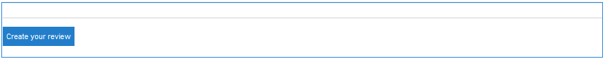
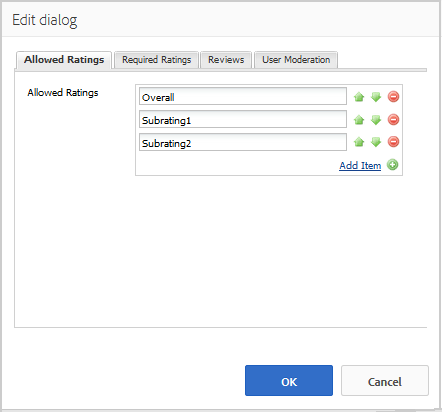
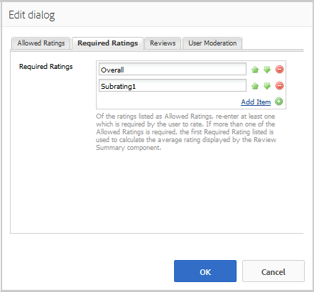
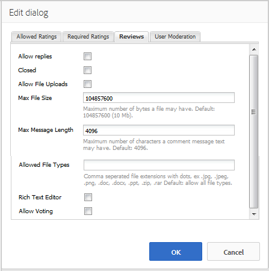
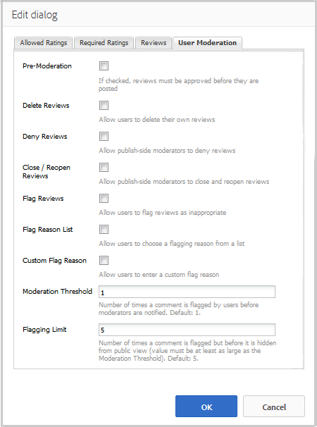
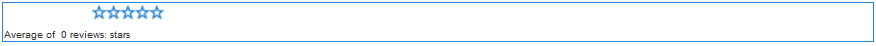
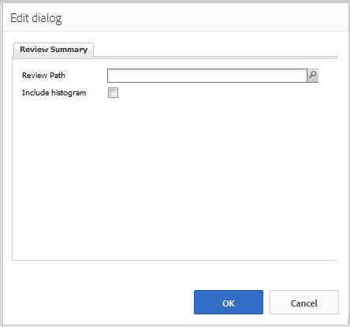
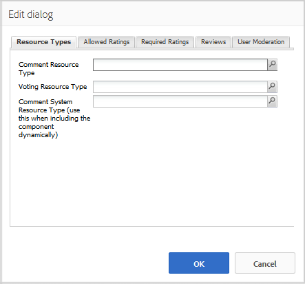

# Utilisation des révisions et du résumé des révisions (affichage) {#using-reviews-and-reviews-summary-display}

Le composant `Reviews` est un ensemble de composants [Comments](comments.md) et [Rating](rating.md) prêts à l’emploi.

Le composant `Reviews Summary (Display)` fournit un résumé d’une instance active ou fermée d’un composant `Reviews` pour affichage à un autre endroit du site.

>[!NOTE]
>
>La publication anonyme d’une révision n’est pas prise en charge. Les visiteurs et visiteuses du site doivent s’inscrire (devenir membre) et se connecter pour participer. Le visiteur connecté peut mettre à jour sa révision à tout moment.

## Ajout d’une révision à une page {#adding-a-review-to-a-page}

Pour ajouter un composant de `Reviews` à une page en mode création, utilisez l’explorateur de composants pour le localiser et `Communities / Reviews` faire glisser sur une page, par exemple à un emplacement relatif à la fonction que les utilisateurs et utilisatrices peuvent consulter.

Pour plus d’informations, consultez [Principes de base des composants de communautés](basics.md).

Lorsque les [bibliothèques côté client requises](reviews-basics.md#essentials-for-client-side) sont incluses, le composant `Reviews` s’affiche de cette manière.

## Configuration des révisions {#configuring-reviews}

Sélectionnez le composant de `Reviews` placé afin de pouvoir accéder à l’icône de `Configure` qui ouvre la boîte de dialogue de modification et de la sélectionner.

Sous l’onglet **[!UICONTROL Évaluations autorisées]**, spécifiez la liste complète des évaluations à afficher aux membres. La première évaluation doit être une évaluation globale/générale, car c’est l’évaluation qui fournit l’évaluation moyenne pour la composante `Review Summary (Display)`. Les deux évaluations suivantes dans la configuration par défaut doivent recevoir un titre différent, autre que « Subration 1 » ou « Subration 2 ».

* **[!UICONTROL Évaluations autorisées]**

  Liste d&#39;évaluations parmi lesquelles un membre peut choisir.

  Utilisez les boutons Flèche vers le haut, Flèche vers le bas et Supprimer pour modifier les sélections visibles.

  Cliquez sur **[!UICONTROL Ajouter un élément]** pour ajouter un autre choix d’évaluation.

Sous l’onglet **[!UICONTROL Évaluation requise]**, saisissez à nouveau les éléments de la liste des **[!UICONTROL Évaluation autorisée]** requis pour l’évaluation. Si un élément n’est spécifié que dans l’onglet Notes autorisées , il peut ne pas être marqué lorsqu’il est soumis par le membre.

Sur le site Web, les évaluations requises sont marquées d&#39;un astérisque. Si un élément est obligatoire et qu’il n’est pas marqué, un message s’affiche pour le membre et l’envoi est refusé jusqu’à ce que toutes les évaluations requises soient marquées.

* **[!UICONTROL Évaluations requises]**

  Un sous-ensemble de notes autorisées, indiquant les notes requises.

  Utilisez les boutons Flèche vers le haut, Flèche vers le bas et Supprimer pour modifier les sélections visibles.

  Cliquez sur **[!UICONTROL Ajouter un élément]** pour ajouter un autre choix de réponse.

>[!NOTE]
>
>Si un élément est saisi dans l&#39;onglet **[!UICONTROL Évaluation requise]** qui n&#39;est pas spécifié dans l&#39;onglet **[!UICONTROL Évaluation autorisée]**, il n&#39;est pas inclus dans les éléments à évaluer.

Sous l’onglet **[!UICONTROL Révisions]**, spécifiez la manière dont les révisions sont gérées.

* **[!UICONTROL Autoriser les réponses]**

  Si cette option est cochée, autorisez les réponses aux révisions. La valeur par défaut n’est pas cochée.

* **[!UICONTROL Fermé]**

  Si cette case est cochée, la révision est fermée aux nouvelles révisions et réponses. La valeur par défaut n’est pas cochée.

* **[!UICONTROL Autoriser les chargements de fichiers]**

  Si cette case est cochée, autorisez le chargement des pièces jointes pour la révision. La valeur par défaut n’est pas cochée.

* **Taille de fichier max**

  Pertinent uniquement si l’option **[!UICONTROL Autoriser le chargement de fichiers]** est cochée. Ce champ limite la taille (en octets) d’un fichier chargé. La valeur par défaut est de 10 Mo.

* **[!UICONTROL Longueur max. du message]**

  Nombre maximal de caractères pouvant être saisis dans la zone de texte. La valeur par défaut est de 4 096 caractères.

* **[!UICONTROL Types de fichiers autorisés]**

  Pertinent uniquement si l’option **[!UICONTROL Autoriser le chargement de fichiers]** est cochée. Liste d’extensions de fichier séparées par des virgules avec le séparateur « point ». Par exemple, .jpg, .jpeg, .png, .doc, .docx, .pdf. Si des types de fichiers sont spécifiés, ceux qui ne le sont pas ne sont pas autorisés. Par défaut, aucun fichier n’est spécifié, de sorte que tous les types de fichiers soient autorisés.

* **[!UICONTROL Éditeur de texte enrichi]**

  Si cette case est cochée, les publications peuvent être saisies avec des balises. La valeur par défaut n’est pas cochée.

* **[!UICONTROL Autoriser le vote]**

  Si cette case est cochée, inclure la fonction Vote pour un sujet. La valeur par défaut n’est pas cochée.

Sous l’onglet **[!UICONTROL Modération des utilisateurs]**, spécifiez la manière dont les révisions publiées sont gérées. Pour plus d’informations, voir [Modération du contenu créé par l’utilisateur](moderate-ugc.md).

* **[!UICONTROL Pré-Modération]**

  Si cette case est cochée, les révisions doivent être approuvées avant d’apparaître sur un site de publication. La valeur par défaut n’est pas cochée.

* **[!UICONTROL Supprimer révisions]**

  Si cette case est cochée, le membre qui a publié la révision peut la supprimer. La valeur par défaut n’est pas cochée.

* **[!UICONTROL Refuser les avis]**

  Si cette option est cochée, autorisez les modérateurs à refuser les avis. La valeur par défaut n’est pas cochée.

* **[!UICONTROL Fermer/Rouvrir les avis]**

  Si cette case est cochée, autorisez les modérateurs à fermer et rouvrir les révisions. La valeur par défaut n’est pas cochée.

* **[!UICONTROL Signaler les commentaires]**

  Si cette option est cochée, autorisez les membres à signaler les révisions comme inappropriées. La valeur par défaut n’est pas cochée.

* **[!UICONTROL Liste des motifs de l&#39;indicateur]**

  Si cette case est cochée, permet aux membres de choisir, dans une liste déroulante, la raison pour laquelle ils signalent une révision comme inappropriée. La valeur par défaut n’est pas cochée.

* **[!UICONTROL Motif de l’indicateur personnalisé]**

  Si cette case est cochée, permettez aux membres de saisir leur propre raison pour signaler une révision comme inappropriée. La valeur par défaut n’est pas cochée.

* **[!UICONTROL Seuil de modération]**

  Permet d’entrer le nombre de fois où une révision doit être marquée par les membres avant que les modérateurs ne soient avertis. La valeur par défaut est une fois (1).

* **[!UICONTROL Limite de marquage]**

  Permet d’entrer le nombre de fois où une révision doit être marquée avec un indicateur avant qu’elle ne soit masquée de la vue publique. Ce nombre doit être supérieur ou égal au **[!UICONTROL seuil de modération]**. La valeur par défaut est 5.

### Ajout d’un résumé de révision (affichage) à une page {#adding-a-review-summary-display-to-a-page}

Pour ajouter un composant `Reviews Summary (Display)` à une page en mode création, localisez-le

* `Communities / Reviews Summary (Display)`

Et faites-le glisser sur une page où un résumé d’une révision active ou fermée doit être affiché.

Pour plus d’informations, consultez [Principes de base des composants de communautés](basics.md).

Lorsque les [bibliothèques côté client requises](reviews-basics.md#essentials-for-client-side) sont incluses, le composant `Reviews Summary (Display)` s’affiche de cette manière.

>[!NOTE]
>
>La « moyenne » reflète les votes pour le premier élément répertorié dans les onglets Cotes autorisées de l&#39;examen récapitulé.

### Configuration Du Résumé Des Révisions (Affichage) {#configuring-reviews-summary-display}

Sélectionnez le composant de `Reviews Summary (Display)` placé afin de pouvoir accéder à l’icône de `Configure` qui ouvre la boîte de dialogue de modification et de la sélectionner.

Sous l’onglet **[!UICONTROL Résumé de la révision]**

* `Review Path`

  Saisissez ou accédez à l’instance placée du composant `reviews` afin de pouvoir résumer, par exemple, si vous ajoutez à la page web du site [Geometrixx Engage ](getting-started.md) le chemin d’accès serait :

  `/content/sites/engage/en/page/jcr:content/content/primary/reviews`

* `Include histogram`

  Si cette case est cochée, incluez l’affichage d’un graphique à barres indiquant le nombre d’étoiles dans les évaluations résumées. La valeur par défaut n’est pas cochée.

### Passage à un type de révision personnalisé {#changing-to-a-custom-review-type}

Le composant Révisions utilise le système de commentaires.

En modifiant le Type de ressource Commentaire, le système de commentaires ne génère plus une instance de commentaire à l’aide de la valeur par défaut, mais une instance personnalisée (étendue) par les développeurs.

Lorsque les types de ressources personnalisées sont connus, passez en [Mode de conception](../../help/sites-authoring/default-components-designmode.md) et double-cliquez sur le composant de `Comments` placé pour ouvrir une boîte de dialogue avec un onglet supplémentaire.

Sous l’onglet **[!UICONTROL Types de ressources]**, spécifiez le type de ressource personnalisé pour les nouvelles instances des composants `Comments or Voting` :

* **[!UICONTROL Type de ressource Commentaire]**

  Accédez au resourceType d’un `comment`composant) étendu (commentaire unique) dans /apps. Par exemple, `/apps/social/commons/components/hbs/comments/comment`.

  Cette ressource identifie le type de ressource du contenu créé par l’utilisateur créé lorsqu’un visiteur publie un commentaire.

* **[!UICONTROL Type de ressource de vote]**

  Accédez au type de ressource d’un composant `voting` étendu dans /apps. Par exemple, `/apps/social/components/hbs/voting`.

  Cette ressource identifie le type de ressource du contenu créé par l’utilisateur créé lorsqu’un visiteur publie un vote.

* **[!UICONTROL Commenter le type de ressource système]**

  Accédez au type de ressource d’un composant `comments`système de commentaires) étendu dans /apps. Laissez ce champ vide, sauf si le modèle de page [inclut dynamiquement](scf.md#add-or-include-a-communities-component) le système de commentaires dans le script sous-jacent au lieu d’être ajouté à la page en tant que ressource (nœud comments). En savoir plus en consultant la section sur l’assistant ](handlebars-helpers.md#include).[`{{include}}`

## Expérience du visiteur du site {#site-visitor-experience}

### Modérateurs et administrateurs {#moderators-and-administrators}

Lorsque l’utilisateur connecté dispose des privilèges de modérateur ou d’administrateur, il peut effectuer les tâches de modération autorisées par la configuration du composant, quelle que soit la personne qui a créé la révision.

### Membres {#members}

Lorsque le visiteur du site est connecté, selon la configuration, il peut :

* Publier une nouvelle révision
* Modifier leur propre révision
* Supprimer leur propre révision
* Signaler les commentaires de révision des autres

Une seule évaluation par membre est autorisée. Le membre peut modifier sa note à tout moment.

### Anonyme {#anonymous}

Les visiteurs et visiteuses du site qui ne sont pas connectés peuvent uniquement lire les avis publiés, les traduire si pris en charge, mais peuvent ne pas ajouter d’évaluation ou d’avis, ni signaler les commentaires d’avis d’autres personnes.

## Informations supplémentaires {#additional-information}

Pour plus d’informations, consultez la page [Review Essentials](reviews-basics.md) destinée aux développeurs et développeuses.

Pour la modération des commentaires publiés, voir [Modération du contenu créé par l’utilisateur](moderate-ugc.md).

Pour la traduction des commentaires publiés, voir [ Traduction de contenu créé par l’utilisateur ](translate-ugc.md).
