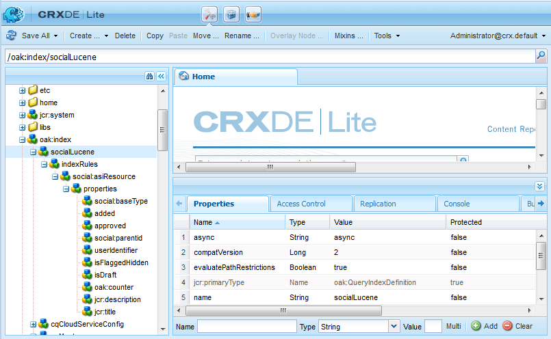

# Rechercher dans Essentials {#search-essentials}

## Vue d’ensemble {#overview}

La fonction de recherche est une fonctionnalité essentielle des communautés Adobe Experience Manager (AEM). Outre les fonctionnalités de recherche de la plateforme [](../../help/sites-deploying/queries-and-indexing.md), AEM Communities fournit l’API de recherche [UGC](#ugc-search-api) pour rechercher du contenu créé par l’utilisateur. Le contenu créé par l’utilisateur possède des propriétés uniques, car il est saisi et stocké séparément des autres données utilisateur et du contenu AEM.

Pour Communities, les deux éléments généralement recherchés sont les suivants :

* Contenu publié par les membres de la communauté

   * Il utilise l’API de recherche du contenu créé par l’utilisateur d’AEM Communities.

* Utilisateurs et groupes d’utilisateurs (données utilisateur)

   * Il utilise les fonctionnalités de recherche de la plateforme AEM.

Cette section de la documentation est destinée aux développeurs et développeuses qui créent des composants personnalisés qui créent ou gèrent du contenu créé par l’utilisateur.

## Nœuds fantômes et de sécurité {#security-and-shadow-nodes}

Pour un composant personnalisé, il est nécessaire d’utiliser les méthodes [SocialResourceUtilities](socialutils.md#socialresourceutilities-package). Les méthodes d’utilitaire qui créent et recherchent du contenu créé par l’utilisateur établissent les [nœuds fantômes](srp.md#about-shadow-nodes-in-jcr) requis et s’assurent que le membre dispose des autorisations appropriées pour la requête.

Ce qui n&#39;est pas géré par l&#39;intermédiaire des utilitaires SRP sont des propriétés liées à la modération.

Consultez [SRP et UGC Essentials](srp-and-ugc.md) pour plus d’informations sur les méthodes utilitaires utilisées pour accéder aux nœuds fantômes UGC et ACL.

## API de recherche UGC {#ugc-search-api}

Le [magasin commun du contenu créé par l’utilisateur](working-with-srp.md) est fourni par l’un des différents fournisseurs de ressources de stockage (SRP), chacun pouvant avoir un langage de requête natif différent. Par conséquent, quel que soit le SRP choisi, le code personnalisé doit utiliser les méthodes du package d’API [UGC](https://developer.adobe.com/experience-manager/reference-materials/6-5/javadoc/com/adobe/cq/social/ugc/api/package-summary.html) (*com.adobe.cq.social.ugc.api*) qui appelle le langage de requête approprié au SRP choisi.

### Recherches ASRP {#asrp-searches}

Pour [ASRP](asrp.md), le contenu créé par l’utilisateur est stocké dans le cloud Adobe. Bien que le contenu créé par l’utilisateur ne soit pas visible dans CRX, la [modération](moderate-ugc.md) est disponible dans les environnements de création et de publication. L’utilisation de l’[API de recherche UGC](#ugc-search-api) fonctionne pour ASRP de la même manière que pour les autres SRP.

Il n’existe actuellement aucun outil permettant de gérer les recherches ASRP.

Lors de la création de propriétés personnalisées pouvant faire l’objet de recherches, il est nécessaire de respecter les [ exigences en matière de dénomination ](#naming-of-custom-properties).

### Recherches MSRP {#msrp-searches}

Pour [MSRP](msrp.md), le contenu créé par l’utilisateur est stocké dans MongoDB configuré pour utiliser Solr pour la recherche. Le contenu créé par l’utilisateur n’est pas visible dans CRX, mais la [modération](moderate-ugc.md) est disponible dans les environnements de création et de publication.

En ce qui concerne MSRP et Solr :

* Le Solr incorporé pour la plateforme AEM n’est pas utilisé pour MSRP.
* Si vous utilisez un Solr distant pour la plateforme AEM, il peut être partagé avec MSRP, mais ils doivent utiliser différentes collections.
* Solr peut être configuré pour une recherche standard ou pour une recherche multilingue (MLS).
* Pour plus d’informations sur la configuration, voir [Configuration de Solr](msrp.md#solr-configuration) pour MSRP.

Les fonctionnalités de recherche personnalisées doivent utiliser l’[API de recherche UGC](#ugc-search-api).

Lors de la création de propriétés personnalisées pouvant faire l’objet de recherches, il est nécessaire de respecter les [ exigences en matière de dénomination ](#naming-of-custom-properties).

### Recherches JSRP {#jsrp-searches}

Pour [JSRP](jsrp.md), le contenu créé par l’utilisateur est stocké dans [Oak](../../help/sites-deploying/platform.md) et est visible uniquement dans le référentiel de l’instance de création ou de publication AEM sur laquelle il a été saisi.

Comme le contenu créé par l’utilisateur est généralement entré dans l’environnement de publication, pour les systèmes de production à éditeurs multiples, il est nécessaire de configurer un [cluster de publication](topologies.md), et non une batterie de publication, de sorte que le contenu entré soit visible de tous les éditeurs.

Pour JSRP, le contenu créé par l’utilisateur entré dans l’environnement de publication n’est jamais visible dans l’environnement de création. Par conséquent, toutes les tâches [modération](moderate-ugc.md) ont lieu dans l’environnement de publication.

Les fonctionnalités de recherche personnalisées doivent utiliser l’[API de recherche UGC](#ugc-search-api).

#### Indexation Oak {#oak-indexing}

Bien que les index Oak ne soient pas automatiquement créés pour la recherche sur la plateforme AEM, à compter d’AEM 6.2, ils ont été ajoutés pour AEM Communities afin d’améliorer les performances et de permettre la pagination lors de la présentation des résultats de la recherche sur le contenu créé par l’utilisateur.

Si des propriétés personnalisées sont en cours d’utilisation et que les recherches sont lentes, des index supplémentaires doivent être créés pour les propriétés personnalisées afin de les rendre plus performantes. Pour maintenir la portabilité, respectez les exigences en matière de [dénomination](#naming-of-custom-properties) lors de la création de propriétés personnalisées pouvant faire l’objet de recherches.

Pour modifier des index existants ou créer des index personnalisés, consultez [Requêtes et indexation ](../../help/sites-deploying/queries-and-indexing.md).

Le [gestionnaire d’index ](https://adobe-consulting-services.github.io/acs-aem-commons/features/oak-index-manager.html) est disponible à partir d’ACS AEM Commons. Elle fournit les éléments suivants :

* Une vue des index existants.
* Possibilité de lancer la réindexation.

Pour afficher les index Oak existants dans [CRXDE Lite](../../help/sites-developing/developing-with-crxde-lite.md), l’emplacement est le suivant :

* `/oak:index/socialLucene`



## Propriétés de recherche indexées {#indexed-search-properties}

### Propriétés de recherche par défaut {#default-search-properties}

Voici quelques-unes des propriétés pouvant faire l’objet d’une recherche utilisées pour diverses fonctionnalités de Communities :

| **Propriété** | **Type de données** |
|---|---|
| isFlagged | *Booléen* |
| isSpam | *Booléen* |
| lecture | *Booléen* |
| influence | *Booléen* |
| pièces jointes | *Booléen* |
| sentiment | *Long* |
| marqué | *Booléen* |
| ajoutée | *Date* |
| modifiedDate | *Date* |
| state | *Chaîne* |
| userIdentifier | *Chaîne* |
| réponses | *Long* |
| jcr:title | *Chaîne* |
| jcr:description | *Chaîne* |
| sling:resourceType | *Chaîne* |
| allowThreadedReply | *Booléen* |
| isDraft | *Booléen* |
| publishDate | *Date* |
| publishJobId | *Chaîne* |
| répondu | *Booléen* |
| choissrépondit | *Booléen* |
| tag | *Chaîne* |
| cq:Tag | *Chaîne* |
| author_display_name | *Chaîne* |
| location_t | *Chaîne* |
| parentPath | *Chaîne* |
| parentTitle | *Chaîne* |

### Dénomination des propriétés personnalisées {#naming-of-custom-properties}

Lors de l’ajout de propriétés personnalisées, pour que ces propriétés soient visibles pour les tris et les recherches créés avec l’[API de recherche UGC](#ugc-search-api), il est *obligatoire* d’ajouter un suffixe au nom de la propriété.

Le suffixe est pour les langages de requête qui utilisent un schéma :

* Elle identifie la propriété comme pouvant faire l’objet d’une recherche.
* Il identifie le type de données.

Solr est un exemple de langage de requête qui utilise un schéma.

| **Suffixe** | **Type de données** |
|---|---|
| _b | *Booléen* |
| _dt | *Calendrier* |
| _d | *Double* |
| _tl | *Long* |
| _s | *Chaîne* |
| _t | *Texte* |

**Remarques:**

* *Text* est une chaîne segmentée en unités lexicales, *String* ne l’est pas. Utilisez *Texte* pour les recherches floues (plus similaires à celle-ci).

* Pour les types à plusieurs valeurs, ajoutez « s » au suffixe, par exemple :

   * `viewDate_dt` : propriété de date unique
   * `viewDates_dts` : propriété de liste de dates

## Filtres {#filters}

Les composants, qui incluent le [ système de commentaires ](essentials-comments.md), prennent en charge le paramètre de filtre en plus de leurs points d’entrée.

La syntaxe de filtre pour la logique AND et OR est exprimée comme suit (affichée avant d’être encodée en URL) :

* Pour spécifier OU utiliser un paramètre de filtre avec des valeurs séparées par des virgules :

   * `filter=name eq 'Jennifer',name eq 'Jen'`

* Pour spécifier ET utiliser plusieurs paramètres de filtre :

   * `filter = name eq 'Jackson'&filter=message eq 'testing'`

L’implémentation par défaut du [composant Recherche](search.md) utilise cette syntaxe, comme vous pouvez le voir dans l’URL qui ouvre la page Résultats de la recherche dans le guide [Composants de communauté](components-guide.md). Pour tester, accédez à [http://localhost:4503/content/community-components/en/search.html](http://localhost:4503/content/community-components/en/search.html).

Les opérateurs de filtre sont les suivants :

| EQ | est égal à |
|---|---|
| NE | différent de |
| LT | inférieur à |
| LTE | inférieur ou égal à |
| GE | supérieur à |
| GTE | supérieur ou égal à |
| J’AIME | correspondance floue |

Il est important que l’URL fasse référence au composant de communautés (ressource) et non à la page sur laquelle le composant est placé :

* Correct : composant de forum
   * `/content/community-components/en/forum/jcr:content/content/forum.social.json`
* Incorrect : page de forum
   * `/content/community-components/en/forum.social.json`

## Outils SRP {#srp-tools}

Il existe un projet GitHub Adobe Experience Cloud qui contient :

[Outils du SRP AEM Communities](https://github.com/Adobe-Marketing-Cloud/aem-communities-srp-tools)

Ce référentiel contient des outils de gestion des données dans SRP.

Actuellement, il existe un servlet qui peut supprimer tout le contenu créé par l’utilisateur de n’importe quel SRP.

Par exemple, pour supprimer tout le contenu créé par l’utilisateur dans ASRP :

```shell
curl -X POST http://localhost:4502/services/social/srp/cleanup?path=/content/usergenerated/asi/cloud -uadmin:admin
```

## Résolution des problèmes {#troubleshooting}

### Requête Solr {#solr-query}

Pour résoudre les problèmes liés à une requête Solr, activez la journalisation DÉBOGUER pour

`com.adobe.cq.social.srp.impl.SocialSolrConnector`.

La requête Solr réelle s’affiche sous la forme d’une URL codée dans le journal de débogage :

La requête à solr est : `sort=timestamp+desc&bl=en&pl=en&start=0&rows=10 &q=%2Btitle_t:(hello)+%2Bprovider_id:\/content/usergenerated/asi/mongo/content/+%2Bresource_type_s:&df=provider_id&trf=verbatim&fq={!cost%3D100}report_suite:mongo`

La valeur du paramètre `q` est la requête. Une fois le codage de l’URL décodé, la requête peut être transmise à l’outil de requête d’administration Solr à des fins de débogage.

## Ressources connexes {#related-resources}

* [Stockage de contenu de la communauté](working-with-srp.md) - Discute des choix SRP disponibles pour un magasin commun de contenu créé par l’utilisateur.
* [Présentation du fournisseur de ressources de stockage](srp.md) - Introduction et présentation de l’utilisation du référentiel.
* [Accès au contenu créé par l’utilisateur avec SRP](accessing-ugc-with-srp.md) - Instructions de codage.
* [SocialUtils Refactoring](socialutils.md) - Méthodes utilitaires pour SRP qui remplacent SocialUtils.
* [Composants Rechercher et Résultats de la recherche](search.md) - Ajout de la fonctionnalité de recherche du contenu créé par l’utilisateur à un modèle.
