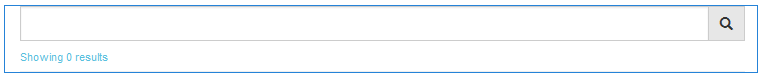

# Fonction de recherche {#search-feature}

La fonction de recherche fonctionne avec d’autres fonctions, comme les forums, et permet de rechercher du contenu.

Lors de l’ajout de la possibilité de rechercher des publications faites par des membres de la communauté (le contenu généré par l’utilisateur), il existe deux composants : [Rechercher](#search) et [Résultats de la recherche](#search-results).

The page that includes the `Search Results` component supports both searching and the display of results.

The page that includes the `Search` component provides a place to launch a search with results appearing on the `Search Results` page.

La fonction de recherche peut être utilisée avec n’importe quelle autre fonction permettant aux visiteurs et aux membres du site d’afficher du contenu.

## Recherche {#search-features}

### Ajout du composant Rechercher à une page {#add-search-to-a-page}

Pour ajouter un `Search` composant à une page en mode création, utilisez l’explorateur de composants pour le localiser `Communities / Search` et le faire glisser vers son emplacement sur une page. L’utilisation de `Search` requiert une deuxième page pour `Search Results.`

For necessary information, visit [Communities Components Basics](basics.md).

When the required client-side library, `cq.social.hbs.search`, is included, this is how the `Search` component will appear.

### Configuration du composant Rechercher {#configure-the-added-search}

Select the placed `Search` component to access and select the `Configure` icon which opens the edit dialog.

Under the **[!UICONTROL Search Settings]** tab, specify how what paths are are search when a query is entered by a visitor.

* **[!UICONTROL Chemins de recherche]** Lorsque vous ajoutez des chemins de recherche à l’aide du bouton Ajouter un élément, la recherche de contenu est limitée. Par exemple, pour limiter la recherche à un forum spécifique, sélectionnez un composant de forum placé dans une page :

   * `/content/community-components/en/forum/jcr:content/content/forum`

* **[!UICONTROL Page]** de résultats Les résultats apparaîtront sur une page distincte spécifiée à l’aide du navigateur pour sélectionner une page contenant la variable 
`Search Results` component.

## Résultats de la recherche {#search-results}

### Ajout du composant Résultats de la recherche à une page {#add-search-results-to-a-page}

To add a `Search Results` component to a page in author mode, use the component browser to locate

* `Communities / Search Results`

et faites-le glisser sur la page. Contrairement au composant Rechercher, la deuxième page n’est pas nécessaire, car les résultats s’affichent sur la même page.

If using Search elsewhere within the website, this one page with `Search Results` may be configured to be the `Result Page` for any or all instances of `Search`.

For necessary information, visit [Communities Components Basics](basics.md).

When the required client-side library, `cq.social.hbs.search`, is included, this is how the `Search Result` component will appear:

### Configuration du composant Résultats de la recherche ajouté {#configure-the-added-search-result}

Select the placed `Search Results` component to access and select the `Configure` icon which opens the edit dialog.

Under the **[!UICONTROL Search Result Settings]** tab, it is possible to specify what paths are included in the search when a query is entered by a visitor.

* **[!UICONTROL Résultats de la recherche par page]**

   Définissez le nombre de rubriques/publications affichées par page. La valeur par défaut est 10.

* **[!UICONTROL Chemins de recherche]**

   En ajoutant des chemins de recherche à l&#39;aide du bouton Ajouter un élément, la recherche de contenu est limitée.

## Informations supplémentaires {#additional-information}

More information may be found on the [Search Essentials](search-implementation.md) page for developers.
