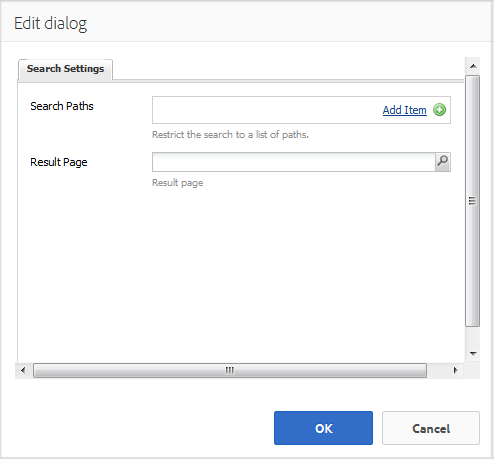
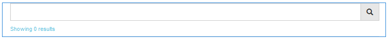
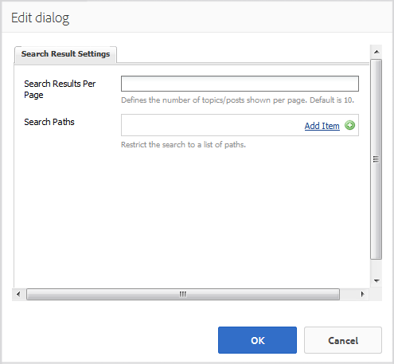

# Fonctionnalité de recherche {#search-feature}

La fonction de recherche fonctionne avec d’autres fonctionnalités, telles que les forums, pour permettre de rechercher du contenu.

Lors de l’ajout de la possibilité de rechercher des publications saisies par les membres de la communauté, en tant que contenu créé par l’utilisateur (UGC), il existe deux composants : [Recherche](#search) et [Résultats de la recherche](#search-results).

La page qui comprend le composant `Search Results` prend en charge la recherche et l’affichage des résultats.

La page qui comprend le composant `Search` permet de lancer une recherche avec les résultats affichés sur la page `Search Results`.

La fonction de recherche peut être utilisée avec toute autre fonction qui permet aux visiteurs et aux membres du site d’afficher le contenu.

## Recherche {#search-features}

### Ajout de la recherche à une page {#add-search-to-a-page}

Pour ajouter un composant de `Search` à une page en mode création, utilisez l’explorateur de composants pour le localiser et `Communities / Search` faire glisser sur une page. L’utilisation de `Search` nécessite une deuxième page pour le `Search Results.`

Pour plus d’informations, consultez [Principes de base des composants de communautés](basics.md).

Lorsque la bibliothèque côté client requise, `cq.social.hbs.search`, est incluse, le composant `Search` s’affiche de cette manière.

### Configuration de la recherche ajoutée {#configure-the-added-search}

Sélectionnez le composant de `Search` placé auquel accéder, puis sélectionnez l’icône `Configure` qui ouvre la boîte de dialogue de modification.

Sous l’onglet **[!UICONTROL Paramètres de recherche]**, indiquez comment les chemins d’accès sont recherchés lorsqu’une requête est saisie par un visiteur.

* **[!UICONTROL Chemins de recherche]**
En ajoutant des chemins de recherche à l’aide du bouton Ajouter un élément , la recherche de contenu est limitée. Par exemple, pour limiter la recherche à un forum spécifique, sélectionnez un composant de forum placé dans une page :

  * `/content/community-components/en/forum/jcr:content/content/forum`

* Page **[!UICONTROL Résultat]**
Les résultats s’affichent sur une page distincte spécifiée à l’aide du navigateur pour sélectionner une page contenant le composant `Search Results`.

## Résultats de la recherche {#search-results}

### Ajout de résultats de recherche à une page {#add-search-results-to-a-page}

Pour ajouter un composant `Search Results` à une page en mode création, utilisez l’explorateur de composants pour localiser .

* `Communities / Search Results`

et faites-la glisser jusqu’à ce qu’elle se trouve sur une page. Contrairement au composant Rechercher , aucune deuxième page n’est nécessaire, car les résultats s’affichent sur la même page.

Si vous utilisez Rechercher ailleurs sur le site web, cette page contenant des `Search Results` peut être configurée pour être la `Result Page` de toutes les instances de `Search` ou d’une partie d’entre elles.

Pour plus d’informations, consultez [Principes de base des composants de communautés](basics.md).

Lorsque la bibliothèque côté client requise, `cq.social.hbs.search`, est incluse, le composant `Search Result` s’affiche de la manière suivante :

### Configuration du résultat de recherche ajouté {#configure-the-added-search-result}

Sélectionnez le composant de `Search Results` placé auquel accéder, puis sélectionnez l’icône `Configure` qui ouvre la boîte de dialogue de modification.

Sous l’onglet **[!UICONTROL Paramètres des résultats de recherche]**, il est possible de spécifier les chemins d’accès inclus dans la recherche lorsqu’une requête est saisie par un visiteur.

* **[!UICONTROL Résultats De Recherche Par Page]**

  Définissez le nombre de rubriques/publications affichées par page. La valeur par défaut est 10.

* **[!UICONTROL Chemins de recherche]**

  En ajoutant des chemins de recherche à l’aide du bouton Ajouter un élément , la recherche de contenu est limitée.

## Informations supplémentaires {#additional-information}

Pour plus d’informations, consultez la page [Search Essentials](search-implementation.md) destinée aux développeurs et développeuses.
