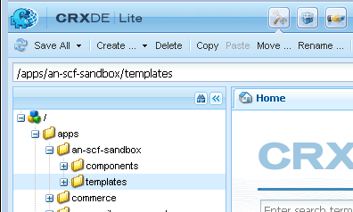

# Configuration de la structure du site Web {#setup-website-structure}

Pour configurer votre site Web, les instructions ci-dessous décrivent les dossiers à créer aux emplacements suivants :

* `/apps/an-scf-sandbox`

   C’est là que résident les applications et modèles personnalisés.

* `/etc/designs/an-scf-sandbox`

   C’est là que résident les éléments de conception téléchargeables.

* `/content/an-scf-sandbox`

   C&#39;est là que résident les pages Web téléchargeables.

Le code de ce didacticiel s’appuiera sur le nom du dossier principal pour l’application, la conception et le contenu. Si vous choisissez un autre nom pour votre site Web, remplacez toujours `an-scf-sandbox` par le nom que vous avez choisi.

>[!NOTE]
>
>A propos des noms :
>
>* Les noms affichés dans CRXDE sont des noms de noeud qui forment le chemin d’accès au contenu adressable.
>* Les noms de noeud peuvent contenir des espaces, mais lorsqu&#39;ils sont utilisés dans un URI, l&#39;espace doit être codé en &quot;%20&quot; ou &quot;+&quot;.
>* Les noms de noeud peuvent contenir des tirets et des traits de soulignement, mais ils doivent être codés lorsqu’ils sont référencés comme nom de package dans un fichier Java. Les tirets et les traits de soulignement sont placés en séquence d’échappement avec un trait de soulignement suivi de leur valeur Unicode :
   >
   >   
   * trait d’union devient &quot;_002d&quot;
   >   * trait de soulignement devient &quot;_005f&quot;

## Configuration du répertoire des applications (/applications) {#setup-the-application-directory-apps}

Le répertoire /apps du référentiel contient le code qui implémente le comportement et le rendu des pages servies à partir du répertoire /content.

Le répertoire /apps est protégé et n’est pas accessible au public, tout comme les répertoires /content et /etc/designs.

1. Create `/apps/an-scf-sandbox` folder.

   Utilisation de **[!UICONTROL CRXDE Lite]**, dans le volet d’exploration

   1. Select the `/apps` folder.
   1. Cliquez avec le bouton droit de la souris sur **[!UICONTROL Créer]**... ou descendre la **[!UICONTROL fenêtre Créer...]** .
   1. Sélectionner **[!UICONTROL Créer un dossier...]**.
   1. Dans la boîte de dialogue **[!UICONTROL Créer un dossier]** , saisissez `an-scf-sandbox`.
   1. Cliquez sur **[!UICONTROL OK]**.

1. Créez **[!UICONTROL un sous-dossier de composants]** .

   1. Select the `/apps/an-scf-sandbox` folder.
   1. Click **[!UICONTROL Create > Create Folder]**.
   1. Dans la boîte de dialogue **[!UICONTROL Créer un dossier]** , saisissez **[!UICONTROL des composants]**.
   1. Cliquez sur **[!UICONTROL OK]**.

1. Créez **[!UICONTROL un sous-dossier de modèles]** .

   1. Select the `/apps/an-scf-sandbox` folder.
   1. Click **[!UICONTROL Create > Create Folder]**.
   1. Dans la boîte de dialogue **[!UICONTROL Créer un dossier]** , saisissez **[!UICONTROL des modèles]**.
   1. Cliquez sur **[!UICONTROL OK]**.
   1. Sélectionnez à nouveau `/apps/an-scf-sandbox`.
   1. Select **[!UICONTROL Save All]**.
   Comme pour tout processus de modification, enregistrez souvent. Si vous rencontrez des problèmes lors de la saisie des données, c’est peut-être parce que votre connexion a expiré ou que vous devez enregistrer les modifications précédentes.

1. La structure du volet d’exploration de CRXDE Lite doit maintenant ressembler à quelque chose comme ceci :

   

## Configuration du répertoire de conception (/etc/designs) {#setup-the-design-directory-etc-designs}

Le répertoire /etc/designs contient les images, les scripts et les feuilles de style à télécharger avec le contenu de la page.

1. Pour utiliser l’outil Designer dans l’interface utilisateur classique, accédez à [https://&lt;serveur>:&lt;port>/miscadmin](http://localhost:4502/miscadmin).

   Remarque : Si vous utilisez CRXDE Lite pour créer un noeud de type `cq:Page`, le et la réplication ne seront pas définis sur les paramètres par défaut pour une page.

1. In the explorer pane, select the **[!UICONTROL Designs]** folder and then click **[!UICONTROL New]** > **[!UICONTROL New Page]**.

   Entrer :

   * Titre : **[!UICONTROL Un Sandbox SCF]**
   * Nom : **[!UICONTROL an-scf-sandbox]**
   * Sélectionner un modèle de page de **[!UICONTROL conception]**
   Cliquez sur **[!UICONTROL Créer]**.

   

1. Actualisez le volet d’exploration si le dossier &quot;An SCF Sandbox&quot; n’apparaît pas.

1. Revenez à CRXDE Lite (http:// localhost:4502/crx/de) et développez /etc/designs pour voir le noeud nommé &quot;an-scf-sandbox&quot;.

   Dans le volet inférieur droit de CRXDE, vous pouvez  l’onglet Propriétés, l’onglet  du et l’onglet Réplication pour voir ce qui a été défini à l’aide du modèle de page de conception.

   

## Configuration du répertoire de contenu (/content) {#setup-the-content-directory-content}

Le répertoire /content du référentiel est l’emplacement où réside le contenu du site Web. Les chemins sous /content comprennent les chemins d’accès de l’URL pour les requêtes de navigateur.

*Une fois* le modèle [de](initial-app.md#createthepagetemplate) page créé dans le cadre de l’application initiale, le contenu initial de la page peut être créé en fonction du modèle.... [**⇒**](initial-app.md)
