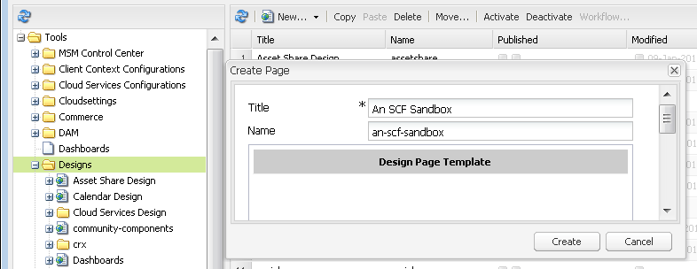

# Configuration de la structure de site web {#setup-website-structure}

Pour configurer votre site web, les instructions ci-dessous décrivent les dossiers à créer aux emplacements suivants :

* `/apps/an-scf-sandbox`

  C’est là que résident les applications et modèles personnalisés.

* `/etc/designs/an-scf-sandbox`

  C’est là que résident les éléments de conception téléchargeables.

* `/content/an-scf-sandbox`

  C’est là que se trouvent les pages web téléchargeables.

Le code de ce tutoriel repose sur le fait que le nom du dossier principal est le même pour l’application, la conception et le contenu. Si vous choisissez un autre nom pour votre site web, remplacez toujours `an-scf-sandbox` par le nom que vous avez choisi.

>[!NOTE]
>
>À propos des noms :
>
>* Les noms affichés dans CRXDE sont des noms de noeud qui forment le chemin d’accès au contenu adressable.
>* Les noms de noeud peuvent contenir des espaces, mais lorsqu’ils sont utilisés dans un URI, l’espace doit être encodé en &#39;%20&#39; ou &#39;+&#39;.
>* Les noms de noeud peuvent contenir des tirets et des traits de soulignement, mais ils doivent être codés lorsqu’ils sont référencés sous la forme d’un nom de module dans un fichier Java™. Les tirets et les traits de soulignement sont précédés d’un trait de soulignement suivi de leur valeur Unicode :
>
>   * Le trait d’union devient &quot;_002d&quot;
>   * trait de soulignement devient &#39;_005f&#39;

## Configuration du répertoire des applications (/apps) {#setup-the-application-directory-apps}

Le répertoire /apps du référentiel contient le code avec implémente le comportement et le rendu des pages diffusées à partir du répertoire /content .

Le répertoire /apps est protégé et n’est pas accessible publiquement, tout comme les répertoires /content et /etc/designs.

1. Créer `/apps/an-scf-sandbox` dossier.

   Utilisation **[!UICONTROL CRXDE Lite]**, dans le volet d’exploration

   1. Sélectionnez la variable `/apps` dossier.
   1. Clic droit **[!UICONTROL Créer]**... ou retirez le **[!UICONTROL Créer...]** .
   1. Sélectionner **[!UICONTROL Créer un dossier...]**.
   1. Dans le **[!UICONTROL Créer un dossier]** boîte de dialogue, entrée `an-scf-sandbox`.
   1. Cliquez sur **[!UICONTROL OK]**.

1. Créer **[!UICONTROL components]** sous-dossier .

   1. Sélectionnez la variable `/apps/an-scf-sandbox` dossier.
   1. Cliquez sur **[!UICONTROL Créer > Créer un dossier]**.
   1. Dans le **[!UICONTROL Créer un dossier]** boîte de dialogue, entrée **[!UICONTROL components]**.
   1. Cliquez sur **[!UICONTROL OK]**.

1. Créer **[!UICONTROL templates]** sous-dossier .

   1. Sélectionnez la variable `/apps/an-scf-sandbox` dossier.
   1. Cliquez sur **[!UICONTROL Créer > Créer un dossier]**.
   1. Dans le **[!UICONTROL Créer un dossier]** boîte de dialogue, entrée **[!UICONTROL templates]**.
   1. Cliquez sur **[!UICONTROL OK]**.
   1. Resélectionner `/apps/an-scf-sandbox`.
   1. Sélectionnez **[!UICONTROL Enregistrer tout]**.

   Comme pour tout processus de modification, vous devez enregistrer souvent. Si vous rencontrez des problèmes lors de la saisie de données, c’est peut-être parce que votre connexion a expiré ou que vous devez enregistrer les modifications précédentes.

1. La structure du volet d’exploration du CRXDE Lite doit maintenant ressembler à celle-ci :

   

## Configuration du répertoire de conception (/etc/designs) {#setup-the-design-directory-etc-designs}

Le répertoire /etc/designs contient les images, les scripts et les feuilles de style à télécharger avec le contenu de la page.

1. Pour utiliser l’outil Designer dans l’interface utilisateur classique, accédez à [https://&lt;server>:&lt;port>/miscadmin](http://localhost:4502/miscadmin).

   Remarque : Si vous utilisez CRXDE Lite pour créer un noeud de type `cq:Page`, le contrôle d’accès et la réplication ne sont pas définis sur les paramètres par défaut d’une page.

1. Dans le volet de l’explorateur, sélectionnez la variable **[!UICONTROL Conceptions]** puis cliquez sur **[!UICONTROL Nouveau]** > **[!UICONTROL Nouvelle page]**.

   Enter :

   * Titre : **[!UICONTROL Un environnement de test SCF]**
   * Nom : **[!UICONTROL an-scf-sandbox]**
   * Sélectionner **[!UICONTROL Modèle de page de conception]**

   Cliquez sur **[!UICONTROL Créer]**.

   

1. Actualisez le volet d’exploration si le dossier &quot;An SCF Sandbox&quot; n’apparaît pas.

1. Revenez au CRXDE Lite (http:// localhost:4502/crx/de) et développez /etc/designs pour voir le noeud nommé &quot;an-scf-sandbox&quot;.

   Dans le volet inférieur droit de CRXDE, vous pouvez afficher les onglets Propriétés, Contrôle d’accès et Réplication pour voir ce qui a été défini à l’aide du modèle de page de conception.

   

## Configuration du répertoire de contenu (/content) {#setup-the-content-directory-content}

Le répertoire /content du référentiel est l’emplacement où réside le contenu du site web. Les chemins sous /content comprennent les chemins d’accès de l’URL pour les requêtes de navigateur.

*Après* la valeur [modèle de page](initial-app.md#createthepagetemplate) est créé dans le cadre de l’application initiale, le contenu initial de la page peut être créé à partir du modèle.... [**⇒**](initial-app.md)
