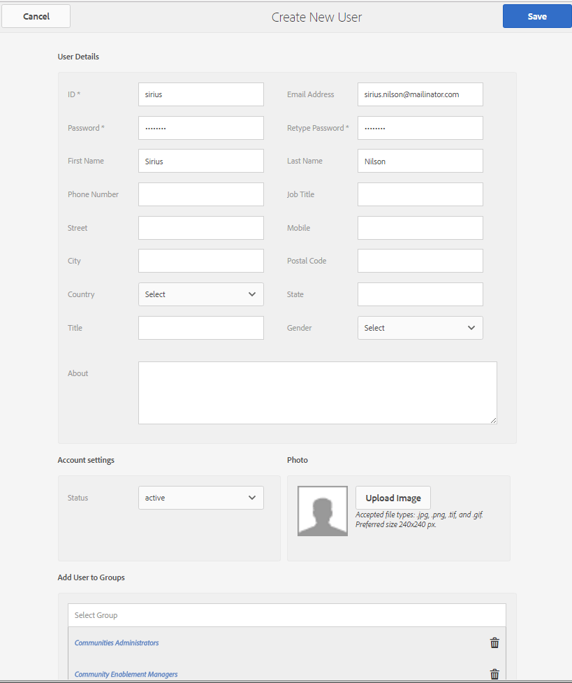
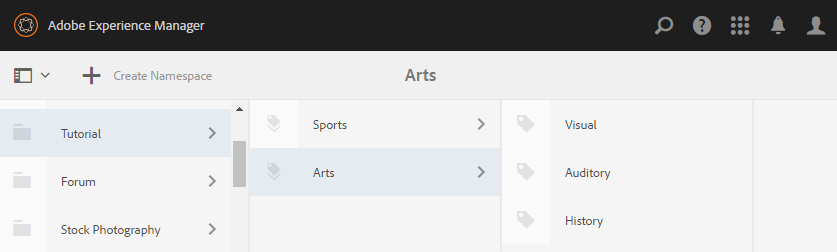

# Configuration initiale {#initial-setup}

## Démarrer les instances d’auteur et de publication {#start-author-and-publish-instances}

À des fins de développement et de démonstration, il est nécessaire d’exécuter une instance de création et une instance de publication.

Pour ce faire, suivez les instructions de base de Adobe Experience Manager (AEM) [Prise en main](../../help/sites-deploying/deploy.md#getting-started), qui génèrent les résultats suivants :

* Environnement de création sur [localhost:4502](http://localhost:4502/).
* Environnement de publication sur [localhost:4503](http://localhost:4503/)

Pour AEM Communities :

* L’environnement de création est destiné aux éléments suivants :

   * Développement de sites, de modèles et de composants
   * Tâches administratives et de configuration.

* L’environnement de publication est destiné aux éléments suivants :

   * Expérience de la communauté consistant à publier et à modérer du contenu.
   * Créer des groupes communautaires, des membres et des groupes de membres.

>[!NOTE]
>
>Si vous ne connaissez pas AEM, consultez la documentation sur [la gestion de base](../../help/sites-authoring/basic-handling.md) et un [guide rapide sur la création de pages](../../help/sites-authoring/qg-page-authoring.md).

## Installer la dernière version de Communities {#install-latest-communities-release}

Ce tutoriel crée un [site de la communauté d’engagement](overview.md#engagement-community) et est basé sur le pack de fonctionnalités AEM Communities 6.2 version 1.10.

Pour vous assurer que le dernier pack de fonctionnalités est installé, rendez-vous sur :

* [Dernières versions](deploy-communities.md#latest-releases)

## Configurer Analytics {#configure-analytics}

Lorsque [Adobe Analytics est configuré pour le site de la communauté](analytics.md) des informations sur l’activité de la communauté sont disponibles, ce qui améliore l’expérience du membre de la communauté et fournit des commentaires aux administrateurs du site.

L’intégration à Adobe Analytics est facultative.

## Configuration des e-mails pour les notifications {#configure-email-for-notifications}

La fonctionnalité de notifications, disponible par défaut pour tous les sites créés à l’aide de la console `Communities Sites`, fournit un canal e-mail pour les notifications.

Il est nécessaire que l’e-mail soit correctement configuré pour le site.

Voir [Configuration des e-mails](email.md).

## Activation du service Tunnel {#enable-the-tunnel-service}

Lors de la création d’un site communautaire dans l’environnement de création, le service de tunnel permet d’affecter des rôles aux membres de la communauté de confiance enregistrés dans l’environnement de publication. Le service de tunnel permet également d’accéder aux membres de la communauté à partir des consoles [Membres et groupes](members.md) dans l’environnement de création.

La convention stipule que les membres et les groupes de membres créés dans l’environnement de publication ne doivent *pas* être recréés dans l’environnement de création. Pour plus d’informations, voir [Gestion des utilisateurs et des groupes d’utilisateurs](users.md).

Pour obtenir des instructions simples sur l’activation du service de tunnel sur une instance **Auteur**, voir [Service de tunnel](deploy-communities.md#tunnel-service-on-author).

## Rôle d’administrateur de la communauté {#community-administrator-role}

Les membres du groupe Administrateurs de la communauté peuvent créer des sites de communauté, gérer des sites, gérer des membres (ils peuvent interdire des membres de la communauté) et modérer du contenu.

### Créer un utilisateur {#create-user}

Créez un utilisateur ou une utilisatrice sur *auteur*, qui se voit attribuer le rôle d’administrateur de la communauté :

* Sur l’instance d’auteur

   * Par exemple, [:4502/](http://localhost:4503/)

* Se connecter avec des droits d’administrateur

   * Par exemple, le nom d’utilisateur « admin » / mot de passe « admin »

* Dans la console principale, accédez à **[!UICONTROL Outils]** > **[!UICONTROL Opérations]** > **[!UICONTROL Sécurité]** > **[!UICONTROL Utilisateurs]**.
* Dans le menu **Modifier**, sélectionnez **[!UICONTROL Ajouter un utilisateur]**

* Dans la boîte de dialogue `Create New User`, saisissez :

   * **[!UICONTROL ID]** : sirius
   * **[!UICONTROL Adresse e-mail]** : sirius.nilson@mailinator.com
   * **[!UICONTROL Mot de passe]** : password
   * **[!UICONTROL Confirm Password&amp;ast;]** : mot de passe
   * **[!UICONTROL Prénom]** : Sirius
   * **[!UICONTROL Nom]** : Nilson

### Affectation de Sirius au groupe d’administrateurs de la communauté {#assign-sirius-to-community-administrators-group}

Faites défiler jusqu’à `Add User to Groups` :

* Saisir « C » pour effectuer la recherche

   * Sélectionnez `Community Administrators`.
   * Sélectionnez `Community Enablement Managers`.

* Sélectionnez **[!UICONTROL Enregistrer]**.

## Activer la connexion au réseau social {#enable-social-login}

Avant de pouvoir utiliser les versions de démonstration de la connexion sociale avec Facebook et Twitter, il est nécessaire de :

1. Installez un pack de correctifs ou [dernier pack de fonctionnalités](deploy-communities.md#latestfeaturepack) (pour les modifications d’API Facebook de mars 2017).
1. [Activez le fournisseur OAuth](social-login.md#adobe-granite-oauth-authentication-handler) dans l’environnement de publication.

Pour les serveurs de production, il est nécessaire de créer les services cloud nécessaires pour fournir une connexion au réseau social.

Voir [Connexion sociale avec Facebook et Twitter](social-login.md).

## Créer des balises de tutoriel {#create-tutorial-tags}

Créez des balises afin de les utiliser pour les tutoriels d’engagement, à l’aide de l’espace de noms de balise de `Tutorial`.

Utilisez la [console Balisage](../../help/sites-administering/tags.md#tagging-console) pour créer les balises suivantes :

* `Tutorial: Sports / Baseball`
* `Tutorial: Sports / Gymnastics`
* `Tutorial: Sports / Skiing`
* `Tutorial: Arts / Visual`
* `Tutorial: Arts / Auditory`
* `Tutorial: Arts / History`

Suivez ensuite les instructions suivantes :

1. [Définissez les autorisations de balise](../../help/sites-administering/tags.md#setting-tag-permissions).
1. [Publiez les balises](../../help/sites-administering/tags.md#publishing-tags).

Exemple de package de balises créé pour les tutoriels de prise en main d’AEM Communities

[Obtenir le fichier](assets/tutorial_tags-v63.zip)

## MongoDB pour le magasin commun du contenu créé par l’utilisateur {#mongodb-for-ugc-common-store}

Il est recommandé, mais facultatif, de définir [MSRP](msrp.md) (MongoDB) comme [magasin commun](working-with-srp.md) pour bénéficier de la flexibilité de modération de tout le contenu créé par l’utilisateur des environnements de publication et/ou de création.

Pour obtenir des instructions, consultez [Comment configurer MongoDB pour la démonstration](demo-mongo.md).

Par défaut, l’installation des instances AEM de création et de publication entraîne le stockage du contenu créé par l’utilisateur dans le [stockage Tar JCR](../../help/sites-deploying/platform.md) accessible à l’aide de [JSRP](jsrp.md). JSRP n’est pas un magasin commun, ce qui signifie que le contenu créé par l’utilisateur n’est visible que sur l’instance sur laquelle il a été saisi. En règle générale, le contenu créé par l’utilisateur est saisi sur une instance de publication et n’est pas visible dans l’environnement de création, ce qui entraîne la nécessité d’utiliser l’instance de publication pour toutes les tâches de modération.
