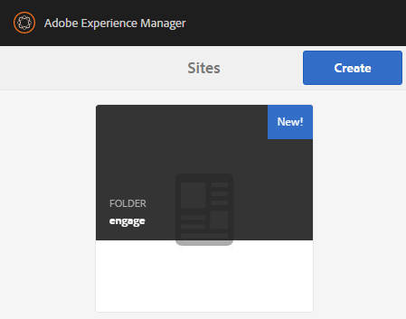

# Console Sites Communities {#communities-sites-console}

La console Sites de Communities permet d’accéder aux éléments suivants :

* Création de site
* Modification du site
* Gestion de site
* [Création et modification de groupes imbriqués](/help/communities/groups.md)  (sous-communautés)

Voir [Prise en main d’AEM Communities](/help/communities/getting-started.md) pour savoir à quelle vitesse un site communautaire peut être créé dans l’environnement de création, ainsi que comment créer des groupes communautaires à partir des environnements de création et de publication.

>[!NOTE]
>
>Les principaux menus Communautés pour la création de [sites de communauté](/help/communities/sites-console.md), [modèles de site de communauté](/help/communities/sites.md), [modèles de groupe de communauté](/help/communities/tools-groups.md) et [fonctions de communauté](/help/communities/functions.md) ne sont utilisables que dans l’environnement de création.

## Prérequis {#prerequisites}

Avant de créer un site communautaire, il est *requis* pour :

* Vérifiez qu’une ou plusieurs instances de publication sont en cours d’exécution.
* Activez le [service tunnel](/help/communities/deploy-communities.md#tunnel-service-on-author) pour gérer les membres et les groupes de membres.
* Identifiez l’[Principal éditeur](/help/communities/deploy-communities.md#primary-publisher).
* [Configurez la ](/help/communities/deploy-communities.md#replication-agents-on-author) réplication lorsque le port Principal de l’éditeur n’est pas le port par défaut (4503).

Pour vous assurer que le site est prêt à prendre en charge de nombreuses fonctionnalités, la bonne pratique consiste à procéder comme suit :

* Installez le [dernier Feature Pack](/help/communities/deploy-communities.md#latestfeaturepack).
* Activez [Adobe Analytics](/help/communities/analytics.md) pour AEM Communities.
* Configurer [email](/help/communities/email.md)
* Identifiez [Administrateurs de la communauté](/help/communities/users.md#creating-community-members).
* [Activez le gestionnaire OAuth ](/help/communities/social-login.md#adobe-granite-oauth-authentication-handler) pour la connexion sociale.

## Accès à la console Sites des communautés {#accessing-communities-sites-console}

Dans l’environnement de création, pour accéder à la console Sites des communautés :

* À partir de la navigation globale : **[!UICONTROL Communautés]** > **[!UICONTROL Sites]**

La console Sites de communautés affiche tous les sites de communautés existants. Dans cette console, les sites de communauté peuvent être créés, modifiés, gérés et supprimés.

Pour créer un site de communauté, cliquez sur l’icône **Créer** .

Pour accéder à un site de communauté existant, afin de créer, modifier, publier, exporter ou ajouter un groupe imbriqué, sélectionnez l’icône de dossier du site.

Par exemple, l’image suivante montre la console Sites des communautés principale affichant les dossiers de deux sites de communauté : [activer](/help/communities/getting-started-enablement.md) et [engager](/help/communities/getting-started.md) :

## Création du site {#site-creation}

La console de création de site fournit une approche détaillée pour assembler les fonctionnalités du site en fonction d’un [modèle de site communautaire](/help/communities/sites.md) et de paramètres sélectionnés.

Chaque site créé comprend une fonction de connexion, car les visiteurs du site doivent se connecter avant de pouvoir publier du contenu, envoyer des messages ou participer à un groupe. Les autres fonctionnalités incluses sont les profils utilisateur, la messagerie, les notifications, le menu du site, la recherche, le thème et l’identité graphique.

Le processus est lancé en sélectionnant le bouton `Create` situé en haut de la console Sites des communautés .

Le processus de création est une série d’étapes présentées sous la forme de panneaux contenant un ensemble de fonctionnalités à configurer (présentées sous la forme de sous-panneaux). Il est possible de passer à l’étape **Suivant** ou **Précédent** à l’étape précédente avant de valider le site à l’étape finale.

### Étape 1 : Modèle de site {#step-site-template}

Dans le panneau Modèle de site, le titre, la description, la racine du site, la langue de base, le nom et le modèle de site sont spécifiés :

* **Titre du site de la communauté**

   Titre affiché du site.

   Le titre s’affiche sur le site publié, ainsi que dans l’interface utilisateur d’administration du site.

* **Description du site de la communauté**

   Description du site.

   La description n’apparaît pas sur le site publié.

* **Racine du site de la communauté**

   Chemin d’accès racine au site.

   La racine par défaut est `/content/sites`, mais elle peut être déplacée à n’importe quel emplacement du site web.

* **Langue de base du site de la communauté**

   (Laissez intacte pour une seule langue : Anglais) Utilisez le menu déroulant pour choisir une ou plusieurs *langues de base* à partir des langues disponibles : allemand, italien, français, japonais, espagnol, portugais (Brésil), chinois (traditionnel) et chinois (simplifié). Un site communautaire sera créé pour chaque langue ajoutée et existera dans le même dossier de site, conformément aux bonnes pratiques décrites dans la section [Traduction de contenu pour les sites multilingues](/help/sites-administering/translation.md). La page racine de chaque site contiendra une page enfant nommée par le code de langue de l’une des langues sélectionnées, comme &quot;en&quot; pour l’anglais ou &quot;fr&quot; pour le français.

* **Nom du site de la communauté**:

   Nom de la page racine du site qui apparaît dans l’URL.

   * Vérifiez deux fois le nom, car il n’est pas facilement modifié une fois le site créé.
   * L’URL de base ( `https://server:port/site root/site name)`) s’affiche sous `Community Site Name`.

   * Pour une URL valide, ajoutez un code de langue de base + &quot;.html&quot;

      *Par exemple*, `https://localhost:4502/content/sites/mysight/en.html`

* **Modèle** de site communautaire

   Utilisez le menu déroulant pour choisir un [modèle de site communautaire](/help/communities/tools.md) disponible.

* Sélectionnez **Suivant**.

### Étape 2 : Conception {#step-design}

Le panneau Conception contient 2 sous-panneaux pour sélectionner le thème et la bannière de marque :

#### THÈME DU SITE COMMUNAUTAIRE {#community-site-theme}

La structure utilise [Twitter Bootstrap](https://twitterbootstrap.org/) pour apporter une conception réactive et flexible au site. Un des nombreux thèmes de Bootstrap préchargés peut être sélectionné pour mettre en forme le modèle de site de communauté sélectionné ou un thème de Bootstrap peut être chargé.

Lorsqu’il est sélectionné, le thème est recouvert d’une coche bleue opaque.

Une fois le site de la communauté publié, il est possible de [modifier les propriétés](#modifying-site-properties) et sélectionner un autre thème.

#### MARQUE DU SITE COMMUNAUTAIRE {#community-site-branding}

La valorisation de marque du site de la communauté est une image affichée en tant qu’en-tête dans la partie supérieure de chaque page.

L’image doit être dimensionnée de manière à être aussi large que l’affichage prévu de la page dans le navigateur et de 120 pixels de hauteur.

Lors de la création ou de la sélection d’une image, gardez à l’esprit les points suivants :

* La hauteur de l’image sera recadrée à 120 pixels mesurés à partir du bord supérieur de l’image.
* L’image est épinglée sur le bord gauche de la fenêtre du navigateur.
* L’image n’est pas redimensionnée, de sorte que lorsque la largeur de l’image est...

   * Moins que la largeur du navigateur, l’image se répète horizontalement.
   * Plus grande que la largeur du navigateur, l’image semble recadrée.

* Sélectionnez **Suivant**.

### Étape 3 : Paramètres {#step-settings}

Le panneau Paramètres contient plusieurs sous-panneaux présentant les fonctionnalités à configurer avant de passer à la dernière étape pour créer le site.

* [GESTION DES UTILISATEURS](#user-management)
* [Balisage](#tagging)
* [RÔLES](#roles)
* [MODÉRATION](#moderation)
* [ANALYTICS](#analytics)
* [TRADUCTION](#translation)
* [ACTIVATION](#enablement)

>[!NOTE]
>
>**Activer le service de tunnel**
>
>Plusieurs sous-panneaux Paramètres permettent d’affecter un membre de confiance pour modérer le contenu créé par l’utilisateur, gérer des groupes ou être un contact pour les ressources d’activation dans l’environnement de publication.
>
>La convention est que les [utilisateurs et les groupes d’utilisateurs ](/help/communities/users.md) (membres et groupes de membres) côté publication ne soient pas dupliqués dans l’environnement de création.
>
>Ainsi, lors de la création du site de la communauté dans l’environnement de création et de l’affectation de membres approuvés à différents rôles, il est nécessaire de récupérer les données de membres de l’environnement de publication.
>
>Pour ce faire, activez ` [AEM Communities Publish Tunnel Service](/help/communities/deploy-communities.md#tunnel-service-on-author)` pour l’environnement de création.

#### GESTION DES UTILISATEURS {#user-management}

>[!NOTE]
>
>Il est recommandé que les [sites de communauté d’activation](/help/communities/overview.md#enablement-community) soient privés (contactez votre gestionnaire de compte pour plus d’informations).
>
>Un site communautaire est privé lorsque les visiteurs anonymes du site se voient refuser l’accès, qu’ils ne s’enregistrent pas eux-mêmes et qu’ils ne peuvent pas utiliser la connexion sociale.

* **Autoriser l&#39;enregistrement d&#39;utilisateur**

   Si cette case est cochée, les visiteurs du site peuvent devenir membres de la communauté en s’inscrivant automatiquement.
Si cette option n’est pas cochée, le site de la communauté est *limité* et les visiteurs du site doivent être affectés au groupe des membres du site de la communauté, faire une demande ou recevoir une invitation par courrier électronique. Si cette option n’est pas cochée, l’accès anonyme ne doit pas être autorisé.
Désélectionnez un site de la communauté *private*. Cette option est cochée par défaut.

* **Autoriser l&#39;accès anonyme**

   Si cette case est cochée, le site de la communauté est *ouvert* et tout visiteur du site peut y accéder.
Si cette option n’est pas cochée, seuls les membres connectés peuvent accéder au site.
Désélectionnez un site de communauté *privé*. Cette option est cochée par défaut.

* **Autoriser les messages**

   Si cette case est cochée, les membres peuvent envoyer des messages les uns aux autres et au groupe sur le site de la communauté.
Si cette option n’est pas cochée, la messagerie n’est pas configurée pour la communauté.
Cette option n’est pas cochée par défaut.

* **Autoriser les connexions sociales : Facebook**

   Si cette case est cochée, les visiteurs du site peuvent se connecter à l’aide des informations d’identification de leur compte Facebook. La [configuration cloud Facebook](/help/communities/social-login.md#create-a-facebook-connect-cloud-service) sélectionnée doit être configurée pour ajouter des utilisateurs au groupe de membres du site de la communauté une fois le site de la communauté créé.
Si cette option n’est pas cochée, aucune connexion Facebook n’est présentée.
Laissez désélectionné le site d’une communauté *private*. Cette option n’est pas cochée par défaut.

* **Autoriser les connexions sociales : Twitter**

   Si cette case est cochée, les visiteurs du site peuvent se connecter à l’aide des informations d’identification de leur compte Twitter. La [configuration cloud Twitter](/help/communities/social-login.md#create-a-twitter-connect-cloud-service) sélectionnée doit être configurée pour ajouter des utilisateurs au groupe de membres du site de la communauté une fois le site de la communauté créé.
Si cette option n’est pas cochée, aucune connexion Twitter n’est présentée.
Laissez désélectionné le site d’une communauté *private*. Cette option n’est pas cochée par défaut.

>[!NOTE]
>
>**Autorisation des connexions aux réseaux sociaux**
>
>Bien que des exemples de configurations Facebook et Twitter puissent exister et être sélectionnables, pour un [environnement de production](/help/sites-administering/production-ready.md), il est nécessaire de créer des applications Facebook et Twitter personnalisées. Voir [Connexion sociale avec Facebook et Twitter](/help/communities/social-login.md).

#### Balisage {#tagging}

Les balises qui peuvent être appliquées au contenu de la communauté sont contrôlées en sélectionnant Espaces de noms de balise précédemment définis via la [Console de balisage](/help/sites-administering/tags.md#tagging-console).

En outre, la sélection des espaces de noms de balise pour le site de la communauté limite la sélection présentée lors de la définition des catalogues et des ressources. Voir [Balisage des ressources d’activation](/help/communities/tag-resources.md) pour obtenir des informations importantes.

* zone de recherche de texte : Commencez à saisir pour identifier les balises pouvant être utilisées sur le site.

#### RÔLES {#roles}

Les [rôles des membres de la communauté](/help/communities/users.md) sont attribués avec ces paramètres.

Il est facile de trouver des membres de la communauté à l’aide d’une recherche anticipée.

* **Gestionnaires de la communauté**

   Commencez à taper pour sélectionner un ou plusieurs membres de la communauté ou groupes de membres pouvant gérer les membres de la communauté et les groupes de membres.

* **Modérateurs de la communauté**

   Commencez à saisir le texte pour sélectionner un ou plusieurs membres de la communauté ou groupes de membres à approuver en tant que modérateurs du contenu généré par l’utilisateur.

* **Membres privilégiés de la communauté**

   Commencez à saisir le texte pour sélectionner un ou plusieurs membres de la communauté ou groupes de membres à qui il sera possible de créer du contenu lorsque `Allow Privileged Member` a été sélectionné pour une [fonction de la communauté](/help/communities/functions.md).

* **Administrateurs de la communauté**

   Commencez à saisir pour sélectionner un ou plusieurs administrateurs du site qui peuvent gérer la structure du site indépendamment des autres administrateurs du site et de l’administrateur de la communauté par défaut. Ils peuvent créer un groupe à n’importe quel niveau de la hiérarchie et devenir l’administrateur par défaut des groupes imbriqués (mais ils peuvent ensuite être supprimés du rôle d’administrateur des groupes imbriqués).

#### MODÉRATION {#moderation}

Le paramètre global de modération du contenu généré par l’utilisateur est contrôlé par ces paramètres. Les composants individuels disposent de paramètres supplémentaires pour contrôler la modération.

* **Le contenu est prémodéré**

   Si cette case est cochée, le contenu de la communauté publié n’apparaîtra pas tant qu’il n’aura pas été approuvé par un modérateur. Cette option n’est pas cochée par défaut. Pour plus d’informations, voir [Modération du contenu de la communauté](/help/communities/moderate-ugc.md#premoderation).

* **Seuil de marquage avant que le contenu ne soit masqué**

   Si la valeur est supérieure à 0, le nombre de fois où une rubrique ou une publication doit être marquée avant d’être masquée dans la vue publique. S’il est défini sur -1, le sujet ou la publication marqué n’est jamais masqué à la vue du public. La valeur par défaut est 5.

#### ANALYTICS {#analytics}

* **Enable Analytics (Activer Adobe Analytics)**

   Disponible uniquement lorsque Adobe Analytics a été [configuré](/help/communities/analytics.md) pour les fonctionnalités Communities.
Cette option n’est pas cochée par défaut. Lorsque cette case est cochée, un menu de sélection supplémentaire s’affiche :

* **Référence de la structure de configuration du cloud**

   Dans le menu déroulant, sélectionnez la structure de service cloud Analytics configurée pour ce site de communauté.
   `Communities` est l’exemple de structure de la documentation Configuration d’ [Analytics pour les ](/help/communities/analytics.md#aem-analytics-framework-configuration) fonctionnalités de communautés .

#### TRADUCTION {#translation}

* **Activer la traduction automatique**

   Lorsque cette option est cochée (la valeur par défaut est décochée), la traduction automatique est activée pour le contenu généré par l’utilisateur dans le site. Cela n’affecte aucun autre contenu, tel que le contenu de la page, même si le site est configuré en tant que site multilingue. Voir [Traduction de contenu généré par l’utilisateur](/help/communities/translate-ugc.md) pour plus d’informations sur la configuration d’un service de traduction sous licence pour AEM Communities. Voir [Traduction de contenu pour des sites multilingues](/help/sites-administering/translation.md) pour une présentation complète.

* **Activer la traduction automatique pour les langues sélectionnées**

   Par défaut, les langues activées pour la traduction automatique correspondent au paramètre système spécifié par la [configuration de l’intégration de traduction](/help/communities/translate-ugc.md#translation-integration-configuration). Ces paramètres par défaut peuvent être remplacés pour ce site en supprimant les paramètres par défaut et/ou en sélectionnant d’autres langues dans le menu déroulant.

* **Sélectionner le fournisseur de traduction**

   Par défaut, le fournisseur de services est un service d’évaluation utilisant `microsoft` à des fins de démonstration uniquement. Si aucun fournisseur de services de traduction n’est sous licence, la case **Autoriser la traduction automatique** doit être décochée.

* **Sélectionner le magasin partagé global**

   Pour un site web comportant plusieurs copies de langue, un magasin partagé global fournit un seul fil de conversation, visible à partir de chaque copie de langue. Pour ce faire, sélectionnez l’une des langues incluses comme copie de langue. La valeur par défaut est *No Global Shared Store*.

* **Sélectionner la configuration du fournisseur de traduction**

   Choisissez une [structure d’intégration de traduction](/help/sites-administering/tc-tic.md) créée pour le fournisseur de traduction sous licence.

* **Sélectionner les options de traduction pour votre site de la communauté**

   * **Traduire la page entière**

      Si cette option est sélectionnée, tout le contenu généré par l’utilisateur d’une page est traduit dans la langue de base de la page.

      La valeur par défaut est *non sélectionnée*.

   * **Traduire la sélection uniquement**

      Si cette option est sélectionnée, une option de traduction s’affiche en regard de chaque publication, ce qui permet de traduire des publications individuelles dans la langue de base de la page.
La valeur par défaut est *sélectionnée*.

* **Sélectionner les options de rémanence**

   * **Traduire les contributions sur demande de l’utilisateur et les conserver**
par la suite. Si cette option est sélectionnée, le contenu n’est pas traduit tant qu’une requête n’a pas été effectuée. Une fois traduite, la traduction est stockée dans le référentiel.

      La valeur par défaut est *non sélectionnée*.

   * **Ne pas conserver les traductions**

      Si cette option est sélectionnée, les traductions ne sont pas stockées dans le référentiel.

      Si cette option n’est pas sélectionnée, les traductions sont conservées.

      La valeur par défaut est *non sélectionnée*.

* **Rendu dynamique**

   Sélectionnez l’une des options suivantes :

   * `Always show contributions in the original language` (default)
   * `Always show contributions in user preferred language`
   * `Show contributions in user preferred language for only logged-in users`

#### ACTIVATION {#enablement}

Les paramètres `ENABLEMENT`s’appliquent lorsque le modèle de site de communauté choisi inclut la fonction [Affectations](/help/communities/functions.md#assignments-function), disponible lorsque les fonctionnalités d’activation sont sous licence et [configurées](/help/communities/enablement.md). Le modèle de site de référence qui inclut la fonction Affectations est `Reference Structured Learning Site Template.`

* **Gestionnaires d’activation**
 (Obligatoire) Seuls les membres du  `Community Enablementmanagers` groupe peuvent être sélectionnés pour gérer cette communauté d’activation. Les gestionnaires d’activation sont chargés d’affecter des membres aux ressources. Voir aussi [Gestion des utilisateurs et des groupes d’utilisateurs](/help/communities/users.md).

* **ID d’entreprise Marketing Cloud**

   (Facultatif) Identifiant d’une licence [Video Heartbeat Analytics](/help/communities/analytics.md#video-heartbeat-analytics).

* Sélectionnez **Suivant**.

### Étape 4 : Créer un site Communities {#step-create-communities-site}

Si des ajustements sont nécessaires, utilisez le bouton **Précédent** pour les effectuer.

Une fois **Create** sélectionné et démarré, le processus de création du site ne peut pas être interrompu.

Une fois le site créé :

* La modification de l’URL (nom du noeud) n’est pas prise en charge.
* Les futures modifications apportées au modèle de site communautaire n’auront aucune incidence sur le site communautaire créé.
* La désactivation du modèle de site de communauté n’affecte pas le site de communauté créé.
* Il est possible de modifier la [STRUCTURE](#modify-structure) d’un site communautaire en modifiant ses propriétés.

Une fois le processus terminé, le dossier du nouveau site s’affiche dans la console Sites des communautés , à partir de laquelle les auteurs peuvent ajouter du contenu de page ou les administrateurs peuvent modifier les propriétés du site.

Pour modifier un site de communauté, sélectionnez son dossier de projet pour l’ouvrir :

Lorsque vous pointez sur un site avec la souris ou que vous touchez une carte, des icônes s’affichent pour vous permettre [de modifier le site en mode création](#authoring-site-content), [d’ouvrir les propriétés du site pour modification](#modifying-site-properties), [de publier le site](#publishing-the-site), [d’exporter le site](#exporting-the-site) et [de supprimer .](#deleting-the-site)

## Création de contenu du site {#authoring-site-content}

Le contenu d’un site peut être créé avec les mêmes outils que tout autre site web AEM. Pour ouvrir le site à des fins de création, sélectionnez l’icône `Open Site` qui s’affiche lorsque vous pointez sur le site avec la souris. Le site s’ouvre dans un nouvel onglet afin que la console Sites des communautés reste accessible.

>[!NOTE]
>
>Si vous ne connaissez pas l’AEM, consultez la documentation sur la [gestion de base](/help/sites-authoring/basic-handling.md) et un [guide rapide pour créer des pages](/help/sites-authoring/qg-page-authoring.md).

## Modification des propriétés du site {#modifying-site-properties}

Les propriétés d’un site existant, spécifiées pendant le processus de création du site, peuvent être modifiées en sélectionnant l’icône `Edit Site`qui s’affiche lorsque vous pointez sur le site avec la souris.

`Details of the following properties match the descriptions provided in the` [Section ](#site-creation) Création du site .

### Modifier de base {#modify-basic}

Le panneau BASIC permet de modifier les éléments suivants :

* Titre du site de la communauté
* Description du site de la communauté

Le nom du site de la communauté ne peut pas être modifié.

Le choix d’un modèle de site de communauté différent n’aurait aucun impact sur un site de communauté existant, car il n’existe aucune connexion entre les modèles et les sites.

Au lieu de cela, la [STRUCTURE](#modify-structure) du site de la communauté peut être modifiée.

### Modifier la structure {#modify-structure}

Le panneau STRUCTURE permet de modifier la structure initialement créée à partir du modèle de site de communauté sélectionné. Dans le panneau , vous pouvez effectuer les opérations suivantes :

* Glissez-déposez des [fonctions de communauté](/help/communities/functions.md) supplémentaires dans la structure du site.
* Sur une instance d’une fonction de communauté dans la structure du site :

   * **`gear icon`**

      Modifiez les paramètres, notamment le titre d’affichage et le nom de l’URL*, ainsi que les [groupes de membres privilégiés](/help/communities/users.md#privilegedmembersgroups).

   * **`trashcan icon`**

      Supprimer (supprimer) des fonctions de la structure du site.

   * **`grid icon`**

      Modifiez l’ordre des fonctions tel qu’affiché dans la barre de navigation de niveau supérieur du site.

>[!NOTE]
>
>Vous pouvez modifier l’ordre de toutes les fonctions de la structure du site, à l’exception de la fonction située en haut. Par conséquent, la page d’accueil du site des communautés ne peut pas être modifiée.

>[!CAUTION]
>
>* Bien que le titre d’affichage puisse être modifié sans effets secondaires, il n’est pas recommandé de modifier le nom d’URL d’une fonction de communauté appartenant à un site de communauté.
>
>
Par exemple, renommer l’URL ne déplace pas le contenu créé par l’utilisateur existant, ce qui a pour effet de &quot;perdre&quot; le contenu créé par l’utilisateur.

>[!CAUTION]
>
>La fonction groups doit *ne pas* être la *première ou la seule fonction* dans la structure du site.
>
>Toute autre fonction, telle que la [fonction de page](/help/communities/functions.md#page-function), doit être incluse et répertoriée en premier.

#### Exemple : Ajout d’une fonction de catalogue à une structure de site de communauté {#example-adding-a-catalog-function-to-a-community-site-structure}

### Modifier la conception {#modify-design}

Le panneau CONCEPTION permet d’appliquer un nouveau thème :

* [Thème des sites de la communauté](#community-site-theme)
* [Valorisation de marque des sites de la communauté](#community-site-branding)

   * Faites défiler l’écran jusqu’au bas du panneau pour modifier l’image de marque.

### Modifier les paramètres {#modify-settings}

Le panneau PARAMÈTRES permet d’accéder à la plupart des paramètres sous les sous-panneaux de l’ Étape 3 de la création d’un site de communauté :

* [Gestion des utilisateurs](#user-management)
* [Balises](#tagging)
* [Modération](#moderation)
* [Rôles des membres](#roles)
* [Analyses](#analytics)
* [Traduction](#translation)

### Modifier la miniature {#modify-thumbnail}

Le panneau MINIATURE permet de charger une image représentant le site dans la console Sites des communautés .

### Modifier l’activation {#modify-enablement}

Le panneau ACTIVATION permet d’accéder aux paramètres fournis lors de la création du site de la communauté.

Voir la description [ENABLEMENT](#enablement) .

## Publication du site {#publishing-the-site}

Une fois qu’un site communautaire a été créé ou modifié, il est possible de le publier (d’activer) en sélectionnant l’icône `Publish Site` qui s’affiche lorsque vous pointez sur le site.

Une indication s’affiche une fois le site publié.

### Publication avec des groupes imbriqués {#publishing-with-nested-groups}

Après la publication d’un site de communauté, il est nécessaire de publier individuellement chaque sous-communauté (groupe imbriqué) créée à l’aide de la [console Groupes](/help/communities/groups.md).

## Exportation du site {#exporting-the-site}

Sélectionnez l’icône d’exportation, lorsque vous placez le pointeur de la souris sur le site, pour créer un module du site de la communauté qui est stocké dans [gestionnaire de modules](/help/sites-administering/package-manager.md) et téléchargé.

Notez que le contenu généré par l’utilisateur n’est pas inclus dans le module du site.

## Suppression du site {#deleting-the-site}

Pour supprimer le site de la communauté, cliquez sur l’icône Supprimer le site qui s’affiche lorsque vous placez le pointeur de la souris sur le site dans la console du site Communities. Cette action supprime tous les éléments associés au site, tels que le contenu créé par l’utilisateur, les groupes d’utilisateurs, les ressources et les enregistrements de base de données.

## Groupes d’utilisateurs de la communauté créés {#created-community-user-groups}

Une fois le nouveau site de la communauté publié, les nouveaux groupes de membres (groupes d’utilisateurs créés dans l’environnement de publication) disposent des autorisations appropriées pour différents rôles d’administrateur et de membre.

Le nom créé pour les groupes de membres inclut le *nom-site* donné au site dans [Étape 1](#step13asitetemplate) (nom qui apparaît dans l’URL) ainsi qu’un identifiant unique afin d’éviter tout conflit avec les sites et groupes de communautés ayant le même nom-site pour différentes racines de site de communauté.

Par exemple, si le nom était &quot;engagement&quot; pour un site intitulé &quot;Tutoriel de prise en main&quot;, le groupe d’utilisateurs pour les modérateurs serait :

* title: Modérateurs d’engagement de la communauté
* name: community-*engage-uid*-modérateurs

Notez que tous les membres affectés comme modérateurs ou administrateurs de groupe lors de la création du site seront affectés au groupe approprié et affectés au groupe de membres. Ces groupes et affectations de membres sont créés lors de la publication lorsque le nouveau site est publié.

Pour plus d’informations, voir [Gestion des utilisateurs et des groupes d’utilisateurs](/help/communities/users.md).

>[!NOTE]
>
>Si [Autoriser la connexion au réseau social : Facebook](#user-management) est activé une fois le groupe d’utilisateurs
>
>* `community-<site-name>-<uid>-members`
>
>
est créé, le [service cloud Facebook](/help/communities/social-login.md#createafacebookcloudservice) appliqué doit être configuré pour ajouter des utilisateurs à ce groupe.

## Configurer pour l’erreur d’authentification {#configure-for-authentication-error}

Par défaut, un site de la communauté redirige vers un exemple de page de connexion lorsque l’utilisateur saisit des informations d’identification erronées et ne parvient pas à se connecter. Cet exemple de connexion ne sera pas présent sur un [serveur de production](/help/sites-administering/production-ready.md).

Pour rediriger correctement, une fois qu’un site a été configuré et envoyé pour publication, procédez comme suit pour obtenir l’échec d’authentification à rediriger vers le site de la communauté :

* Sur chaque instance de publication AEM.
* Connectez-vous avec les privilèges d’administrateur.
* Accédez à la [console web](/help/sites-deploying/configuring-osgi.md).

   * Par exemple, [https://localhost:4503/system/console/configMgr](https://localhost:4503/system/console/configMgr).

* Recherchez `Adobe Granite Login Selector Authentication Handler`.
* Sélectionnez l’icône `pencil` pour ouvrir la configuration à modifier.
* Saisissez un **mappages de page de connexion** comme suit :

   `/content/sites/<site-name>/path/to/login/page:/content/sites/<site-name>`

   Par exemple :
   `/content/sites/engage/en/signin:/content/sites/engage/en`

* Sélectionnez **Enregistrer**.

### Tester la redirection d’authentification {#test-authentication-redirection}

Sur la même instance de publication AEM configurée avec un mappage de page de connexion pour le site de la communauté :

* Accédez à la page d’accueil du site de la communauté.

   * Par exemple, [https://localhost:4503/content/sites/engage/en.html](https://localhost:4503/content/sites/engage/en.html)

* Sélectionnez Déconnexion.
* Sélectionnez Connexion.
* Saisissez des informations d’identification manifestement incorrectes, telles que le nom d’utilisateur &quot;x&quot; et le mot de passe &quot;x&quot;.
* La page de connexion doit s’afficher avec une erreur &quot;login non valide&quot;.

## Accès aux sites de la communauté à partir de la console Sites principale {#accessing-community-sites-from-main-sites-console}

Dans la console Sites de navigation globale, les sites de communauté se trouvent dans le dossier `Community Sites` .

Bien qu’il soit possible d’accéder à un site communautaire de cette manière, pour les tâches administratives, le site de la communauté doit être accessible à partir de la console Sites des communautés .

