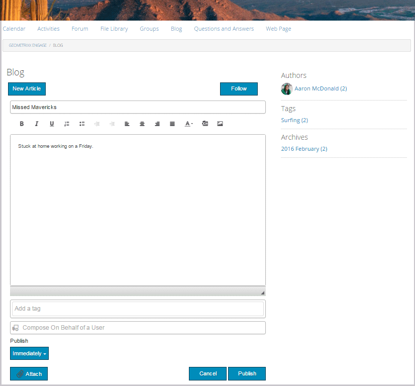
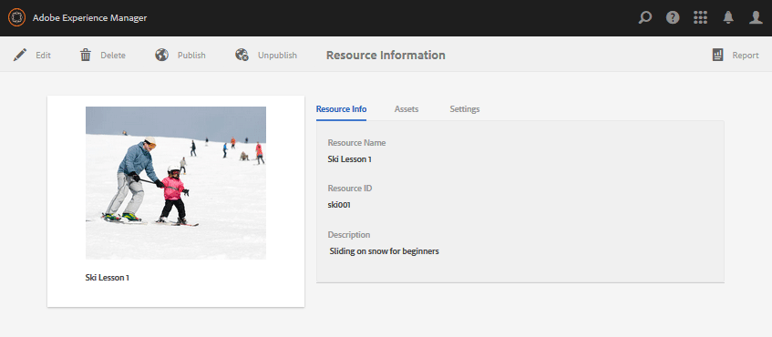

# Console Sites de communautés {#communities-sites-console}

La console Sites des communautés donne accès à :

* Création de site
* Modification du site
* Gestion de site
* [Création et modification de groupes](/help/communities/groups.md) imbriqués (sous-communautés)

Reportez-vous à la page [Prise en main des communautés](/help/communities/getting-started.md) AEM pour découvrir à quelle vitesse un site communautaire peut être créé dans l’auteur  , ainsi que comment créer des groupes communautaires à partir de l’auteur et publier le  de publication.

>[!NOTE]
>
>Les principaux menus Collectivités pour la création de sites communautaires, de modèles [de sites](/help/communities/sites.md)communautaires, de modèles [de groupes](/help/communities/tools-groups.md) communautaires et de fonctions de [communauté ne sont utilisés que dans le  de l&#39;auteur.](/help/communities/functions.md)

## Conditions préalables {#prerequisites}

Avant de créer un site communautaire, vous *devez* :

* Vérifiez qu’une ou plusieurs instances de publication sont en cours d’exécution.
* Activez le service  tunnel pour gérer les membres et les groupes de membres.
* Identifiez l’éditeur principal.
* [Configurez la réplication](/help/communities/deploy-communities.md#replication-agents-on-author) lorsque le port d’éditeur principal n’est pas le port par défaut (4503).

Pour vous assurer que le site est prêt à prendre en charge de nombreuses fonctionnalités, il est recommandé de procéder comme suit :

* Installez le [dernier Feature Pack](/help/communities/deploy-communities.md#latestfeaturepack).
* Activez [Adobe Analytics](/help/communities/analytics.md) pour les communautés AEM.
* Configurer le [courrier électronique](/help/communities/email.md)
* Identifiez Les Administrateurs [De](/help/communities/users.md#creating-community-members)La Communauté.
* [Activez le gestionnaire](/help/communities/social-login.md#adobe-granite-oauth-authentication-handler) OAuth pour la connexion sociale.

## Accès à la console Sites de communautés {#accessing-communities-sites-console}

Dans le  de l&#39;auteur , pour accéder à la console Sites des communautés :

* A partir de la navigation globale : **[!UICONTROL Communautés]** > **[!UICONTROL Sites]**

La console Sites des communautés affiche tous les sites communautaires existants. A partir de cette console, les sites de la communauté peuvent être créés, modifiés, gérés et supprimés.

Pour créer un site communautaire, sélectionnez l’icône **Créer** .

Pour accéder à un site communautaire existant, sélectionnez l’icône de dossier du site afin de créer, modifier, publier, exporter ou ajouter un groupe imbriqué.

Par exemple, l’image suivante montre la console Sites des communautés principale affichant les dossiers de deux sites de la communauté : [activer](/help/communities/getting-started-enablement.md) et [engager](/help/communities/getting-started.md):

## Création de site {#site-creation}

La console de création de site fournit une approche pas à pas pour assembler les fonctionnalités du site en fonction d’un modèle [et de paramètres de site](/help/communities/sites.md) communautaire sélectionnés.

Chaque site créé comprend une fonction de connexion, car les du site doivent se connecter avant de pouvoir publier du contenu, envoyer des messages ou participer à un groupe. Les autres fonctionnalités incluses sont les  utilisateur, la messagerie, les notifications, le menu du site, la recherche, le thème et l’identité graphique.

Le processus est lancé en sélectionnant le `Create` bouton situé en haut de la console Sites des communautés.

Le processus de création est une série d’étapes présentées sous forme de panneaux contenant un ensemble de fonctionnalités à configurer (présentées sous forme de sous-panneaux). Il est possible de passer à l’étape **suivante** ou **de revenir** à l’étape précédente avant de valider le site dans l’étape finale.

### Étape 1 : Modèle de site {#step-site-template}

Dans le panneau Modèle de site, le titre, la description, la racine du site, la langue de base, le nom et le modèle de site sont spécifiés :

* **Titre du site de la communauté**

   Titre d’affichage du site.

   Le titre s’affiche sur le site publié ainsi que dans l’interface utilisateur d’administration du site.

* **Description du site de la communauté**

   Description du site.

   La description n’apparaît pas sur le site publié.

* **Racine du site de la communauté**

   Chemin d’accès racine au site.

   La racine par défaut est `/content/sites`, mais elle peut être déplacée à n’importe quel emplacement du site Web.

* **Langue de base du site de la communauté**

   (Ne rien modifier pour une seule langue : Anglais) Utilisez le menu déroulant pour choisir une *ou plusieurs* langues de base parmi les langues disponibles : allemand, italien, français, japonais, espagnol, portugais (Brésil), chinois (traditionnel) et chinois (simplifié). Un site communautaire sera créé pour chaque langue ajoutée et existera dans le même dossier de site, conformément aux bonnes pratiques décrites dans la section [Traduction de contenu pour les sites](/help/sites-administering/translation.md)multilingues. La page racine de chaque site contiendra une page enfant nommée par le code de langue de l&#39;une des langues sélectionnées, comme &quot;en&quot; pour l&#39;anglais ou &quot;fr&quot; pour le français.

* **Nom du site de la communauté**:

   Nom de la page racine du site qui apparaît dans l’URL.

   * -vérifiez le nom car il n&#39;est pas facilement modifié une fois le site créé.
   * L’URL de base ( `https://server:port/site root/site name)` s’affichera sous le `Community Site Name`.

   * Pour une URL valide, ajoutez un code de langue de base + &quot;.html&quot;

      *Par exemple*, `https://localhost:4502/content/sites/mysight/en.html`

* **Menu Modèle** de site de la communauté

   Utilisez le menu déroulant pour choisir un modèle [de site](/help/communities/tools.md)communautaire disponible.

* Sélectionnez **Suivant**.

### Étape 2 : Conception {#step-design}

Le panneau Conception contient deux sous-panneaux permettant de sélectionner le thème et la bannière de marque :

#### COMMUNITY SITE THEME {#community-site-theme}

La structure utilise [Twitter Bootstrap](https://twitterbootstrap.org/) pour apporter une conception adaptée et flexible au site. L&#39;un des nombreux d&#39;amorçage préchargés peut être sélectionné pour mettre en forme le modèle de site de la communauté sélectionnée, ou un thème d&#39;amorçage peut être téléchargé.

Une fois sélectionné, le thème sera superposé avec une coche bleue opaque.

Une fois le site de la communauté publié, il est possible de [modifier les propriétés](#modifying-site-properties) et de sélectionner un autre thème.

#### COMMUNITY SITE BRANDING {#community-site-branding}

L’image de marque du site de la communauté est une image affichée sous forme d’en-tête dans la partie supérieure de chaque page.

L’image doit être dimensionnée de manière à être aussi large que l’affichage prévu de la page dans le navigateur et à 120 pixels de hauteur.

Lors de la création ou de la sélection d’une image, gardez à l’esprit :

* La hauteur de l’image sera rognée à 120 pixels, mesurée à partir du bord supérieur de l’image.
* L’image est épinglée sur le bord gauche de la fenêtre du navigateur.
* L’image n’est pas redimensionnée, de telle sorte que lorsque la largeur de l’image est...

   * Moins que la largeur du navigateur, l’image se répète horizontalement.
   * Plus grande que la largeur du navigateur, l’image semble recadrée.

* Sélectionnez **Suivant**.

### Étape 3 : Paramètres {#step-settings}

Le panneau Paramètres contient plusieurs sous-panneaux présentant les fonctionnalités à configurer avant de passer à la dernière étape de création du site.

* [GESTION DES UTILISATEURS](#user-management)
* [BALISAGE](#tagging)
* [RÔLES](#roles)
* [MODÉRATION](#moderation)
* [ANALYTICS](#analytics)
* [TRADUCTION](#translation)
* [ACTIVER](#enablement)

>[!NOTE]
>
>**Activer le service de tunnel**
>
>Plusieurs des sous-panneaux Paramètres permettent d’affecter un membre de confiance pour modérer l’UGC, gérer des groupes ou être des contacts pour les ressources d’activation dans le  de publication .
>
>La convention prévoit que [les utilisateurs et les groupes](/help/communities/users.md) d’utilisateurs côté publication (membres et groupes de membres) ne doivent pas être dupliqués dans le  de l’auteur .
>
>Ainsi, lors de la création du site de la communauté dans l’auteur   les membres de confiance et de l’affectation de membres de confiance à divers rôles, il est nécessaire de récupérer les données des membres à partir du  de publication.
>
>Pour ce faire, activez le ` [AEM Communities Publish Tunnel Service](/help/communities/deploy-communities.md#tunnel-service-on-author)` pour l’auteur  .

#### USER MANAGEMENT {#user-management}

>[!NOTE]
>
>Il est recommandé que les sites [de la communauté d’](/help/communities/overview.md#enablement-community) activation soient privés (pour plus d’informations, contactez votre gestionnaire de compte).
>
>Un site communautaire est privé lorsque des anonymes du site se voient refuser l’accès, peuvent ne pas s’enregistrer eux-mêmes et ne pas utiliser la connexion sociale.

* **Autoriser l&#39;enregistrement d&#39;utilisateur**

   Si cette option est cochée, les du site peuvent devenir membres de la communauté par auto-inscription.
Si cette option n’est pas cochée, le site communautaire est *restreint* et les du site doivent être affectés au groupe des membres du site, faire une demande ou être envoyés par courrier électronique. Si cette option est désactivée, l’accès anonyme ne doit pas être autorisé.
Désélectionnez un site *communautaire privé* . Cette option est cochée par défaut.

* **Autoriser l&#39;accès anonyme**

   Si cette option est cochée, le site communautaire est *ouvert *et tout du site peut y accéder.
Si cette option est désactivée, seuls les membres connectés peuvent accéder au site.
Désélectionnez un site *privé *communautaire. Cette option est cochée par défaut.

* **Autoriser les messages**

   Si cette option est cochée, les membres peuvent envoyer des messages entre eux et au groupe sur le site communautaire.
Si cette option est désactivée, la messagerie n’est pas configurée pour la communauté.
Cette option n’est pas cochée par défaut.

* **Autoriser les connexions sociales : Facebook**

   Si cette option est cochée, autorisez les du site à se connecter avec leurs identifiants de compte Facebook. La configuration [de cloud](/help/communities/social-login.md#create-a-facebook-connect-cloud-service) Facebook sélectionnée doit être configurée pour ajouter des utilisateurs au groupe de membres du site de la communauté une fois le site de la communauté créé.
Si cette option est désactivée, aucune connexion Facebook n’est présentée.
Ne vérifiez pas la présence d’un site communautaire *privé* . Cette option n’est pas cochée par défaut.

* **Autoriser les connexions sociales : Twitter**

   Si cette option est cochée, autorisez les du site à se connecter à l’aide de leurs identifiants de compte Twitter. La configuration [de cloud](/help/communities/social-login.md#create-a-twitter-connect-cloud-service) Twitter sélectionnée doit être configurée pour ajouter des utilisateurs au groupe de membres du site de la communauté une fois le site de la communauté créé.
Si cette option est désactivée, aucune connexion Twitter n’est présentée.
Ne vérifiez pas la présence d’un site communautaire *privé* . Cette option n’est pas cochée par défaut.

>[!NOTE]
>
>**Autorisation des connexions aux réseaux sociaux**
>
>Bien qu’il puisse exister des exemples de configurations Facebook et Twitter et qu’il soit possible de les sélectionner, pour une [production ](/help/sites-administering/production-ready.md), il est nécessaire de créer des applications Facebook et Twitter personnalisées. Voir Connexion [aux réseaux sociaux avec Facebook et Twitter](/help/communities/social-login.md).

#### TAGGING {#tagging}

Les balises qui peuvent être appliquées au contenu de la communauté sont contrôlées en sélectionnant Balise  défini précédemment dans la console [de](/help/sites-administering/tags.md#tagging-console)balisage.

En outre, la sélection des balises   pour le site de la communauté limite la sélection présentée lors de la définition des catalogues et des ressources. Voir Ressources [d’activation du](/help/communities/tag-resources.md) balisage pour obtenir des informations importantes.

* zone de recherche de texte :  de saisie pour identifier les balises autorisées sur le site.

#### ROLES {#roles}

Les [rôles des membres](/help/communities/users.md) de la communauté sont assignés avec ces paramètres.

Il est facile de trouver des membres de la communauté en effectuant une recherche par type.

* **Gestionnaires de la communauté**

    de saisie pour sélectionner un ou plusieurs membres de la communauté ou groupes de membres qui peuvent gérer les membres de la communauté et les groupes de membres.

* **Modérateurs de la communauté**

   de saisie pour sélectionner un ou plusieurs membres de la communauté ou groupes de membres à approuver en tant que modérateurs du contenu généré par l’utilisateur.

* **Membres privilégiés de la communauté**

    de saisie pour sélectionner un ou plusieurs membres de la communauté ou groupes de membres afin de pouvoir créer du contenu lorsqu’une fonction `Allow Privileged Member` communautaire a été sélectionnée.

* **Administrateurs de la communauté**

    de saisie pour sélectionner un ou plusieurs administrateurs du site qui peuvent gérer la structure du site indépendamment des autres administrateurs du site et de l’administrateur de la communauté par défaut. Ils peuvent créer un groupe à n’importe quel niveau de la hiérarchie et devenir l’administrateur par défaut des groupes imbriqués (mais ils peuvent ensuite être supprimés du rôle d’administrateur des groupes imbriqués).

#### MODERATION {#moderation}

Le paramètre global de modération du contenu généré par l’utilisateur (UGC) est contrôlé par ces paramètres. Les composants individuels disposent de paramètres supplémentaires pour contrôler la modération.

* **Le contenu est prémodéré**

   Si cette option est cochée, le contenu de la communauté publié n’apparaîtra pas avant d’être approuvé par un modérateur. Cette option n’est pas cochée par défaut. For more information, see [Moderating Community Content](/help/communities/moderate-ugc.md#premoderation).

* **Seuil de marquage avant que le contenu ne soit masqué**

   Si la valeur est supérieure à 0, le nombre de fois où une rubrique ou une publication doit être marquée avant d’être masquée du  public. Si elle est définie sur -1, la rubrique ou la publication balisée n’est jamais masquée du  public. La valeur par défaut est 5.

#### ANALYTICS {#analytics}

* **Enable Analytics (Activer Adobe Analytics)**

   Disponible uniquement lorsque Adobe Analytics a été [configuré](/help/communities/analytics.md) pour les fonctionnalités des communautés.
Cette option n’est pas cochée par défaut. Si cette option est cochée, un menu de sélection supplémentaire s’affiche :

* **Référence de la structure de configuration du cloud**

   Dans le menu déroulant, sélectionnez la structure de service cloud Analytics configurée pour ce site de la communauté.
   `Communities` est l’exemple de structure de la documentation sur la configuration [Analytics pour les fonctionnalités](/help/communities/analytics.md#aem-analytics-framework-configuration) des communautés.

#### TRANSLATION {#translation}

* **Activer la traduction automatique**

   Si cette option est cochée (la valeur par défaut est désactivée), la traduction automatique est activée pour l’UGC dans le site. Cela n’affecte aucun autre contenu, tel que le contenu de la page, même si le site est configuré en tant que site multilingue. Voir [Traduction de contenu](/help/communities/translate-ugc.md) généré par l’utilisateur pour en savoir plus sur la configuration d’un service de traduction sous licence pour les communautés AEM. Voir [Traduction de contenu pour les sites](/help/sites-administering/translation.md) multilingues pour obtenir un aperçu complet.

* **Activer la traduction automatique pour les langues sélectionnées**

   Les langues activées pour la traduction automatique sont par défaut définies dans le paramètre système spécifié par la configuration [de l’intégration de la](/help/communities/translate-ugc.md#translation-integration-configuration)traduction. Ces paramètres par défaut peuvent être remplacés pour ce site en supprimant les valeurs par défaut et/ou en sélectionnant d’autres langues dans le menu déroulant.

* **Sélectionner le fournisseur de traduction**

   Par défaut, le est un service d’évaluation utilisé `microsoft` à des fins de démonstration uniquement. Si aucun de traduction n’est autorisé, **l’option Autoriser la traduction** automatique doit être désactivée.

* **Sélectionner le magasin partagé global**

   Pour un site Web avec plusieurs copies de langue, une boutique partagée globale fournit un seul fil de conversation, visible à partir de chaque copie de langue. Pour ce faire, sélectionnez l&#39;une des langues incluses comme copie de langue. La valeur par défaut est *Pas de magasin* partagé global.

* **Sélectionner la configuration du fournisseur de traduction**

   Choisissez une structure [d’intégration de](/help/sites-administering/tc-tic.md) traduction créée pour le fournisseur de traduction sous licence.

* **Sélectionner les options de traduction pour votre site de la communauté**

   * **Traduire la page entière**

      Si cette option est sélectionnée, tous les UGC d’une page sont traduits dans la langue de base de la page.

      La valeur par défaut *n’est pas sélectionnée*.

   * **Traduire la sélection uniquement**

      Si cette option est sélectionnée, une option de traduction s’affiche en regard de chaque publication, ce qui permet de traduire des publications individuelles dans la langue de base de la page.
Default is *selected*.

* **Sélectionner les options de rémanence**

   * **Traduire les contributions sur demande de l’utilisateur et les conserver ensuite** Si cette option est sélectionnée, le contenu n’est pas traduit tant qu’une requête n’a pas été effectuée. Une fois traduite, la traduction est stockée dans le référentiel.

      La valeur par défaut *n’est pas sélectionnée*.

   * **Ne pas conserver les traductions**

      Si cette option est sélectionnée, les traductions ne sont pas stockées dans le référentiel.

      Si cette option n’est pas sélectionnée, les traductions sont conservées.

      La valeur par défaut *n’est pas sélectionnée*.

* **Rendu dynamique**

   Sélectionnez l’une des options suivantes :

   * `Always show contributions in the original language` (default)
   * `Always show contributions in user preferred language`
   * `Show contributions in user preferred language for only logged-in users`

#### ENABLEMENT {#enablement}

Les `ENABLEMENT`paramètres sont applicables lorsque le modèle de site de la communauté choisie inclut la fonction d’affectation, disponible lorsque les fonctionnalités d’activation sont sous licence et [configurées](/help/communities/enablement.md). Le modèle de site de référence qui inclut la fonction des affectations est `Reference Structured Learning Site Template.`

* **Gestionnaires** d&#39;activation (Obligatoire) Seuls les membres du `Community Enablementmanagers` groupe sont disponibles pour être sélectionnés pour gérer cette communauté d&#39;activation. Les gestionnaires d’activation sont chargés d’affecter des membres aux ressources. Voir aussi [Gestion des utilisateurs et des groupes](/help/communities/users.md)d’utilisateurs.

* **ID d’entreprise Marketing Cloud**

   (Facultatif) ID d’une licence Analytics de pulsation [vidéo](/help/communities/analytics.md#video-heartbeat-analytics) .

* Sélectionnez **Suivant**.

### Étape 4 : Créer un site de communautés {#step-create-communities-site}

Si des ajustements sont nécessaires, utilisez le bouton **Précédent** pour les effectuer.

Une fois **Créer** sélectionné et démarré, le processus de création du site ne peut plus être interrompu.

Une fois le site créé :

* La modification de l’URL (nom du noeud) n’est pas prise en charge.
* Les modifications futures du modèle de site communautaire n’affecteront pas le site communautaire créé.
* La désactivation du modèle de site de la communauté n’affectera pas le site créé.
* Il est possible de modifier la [STRUCTURE](#modify-structure) d&#39;un site communautaire en modifiant ses propriétés.

Une fois le processus terminé, le dossier du nouveau site s’affiche dans la console Sites des communautés, d’où les auteurs peuvent ajouter du contenu de page ou les administrateurs peuvent modifier les propriétés du site.

Pour modifier un site de la communauté, sélectionnez son dossier de projet pour l’ouvrir :

Lorsque vous passez le curseur de la souris sur un site ou touchez une carte du site, des icônes s’affichent pour permettre de [modifier le site en mode](#authoring-site-content)d’auteur, d’ [ouvrir les propriétés du site en vue de les modifier](#modifying-site-properties), de [publier le site](#publishing-the-site), d’ [exporter le site et de supprimer le site.](#exporting-the-site)

## Création de contenu du site {#authoring-site-content}

Le contenu d’un site peut être créé avec les mêmes outils que tout autre site Web AEM. Pour ouvrir le site à des fins de création, sélectionnez l’ `Open Site` icône qui s’affiche lorsque vous survolez le site avec la souris. Le site s&#39;ouvrira dans un nouvel onglet afin que la console Sites des communautés reste accessible.

>[!NOTE]
>
>If not familiar with AEM, view the documentation on [basic handling](/help/sites-authoring/basic-handling.md) and a [quick guide to authoring pages](/help/sites-authoring/qg-page-authoring.md).

## Modification des propriétés du site {#modifying-site-properties}

Les propriétés d&#39;un site existant, spécifiées au cours du processus de création du site, peuvent être modifiées en sélectionnant l&#39; `Edit Site`icône qui s&#39;affiche lorsque vous passez la souris sur le site.

`Details of the following properties match the descriptions provided in the` Section Création  du site.

### Modification de base {#modify-basic}

Le panneau BASIC permet de modifier les éléments suivants :

* Titre du site de la communauté
* Description du site de la communauté

Le nom du site de la communauté ne peut pas être modifié.

Le choix d’un modèle de site communautaire différent n’aurait aucune incidence sur un site communautaire existant, car il n’y a plus de lien entre les modèles et les sites.

La [STRUCTURE](#modify-structure) du site communautaire peut plutôt être modifiée.

### Modifier la structure {#modify-structure}

Le panneau STRUCTURE permet de modifier la structure initialement créée à partir du modèle de site de la communauté sélectionnée. Depuis le panneau, il est possible de :

* Faites glisser d’autres fonctions [de](/help/communities/functions.md) communauté dans la structure du site.
* Sur une instance d’une fonction de communauté dans la structure du site :

   * **`gear icon`**

      Modifiez les paramètres, y compris le titre d’affichage et le nom d’URL*, ainsi que les groupes [de membres](/help/communities/users.md#privilegedmembersgroups)privilégiés.

   * **`trashcan icon`**

      Supprimez (supprimez) des fonctions de la structure du site.

   * **`grid icon`**

      Modifiez l’ordre des fonctions tel qu’il s’affiche dans la barre de navigation de niveau supérieur du site.

>[!NOTE]
>
>Vous pouvez modifier l&#39;ordre de toutes les fonctions de la Structure du site, à l&#39;exception de la fonction en haut. Par conséquent, le  du site des communautés ne peut pas être modifié.

>[!CAUTION]
>
>* Bien que le titre d’affichage puisse être modifié sans effets secondaires, il n’est pas recommandé de modifier le nom d’URL d’une fonction de communauté appartenant à un site de la communauté.
>
>
Par exemple, renommer l’URL ne déplace pas l’UGC existant, avec pour effet de &quot;perdre&quot; l’UGC.

>[!CAUTION]
>
>La fonction de groupes *ne doit pas* être la *première ou la seule* fonction de la structure du site.
>
>Toute autre fonction, telle que la fonction [de](/help/communities/functions.md#page-function)page, doit être incluse et répertoriée en premier.

#### Exemple : Ajout d’une fonction de catalogue à une structure de site communautaire {#example-adding-a-catalog-function-to-a-community-site-structure}

### Modifier la conception {#modify-design}

Le panneau DESIGN permet d’appliquer un nouveau thème :

* [Thème des sites de la communauté](#community-site-theme)
* [Valorisation de marque des sites de la communauté](#community-site-branding)

   * Faites défiler l’écran jusqu’au bas du panneau pour modifier l’image de marque.

### Modifier les paramètres {#modify-settings}

Le panneau PARAMÈTRES permet d’accéder à la plupart des paramètres des sous-panneaux de l’étape 3 de la création d’un site communautaire :

* [Gestion des utilisateurs](#user-management)
* [Balises](#tagging)
* [Modération](#moderation)
* [Rôles des membres](#roles)
* [Analyse](#analytics)
* [Traduction](#translation)

### Modifier la miniature {#modify-thumbnail}

Le panneau MINIATURE permet de télécharger une image pour représenter le site dans la console Sites des communautés.

### Modifier l&#39;activation {#modify-enablement}

Le panneau ENABLEMENT permet d’accéder aux paramètres fournis lors de la création du site communautaire.

Voir la description [ENABLEMENT](#enablement) .

## Publication du site {#publishing-the-site}

Après la création ou la modification d’un site communautaire, il est possible de le publier (activer) en sélectionnant l’ `Publish Site` icône qui apparaît lorsque vous passez la souris sur le site.

Il y aura une indication une fois le site publié.

### Publication avec des groupes imbriqués {#publishing-with-nested-groups}

Après la publication d’un site de la communauté, il est nécessaire de publier individuellement chaque sous-communauté (groupe imbriqué) créée à l’aide de la console Groupes.

## Exportation du site {#exporting-the-site}

Sélectionnez l’icône d’exportation, lorsque vous passez la souris sur le site, pour créer un package du site de la communauté stocké dans le gestionnaire de [packages](/help/sites-administering/package-manager.md) et téléchargé.

Notez que l’UGC n’est pas inclus dans le package du site.

## Suppression du site {#deleting-the-site}

Pour supprimer le site de la communauté, sélectionnez l&#39;icône Supprimer le site qui s&#39;affiche lorsque vous passez la souris sur le site dans la console du site Communautés. Cette action supprime tous les éléments associés au site, tels que l’UGC, les groupes d’utilisateurs, les ressources et les enregistrements de base de données.

## Groupes d’utilisateurs de la communauté créés {#created-community-user-groups}

Une fois le nouveau site de la communauté publié, les nouveaux groupes de membres (les groupes d’utilisateurs sont créés dans le  de publication ) disposent des autorisations appropriées définies pour divers rôles d’administrateur et de membre.

Le nom créé pour les groupes de membres inclut le nom *du* site donné au site à l’ [étape 1](#step13asitetemplate) (le nom qui apparaît dans l’URL) ainsi qu’un identifiant unique afin d’éviter les conflits avec les sites et groupes communautaires ayant le même nom de site pour différentes racines de site de la communauté.

Par exemple, si le nom était &quot;engager&quot; pour un site intitulé &quot;Didacticiel de prise en main&quot;, le groupe d’utilisateurs pour les modérateurs serait :

* title : Modérateurs d’engagement de la communauté
* name : communauté-*engagement-uid*-modérateurs

Notez que tous les membres affectés à des rôles de modérateurs ou d’administrateurs de groupe lors de la création du site seront affectés au groupe approprié ainsi qu’au groupe de membres. Ces groupes et affectations de membres sont créés lors de la publication du nouveau site.

Pour plus d’informations, voir [Gestion des utilisateurs et des groupes](/help/communities/users.md)d’utilisateurs.

>[!NOTE]
>
>Si vous [autorisez la connexion à Social : Facebook](#user-management) est activé, une fois le groupe d’utilisateurs
>
>* `community-<site-name>-<uid>-members`
>
>
est créée, le service [cloud](/help/communities/social-login.md#createafacebookcloudservice) Facebook appliqué doit être configuré pour ajouter des utilisateurs à ce groupe.

## Erreur de configuration pour l’authentification {#configure-for-authentication-error}

Par défaut, un site de la communauté redirige vers un exemple de page de connexion lorsque l’utilisateur saisit des informations d’identification erronées et ne parvient pas à se connecter. Cet exemple de connexion ne sera pas présent sur un serveur [de](/help/sites-administering/production-ready.md)production.

Pour rediriger correctement un site, une fois qu’il a été configuré et poussé vers la publication, procédez comme suit pour obtenir l’échec de l’authentification de la redirection vers le site de la communauté :

* Sur chaque instance de publication AEM.
* Connectez-vous avec des droits d’administrateur.
* Access the [Web Console](/help/sites-deploying/configuring-osgi.md).

   * For example, [https://localhost:4503/system/console/configMgr](https://localhost:4503/system/console/configMgr).

* Localisez `Adobe Granite Login Selector Authentication Handler`.
* Sélectionnez l’ `pencil` icône pour ouvrir la configuration à modifier.
* Entrez les mappages **de page de** connexion comme suit :

   `/content/sites/<site-name>/path/to/login/page:/content/sites/<site-name>`

   Par exemple :
   `/content/sites/engage/en/signin:/content/sites/engage/en`

* Sélectionnez **Enregistrer**.

### Tester la redirection de l&#39;authentification {#test-authentication-redirection}

Sur la même instance de publication AEM configurée avec un mappage de page de connexion pour le site de la communauté :

* Accédez au du site de la communauté.

   * Par exemple, [https://localhost:4503/content/sites/engage/en.html](https://localhost:4503/content/sites/engage/en.html)

* Sélectionnez Déconnexion.
* Sélectionnez Connexion.
* Entrez des informations d’identification manifestement incorrectes, telles que le nom d’utilisateur &quot;x&quot; et le mot de passe &quot;x&quot;.
* La page de connexion doit s’afficher avec une erreur de connexion non valide.

## Accès aux sites de la communauté à partir de la console des sites principaux {#accessing-community-sites-from-main-sites-console}

Dans la console Sites de navigation globale, les sites de la communauté se trouvent dans le `Community Sites` dossier.

Bien qu&#39;il soit possible d&#39;accéder à un site communautaire de cette façon, pour les administratifs, le site communautaire doit être accessible à partir de la console Sites communautaires.

