# Console Sites Communities {#communities-sites-console}

La console Sites de communautés permet d’accéder aux éléments suivants :

* Création de site
* Modification du site
* Gestion de site
* [Création et modification de groupes imbriqués](/help/communities/groups.md) (sous-communautés)

Reportez-vous à la section [Prise en main d’AEM Communities](/help/communities/getting-started.md) où vous pouvez découvrir à quelle vitesse un site communautaire peut être créé dans l’environnement de création et comment créer des groupes de communautés à partir des environnements de création et de publication.

>[!NOTE]
>
>Les principaux menus Communities pour la création de [sites de communauté](/help/communities/sites-console.md), [modèles de site de communauté](/help/communities/sites.md), [modèles de groupe de communauté](/help/communities/tools-groups.md) et [fonctions de communauté](/help/communities/functions.md) sont à utiliser uniquement dans l’environnement de création.

## Conditions préalables {#prerequisites}

Avant de créer un site communautaire, il est *obligatoire* de :

* Vérifiez qu’une ou plusieurs instances de publication sont en cours d’exécution.
* Activez le [service tunnel](/help/communities/deploy-communities.md#tunnel-service-on-author) pour gérer les membres et les groupes de membres.
* Identifiez l’[éditeur principal](/help/communities/deploy-communities.md#primary-publisher).
* [Configurez la réplication](/help/communities/deploy-communities.md#replication-agents-on-author) lorsque le port d’éditeur principal n’est pas le port par défaut (4503).

Pour vous assurer que le site est prêt à prendre en charge de nombreuses fonctionnalités, il est recommandé de suivre les étapes suivantes :

* Installez le [dernier pack de fonctionnalités](/help/communities/deploy-communities.md#latestfeaturepack).
* Activez [&#128279;](/help/communities/analytics.md) pour AEM Communities.
* Configurer [e-mail](/help/communities/email.md)
* Identifiez [les administrateurs de la communauté](/help/communities/users.md#creating-community-members).
* [Activez le gestionnaire OAuth](/help/communities/social-login.md#adobe-granite-oauth-authentication-handler) pour la connexion au réseau social.

## Accès à la console Sites de Communities {#accessing-communities-sites-console}

Dans l’environnement de création, pour accéder à la console Sites de communautés :

* À partir de la navigation globale : **[!UICONTROL Communities]** > **[!UICONTROL Sites]**

La console Sites communautaires affiche tous les sites communautaires existants. À partir de cette console, les sites de la communauté peuvent être créés, modifiés, gérés et supprimés.

Pour créer un site de la communauté, sélectionnez l’icône **Créer**.

Pour accéder à un site communautaire existant pour créer, modifier, publier, exporter ou ajouter un groupe imbriqué, sélectionnez l’icône de dossier du site.

## Création de site {#site-creation}

La console de création de site propose une approche détaillée pour assembler les fonctionnalités du site en fonction d’un [modèle de site de la communauté](/help/communities/sites.md) et des paramètres sélectionnés.

Chaque site créé comprend une fonction de connexion, car les visiteurs du site doivent se connecter avant de pouvoir publier du contenu, envoyer des messages ou participer à un groupe. Les autres fonctionnalités incluses sont les profils utilisateur, la messagerie, les notifications, le menu du site, la recherche, le thème et l’identité graphique.

Le processus est lancé en sélectionnant le bouton `Create` dans la partie supérieure de la console Sites de communautés.

Le processus de création est une série d’étapes présentées sous la forme de panneaux contenant un ensemble de fonctionnalités à configurer (présentées sous la forme de sous-panneaux). Il est possible de passer à l’étape **Suivante** ou **Retour** à l’étape précédente avant de valider le site à l’étape finale.

### Étape 1 : modèle de site {#step-site-template}

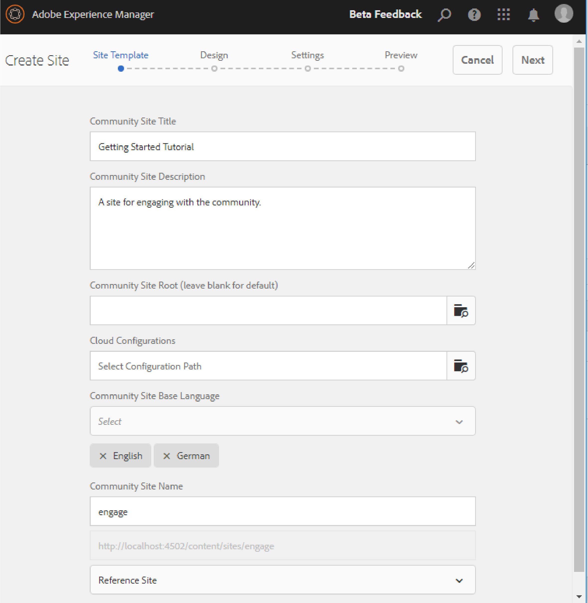

Dans le panneau Modèle de site, le titre, la description, la racine du site, la langue de base, le nom et le modèle de site sont spécifiés :

* **Titre du site communautaire**

  Titre affiché pour le site.

  Le titre s’affiche sur le site publié et dans l’interface utilisateur d’administration du site.

* **Description du site communautaire**

  Description du site.

  La description n’apparaît pas sur le site publié.

* **Racine du site communautaire**

  Chemin d’accès racine au site.

  La racine par défaut est `/content/sites`, mais elle peut être déplacée vers n’importe quel emplacement du site web.

* **Langue de base du site communautaire**

  (Ne pas toucher pour une seule langue : anglais) Utilisez le menu déroulant pour choisir une *ou plusieurs* langues de base parmi les langues disponibles : allemand, italien, français, japonais, espagnol, portugais (Brésil), chinois (traditionnel) et chinois (simplifié). Un site communautaire est créé pour chaque langue ajoutée et existe dans le même dossier de site conformément aux bonnes pratiques décrites dans la section [Traduction de contenu pour les sites multilingues](/help/sites-administering/translation.md). La page racine de chaque site contient une page enfant nommée selon le code de langue de l’une des langues sélectionnées (en pour l’anglais, fr pour le français, par exemple).

* **Nom du site de la communauté** :

  Nom de la page racine du site qui apparaît dans l’URL.

   * Vérifiez à nouveau le nom, car il ne peut pas être facilement modifié une fois le site créé.
   * L’URL de base ( `https://server:port/site root/site name)` s’affiche sous le `Community Site Name` .

   * Pour obtenir une URL valide, ajoutez un code de langue de base + « .html »

     *Par exemple*, `https://localhost:4502/content/sites/mysight/en.html`

* Menu **Modèle de site de la communauté**

  Utilisez le menu déroulant pour choisir un [modèle de site communautaire](/help/communities/tools.md) disponible.

* Sélectionnez **Suivant**.

### Étape 2 : conception {#step-design}

Le panneau Conception contient deux sous-panneaux pour sélectionner le thème et la bannière de branding :

#### THÈME DU SITE DE LA COMMUNAUTÉ {#community-site-theme}

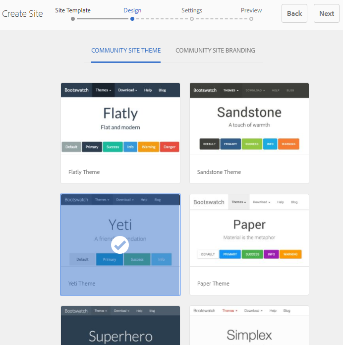

Le framework utilise `Twitter Bootstrap` pour apporter une conception réactive et flexible au site. L’un des nombreux thèmes Bootstrap préchargés peut être sélectionné pour appliquer un style au modèle de site de la communauté sélectionné, ou un thème Bootstrap peut être chargé.

Lorsqu’il est sélectionné, le thème est recouvert d’une coche opaque bleue.

Une fois le site de la communauté publié, il est possible de [modifier les propriétés](#modifying-site-properties) et sélectionner un autre thème.

#### IDENTITÉ GRAPHIQUE DU SITE DE LA COMMUNAUTÉ {#community-site-branding}

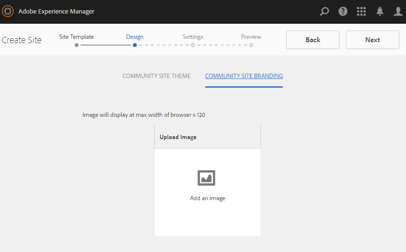

Le branding de site de la communauté est une image affichée sous la forme d’un en-tête en haut de chaque page.

L’image doit être dimensionnée pour être aussi large que l’affichage attendu de la page dans le navigateur et pour une hauteur de 120 pixels.

Lors de la création ou de la sélection d’une image, gardez à l’esprit les points suivants :

* La hauteur de l’image est réduite à 120 pixels, mesurés à partir du bord supérieur de l’image.
* L’image est épinglée sur le bord gauche de la fenêtre du navigateur.
* Il n’y a pas de redimensionnement de l’image, de sorte que lorsque la largeur de l’image est...

   * Inférieure à la largeur du navigateur, l’image se répète horizontalement.
   * L’image semble être recadrée si elle est supérieure à la largeur du navigateur.

* Sélectionnez **Suivant**.

### Étape 3 : Paramètres {#step-settings}

Le panneau Paramètres contient plusieurs sous-panneaux présentant des fonctionnalités à configurer avant de passer à la dernière étape de création du site.

* [GESTION DES UTILISATEURS](#user-management)
* [BALISAGE](#tagging)
* [ROLE](#roles)
* [MODÉRATION](#moderation)
* [ANALYTICS](#analytics)
* [TRADUCTION](#translation)

>[!NOTE]
>
>**Activer le service Tunnel**
>
>Plusieurs des sous-panneaux Paramètres permettent d’affecter un membre de confiance à la modération du contenu créé par l’utilisateur, à la gestion des groupes ou au rôle de contacts pour les ressources d’activation dans l’environnement de publication.
>
>La convention stipule que les [utilisateurs et utilisatrices et groupes d’utilisateurs](/help/communities/users.md) côté publication (membres et groupes de membres) ne doivent pas être dupliqués dans l’environnement de création.
>
>Ainsi, lors de la création du site de la communauté dans l’environnement de création et de l’affectation de membres approuvés à divers rôles, il est nécessaire de récupérer les données de membre de l’environnement de publication.
>
>Pour ce faire, activez le ` [AEM Communities Publish Tunnel Service](/help/communities/deploy-communities.md#tunnel-service-on-author)` pour l’environnement de création.

#### GESTION DES UTILISATEURS {#user-management}

* **Autoriser l’enregistrement des utilisateurs**

  Si cette case est cochée, les visiteurs du site peuvent devenir membres de la communauté en s’auto-enregistrant.
Si cette option n’est pas cochée, le site communautaire est *restreint* et les visiteurs du site doivent être affectés au groupe de membres du site communautaire, effectuer une demande ou recevoir une invitation par e-mail. Si cette option n’est pas cochée, l’accès anonyme ne doit pas être autorisé.
Désélectionnez un site communautaire *privé*. La valeur par défaut est cochée.

* **Autoriser l’accès anonyme**

  Si cette case est cochée, le site communautaire est *ouvert* et tout visiteur du site peut y accéder.
Si cette option n&#39;est pas cochée, seuls les membres connectés peuvent accéder au site.
Désélectionnez un site communautaire *privé*. La valeur par défaut est cochée.

* **Autoriser la messagerie**

  Si cette case est cochée, les membres peuvent envoyer des messages les uns aux autres et au groupe au sein du site communautaire.
Si cette option n’est pas cochée, la messagerie n’est pas configurée pour la communauté.
La valeur par défaut n’est pas cochée.

* **Autoriser les connexions sociales : Facebook**

  Si cette case est cochée, autorisez les visiteurs du site à se connecter avec leurs informations d’identification de compte Facebook. La [configuration cloud Facebook](/help/communities/social-login.md#create-a-facebook-connect-cloud-service) sélectionnée doit être configurée pour ajouter des utilisateurs au groupe des membres du site communautaire une fois le site communautaire créé.
Si cette option n’est pas cochée, aucune connexion Facebook n’est présentée.
Laissez cette option non cochée pour un site communautaire *privé*. La valeur par défaut n’est pas cochée.

* **Autoriser les connexions sociales : Twitter**

  Si cette case est cochée, autorisez les visiteurs du site à se connecter avec leurs informations d’identification de compte Twitter. La [configuration du cloud Twitter](/help/communities/social-login.md#create-a-twitter-connect-cloud-service) sélectionnée doit être configurée pour ajouter des utilisateurs au groupe des membres du site communautaire une fois le site communautaire créé.
Si cette option n’est pas cochée, aucun identifiant Twitter ne s’affiche.
Laissez cette option non cochée pour un site communautaire *privé*. La valeur par défaut n’est pas cochée.

>[!NOTE]
>
>**Autorisation des connexions sociales**
>
>Bien que des exemples de configurations Facebook et Twitter puissent exister et être sélectionnables pour un [environnement de production](/help/sites-administering/production-ready.md), il est nécessaire de créer des applications Facebook et Twitter personnalisées. Voir [Connexion sociale avec Facebook et Twitter](/help/communities/social-login.md).

#### BALISAGE {#tagging}

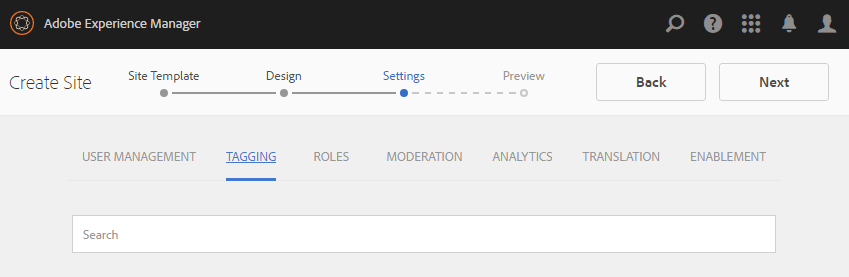

Les balises (qui peuvent être appliquées au contenu de la communauté) sont contrôlées en sélectionnant Espaces de noms de balise précédemment définis via la [console de balisage](/help/sites-administering/tags.md#tagging-console).

En outre, la sélection d’espaces de noms de balises pour le site de la communauté limite la sélection présentée lors de la définition de catalogues et de ressources.

* Zone de recherche de texte : commencez à saisir pour identifier les balises pouvant être utilisées sur le site.

#### ROLE {#roles}

Les [rôles des membres de la communauté](/help/communities/users.md) sont affectés avec ces paramètres.

La recherche de membres de la communauté est facile à l’aide de la recherche saisie semi-automatique.

* **Gestionnaires de communauté**

  Commencez à taper pour sélectionner un ou plusieurs membres de la communauté ou groupes de membres susceptibles de gérer des membres de la communauté et des groupes de membres.

* **Modérateurs communautaires**

  Commencez à taper pour sélectionner un ou plusieurs membres de la communauté ou groupes de membres à qui faire confiance en tant que modérateurs du contenu créé par l’utilisateur.

* **Membres privilégiés de la communauté**

  Commencez à taper pour sélectionner un ou plusieurs membres de la communauté ou groupes de membres à qui donner la possibilité de créer du contenu lorsque `Allow Privileged Member` a été sélectionné pour une [fonction de communauté](/help/communities/functions.md).

* **Administrateurs de la communauté**

  Commencez à taper pour sélectionner un ou plusieurs administrateurs de site qui peuvent gérer la structure du site indépendamment des autres administrateurs de site et de l’administrateur de la communauté par défaut. Ils peuvent créer des groupes à n’importe quel niveau de la hiérarchie et devenir l’administrateur par défaut des groupes imbriqués (mais ils peuvent être supprimés ultérieurement du rôle d’administrateur des groupes imbriqués).

#### MODÉRATION {#moderation}

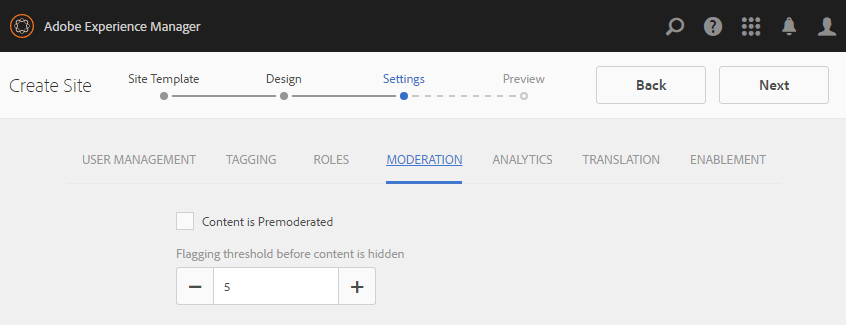

Le paramètre global de modération du contenu créé par l’utilisateur est contrôlé par ces paramètres. Chaque composant possède des paramètres supplémentaires pour contrôler la modération.

* **Contenu prémodéré**

  Si cette case est cochée, le contenu de la communauté publiée n’apparaît que lorsqu’il a été approuvé par un modérateur. La valeur par défaut n’est pas cochée. Pour plus d’informations, voir [Modération du contenu de la communauté](/help/communities/moderate-ugc.md#premoderation).

* **Seuil de marquage avant masquage du contenu**

  Si supérieur à 0, le nombre de fois où un sujet ou une publication doit être marqué avant qu&#39;il ne soit masqué de la vue publique. Si elle est définie sur -1, la rubrique ou la publication marquée n&#39;est jamais masquée de la vue publique. La valeur par défaut est 5.

#### ANALYTICS {#analytics}

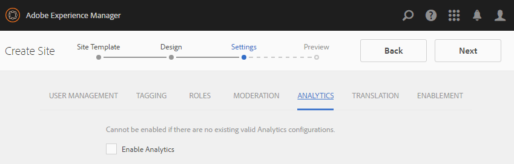

* **Activer Analytics**

  Disponible uniquement lorsqu’Adobe Analytics a été [configuré](/help/communities/analytics.md) pour les fonctionnalités de Communities.
La valeur par défaut n’est pas cochée. Lorsque cette case est cochée, un menu de sélection supplémentaire s’affiche :

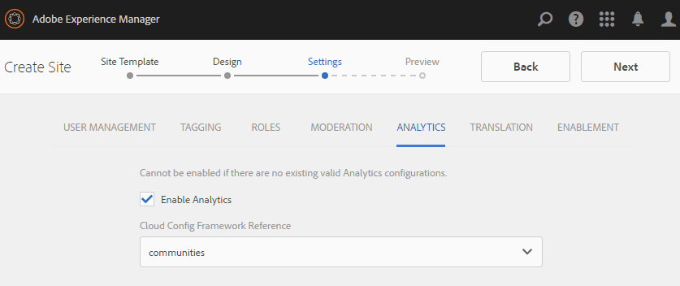

* **Référence du framework de configuration du cloud**

  Dans le menu déroulant, sélectionnez le framework de service Analytics Cloud configuré pour ce site communautaire.
  `Communities` est l’exemple de framework de la documentation [Configuration d’Analytics pour les fonctionnalités de Communities](/help/communities/analytics.md#aem-analytics-framework-configuration).

#### TRADUCTION {#translation}

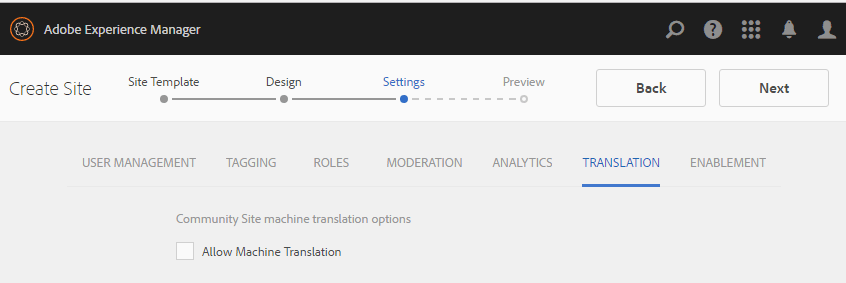

* **Autoriser la traduction automatique**

  Lorsque cette option est cochée (la valeur par défaut est décochée), la traduction automatique est activée pour le contenu créé par l’utilisateur sur le site. Cela n’affecte aucun autre contenu, tel que le contenu de la page, même si le site est configuré en tant que site multilingue. Consultez [Traduction de contenu créé par l’utilisateur](/help/communities/translate-ugc.md) pour plus d’informations sur la configuration d’un service de traduction sous licence pour AEM Communities. Consultez [Traduction de contenu pour des sites multilingues](/help/sites-administering/translation.md) pour une vue d’ensemble complète.

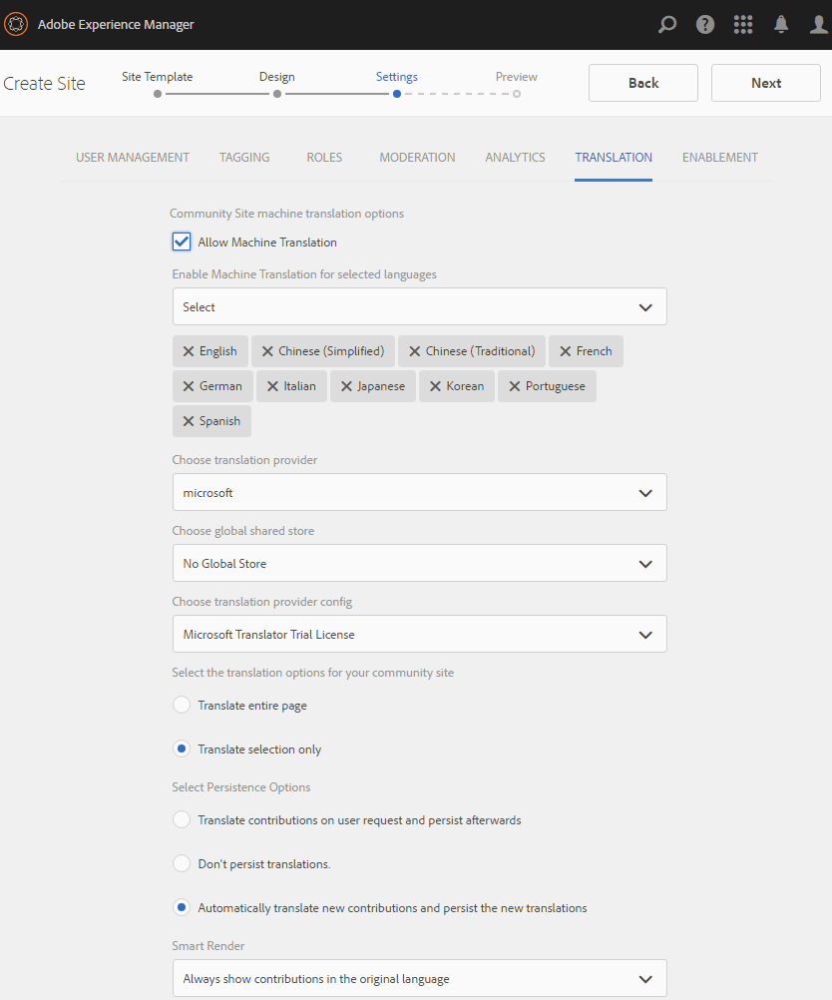

* **Activer la traduction automatique pour les langues sélectionnées**

  Les langues activées pour la traduction automatique sont définies par défaut sur le paramètre système spécifié par la [configuration de l’intégration de traduction](/help/communities/translate-ugc.md#translation-integration-configuration). Ces paramètres par défaut peuvent être remplacés pour ce site en supprimant les paramètres par défaut et/ou en sélectionnant d’autres langues dans le menu déroulant.

* **Choisissez un fournisseur de traduction**

  Par défaut, le fournisseur est un service d&#39;évaluation qui utilise `microsoft` à des fins de démonstration uniquement. Si aucun fournisseur de services de traduction n’est sous licence, la case **Autoriser la traduction automatique** doit être décochée.

* **Choisir un magasin partagé global**

  Pour un site web comportant plusieurs copies de langue, un magasin partagé global fournit un seul fil de conversation, visible à partir de chaque copie de langue. Pour ce faire, sélectionnez l’une des langues incluses en tant que copie de langue. La valeur par défaut est *Aucun magasin partagé global*.

* **Choisissez la configuration du fournisseur de traduction**

  Sélectionnez une [structure d’intégration de traduction](/help/sites-administering/tc-tic.md) créée pour le fournisseur de traduction sous licence.

* **Sélectionnez les options de traduction de votre site communautaire**

   * **Traduire la page entière**

     Si cette option est sélectionnée, tout le contenu créé par l’utilisateur sur une page est traduit dans la langue de base de la page.

     La valeur par défaut est *non sélectionné*.

   * **Traduire la sélection uniquement**

     Si cette option est sélectionnée, une option de traduction s’affiche en regard de chaque publication, permettant à chaque publication d’être traduite dans la langue de base de la page.
La valeur par défaut est *sélectionné*.

* **Sélectionner les options de persistance**

   * **Traduire les contributions à la demande de l’utilisateur et les conserver par la suite**
Si cette option est sélectionnée, le contenu n’est pas traduit tant qu’une requête n’a pas été effectuée. Une fois traduit, le texte traduit est stocké dans le référentiel.

     La valeur par défaut est *non sélectionné*.

   * **Ne pas conserver les traductions**

     Si cette option est sélectionnée, les traductions ne sont pas stockées dans le référentiel.

     Si cette option n’est pas sélectionnée, les traductions sont conservées.

     La valeur par défaut est *non sélectionné*.

* **Rendu intelligent**

  Sélectionnez l’une des options suivantes :

   * `Always show contributions in the original language` (par défaut)
   * `Always show contributions in user preferred language`
   * `Show contributions in user preferred language for only logged-in users`

### Étape 4 : Créer Un Site De Communautés {#step-create-communities-site}

Si des ajustements sont nécessaires, utilisez le bouton **Précédent** pour les effectuer.

Une fois que **Créer** est sélectionné et démarré, le processus de création du site ne peut pas être interrompu.

Une fois le site créé :

* La modification de l’URL (nom du nœud) n’est pas prise en charge.
* Les futures modifications apportées au modèle de site de la communauté n’affectent pas le site de la communauté créé.
* La désactivation du modèle de site de la communauté n’affecte pas le site de la communauté créé.
* Il est possible de modifier la [STRUCTURE](#modify-structure) d’un site communautaire en modifiant ses propriétés.

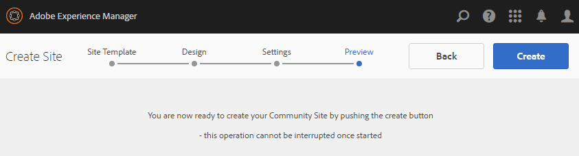

Une fois le processus terminé, le dossier du nouveau site s’affiche dans la console Sites de communautés, à partir de laquelle les auteurs et autrices peuvent ajouter du contenu de page ou les administrateurs et administratrices peuvent modifier les propriétés du site.

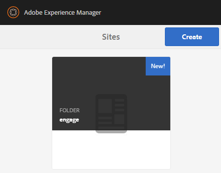

Pour modifier un site communautaire, sélectionnez son dossier de projet pour l’ouvrir :

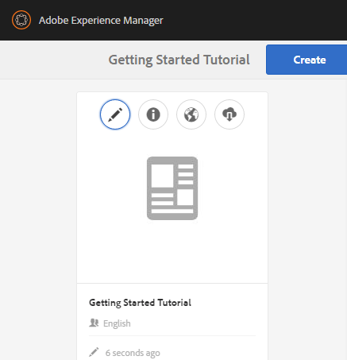

Lorsque vous passez la souris sur un site ou que vous touchez une carte de site, des icônes s’affichent pour vous permettre d’effectuer les opérations suivantes :

* [modification du site en mode création](#authoring-site-content)
* [ouverture des propriétés du site pour modification](#modifying-site-properties)
* [publication du site](#publishing-the-site)
* [exportation du site](#exporting-the-site)
* [suppression du site](#deleting-the-site)

## Création de contenu de site {#authoring-site-content}

Le contenu d’un site peut être créé avec les mêmes outils que tout autre site web AEM. Pour ouvrir le site en vue de la création, sélectionnez l’icône `Open Site` qui s’affiche lorsque vous survolez le site avec la souris. Le site s’ouvre dans un nouvel onglet de sorte que la console Sites de communautés reste accessible.

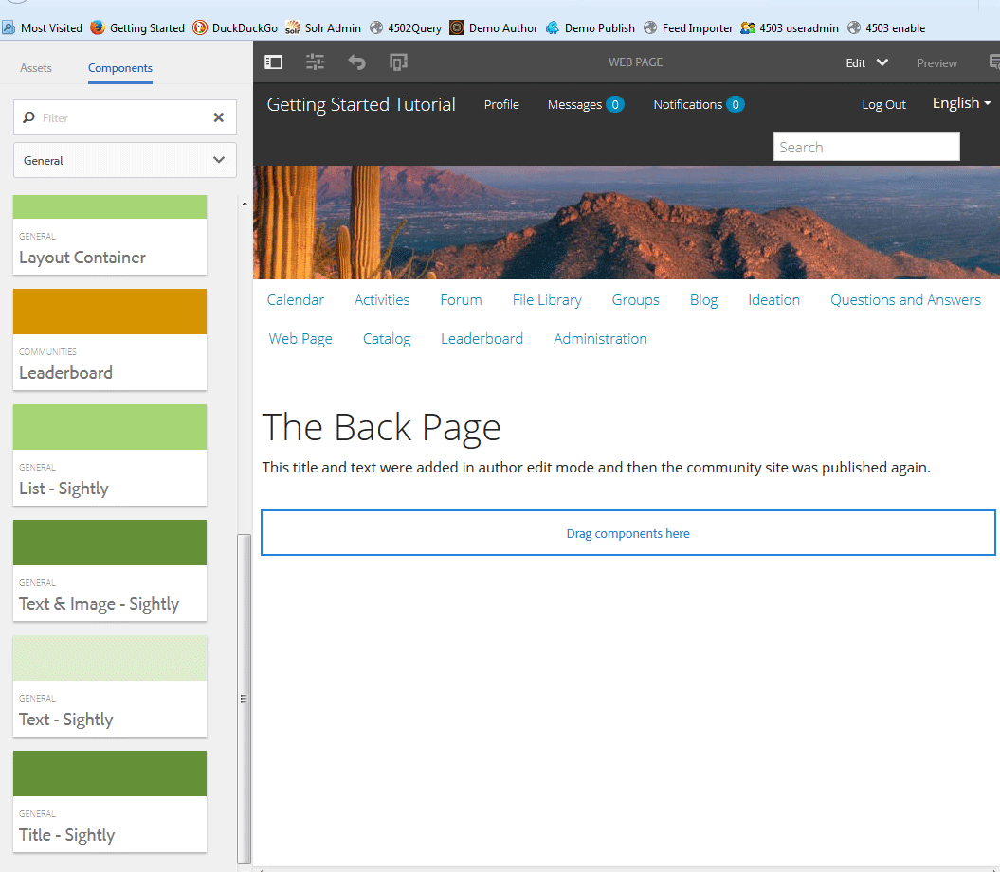

>[!NOTE]
>
>Si vous ne connaissez pas AEM, consultez la documentation sur [la gestion de base](/help/sites-authoring/basic-handling.md) et un [guide rapide sur la création de pages](/help/sites-authoring/qg-page-authoring.md).

## Modification des propriétés du site {#modifying-site-properties}

Les propriétés d’un site existant, spécifiées pendant le processus de création du site, peuvent être modifiées en sélectionnant l’icône `Edit Site` qui s’affiche lorsque vous survolez le site avec la souris.

`Details of the following properties match the descriptions provided in the` section [Création de site](#site-creation).

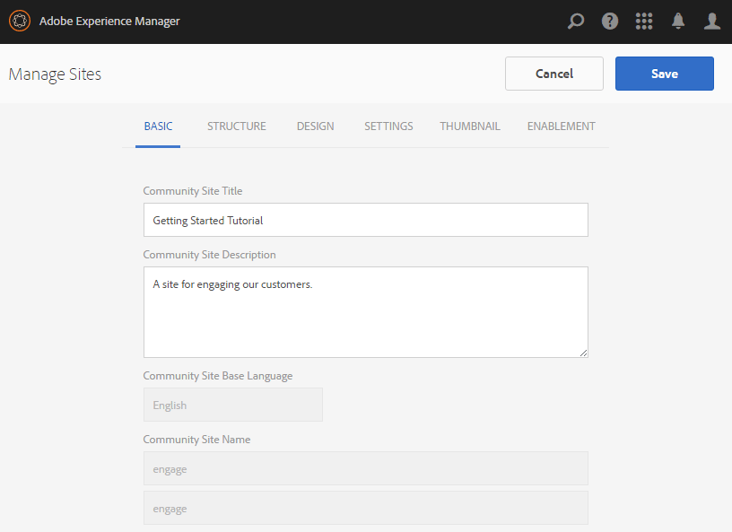

### Modifier les paramètres de base {#modify-basic}

Le panneau DE BASE permet de modifier les éléments suivants :

* Titre du site de la communauté
* Description du site de la communauté

Le nom du site communautaire ne peut pas être modifié.

Le choix d&#39;un autre modèle de site communautaire n&#39;aurait aucun effet sur un site communautaire existant, car il ne subsiste aucune connexion entre les modèles et les sites.

Au lieu de cela, la [STRUCTURE](#modify-structure) du site de la communauté peut être modifiée.

### Modifier la structure {#modify-structure}

Le panneau STRUCTURE permet de modifier la structure initialement créée à partir du modèle de site de la communauté sélectionnée. À partir du panneau, il est possible de :

* Glissez-déposez des [fonctions de communauté](/help/communities/functions.md) supplémentaires dans la structure du site.
* Sur une instance d’une fonction de communauté dans la structure du site :

   * **`gear icon`**

     Modifiez les paramètres, notamment le titre d’affichage et le nom de l’URL, ainsi que les [groupes de membres privilégiés](/help/communities/users.md#privilegedmembersgroups).

   * **`trashcan icon`**

     Supprimez (supprimez) des fonctions de la structure du site.

   * **`grid icon`**

     Modifiez l’ordre des fonctions tel qu’affiché dans la barre de navigation de niveau supérieur du site.

>[!NOTE]
>
>Vous pouvez modifier l’ordre de toutes les fonctions dans la structure du site, à l’exception de la fonction située en haut. Par conséquent, la page d’accueil d’un site communautaire ne peut pas être modifiée.

>[!CAUTION]
>
>* Bien que le titre affiché puisse être modifié sans effets secondaires, il n’est pas recommandé de modifier le nom de l’URL d’une fonction de communauté appartenant à un site de communauté.
>
>Par exemple, renommer l’URL ne déplace pas le contenu créé par l’utilisateur existant et entraîne sa « perte ».

>[!CAUTION]
>
>La fonction de groupes ne doit *pas* être la *première ni la seule* fonction de la structure du site.
>
>Toute autre fonction, telle que la fonction [page](/help/communities/functions.md#page-function), doit être incluse et répertoriée en premier.

#### Exemple : ajout d’une fonction de catalogue à une structure de site de communauté {#example-adding-a-catalog-function-to-a-community-site-structure}

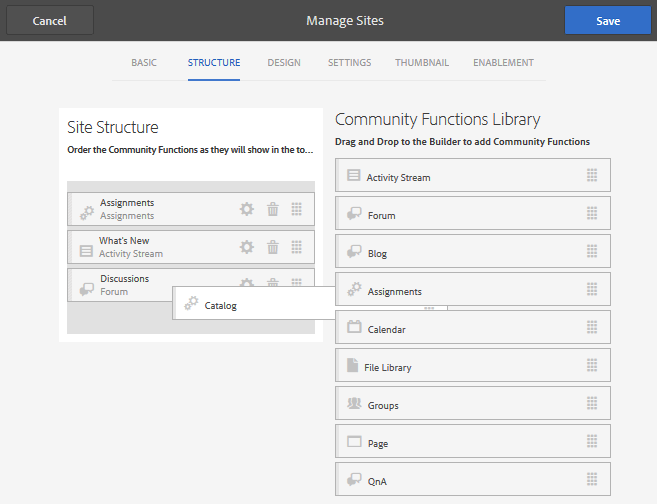

### Modifier la conception {#modify-design}

Le panneau CONCEPTION permet d’appliquer un nouveau thème :

* [Thème des sites de la communauté](#community-site-theme)
* [Valorisation de marque des sites de la communauté](#community-site-branding)

   * Faites défiler jusqu’au bas du panneau pour modifier l’image de marque.

### Modifier les paramètres {#modify-settings}

Le panneau PARAMÈTRES permet d’accéder à la plupart des paramètres sous les sous-panneaux de pour l’étape 3 de la création du site de la communauté :

* [Gestion des utilisateurs et utilisatrices](#user-management)
* [Balises](#tagging)
* [Modération](#moderation)
* [Rôles des membres](#roles)
* [Analytics](#analytics)
* [Traduction](#translation)

### Modifier la miniature {#modify-thumbnail}

Le panneau MINIATURE permet de charger une image pour représenter le site dans la console Sites de communautés.

## Publication du site {#publishing-the-site}

Une fois qu’un site communautaire a été nouvellement créé ou modifié, il est possible de le publier (activer) en sélectionnant l’icône `Publish Site` qui s’affiche lorsque vous pointez sur le site.

Une indication s’affiche une fois le site publié.

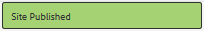

### Publication avec des groupes imbriqués {#publishing-with-nested-groups}

Après avoir publié un site de communauté, il est nécessaire de publier individuellement chaque sous-communauté (groupe imbriqué) créée à l’aide de la console [Groupes](/help/communities/groups.md).

## Exportation du site {#exporting-the-site}

Lorsque l’icône d’exportation est sélectionnée, pointez sur le site avec la souris pour créer un package du site de la communauté qui est stocké dans le [gestionnaire de packages](/help/sites-administering/package-manager.md) et téléchargé.

Le contenu créé par l’utilisateur n’est pas inclus dans le package de site.

## Suppression du site {#deleting-the-site}

Pour supprimer le site de la communauté, sélectionnez l’icône Supprimer le site qui s’affiche lorsque vous placez le pointeur de la souris sur le site dans la console Sites de communautés. Cette action supprime tous les éléments associés au site, tels que le contenu créé par l’utilisateur, les groupes d’utilisateurs, les ressources et les enregistrements de base de données.

## Groupes d’utilisateurs de la communauté créés {#created-community-user-groups}

Une fois le nouveau site de la communauté publié, de nouveaux groupes de membres (groupes d’utilisateurs et d’utilisatrices sont créés dans l’environnement de publication) disposant des autorisations appropriées définies pour divers rôles administratifs et membres.

Le nom créé pour les groupes de membres inclut le *nom-site* donné à [Étape 1](#step13asitetemplate) (le nom qui apparaît dans l&#39;URL). Il comprend également un ID unique pour éviter les conflits avec les sites et groupes de la communauté portant le même nom de site pour différentes racines de site de la communauté.

Par exemple, si le nom était « engage » pour un site intitulé « Tutoriel de prise en main », le groupe d’utilisateurs pour les modérateurs serait :

* titre : Community Engage Modérators
* nom : community-*engage-uid*-moderniators

Tous les membres affectés à des rôles de modérateurs ou d’administrateurs de groupe lors de la création du site sont affectés au groupe approprié et affectés au groupe de membres . Ces groupes et affectations de membres sont créés lors de la publication lorsque le nouveau site est publié.

Pour plus d’informations, voir [Gestion des utilisateurs et des groupes d’utilisateurs](/help/communities/users.md).

>[!NOTE]
>
>Si [Autoriser la connexion au réseau social : Facebook](#user-management) est activé, une fois que le groupe d’utilisateurs `community-<site-name>-<uid>-members`
>est créé, le [service cloud Facebook](/help/communities/social-login.md#createafacebookcloudservice) appliqué doit être configuré pour ajouter des utilisateurs à ce groupe.

## Erreur de configuration d’pour l’authentification {#configure-for-authentication-error}

Par défaut, un site communautaire redirige vers un exemple de page de connexion lorsque l’utilisateur saisit des informations d’identification incorrectes et ne parvient pas à se connecter. Cet exemple de connexion n’est pas présent sur un [&#x200B; serveur de production &#x200B;](/help/sites-administering/production-ready.md).

Pour rediriger correctement, une fois qu’un site a été configuré et envoyé pour publication, procédez comme suit pour obtenir un échec d’authentification pour rediriger vers le site de la communauté :

* Sur chaque instance de publication AEM.
* Connectez-vous avec des droits d’administrateur.
* Accédez à la [console web](/help/sites-deploying/configuring-osgi.md).

   * Par exemple, [:4503/system/console/configMgr](https://localhost:4503/system/console/configMgr).

* Localisez `Adobe Granite Login Selector Authentication Handler`.
* Sélectionnez l’icône `pencil` pour pouvoir ouvrir la configuration à modifier.
* Saisissez un **Mappages de page de connexion** comme suit :

  `/content/sites/<site-name>/path/to/login/page:/content/sites/<site-name>`

  Par exemple :
  `/content/sites/engage/en/signin:/content/sites/engage/en`

* Sélectionnez **Enregistrer**.

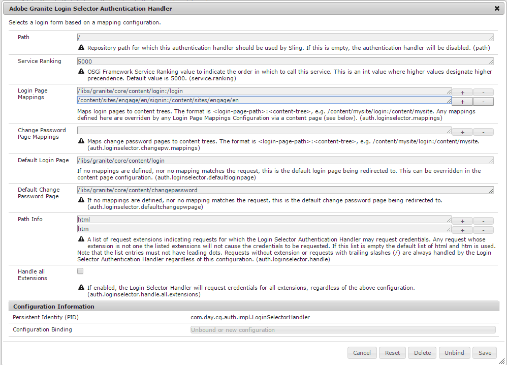

### Test de la redirection de l’authentification {#test-authentication-redirection}

Sur la même instance de publication AEM configurée avec un mappage de page de connexion pour le site de la communauté :

* Accédez à la page d’accueil du site de la communauté .

   * Par exemple, [https://localhost:4503/content/sites/engage/en.html](https://localhost:4503/content/sites/engage/en.html)

* Sélectionnez Déconnexion.
* Sélectionnez Connexion.
* Saisissez des informations d’identification incorrectes, telles que le nom d’utilisateur « x » et le mot de passe « x ».
* La page de connexion doit s’afficher avec un message d’erreur indiquant « connexion non valide ».

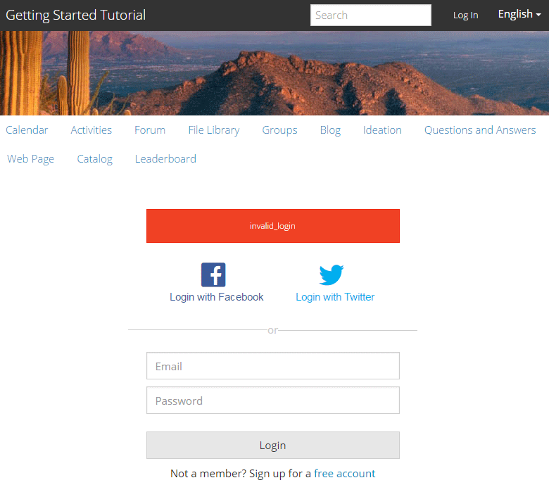

## Accès aux sites de la communauté à partir de la console Sites principale {#accessing-community-sites-from-main-sites-console}

Dans la console de navigation globale Sites, les sites des communautés se trouvent dans le dossier `Community Sites` .

Bien qu’il soit possible d’accéder à un site communautaire de cette manière, pour les tâches administratives, le site communautaire doit être accessible à partir de la console Sites communautaires.

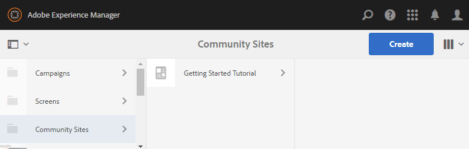
