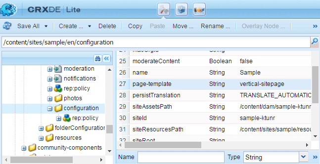

# Principes de base des sites de la communauté {#community-site-essentials}

## Modèle de site personnalisé {#custom-site-template}

Un modèle de site personnalisé peut être spécifié séparément pour chaque copie de langue d’un site communautaire.

Procédez comme suit :

* Créez un modèle personnalisé.
* Recouvrez le chemin d’accès par défaut du modèle de site.
* Ajoutez le modèle personnalisé au chemin d’accès du recouvrement.
* Spécifiez le modèle personnalisé en ajoutant une propriété `page-template` au nœud `configuration` .

**Modèle par défaut** :

`/libs/social/console/components/hbs/sitepage/sitepage.hbs`

**Modèle personnalisé dans le chemin de recouvrement** :

`/apps/social/console/components/hbs/sitepage/template-name.hbs`

**Property** : page-template

**Type** : chaîne

**Value** : `template-name` (aucune extension)

**Nœud de configuration** :

`/content/community site path/lang/configuration`

Par exemple : `/content/sites/engage/en/configuration`

>[!NOTE]
>
>Il suffit que tous les nœuds du chemin recouvert soient de type `Folder`.

>[!CAUTION]
>
>Si le modèle personnalisé est nommé *sitepage.hbs*, tous les sites de la communauté sont personnalisés.

### Exemple de modèle de site personnalisé {#custom-site-template-example}

Par exemple, `vertical-sitepage.hbs` est un modèle de site qui place des liens de menu verticalement sur le côté gauche de la page, au lieu d’horizontalement sous la bannière.

[Obtenir le fichier](assets/vertical-sitepage.hbs)
Placez le modèle de site personnalisé dans le dossier de recouvrement :

`/apps/social/console/components/hbs/sitepage/vertical-sitepage.hbs`

Identifiez le modèle personnalisé en ajoutant une propriété `page-template` au nœud de configuration :

`/content/sites/sample/en/configuration`

Veillez à **Enregistrer tout** et à répliquer le code personnalisé sur toutes les instances de Adobe Experience Manager (AEM) (le code personnalisé n’est pas inclus lorsque le contenu du site de la communauté est publié à partir de la console).

La pratique recommandée pour répliquer du code personnalisé consiste à [créer un package](../../help/sites-administering/package-manager.md#creating-a-new-package) et à le déployer sur toutes les instances.

## Exportation d’un site communautaire {#exporting-a-community-site}

Une fois qu’un site communautaire est créé, il est possible d’exporter le site en tant que package AEM stocké dans le gestionnaire de packages et disponible pour téléchargement et téléchargement.

Cette option est disponible à partir de la console [Sites communautaires](sites-console.md#exporting-the-site).

Le contenu créé par l’utilisateur et le code personnalisé ne sont pas inclus dans le package du site communautaire.

Pour exporter du contenu créé par l’utilisateur, utilisez l’[Outil de migration du contenu créé par l’utilisateur &#x200B;](https://github.com/Adobe-Marketing-Cloud/aem-communities-ugc-migration), un outil de migration open source disponible sur GitHub.

## Suppression d’un site communautaire {#deleting-a-community-site}

Depuis le pack de services 1 d’AEM Communities 6.3, l’icône Supprimer le site s’affiche lorsque vous pointez sur le site de la communauté à partir de la console **[!UICONTROL Communities]** > **[!UICONTROL Sites]**. Lors du développement, si vous souhaitez supprimer un site de la communauté et repartir de zéro, vous pouvez utiliser cette fonctionnalité. Lors de la suppression d’un site communautaire, les éléments suivants y sont associés :

* [UGC](#user-generated-content)
* [Groupes d’utilisateurs et d’utilisatrices](#community-user-groups)
* [Enregistrements de base de données](#database-records)

### ID de site unique de la communauté {#community-unique-site-id}

Pour identifier l’ID de site unique associé au site de la communauté, à l’aide de CRXDE :

* Accédez à la racine de langue du site, par exemple `/content/sites/*<site name>*/en/rep:policy`.

* Recherchez le nœud `allow<#>` avec un `rep:principalName` au format `rep:principalName = *community-enable-nrh9h-members*`.

* L’identifiant de site est le troisième composant d’`rep:principalName`

  Par exemple, si `rep:principalName = community-enable-nrh9h-members`

  * **nom du site** = *activer*
  * **Identifiant du site** = *nrh9h*
  * **unique site ID** = *enable-nrh9h*

### Contenu Généré Par L’Utilisateur {#user-generated-content}

Procurez-vous le projet communities-srp-tools à partir de GitHub :

* [https://github.com/Adobe-Marketing-Cloud/aem-communities-srp-tools](https://github.com/Adobe-Marketing-Cloud/aem-communities-srp-tools)

Contient un servlet permettant de supprimer tout le contenu créé par l’utilisateur de n’importe quel fournisseur de services partagés.

Tout le contenu créé par l’utilisateur peut être supprimé ou pour un site spécifique, par exemple :

* `path=/content/usergenerated/asi/mongo/content/sites/engage`

Cela supprime uniquement le contenu généré par l’utilisateur (saisi lors de la publication) et non le contenu créé (saisi lors de la création). Par conséquent, les [nœuds fantômes](srp.md#shadownodes) ne sont pas affectés.

### Community User Groups {#community-user-groups}

Sur toutes les instances d’auteur et de publication, à partir de la [console de sécurité](../../help/sites-administering/security.md), recherchez et supprimez les [groupes d’utilisateurs](users.md) qui sont :

* Précédé de `community`
* Suivi de [identifiant unique du site](#community-unique-site-id)

Par exemple, `community-engage-x0e11-members`.
