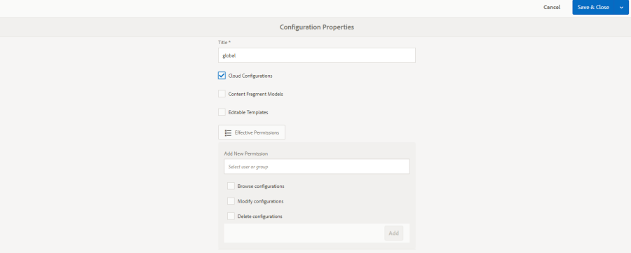

# Connexion aux réseaux sociaux avec Facebook et Twitter {#social-login-with-facebook-and-twitter}

La connexion à Social permet de proposer à un visiteur du site l’option de connexion à l’aide de son compte Facebook ou Twitter. Par conséquent, inclure les données Facebook ou Twitter autorisées dans leur profil de membre AEM.

## Présentation de la connexion au réseau social {#social-login-overview}

Pour inclure la connexion sociale, il est *nécessaire* de créer des applications Facebook et Twitter personnalisées.

Bien que l’exemple we-retail fournisse des exemples d’applications Facebook et Twitter et de services cloud, ils ne sont pas disponibles sur un [site web de production](../../help/sites-administering/production-ready.md).

Les étapes requises sont les suivantes :

1. [Activez l’](#adobe-granite-oauth-authentication-handler) authentification OAuth sur toutes les instances de publication AEM.

   Si OAuth n’est pas activé, les tentatives de connexion échouent.

1. **** Créez une application sociale et un service cloud.

   * Pour prendre en charge la connexion avec Facebook :

      * Créez une [application Facebook](#create-a-facebook-app).
      * Créez et publiez un [service cloud Facebook Connect](#create-a-facebook-connect-cloud-service).
   * Pour prendre en charge la connexion avec Twitter :

      * Créez une [application Twitter](#create-a-twitter-app).
      * Créez et publiez un [service cloud Twitter Connect](#create-a-twitter-connect-cloud-service).

1. [**** Permet d’activer la ](#enable-social-login) connexion sociale pour un site de communauté.

Il existe deux concepts de base :

1. **Portée**  (autorisations) spécifie les données que l’application est autorisée à demander.

   * Par défaut, les instances Facebook et Twitter [Adobe Granite OAuth Application et Provider](#adobe-granite-oauth-application-and-provider) incluent les autorisations de base de l’application dans leur portée.

1. **Les champs**  (params) spécifient les données réelles demandées à l’aide des paramètres d’URL.

   * Ces champs sont spécifiés dans [Fournisseur OAuth Facebook AEM Communities](#aem-communities-facebook-oauth-provider) et [Fournisseur OAuth Twitter AEM Communities](#aem-communities-twitter-oauth-provider).
   * Les champs par défaut sont suffisants pour la plupart des cas d&#39;utilisation, mais peuvent être modifiés.

## Connexion à facebook {#facebook-login}

### Version de l’API facebook {#facebook-api-version}

La connexion sociale et l’exemple de Facebook we-retail ont été développés lorsque l’API Facebook Graph était la version 1.0.
Depuis AEM version 6.4 GA et AEM 6.3 SP1, la connexion sociale a été mise à jour pour fonctionner avec la nouvelle version de l’API Facebook Graph 2.5.

>[!NOTE]
>
>Pour les versions AEM plus anciennes, si vous rencontrez une exception dans les journaux **Impossible d’extraire un jeton de cette**, effectuez une mise à niveau vers le dernier CFP pour cette version AEM.

Pour plus d’informations sur la version de l’API Facebook Graph, voir le [journal des modifications de l’API Facebook](https://developers.facebook.com/docs/apps/changelog).

### Création d’une application Facebook {#create-a-facebook-app}

Une application Facebook correctement configurée est requise pour activer la connexion sociale Facebook.

Pour créer une application Facebook, suivez les instructions Facebook à l’adresse [https://developers.facebook.com/apps/](https://developers.facebook.com/apps/). Les modifications apportées à leurs instructions ne sont pas répercutées dans les informations suivantes.

En règle générale, à partir de l’API Facebook v2.7 :

* *Ajout d’une nouvelle application Facebook*
   * Pour *Plateforme*, choisissez Site Web :
      * Pour *URL du site*, saisissez `  https://<server>:<port>.`
      * Pour *Nom d’affichage*, saisissez un titre à utiliser comme titre du service de connexion Facebook.
      * Pour *Catégorie*, il est recommandé de choisir *Applications pour les pages*, mais cela peut être n’importe quoi.
      * *Ajouter un produit : Connexion à facebook*
      * Pour *URI de redirection OAuth valides*, saisissez `  https://<server>:<port>.`

>[!NOTE]
>
>Pour le développement, http://localhost:4503 fonctionne.

Une fois l’application créée, localisez les paramètres **[!UICONTROL ID d’application]** et **[!UICONTROL Secret d’application]**. Ces informations sont requises pour la configuration du [service cloud Facebook](#createafacebookcloudservice).

### Création d’un Cloud Service Facebook Connect {#create-a-facebook-connect-cloud-service}

L’instance [Adobe de l’application OAuth Granite et du fournisseur](#adobe-granite-oauth-application-and-provider), instanciée par la création d’une configuration de service cloud, identifie l’application Facebook et le ou les groupes de membres auxquels les nouveaux utilisateurs sont ajoutés.

1. Sur l’instance d’auteur AEM, connectez-vous avec les droits d’administrateur.
1. Dans la navigation globale, sélectionnez **[!UICONTROL Outils]** > **[!UICONTROL Cloud Services]** > **[!UICONTROL Configuration de la connexion à Facebook Social]**.
1. Sélectionnez le **[!UICONTROL chemin du contexte]** de configuration.

   **[!UICONTROL Le]** chemin de contexte doit être identique au chemin de configuration du cloud que vous avez sélectionné lors de la création/modification d’un site de communauté.

1. Vérifiez si votre chemin d’accès au contexte est activé pour créer des services cloud en-dessous.
1. Accédez à **[!UICONTROL Outils]** > **[!UICONTROL Général]** > **[!UICONTROL Navigateur de configuration]**. Sélectionnez votre contexte et modifiez les propriétés. Activez les configurations cloud si elles ne sont pas encore activées.

   

   * Pour plus d’informations, consultez la documentation relative au [Navigateur de configuration](/help/sites-administering/configurations.md).

1. **Créez/** Modifiez la configuration du service cloud Facebook.

   

   * **[!UICONTROL Titre]**  (*Obligatoire*) Saisissez un titre d’affichage qui identifie l’application Facebook. Il est recommandé d’utiliser le même nom que celui saisi sous *Nom d’affichage* pour l’application Facebook.
   * **[!UICONTROL ID de l’application/clé API]**  (*obligatoire*) Saisissez l’ ****** ID de l’application pour l’application Facebook. Cela identifie l’instance [Adobe de l’application OAuth Granite et de fournisseur](https://helpx.adobe.com/experience-manager/6-3/communities/using/social-login.html#AdobeGraniteOAuthApplicationandProvider) créée à partir de la boîte de dialogue.
   * **[!UICONTROL Secret de l’application]**  (*obligatoire*) Saisissez le  ***secrétaire*** d’application de l’application Facebook.
   * **[!UICONTROL Créer des]** utilisateurs Si cette option est cochée, la connexion à l’aide d’un compte Facebook crée une entrée d’utilisateur AEM et l’ajoute en tant que membre au ou aux groupes d’utilisateurs sélectionnés.  La valeur par défaut est cochée (vivement recommandé).
   * **[!UICONTROL Masquer les ID utilisateur]** : Laissez désélectionné.
   * **[!UICONTROL Domaine]** : L’ID de courrier électronique de l’utilisateur doit être récupéré à partir de Facebook.
   * **[!UICONTROL Ajouter aux]** groupes d’utilisateurs , sélectionnez Ajouter un groupe d’utilisateurs pour choisir un ou plusieurs  [groupes de ](https://helpx.adobe.com/experience-manager/6-3/communities/using/users.html) membres pour le site de communauté auquel les utilisateurs seront ajoutés.

   >[!NOTE]
   >
   >Les groupes peuvent être ajoutés ou supprimés à tout moment. Mais les appartenances des utilisateurs existants ne seront pas affectées. L’adhésion automatique s’applique uniquement aux nouveaux utilisateurs créés après la mise à jour de ce champ. Pour les sites où les utilisateurs anonymes sont désactivés, choisissez d’ajouter des utilisateurs au groupe de membres de communauté correspondant destiné à ce site de communauté fermé.

   * Sélectionnez **[!UICONTROL SAVE]**.
   * **[!UICONTROL Publication]**.

Le résultat est une instance [Adobe de l’application OAuth Granite et de Provider](https://helpx.adobe.com/experience-manager/6-3/communities/using/social-login.html#adobe-granite-oauth-application-and-provider) qui ne nécessite pas de modification supplémentaire, sauf si vous ajoutez une portée supplémentaire (autorisations). La portée par défaut est les autorisations standard pour la connexion à Facebook. Si une portée supplémentaire est souhaitée, il est nécessaire de modifier directement la configuration OSGI. Si des modifications sont effectuées directement via le système/la console, évitez de modifier vos configurations de service cloud à partir de l’interface utilisateur tactile afin d’éviter tout écrasement.

### Fournisseur OAuth Facebook AEM Communities {#aem-communities-facebook-oauth-provider}

Le fournisseur AEM Communities étend les instances [Adobe Granite OAuth Application et Provider](#adobe-granite-oauth-application-and-provider).

Ce fournisseur devra être modifié pour :

* Autoriser les mises à jour des utilisateurs
* Ajouter des champs [dans scope](#adobe-granite-oauth-application-and-provider)

   * Tous les champs autorisés par défaut ne sont pas inclus par défaut.

Si des modifications sont nécessaires, sur chaque instance de publication AEM :

1. Connectez-vous avec les privilèges d’administrateur.
1. Accédez à la [console Web](../../help/sites-deploying/configuring-osgi.md). Par exemple, http://localhost:4503/system/console/configMgr.
1. Recherchez le fournisseur OAuth Facebook AEM Communities.
1. Sélectionnez l’icône en forme de crayon à ouvrir pour modification.

   

   * **[!UICONTROL Identifiant du fournisseur OAuth]**

      (*Obligatoire*) La valeur par défaut est *soco-facebook*. Ne modifiez pas.

   * **[!UICONTROL Configuration du Cloud Service]**

      La valeur par défaut est `/etc/  cloudservices /  facebookconnect`. Ne modifiez pas.

   * **[!UICONTROL Configuration du service de fournisseur OAuth]**

      La valeur par défaut est `/apps/social/facebookprovider/config/`. Ne modifiez pas.

   * **[!UICONTROL Activation des balises]**

      Ne modifiez pas.

   * **[!UICONTROL Chemin d’accès utilisateur]**

      Emplacement dans le référentiel où les données utilisateur sont stockées. Pour un site de communauté, afin que les membres puissent y voir leur profil, le chemin doit être le chemin par défaut */home/users/community*.

   * **[!UICONTROL Activer les champs]**

      Si cette case est cochée, les champs répertoriés sont spécifiés dans la demande à Facebook pour l’authentification et les informations de l’utilisateur. La valeur par défaut est désélectionnée.

   * **[!UICONTROL Champs]**

      Lorsque les champs sont activés, les champs suivants sont inclus lors de l’appel de l’API Facebook Graph. Les champs doivent être autorisés dans la portée définie dans la configuration du service cloud. Les champs supplémentaires peuvent nécessiter l’approbation de Facebook. Reportez-vous à la section Autorisations de connexion Facebook de la documentation Facebook. Les champs par défaut ajoutés en tant que paramètres sont les suivants :

      * id
      * name
      * first_name
      * last_name
      * lien
      * paramètres régionaux
      * picture
      * timezone
      * updated_time
      * vérifié
      * email

   Si un champ est ajouté ou modifié, mettez à jour la configuration du gestionnaire de synchronisation par défaut correspondant pour corriger le mappage.

   * **[!UICONTROL Mettre à jour l’utilisateur]**

      Si cette case est cochée, actualise les données utilisateur dans le référentiel à chaque connexion afin de refléter les modifications de profil ou les données supplémentaires demandées. La valeur par défaut est désélectionnée.

#### Étapes suivantes {#next-steps}

Les étapes suivantes sont les mêmes pour Facebook et Twitter :

* [Publication des configurations du service cloud](#publishcloudservices)
* [Activation pour un site de communauté](#enable-social-login)

## Connexion à twitter {#twitter-login}

### Création d’une application Twitter {#create-a-twitter-app}

Une application Twitter configurée est requise pour activer la connexion sociale Twitter.

Suivez les dernières instructions pour créer une application Twitter à l’adresse [https://apps.twitter.com](https://apps.twitter.com/).

En général :

1. Saisissez un *nom* qui identifiera votre application Twitter aux utilisateurs de votre site web.
1. Saisissez une *description*.
1. Pour *site Web* - saisissez `https://<server>`.
1. Pour *URL de callback* - saisissez `https://server`.

   >[!NOTE]
   >
   >Il n’est pas nécessaire de spécifier le port.
   >
   >Pour le développement, https://127.0.0.1/ fonctionne.

1. Une fois l’application créée, localisez la **[!UICONTROL Clé client (API)]** et le **[!UICONTROL Secret client (API)]**. Ces informations seront nécessaires pour la configuration du [service cloud Twitter](#createatwittercloudservice).

#### Autorisations {#permissions}

Dans la section Autorisations de la gestion des applications Twitter :

* **[!UICONTROL Accès]** : Sélectionnez  `Read only`.

   * Les autres options ne sont pas prises en charge

* **[!UICONTROL Autorisations supplémentaires]** : Vous pouvez également choisir  `Request email addresses from users`.

   * Si cette option n’est pas sélectionnée, le profil utilisateur dans AEM n’inclut pas son adresse électronique.
   * Les instructions de twitter indiquent les étapes supplémentaires à suivre.

La seule requête REST envoyée pour la connexion sociale est *[GET account/verify credentials](https://dev.twitter.com/rest/reference/get/account/verify_credentials)*.

### Création d’un Cloud Service Twitter Connect {#create-a-twitter-connect-cloud-service}

L’instance [Adobe de l’application OAuth Granite et du fournisseur](#adobe-granite-oauth-application-and-provider), instanciée par la création d’une configuration de service cloud, identifie l’application Twitter et le ou les groupes de membres auxquels les nouveaux utilisateurs sont ajoutés.

1. Sur l’instance d’auteur, connectez-vous avec les privilèges d’administrateur.
1. Dans la navigation globale, sélectionnez **[!UICONTROL Outils]** > **[!UICONTROL Cloud Services]** > **[!UICONTROL Configuration de la connexion à Twitter Social]**.
1. Sélectionnez la configuration **[!UICONTROL context path]** .

   Le chemin d’accès au contexte doit être identique au chemin de configuration du cloud que vous avez sélectionné lors de la création/modification d’un site de communauté.

1. Vérifiez si votre chemin d’accès au contexte est activé pour créer des services cloud en-dessous.
1. Accédez à **[!UICONTROL Outils]** > **[!UICONTROL Général]** > **[!UICONTROL Navigateur de configuration]**. Sélectionnez votre contexte et modifiez les propriétés. Activez les configurations cloud si elles ne sont pas encore activées.

   

   * Pour plus d’informations, consultez la documentation relative au [Navigateur de configuration](/help/sites-administering/configurations.md).

1. Créez/modifiez la configuration du service cloud Twitter.

   

   * **[!UICONTROL Titre]**

      (*Obligatoire*) Saisissez un titre d’affichage qui identifie l’application Twitter. Il est recommandé d’utiliser le même nom que celui saisi sous *Nom d’affichage* pour l’application Twitter.

   * **[!UICONTROL Clé du client]**

      (*Obligatoire*) Saisissez la **Clé du client (API)** pour l’application Twitter. Cela identifie l’instance [Adobe de l’application OAuth Granite et de fournisseur](https://helpx.adobe.com/experience-manager/6-3/communities/using/social-login.html#AdobeGraniteOAuthApplicationandProvider) créée à partir de la boîte de dialogue.

   * **[!UICONTROL Secret de consommateur]**

      (*Obligatoire*) Saisissez le ***Secret client(API)*** pour l’application Twitter.

   * **[!UICONTROL Créer des utilisateurs]**

      Si cette case est cochée, la connexion à l’aide d’un compte Twitter crée une entrée utilisateur AEM et l’ajoute en tant que membre au ou aux groupes d’utilisateurs sélectionnés. La valeur par défaut est cochée (vivement recommandé).

   * **[!UICONTROL Masquer les identifiants utilisateur]**

      Laissez désélectionné.

   * **[!UICONTROL Ajouter aux groupes d’utilisateurs]**

      Sélectionnez Ajouter un groupe d’utilisateurs pour choisir un ou plusieurs [groupes de membres](https://helpx.adobe.com/experience-manager/6-3/communities/using/users.html) pour le site de communauté auquel les utilisateurs seront ajoutés.
   >[!NOTE]
   >
   >Les groupes peuvent être ajoutés ou supprimés à tout moment. Mais les appartenances des utilisateurs existants ne seront pas affectées. L’adhésion automatique s’applique uniquement aux nouveaux utilisateurs créés après la mise à jour de ce champ. Pour les sites où les utilisateurs anonymes sont désactivés, ajoutez des utilisateurs au groupe de membres de communauté correspondant destiné à ce site de communauté fermé.

1. Sélectionnez **[!UICONTROL SAVE]** et **[!UICONTROL Publier]**.

Le résultat est une instance [Adobe de l’application OAuth Granite et de Provider](https://helpx.adobe.com/experience-manager/6-3/communities/using/social-login.html#adobe-granite-oauth-application-and-provider) qui ne nécessite pas de modification supplémentaire. La portée par défaut est les autorisations standard pour la connexion à Twitter.

### Fournisseur OAuth Twitter AEM Communities {#aem-communities-twitter-oauth-provider}

La configuration AEM Communities étend l’instance [Adobe Granite OAuth Application et Provider](#adobe-granite-oauth-application-and-provider). Ce fournisseur devra être modifié pour autoriser les mises à jour des utilisateurs.

Si des modifications sont nécessaires, sur chaque instance de publication AEM :

1. Connectez-vous avec les privilèges d’administrateur.
1. Accédez à la [console Web](../../help/sites-deploying/configuring-osgi.md).

   Par exemple, http://localhost:4503/system/console/configMgr.

1. Recherchez le fournisseur OAuth Twitter AEM Communities.
1. Sélectionnez l’icône en forme de crayon à ouvrir pour modification.

   

   * **[!UICONTROL Identifiant du fournisseur OAuth]**

   (*Obligatoire*) La valeur par défaut est *soco-twitter*. Ne modifiez pas.

   * **[!UICONTROL Configuration du Cloud Service]**

      La valeur par défaut est *conf.* Ne modifiez pas.

   * **[!UICONTROL Configuration du service de fournisseur OAuth]**

      La valeur par défaut est `/apps/social/twitterprovider/config/`. Ne modifiez pas.

   * **[!UICONTROL Chemin d’accès utilisateur]**

      Emplacement dans le référentiel où les données utilisateur sont stockées. Pour un site de communauté, afin que les membres puissent afficher leur profil, le chemin d’accès doit être la valeur par défaut `/home/users/community`.

   * **[!UICONTROL Activer les]** paramètres sans modification
   * **[!UICONTROL Les]** paramètres d’URL ne sont pas modifiés
   * **[!UICONTROL Mettre à jour l’utilisateur]**

      Si cette case est cochée, actualise les données utilisateur dans le référentiel à chaque connexion afin de refléter les modifications de profil ou les données supplémentaires demandées. La valeur par défaut est désélectionnée.

#### Étapes suivantes {#next-steps-1}

Les étapes suivantes sont les mêmes pour Facebook et Twitter :

* [Publication des configurations du service cloud](#publishcloudservices)
* [Activation pour un site de communauté](#enable-social-login)

## Activation de la connexion aux réseaux sociaux {#enable-social-login}

### Console AEM Communities Sites {#aem-communities-sites-console}

Une fois qu’un service cloud est configuré, il peut être activé pour le paramètre Social Login approprié pour un site de communauté à l’aide du sous-panneau [User Management](https://helpx.adobe.com/experience-manager/6-3/communities/using/sites-console.html#USERMANAGEMENT) Paramètres lors de la création du site de communauté [ou [gestion](https://helpx.adobe.com/experience-manager/6-3/communities/using/sites-console.html#ModifyingSiteProperties).](https://helpx.adobe.com/experience-manager/6-3/communities/using/sites-console.html#SiteCreation)

1. Sélectionnez le contexte de configuration de votre site dans lequel vous avez enregistré vos configurations de connexion sociale.

1. Dans l’onglet Général , définissez les configurations cloud.

   

1. Dans l’onglet Paramètres , activez **[!UICONTROL Connexions aux réseaux sociaux]** et Enregistrer.

   

## Test de la connexion au réseau social {#test-social-login}

* Vérifiez que [Adobe du gestionnaire d’authentification OAuth Granite](#adobe-granite-oauth-authentication-handler) a été activé sur toutes les instances de publication.
* Assurez-vous que les services cloud ont été publiés.
* Assurez-vous que le site de la communauté a été publié.
* Lancez le site publié dans un navigateur.
Par exemple, http://localhost:4503/content/sites/engage/en.html
* Sélectionnez **[!UICONTROL Connexion à]**.
* Sélectionnez **[!UICONTROL Se connecter avec Facebook]** ou **[!UICONTROL Se connecter avec Twitter]**.
* Si vous n’êtes pas encore connecté à Facebook ou Twitter, connectez-vous avec les informations d’identification appropriées.
* Il peut être nécessaire d’accorder une autorisation en fonction de la boîte de dialogue affichée par l’application Facebook ou Twitter.
* Notez que la barre d’outils située en haut de la page est mise à jour pour refléter la connexion réussie.
* Sélectionnez **[!UICONTROL Profil]** : la page Profil affiche l’avatar, le prénom et le nom de l’utilisateur. Il affiche également les informations du profil Facebook ou Twitter en fonction des champs/paramètres autorisés.

## AEM Configurations OAuth de la plateforme {#aem-platform-oauth-configurations}

### Adobe du gestionnaire d’authentification OAuth Granite {#adobe-granite-oauth-authentication-handler}

`Adobe Granite OAuth Authentication Handler` n’est pas activé par défaut et ***doit être activé sur toutes les instances de publication AEM.***

Pour activer le gestionnaire d’authentification lors de la publication, ouvrez simplement la configuration OSGi et enregistrez-la :

* Connectez-vous avec les privilèges d’administrateur.
* Accédez à la [console Web](../../help/sites-deploying/configuring-osgi.md).
Par exemple, http://localhost:4503/system/console/configMgr
* Recherchez `Adobe Granite OAuth Authentication Handler`.
* Sélectionnez cette option pour ouvrir la configuration à modifier.
* Sélectionnez **[!UICONTROL Enregistrer]**.

>[!CAUTION]
>
>Veillez à ne pas confondre le gestionnaire d’authentification avec une instance Facebook ou Twitter de *Adobe Granite OAuth Application et Provider*.

### Adobe Application OAuth Granite et fournisseur {#adobe-granite-oauth-application-and-provider}

Lorsqu’un service cloud pour Facebook ou Twitter est créé, une instance de `Adobe Granite OAuth Authentication Handler` est créée.

Pour localiser l’instance créée pour une application Facebook ou Twitter :

1. Connectez-vous avec les privilèges d’administrateur.
1. Accédez à la [console Web](../../help/sites-deploying/configuring-osgi.md).

   Par exemple, http://localhost:4503/system/console/configMgr.

1. Localisez l’application et le fournisseur OAuth Adobe Granite.

   * Recherchez l’instance où **[!UICONTROL ID client]** correspond à l’**[!UICONTROL ID d’application]**.

      

      A l’exception des propriétés suivantes, conservez les autres propriétés de la configuration inchangées :

   * **[!UICONTROL ID de configuration]**

      (*Obligatoire*) Les identifiants de configuration OAuth doivent être uniques. Généré automatiquement lors de la création du service cloud.

   * **[!UICONTROL ID client]**

      (*Obligatoire*) ID d’application fourni lors de la création du service cloud.

   * **[!UICONTROL Secret client]**

      (*Obligatoire*) Secret d’application fourni lors de la création du service cloud.

   * **[!UICONTROL Portée]**

      (*Facultatif*) Le fournisseur peut demander une portée supplémentaire pour ce qui est autorisé. La portée par défaut couvre les autorisations nécessaires pour fournir l’authentification sociale et les données de profil.

   * **[!UICONTROL Identifiant du fournisseur]**

      (*Obligatoire*) L’ID de fournisseur pour AEM Communities est défini lors de la création du service cloud. Ne modifiez pas. Pour Facebook Connect, la valeur est *soco-facebook*. Pour Twitter Connect, la valeur est *soco-twitter*.

   * **[!UICONTROL Groupes]**

      (*Recommandé*) Un ou plusieurs groupes de membres auxquels des utilisateurs créés sont ajoutés. Pour AEM Communities, il est recommandé de répertorier le groupe de membres pour le site de la communauté.

   * **[!UICONTROL URL de rappel]**

      (*Facultatif*) URL configurée avec les fournisseurs OAuth pour rediriger le client. Utilisez une URL relative pour utiliser l’hôte de la requête d’origine. Laissez vide pour utiliser l’URL demandée d’origine à la place. Le suffixe &quot;/callback/j_security_check&quot; est automatiquement ajouté à cette URL .
   >[!NOTE]
   >
   >Le domaine du rappel doit être enregistré auprès du fournisseur (Facebook ou Twitter).

Pour chaque configuration du gestionnaire d’authentification OAuth, deux configurations supplémentaires sont créées dans l’instance :

* Gestionnaire de synchronisation par défaut Apache Jackrabbit Oak (org.apache.jackrabbit.oak.spi.security.authentication.external.impl.DefaultSyncHandler) - Aucune modification n’y est requise, mais vous pouvez examiner les mappages des champs utilisateur comment les champs Facebook sont mappés à un noeud de profil utilisateur CQ. Notez également que &quot;Nom du gestionnaire de synchronisation&quot; correspond à l’ID de configuration de la configuration du fournisseur OAuth.
* Module de connexion externe Apache Jackrabbit Oak (org.apache.jackrabbit.oak.spi.security.authentication.external.impl.ExternalLoginModuleFactory) - Aucune modification n’y est requise, mais vous pouvez remarquer que &quot;Nom du fournisseur d’identité&quot; et &quot;Nom du gestionnaire de synchronisation&quot; sont identiques et pointent respectivement vers les configurations OAuth et du gestionnaire de synchronisation correspondantes.

Pour plus d’informations, voir [Authentification avec module de connexion externe Apache Oak](https://jackrabbit.apache.org/oak/docs/security/authentication/externalloginmodule.html).

## Performances de conversion des utilisateurs OAuth {#oauth-user-traversal-performance}

Pour les sites de la communauté qui voient des centaines de milliers d’utilisateurs s’enregistrer à l’aide de leur connexion Facebook ou Twitter, les performances transversales de la requête effectuée lorsqu’un visiteur du site utilise sa connexion sociale peuvent être améliorées en ajoutant l’index Oak suivant.

Si des avertissements transversaux s’affichent dans les journaux, il est recommandé d’ajouter cet index.

Sur une instance d’auteur, connectez-vous avec les privilèges d’administrateur :

1. À partir de la navigation globale : sélectionnez **Outils, [CRX/DE Lite](../../help/sites-developing/developing-with-crxde-lite.md).**
1. Créez un index nommé ntBaseLucene-oauth à partir d’une copie de ntBaseLucene :

   * Sous le noeud `/oak:index`
   * Sélectionner le noeud `ntBaseLucene`
   * Sélectionnez **[!UICONTROL Copier]**
   * Sélectionner `/oak:index`
   * Sélectionnez **[!UICONTROL Coller]**
   * Renommez Copie de ntBaseLucene en `ntBaseLucene-oauth`

1. Modifiez les propriétés du noeud ntBaseLucene-oauth :

   * **[!UICONTROL indexPath]** :  `/oak:index/ntBaseLucene-oauth`
   * **[!UICONTROL name]** :  `oauthid-123****`
   * **[!UICONTROL reindex]** :  `true`
   * **[!UICONTROL reindexCount]** :  `1`

1. Sous le noeud /oak:index/ntBaseLucene-oauth/indexRules/nt:base/properties :

   * Supprimez tous les noeuds enfants, à l’exception de cqTags.
   * Renommez cqTags en `oauthid-123****`
   * Modifier les propriétés du noeud `oauthid-123****`

      * **[!UICONTROL name]** :  `oauthid-123****`
   * Sélectionnez **[!UICONTROL Enregistrer tout]**.

* Pour le **nom** `oauthid-123`, remplacez *123* par l’ID d’application ***Facebook*** ou la ***Clé de consommateur (API)*** correspondant à la valeur de l’**ID de client** dans l’ &lt;a1111111111111111111111111111111111111111111111111111111111111111111111 Configuration de l’application et du fournisseur OAuth Granite](social-login.md#adobe-granite-oauth-application-and-provider).[

   

Pour plus d’informations et d’outils, voir [Requêtes Oak et indexation](../../help/sites-deploying/queries-and-indexing.md).

## Configuration du Dispatcher {#dispatcher-configuration}

Voir [Configuration de Dispatcher pour Communities](dispatcher.md).
