# Connexion sociale avec Facebook et Twitter {#social-login-with-facebook-and-twitter}

La connexion sociale est la possibilité de présenter à un visiteur du site l’option de se connecter avec son compte Facebook ou Twitter. Par conséquent, y compris les données Facebook ou Twitter autorisées dans leur profil de membre AEM.

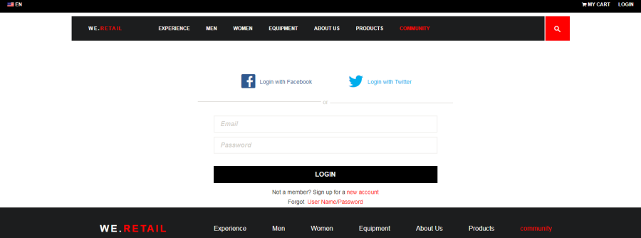

## Présentation de la connexion au réseau social {#social-login-overview}

Pour inclure la connexion au réseau social, il est *obligatoire* de créer des applications Facebook et Twitter personnalisées.

L’exemple we-retail fournit des exemples d’applications et de services cloud Facebook et Twitter, mais ils ne sont pas disponibles sur un [site web de production](../../help/sites-administering/production-ready.md).

Les étapes requises sont les suivantes :

1. [Activez l’authentification OAuth](#adobe-granite-oauth-authentication-handler) sur toutes les instances de publication AEM.

   Si OAuth n’est pas activé, les tentatives de connexion échouent.

1. **Créer** une application sociale et un service cloud.

   * Pour prendre en charge la connexion avec Facebook :

     * Créez une [application Facebook](#create-a-facebook-app).
     * Créer et publier un [service cloud Facebook Connect](#create-a-facebook-connect-cloud-service).

   * Pour prendre en charge la connexion avec Twitter :

     * Créez une [application Twitter](#create-a-twitter-app).
     * Créez et publiez un [service cloud Twitter Connect](#create-a-twitter-connect-cloud-service).

1. [**Activer** connexion au réseau social](#enable-social-login) pour un site communautaire.

Il existe deux concepts de base :

1. **Portée** (autorisations) indique les données que l’application est autorisée à demander.

   * Par défaut, les instances [Application et fournisseur OAuth Granite Adobe et Twitter](#adobe-granite-oauth-application-and-provider) incluent les autorisations d’application de base dans leur portée.

1. **Champs** (paramètres) indique les données réelles demandées à l’aide des paramètres d’URL.

   * Ces champs sont spécifiés dans le [fournisseur OAuth Facebook &#x200B;](#aem-communities-facebook-oauth-provider) et le [fournisseur OAuth Twitter AEM Communities](#aem-communities-twitter-oauth-provider).
   * Les champs par défaut sont suffisants dans la plupart des cas d’utilisation, mais ils peuvent être modifiés.

## Identifiant Facebook {#facebook-login}

### Version de l’API Facebook {#facebook-api-version}

La connexion sociale et l’exemple Facebook we-retail ont été développés lorsque l’API Facebook Graph était version 1.0.
Depuis AEM 6.4 GA et AEM 6.3 SP1, la connexion sociale a été mise à jour pour fonctionner avec la nouvelle version de l’API Facebook Graph 2.5.

>[!NOTE]
>
>Pour les versions plus anciennes d’AEM, si vous rencontrez une exception dans les journaux **Impossible d’extraire un jeton de ce**, effectuez la mise à niveau vers le dernier CFP pour cette version d’AEM.

Pour obtenir des informations sur la version de l’API Facebook Graph, consultez le [Journal des modifications de l’API Facebook](https://developers.facebook.com/docs/apps/changelog).

### Créer une application Facebook {#create-a-facebook-app}

Une application Facebook correctement configurée est requise pour activer la connexion au réseau social Facebook.

Pour créer une application Facebook, suivez les instructions de Facebook à l’adresse [&#128279;](https://developers.facebook.com/apps/). Les modifications apportées à leurs instructions ne sont pas reflétées dans les informations suivantes.

En général, à partir de l’API Facebook v2.7 :

* *Ajouter une nouvelle application Facebook*
  * Pour *Platform*, choisissez Site web :
    * Pour *URL du site*, saisissez `  https://<server>:<port>.`
    * Pour *Nom d’affichage*, saisissez un titre à utiliser comme titre du service de connexion Facebook.
    * Pour *Catégorie*, nous vous recommandons de choisir *Applications pour les pages*, mais il peut s’agir de n’importe quel élément.
    * *Ajouter un produit : Facebook Login*
    * Pour *URI de redirection OAuth valides*, saisissez `  https://<server>:<port>.`

>[!NOTE]
>
>Pour le développement, http://localhost:4503 fonctionnera.

Une fois l’application créée, recherchez les paramètres **[!UICONTROL ID d’application]** et **[!UICONTROL Secret d’application]**. Ces informations sont nécessaires à la configuration du [service cloud Facebook](#createafacebookcloudservice).

### Création d’un Cloud Service Facebook Connect {#create-a-facebook-connect-cloud-service}

L’instance [Application et fournisseur OAuth Granite &#x200B;](#adobe-granite-oauth-application-and-provider), instanciée lors de la création d’une configuration de service cloud, identifie l’application Facebook et le ou les groupes membres auxquels les nouveaux utilisateurs sont ajoutés.

1. Sur l’instance d’auteur AEM, connectez-vous avec les droits d’administrateur.
1. Dans la navigation globale, sélectionnez **[!UICONTROL Outils]** > **[!UICONTROL Services cloud]** > **[!UICONTROL Configuration de la connexion au réseau social Facebook]**.
1. Sélectionnez la configuration **[!UICONTROL chemin du contexte]**.

   Le **[!UICONTROL chemin d’accès au contexte]** doit être identique au chemin d’accès à la configuration cloud que vous avez sélectionné lors de la création/modification d’un site communautaire.

1. Vérifiez si votre chemin d’accès au contexte est activé pour créer des services cloud sous celui-ci.
1. Accédez à **[!UICONTROL Outils]** > **[!UICONTROL Général]** > **[!UICONTROL Navigateur de configuration]**. Sélectionnez votre contexte et modifiez les propriétés. Activez les configurations cloud si elles ne sont pas encore activées.

   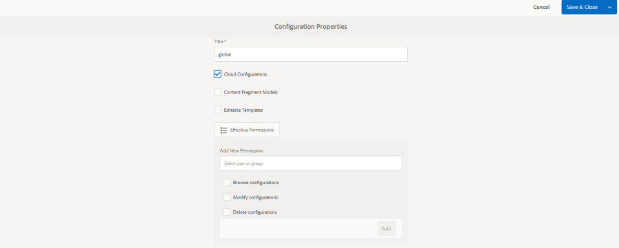

   * Pour plus d’informations, consultez la documentation relative à l’[Explorateur de configurations](/help/sites-administering/configurations.md).

1. **Créer/Modifier** Configuration du service cloud Facebook.

   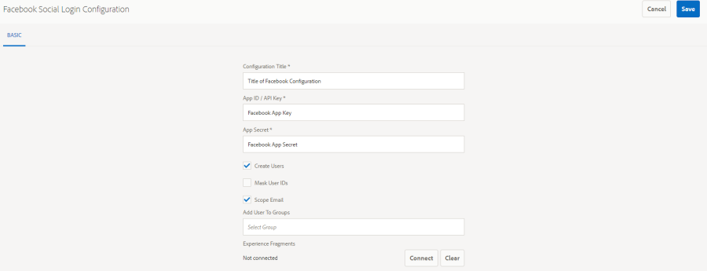

   * **[!UICONTROL Titre]** (*Obligatoire*) Saisissez un titre d’affichage qui identifie l’application Facebook. Utilisez le même nom saisi que le *Nom d’affichage* pour l’application Facebook.
   * **[!UICONTROL ID de l’application/Clé API]** (*obligatoire*) Saisissez l’***ID de l’application*** pour l’application Facebook. Cela identifie l’instance [Application et fournisseur OAuth Granite &#x200B;](https://helpx.adobe.com/experience-manager/6-3/communities/using/social-login.html#AdobeGraniteOAuthApplicationandProvider) créée à partir de la boîte de dialogue.
   * **[!UICONTROL Secret de l’application]** (*Obligatoire*) Saisissez le ***Secret de l’application*** pour l’application Facebook.
   * **[!UICONTROL Créer des utilisateurs]** Si cette case est cochée, la connexion avec un compte Facebook créera une entrée utilisateur AEM et l’ajoutera en tant que membre au(x) groupe(s) d’utilisateurs sélectionné(s).  La valeur par défaut est cochée (vivement recommandé).
   * **[!UICONTROL Masquer les ID utilisateur]** : laissez désélectionné.
   * **[!UICONTROL Étendue de l’e-mail]** : l’ID d’e-mail de l’utilisateur doit être récupéré sur Facebook.
   * **[!UICONTROL Ajouter aux groupes d’utilisateurs]** sélectionnez Ajouter un groupe d’utilisateurs pour choisir un ou plusieurs [groupes membres](https://helpx.adobe.com/experience-manager/6-3/communities/using/users.html) pour le site de la communauté auquel les utilisateurs seront ajoutés.

   >[!NOTE]
   >
   >Les groupes peuvent être ajoutés ou supprimés à tout moment. Mais les abonnements des utilisateurs existants ne sont pas affectés. L’abonnement automatique s’applique uniquement aux nouveaux utilisateurs créés après la mise à jour de ce champ. Pour les sites sur lesquels les utilisateurs anonymes sont désactivés, choisissez d’ajouter des utilisateurs au groupe de membres de la communauté correspondant, destiné à ce site de la communauté fermée.

   * Sélectionnez **[!UICONTROL ENREGISTRER]**.
   * **[!UICONTROL Publier]**.

Le résultat est une instance [Application et fournisseur OAuth Adobe Granite](https://helpx.adobe.com/experience-manager/6-3/communities/using/social-login.html#adobe-granite-oauth-application-and-provider) qui ne nécessite pas d’autres modifications, sauf si vous ajoutez une portée supplémentaire (autorisations). L’étendue par défaut est celle des autorisations standard pour la connexion Facebook. Si une portée supplémentaire est souhaitée, il est nécessaire de modifier directement la configuration OSGI. Si les modifications sont effectuées directement via le système ou la console, évitez de modifier les configurations de vos services cloud à partir de l’interface utilisateur tactile afin d’éviter tout remplacement.

### Fournisseur OAuth Facebook AEM Communities {#aem-communities-facebook-oauth-provider}

Le fournisseur AEM Communities étend l’instance [Application et fournisseur OAuth Granite Adobe](#adobe-granite-oauth-application-and-provider).

Ce fournisseur devra être modifié pour :

* Autoriser les mises à jour des utilisateurs
* Ajouter des champs supplémentaires [dans la portée](#adobe-granite-oauth-application-and-provider)

  * Tous les champs autorisés par défaut ne sont pas inclus par défaut.

Si une modification est nécessaire, sur chaque instance de publication AEM :

1. Connectez-vous avec des droits d’administrateur.
1. Accédez à la [console web](../../help/sites-deploying/configuring-osgi.md). Par exemple, http://localhost:4503/system/console/configMgr.
1. Recherchez le fournisseur OAuth Facebook AEM Communities .
1. Sélectionnez l’icône en forme de crayon à ouvrir pour modification.

   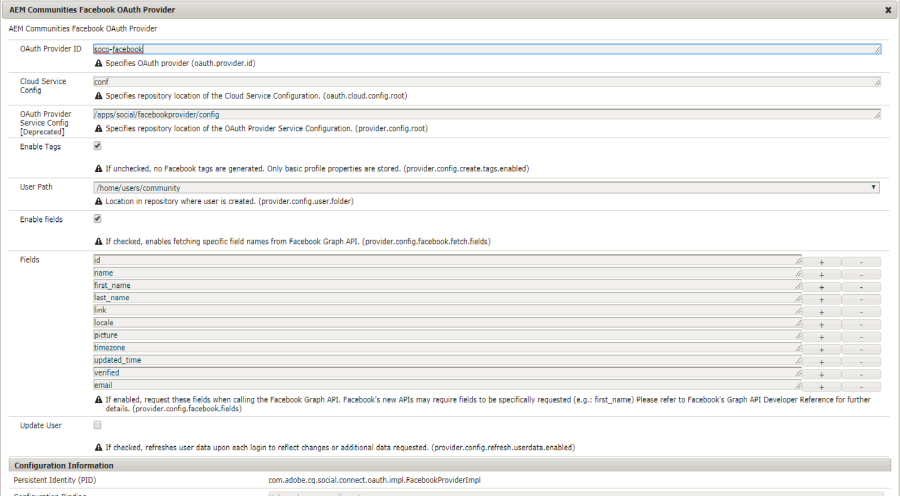

   * **[!UICONTROL ID de fournisseur OAuth]**

     (*Obligatoire*) La valeur par défaut est *soco -facebook*. Ne pas modifier.

   * **[!UICONTROL Configuration]**

     La valeur par défaut est `/etc/  cloudservices /  facebookconnect`. Ne pas modifier.

   * **[!UICONTROL Configuration du service du fournisseur OAuth]**

     La valeur par défaut est `/apps/social/facebookprovider/config/`. Ne pas modifier.

   * **[!UICONTROL Activer les balises]**

     Ne pas modifier.

   * **[!UICONTROL Chemin d’accès utilisateur]**

     Emplacement dans le référentiel où sont stockées les données utilisateur. Pour un site communautaire, afin de garantir les autorisations des membres pour afficher le profil d’un autre membre, le chemin d’accès doit être le chemin par défaut */home/users/community*.

   * **[!UICONTROL Activer les champs]**

     Si cette case est cochée, les champs répertoriés sont spécifiés dans la demande d’authentification et d’informations de l’utilisateur à Facebook. La valeur par défaut est désélectionnée.

   * **[!UICONTROL Champs]**

     Lorsque les champs sont activés, les champs suivants sont inclus lors de l’appel de l’API Facebook Graph. Les champs doivent être autorisés dans la portée définie dans la configuration du service cloud. Les champs supplémentaires peuvent nécessiter l&#39;approbation de Facebook. Référencez la section Autorisations de connexion Facebook de la documentation Facebook. Les champs par défaut ajoutés en tant que paramètres sont les suivants :

     * id
     * name
     * first_name
     * nom_de_famille
     * lien
     * paramètres régionaux
     * image
     * fuseau horaire
     * updated_time
     * vérifié
     * email

   Si un champ est ajouté ou modifié, mettez à jour la configuration du gestionnaire de synchronisation par défaut correspondant pour corriger le mappage.

   * **[!UICONTROL Mettre à jour utilisateur]**

     Si cette case est cochée, actualise les données utilisateur dans le référentiel à chaque connexion pour refléter les modifications du profil ou les données supplémentaires demandées. La valeur par défaut est désélectionnée.

#### Étapes suivantes {#next-steps}

Les étapes suivantes sont les mêmes pour Facebook et Twitter :

* [Publication des configurations de service cloud](#publishcloudservices)
* [Activer pour un site communautaire](#enable-social-login)

## Identifiant Twitter {#twitter-login}

### Créer une application Twitter {#create-a-twitter-app}

Une application Twitter configurée est nécessaire pour activer la connexion au réseau social Twitter.

Suivez les dernières instructions pour créer une application Twitter sur [&#128279;](https://apps.twitter.com/).

En général :

1. Saisissez un *Nom* qui identifiera votre application Twitter pour les utilisateurs de votre site web.
1. Saisissez une *Description*.
1. Pour *site web* - saisissez `https://<server>`.
1. Pour *URL de rappel* - saisissez `https://server`.

   >[!NOTE]
   >
   >Il n’est pas nécessaire de spécifier le port.
   >
   >Pour le développement, 127.0.0.1/ fonctionnera.

1. Une fois l’application créée, recherchez les **[!UICONTROL Clé du client (API)]** et **[!UICONTROL Secret du client (API)]**. Ces informations seront nécessaires pour configurer le [service cloud Twitter](#createatwittercloudservice).

#### Autorisations {#permissions}

Dans la section Autorisations de la gestion des applications Twitter :

* **[!UICONTROL Accès]** : sélectionnez `Read only`.

  * Les autres options ne sont pas prises en charge

* **[!UICONTROL Autorisations supplémentaires]** : vous pouvez éventuellement choisir `Request email addresses from users`.

  * Si cette option n’est pas sélectionnée, le profil utilisateur d’AEM n’inclut pas son adresse e-mail.
  * Les instructions de Twitter notent les mesures supplémentaires à prendre.

La seule requête REST effectuée pour la connexion au réseau social consiste à *[OBTENIR le compte/vérifier les informations d’identification](https://dev.twitter.com/rest/reference/get/account/verify_credentials)*.

### Création d’un Cloud Service Twitter Connect {#create-a-twitter-connect-cloud-service}

L’instance [Application et fournisseur OAuth Granite &#x200B;](#adobe-granite-oauth-application-and-provider), instanciée lors de la création d’une configuration de service cloud, identifie l’application Twitter et le ou les groupes membres auxquels les nouveaux utilisateurs sont ajoutés.

1. Sur l’instance d’auteur, connectez-vous avec les droits d’administrateur.
1. Dans la navigation globale, sélectionnez **[!UICONTROL Outils]** > **[!UICONTROL Services cloud]** > **[!UICONTROL Configuration de la connexion au réseau social Twitter]**.
1. Choisissez la configuration **[!UICONTROL chemin d’accès au contexte]**.

   Le chemin d’accès au contexte doit être identique au chemin d’accès à la configuration cloud que vous avez sélectionné lors de la création/modification d’un site communautaire.

1. Vérifiez si votre chemin d’accès au contexte est activé pour créer des services cloud sous celui-ci.
1. Accédez à **[!UICONTROL Outils]** > **[!UICONTROL Général]** > **[!UICONTROL Navigateur de configuration]**. Sélectionnez votre contexte et modifiez les propriétés. Activez les configurations cloud si elles ne sont pas encore activées.

   

   * Pour plus d’informations, consultez la documentation relative à l’[Explorateur de configurations](/help/sites-administering/configurations.md).

1. Créez/modifiez la configuration du service cloud Twitter.

   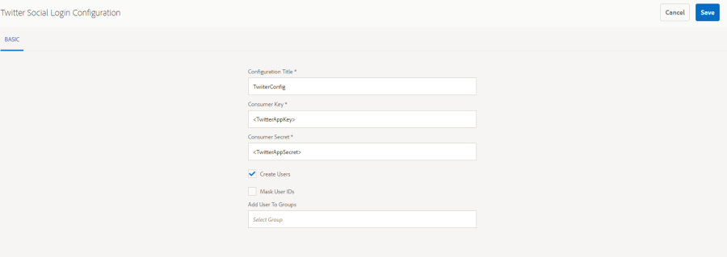

   * **[!UICONTROL Titre]**

     (*Obligatoire*) Saisissez un titre d’affichage qui identifie l’application Twitter. Utilisez le même nom saisi que le *Nom d’affichage* pour l’application Twitter.

   * **[!UICONTROL Consumer Key]**

     (*Obligatoire*) Saisissez la clé **Consommateur (API)** pour l’application Twitter. Cela identifie l’instance [Application et fournisseur OAuth Granite &#x200B;](https://helpx.adobe.com/experience-manager/6-3/communities/using/social-login.html#AdobeGraniteOAuthApplicationandProvider) créée à partir de la boîte de dialogue.

   * **[!UICONTROL Secret du client]**

     (*Obligatoire*) Saisissez le ***Secret du client (API)*** pour l’application Twitter.

   * **[!UICONTROL Créer des utilisateurs]**

     Si cette case est cochée, la connexion à l’aide d’un compte Twitter crée une entrée utilisateur AEM et l’ajoute en tant que membre au(x) groupe(s) d’utilisateurs sélectionné(s). La valeur par défaut est cochée (vivement recommandé).

   * **[!UICONTROL Masquer les ID utilisateur]**

     Laisser désélectionné.

   * **[!UICONTROL Ajouter aux groupes d’utilisateurs]**

     Sélectionnez Ajouter un groupe d’utilisateurs pour choisir un ou plusieurs [groupes membres](https://helpx.adobe.com/experience-manager/6-3/communities/using/users.html) pour le site communautaire auquel les utilisateurs seront ajoutés.

   >[!NOTE]
   >
   >Les groupes peuvent être ajoutés ou supprimés à tout moment. Mais les abonnements des utilisateurs existants ne sont pas affectés. L’abonnement automatique s’applique uniquement aux nouveaux utilisateurs créés après la mise à jour de ce champ. Pour les sites sur lesquels les utilisateurs anonymes sont désactivés, ajoutez des utilisateurs au groupe de membres de la communauté correspondant destiné à ce site de la communauté fermée.
   >

1. Sélectionnez **[!UICONTROL ENREGISTRER]** et **[!UICONTROL Publier]**.

Le résultat est une instance [Application et fournisseur OAuth Granite &#x200B;](https://helpx.adobe.com/experience-manager/6-3/communities/using/social-login.html#adobe-granite-oauth-application-and-provider) qui ne nécessite aucune modification supplémentaire. La portée par défaut est celle des autorisations standard pour la connexion à Twitter.

### Fournisseur OAuth Twitter AEM Communities {#aem-communities-twitter-oauth-provider}

La configuration d’AEM Communities étend l’instance [Application et fournisseur OAuth Granite Adobe](#adobe-granite-oauth-application-and-provider). Ce fournisseur devra être modifié pour autoriser les mises à jour des utilisateurs.

Si une modification est nécessaire, sur chaque instance de publication AEM :

1. Connectez-vous avec des droits d’administrateur.
1. Accédez à la [console web](../../help/sites-deploying/configuring-osgi.md).

   Par exemple, http://localhost:4503/system/console/configMgr.

1. Recherchez le fournisseur OAuth Twitter AEM Communities .
1. Sélectionnez l’icône en forme de crayon à ouvrir pour modification.

   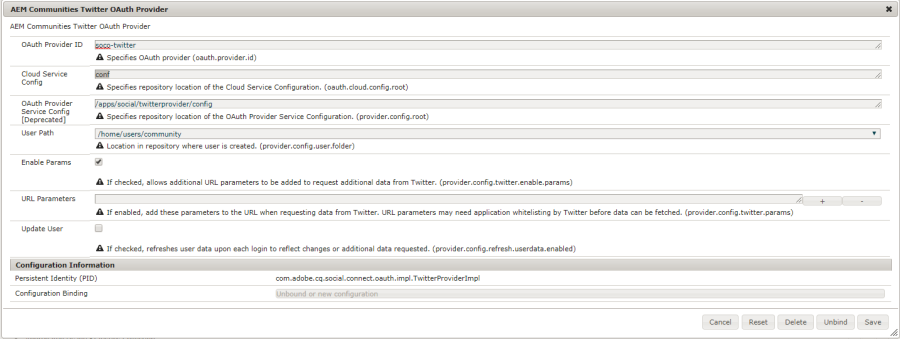

   * **[!UICONTROL ID de fournisseur OAuth]**

   (*Obligatoire*) La valeur par défaut est *soco -twitter*. Ne pas modifier.

   * **[!UICONTROL Configuration]**

     La valeur par défaut est *conf.* Ne pas modifier.

   * **[!UICONTROL Configuration du service du fournisseur OAuth]**

     La valeur par défaut est `/apps/social/twitterprovider/config/`. Ne pas modifier.

   * **[!UICONTROL Chemin d’accès utilisateur]**

     Emplacement dans le référentiel où sont stockées les données utilisateur. Pour un site communautaire, afin de garantir les autorisations des membres pour afficher le profil d’un autre membre, le chemin d’accès doit être le `/home/users/community` par défaut.

   * **[!UICONTROL Activer les paramètres]** - ne pas modifier
   * **[!UICONTROL Paramètres d’URL]** - ne pas modifier
   * **[!UICONTROL Mettre à jour utilisateur]**

     Si cette case est cochée, actualise les données utilisateur dans le référentiel à chaque connexion pour refléter les modifications du profil ou les données supplémentaires demandées. La valeur par défaut est désélectionnée.

#### Étapes suivantes {#next-steps-1}

Les étapes suivantes sont les mêmes pour Facebook et Twitter :

* [Publication des configurations de service cloud](#publishcloudservices)
* [Activer pour un site communautaire](#enable-social-login)

## Activer la connexion au réseau social {#enable-social-login}

### Console Sites AEM Communities {#aem-communities-sites-console}

Une fois qu’un service cloud est configuré, il peut être activé pour le paramètre de connexion au réseau social approprié pour un site communautaire à l’aide du sous-panneau [Gestion des utilisateurs](https://helpx.adobe.com/experience-manager/6-3/communities/using/sites-console.html#USERMANAGEMENT) Paramètres lors de la [création](https://helpx.adobe.com/experience-manager/6-3/communities/using/sites-console.html#SiteCreation) ou [gestion](https://helpx.adobe.com/experience-manager/6-3/communities/using/sites-console.html#ModifyingSiteProperties) du site communautaire.

1. Choisissez le contexte de configuration de votre site où vous avez enregistré vos configurations de connexion au réseau social.

1. Dans l’onglet Général , définissez les configurations cloud.

   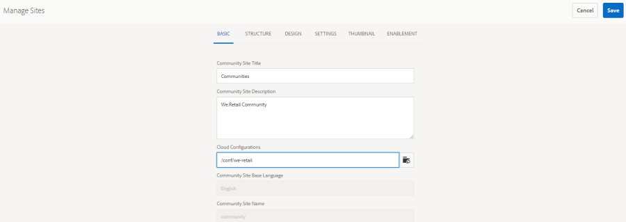

1. Sur l’onglet Paramètres , activez **[!UICONTROL Connexions aux réseaux sociaux]** et Enregistrer.

   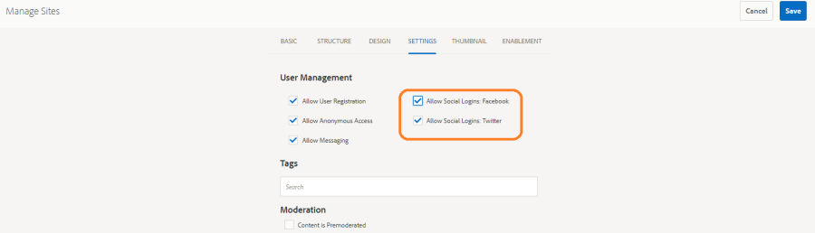

## Tester la connexion au réseau social {#test-social-login}

* Assurez-vous que le [Gestionnaire d’authentification OAuth Granite &#x200B;](#adobe-granite-oauth-authentication-handler) a été activé sur toutes les instances de publication.
* Vérifiez que les services cloud ont été publiés.
* Vérifiez que le site de la communauté a été publié.
* Lancez le site publié dans un navigateur.
Par exemple, http://localhost:4503/content/sites/engage/en.html
* Sélectionnez **[!UICONTROL Connexion]**.
* Sélectionnez **[!UICONTROL Se connecter avec Facebook]** ou **[!UICONTROL Se connecter avec Twitter]**.
* Si ce n’est pas déjà fait, connectez-vous avec les identifiants appropriés sur Facebook ou Twitter.
* Il peut être nécessaire d’accorder une autorisation en fonction de la boîte de dialogue affichée par l’application Facebook ou Twitter.
* Notez que la barre d’outils située en haut de la page est mise à jour pour refléter la réussite de la connexion.
* Sélectionnez **[!UICONTROL Profil]** : la page Profil affiche l’image d’avatar de l’utilisateur, son prénom et son nom. Il affiche également les informations du profil Facebook ou Twitter en fonction des champs/paramètres autorisés.

## Configurations OAuth d’AEM Platform {#aem-platform-oauth-configurations}

### Gestionnaire d’authentification OAuth Granite Adobe {#adobe-granite-oauth-authentication-handler}

Le `Adobe Granite OAuth Authentication Handler` n’est pas activé par défaut et ***doit être activé sur toutes les instances de publication AEM.***

Pour activer le gestionnaire d’authentification lors de la publication, ouvrez simplement la configuration OSGi et enregistrez-la :

* Connectez-vous avec des droits d’administrateur.
* Accédez à la [console web](../../help/sites-deploying/configuring-osgi.md).
Par exemple, http://localhost:4503/system/console/configMgr
* Localisez `Adobe Granite OAuth Authentication Handler`.
* Sélectionnez pour ouvrir la configuration à modifier.
* Sélectionnez **[!UICONTROL Enregistrer]**.

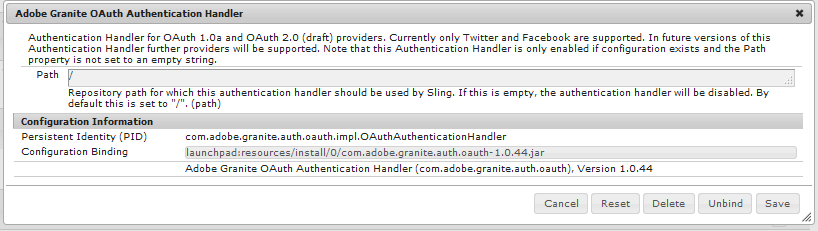

>[!CAUTION]
>
>Veillez à ne pas confondre le gestionnaire d’authentification avec une instance Facebook ou Twitter de *Application et fournisseur OAuth Granite*.

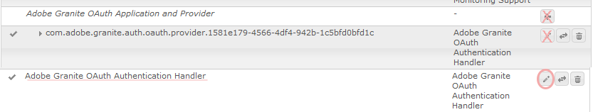

### Application et fournisseur OAuth Granite Adobe {#adobe-granite-oauth-application-and-provider}

Lorsqu’un service cloud pour Facebook ou Twitter est créé, une instance de `Adobe Granite OAuth Authentication Handler` est créée.

Pour localiser l’instance créée pour une application Facebook ou Twitter :

1. Connectez-vous avec des droits d’administrateur.
1. Accédez à la [console web](../../help/sites-deploying/configuring-osgi.md).

   Par exemple, http://localhost:4503/system/console/configMgr.

1. Recherchez l’application OAuth Granite Adobe et le fournisseur .

   * Localisez l’instance sur laquelle **[!UICONTROL ID client]** correspond à l’**[!UICONTROL ID de l’application]**.

     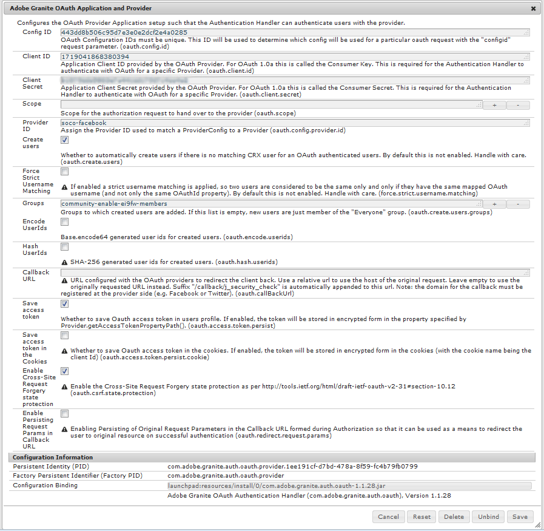

     À l’exception des propriétés suivantes, ne modifiez pas les autres propriétés de la configuration :

   * **[!UICONTROL ID de configuration]**

     (*Obligatoire*) Les identifiants de configuration OAuth doivent être uniques. Généré automatiquement lors de la création du service cloud.

   * **[!UICONTROL Identifiant client]**

     (*Obligatoire*) ID d’application fourni lors de la création du service cloud.

   * **[!UICONTROL Secret client]**

     (*Obligatoire*) Secret d’application fourni lors de la création du service cloud.

   * **[!UICONTROL Portée]**

     (*Facultatif*) Une étendue supplémentaire pour ce qui est autorisé peut être demandée au fournisseur. La portée par défaut couvre les autorisations nécessaires pour fournir l’authentification sociale et les données de profil.

   * **[!UICONTROL Identifiant du fournisseur]**

     (*Obligatoire*) L’ID de fournisseur pour AEM Communities est défini lors de la création du service cloud. Ne pas modifier. Pour Facebook Connect, la valeur est *soco -facebook*. Pour Twitter Connect, la valeur est *soco -twitter*.

   * **[!UICONTROL Groupes]**

     (*Recommandé*) Un ou plusieurs groupes membres auxquels sont ajoutés des utilisateurs créés. Pour AEM Communities, il est recommandé de répertorier le groupe de membres pour le site de la communauté.

   * **[!UICONTROL URL de rappel]**

     (*Facultatif*) URL configurée avec les fournisseurs OAuth pour rediriger le client. Utilisez une URL relative pour utiliser l’hôte de la requête d’origine. Laissez le champ vide pour utiliser l’URL demandée à la place. Le suffixe « /callback/j_security_check » est automatiquement ajouté à cette URL .

   >[!NOTE]
   >
   >Le domaine du rappel doit être enregistré auprès du fournisseur (Facebook ou Twitter).

Pour chaque configuration de gestionnaire d’authentification OAuth, il existe deux configurations supplémentaires créées dans l’instance :

* Gestionnaire de synchronisation par défaut d’Apache Jackrabbit Oak (org.apache.jackrabbit.oak.spi.security.authentication.external.impl.DefaultSyncHandler) : aucune modification n’est requise, mais vous pouvez examiner les mappages de champs utilisateur et la manière dont les champs Facebook sont mappés à un nœud de profil utilisateur CQ. Notez également que « Nom du gestionnaire de synchronisation » correspond à l’ID de configuration de la configuration du fournisseur OAuth.
* Module de connexion externe Apache Jackrabbit Oak (org.apache.jackrabbit.oak.spi.security.authentication.external.impl.ExternalLoginModuleFactory) : aucune modification n’est requise, mais vous remarquerez peut-être que « Nom du fournisseur d’identité » et « Nom du gestionnaire de synchronisation » sont identiques et pointent vers les configurations OAuth et du gestionnaire de synchronisation correspondantes respectivement.

Pour plus d’informations, voir [&#x200B; Authentification avec le module de connexion externe Apache Oak &#x200B;](https://jackrabbit.apache.org/oak/docs/security/authentication/externalloginmodule.html).

## Performances de parcours utilisateur OAuth {#oauth-user-traversal-performance}

Pour les sites de la communauté qui voient des centaines de milliers d’utilisateurs s’enregistrer à l’aide de leur connexion Facebook ou Twitter, la performance de traversée de la requête effectuée lorsqu’un visiteur du site utilise sa connexion sociale peut être améliorée en ajoutant l’index Oak suivant.

Si des avertissements de traversée sont affichés dans les journaux, il est recommandé d’ajouter cet index.

Sur une instance d’auteur, connecté avec des droits d’administrateur :

1. Dans la navigation globale : sélectionnez **Outils, [CRX/DE Lite](../../help/sites-developing/developing-with-crxde-lite.md).**.
1. Créez un index nommé ntBaseLucene-oauth à partir d’une copie de ntBaseLucene :

   * Sous le nœud `/oak:index`
   * Sélectionner le `ntBaseLucene` de nœud
   * Sélectionnez **[!UICONTROL Copier]**
   * Sélectionnez `/oak:index`.
   * Sélectionnez **[!UICONTROL Coller]**
   * Renommer la copie de ntBaseLucene en `ntBaseLucene-oauth`

1. Modifiez les propriétés du nœud ntBaseLucene-oauth :

   * **[!UICONTROL indexPath]** : `/oak:index/ntBaseLucene-oauth`
   * **[!UICONTROL name]** : `oauthid-123****`
   * **[!UICONTROL reindex]** : `true`
   * **[!UICONTROL reindexCount]** : `1`

1. Sous le nœud /oak:index/ntBaseLucene-oauth/indexRules/nt:base/properties :

   * Supprimez tous les nœuds enfants, à l’exception de cqTags.
   * Renommer cqTags en `oauthid-123****`
   * Modification des propriétés des `oauthid-123****` de nœud

     * **[!UICONTROL name]** : `oauthid-123****`

   * Sélectionnez **[!UICONTROL Enregistrer tout]**.

* Pour le `oauthid-123` **name**, remplacez *123* par la clé Facebook ***ID de l’application*** ou Twitter ***Clé du client (API)*** qui correspond à la valeur de l’**ID du client** dans la configuration [Application OAuth Granite Adobe et fournisseur](social-login.md#adobe-granite-oauth-application-and-provider).

  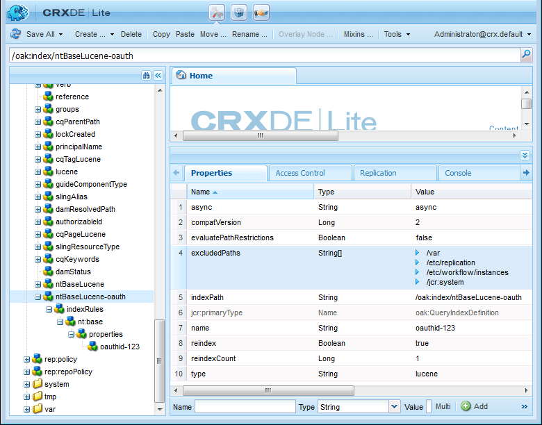

Pour plus d’informations et d’outils, voir [Requêtes et indexation &#x200B;](../../help/sites-deploying/queries-and-indexing.md).

## Configuration du Dispatcher {#dispatcher-configuration}

Voir [Configuration de Dispatcher pour Communities](dispatcher.md).
