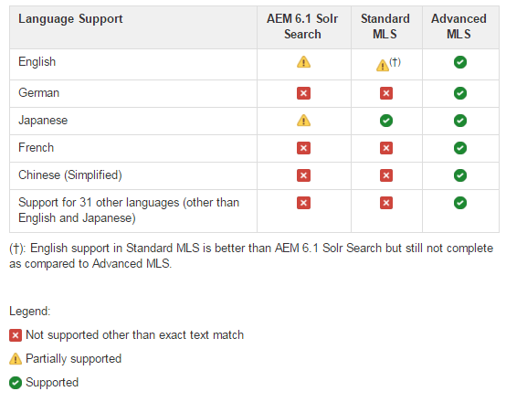

# Configuration de Solr pour SRP {#solr-configuration-for-srp}

## Solr pour AEM Platform {#solr-for-aem-platform}

Une installation [Apache Solr](https://solr.apache.org/) peut être partagée entre le [magasin de nœuds](../../help/sites-deploying/data-store-config.md) (Oak) et le [magasin commun](working-with-srp.md) (SRP) à l’aide de collections différentes.

Si les collections Oak et SRP sont utilisées de manière intensive, un second Solr peut être installé pour des raisons de performances.

Pour les environnements de production, le [mode SolrCloud](#solrcloud-mode) offre de meilleures performances par rapport au mode autonome (une configuration Solr unique et locale).

### Exigences {#requirements}

Téléchargez et installez Apache Solr :

* [Version 7.0](https://archive.apache.org/dist/lucene/solr/7.0.0/)

* Solr nécessite Java™ 1.7 ou une version ultérieure
* Aucun service n’est nécessaire
* Choix des modes d’exécution :

   * Mode autonome
   * [mode SolrCloud](#solrcloud-mode) (recommandé pour les environnements de production)

* Choix de la recherche multilingue (MLS)

   * [Installation de MLS standard](#installing-standard-mls)
   * [Installation du MLS avancé](#installing-advanced-mls)

## Mode SolrCloud {#solrcloud-mode}

Le mode [SolrCloud](https://solr.apache.org/guide/6_6/solrcloud.html) est recommandé pour les environnements de production. En mode SolrCloud, SolrCloud doit être installé et configuré avant d’installer la recherche multilingue (MLS).

Il est recommandé de suivre les instructions d’installation de SolrCloud :

* 3 nœuds SolrCloud sur le même serveur.
* Un Apache ZooKeeper externe.

Il est également recommandé de configurer JVM pour ajuster l’utilisation de la mémoire et le nettoyage.

### Exemple de configuration JVM {#jvm-configuration-example}

```shell
JVM_OPTS="-server -Xmx2048m -XX:+UseConcMarkSweepGC -XX:+CMSClassUnloadingEnabled -Xloggc:../logs/gc.log -XX:+PrintGCDetails -XX:+PrintGCDateStamps -Djava.awt.headless=true"
```

### Commandes de configuration SolrCloud {#solrcloud-setup-commands}

Lors de l’exécution en mode SolrCloud, avant l’installation de MLS, il est nécessaire d’utiliser et de connaître les commandes de configuration SolrCloud suivantes.

#### &#x200B;1. Charger une configuration sur ZooKeeper {#upload-a-configuration-to-zookeeper}

Référence :
[](https://solr.apache.org/guide/6_6/command-line-utilities.html)

Utilisation :
sh ./scripts/cloud-scripts/zkcli.sh \
-cmd upconfig \
-zkhost *serveur:port* \
-confname *myconfig-name *\
-solrhome *solr-home-path* \
-confdir *config-dir*

#### &#x200B;2. Création d’une collection {#create-a-collection}

Référence :
[](https://solr.apache.org/guide/6_6/solr-control-script-reference.html#SolrControlScriptReference-Create)

Utilisation :
./bin/solr créer \
-c *mycollection-name*\
-d *config-dir* \
-n *myconfig-name* \
-p *port*\
-s *nombre de partitions* \
-rf *nombre-de-répliques*

#### &#x200B;3. Liaison d’une collection à un jeu de configuration {#link-a-collection-to-a-configuration-set}

Associez une collection à une configuration déjà téléchargée sur ZooKeeper.

Référence :
[](https://solr.apache.org/guide/6_6/command-line-utilities.html)

Utilisation :
sh ./scripts/cloud-scripts/zkcli.sh \
-cmd linkconfig \
-zkhost *serveur:port* \
-collection *mycollection-name* \
-confname *myconfig-name*

### Comparaison entre MLS standard et avancé {#comparison-of-standard-and-advanced-mls}

La recherche multilingue (MLS) pour AEM Communities est conçue pour la plateforme Solr afin de fournir une recherche améliorée dans toutes les langues prises en charge, y compris l’anglais.

MLS pour AEM Communities est disponible en tant que MLS standard ou MLS avancé. Le MLS standard inclut uniquement les paramètres de configuration Solr et exclut tous les plug-ins ou fichiers de ressources. Advanced MLS est la solution la plus complète et comprend les paramètres de configuration Solr, les plug-ins et les ressources associées

Le MLS standard comprend des améliorations pour la recherche de contenu dans les langues suivantes :

* Anglais : amélioration de la méthode stemmer pour tenter de faire correspondre les dérivations de mots.
* Japonais : amélioration de la segmentation en unités lexicales japonaises pour les caractères à demi-largeur.

Le MLS avancé comprend des améliorations pour la recherche de contenu dans les langues suivantes :

* Anglais : Remplacé l&#39;étamer par le lemmatizer.
* Allemand : ajout du décomposeur.
* Français : ajout de la gestion des émissions.
* Chinois (simplifié) : ajout d’un jeton plus intelligent.
* Diverses langues : ajout d’un élément, d’une liste de mots vides et d’un normalisateur.

Au total, les 33 langues suivantes sont prises en charge dans Advanced MLS.

| Arabe | Allemand | Norvégien |
|---|---|---|
| Bulgare | Grec | Polonais |
| Chinois (simplifié) | Créole haïtien | Portugais |
| Chinois (traditionnel) | Hébreu | Roumain |
| Tchèque | Hongrois | Russe |
| Danois | Indonésien | Slovaque |
| Néerlandais | Italien | Slovène |
| Anglais | Japonais | Espagnol |
| Estonien | Coréen | Suédois |
| Finnois | Lette | Thaïlandais |
| Français | Lituanien | Turc |

#### Comparaison entre la recherche Solr AEM 6.1, le MLS standard et le MLS avancé {#comparison-of-aem-solr-search-standard-mls-and-advanced-mls}

**Remarque** : AEM 6.1 fait référence à AEM 6.1 Communities FP3 et versions antérieures.



### Installation de MLS standard {#installing-standard-mls}

Pour la collection SRP (MSRP ou DSRP), pour prendre en charge la recherche multilingue standard (MLS), il est nécessaire de modifier deux des fichiers de configuration de Solr :

* **schema.xml**
* **solrconfig.xml**

Fichiers MLS standard (schema.xml, solrconfig.xml) pour Solr 4.10.

Fichiers MLS standard (schema.xml, solrconfig.xml) pour Solr 5.x.

Les fichiers MLS standard sont stockés dans le référentiel AEM.

**Remarque** : bien que les fichiers Solr soient stockés dans le dossier msrp/, ils sont également destinés à DSRP (aucune modification n’est nécessaire).

**Instructions de téléchargement** : remplacez `solrX` par `solr4` ou `solr5`, le cas échéant.

1. À l’aide de CRXDE|Lite, localisez :

   * `/libs/social/config/datastore/msrp/solrX/schema.xml`
   * `/libs/social/config/datastore/msrp/solrX/solrconfig.xml`

1. Téléchargez sur le serveur local sur lequel Solr est déployé.

   * Recherchez la propriété `jcr:data` du nœud `jcr:content`.
   * Pour lancer le téléchargement, sélectionnez `view`.
   * Assurez-vous que les fichiers sont enregistrés avec les noms et le codage appropriés (UTF8).

1. Suivez les instructions d’installation en mode autonome ou SolrCloud.

#### Mode SolrCloud - MLS standard {#solrcloud-mode-standard-mls}

1. Installez et configurez Solr en mode SolrCloud.
1. Préparez une nouvelle configuration :

   1. Créez new-config-dir* tel que `solr-install-dir*/myconfig/`

   1. Copiez le contenu du répertoire de configuration Solr existant dans *new-config-dir*

      * Pour Solr4 : copier `solr-install-dir/example/solr/collection1/conf/`
      * Pour Solr5 : copier `solr-install-dir/server/solr/configsets/data_driven_schema_configs/`

   1. Copiez les fichiers **schema.xml** et **solrconfig.xml** téléchargés dans *new-config-dir* pour remplacer les fichiers existants.

1. [Chargez la nouvelle configuration](#upload-a-configuration-to-zookeeper) sur ZooKeeper.
1. [Créez une collection](#create-a-collection) en spécifiant les paramètres nécessaires, tels que le nombre de partitions, le nombre de répliques et le nom de la configuration.
1. Si le nom de la configuration n’a *pas* été fourni lors de la création de la collection, [liez cette collection nouvellement créée](#link-a-collection-to-a-configuration-set) avec la configuration chargée dans ZooKeeper.

1. Pour MSRP, exécutez [MSRP Reindex Tool](msrp.md#msrp-reindex-tool), sauf si cette installation est nouvelle.

#### Mode autonome - MLS standard {#standalone-mode-standard-mls}

1. Installez Solr en mode autonome.
1. Si vous exécutez Solr5, créez une collection1 (similaire à Solr4) :

   * `./bin/solr start`
   * `./bin/solr create_core -c collection1 -d sample_techproducts_configs`

1. Sauvegardez **schema.xml** et **solrconfig.xml** dans le répertoire de configuration Solr, par exemple :

   * Pour Solr4 : `solr-install-dir/example/solr/collection1/conf/`
   * Créé pour Solr5 : `solr-install-dir/server/solr/collection1/conf/`

1. Copiez les fichiers **schema.xml** et **solrconfig.xml** téléchargés dans ce même répertoire.

1. Redémarrez Solr.
1. Pour MSRP, exécutez [MSRP Reindex Tool](#msrpreindextool), sauf si cette installation est nouvelle.

### Installation du MLS avancé {#installing-advanced-mls}

Pour que la collecte SRP (MSRP ou DSRP) prenne en charge le MLS avancé, de nouveaux plug-ins Solr sont requis en plus d’un schéma personnalisé et d’une configuration Solr. Tous les éléments requis sont regroupés dans un fichier zip téléchargeable. En outre, un script d’installation est inclus pour une utilisation lorsque Solr est déployé en mode autonome.

Pour obtenir le package MLS avancé, consultez [MLS avancé ](deploy-communities.md#aem-advanced-mls) dans la section de déploiement de la documentation.

Pour commencer l’installation de en mode SolrCloud ou autonome :

* Téléchargez l’archive zip AEM-SOLR-MLS sur le serveur hébergeant Solr.
* Décompressez l’archive.

#### Mode SolrCloud - MLS avancé {#solrcloud-mode-advanced-mls}

Instructions d’installation - notez les quelques différences pour Solr4 et Solr5 :

1. Installez et configurez Solr en mode SolrCloud.
1. Extrayez le contenu du package MLS avancé sur le disque. Le contenu doit inclure :

   * **schema.xml**
   * **solrconfig.xml**
   * **dossier mots vides/**
   * **dossier profiles/**
   * **dossier extra-libs/**

1. Préparez une nouvelle configuration :

   1. Créez un *new-config-dir*

      * Par exemple `solr-install-dir/myconfig/`
      * Créer des sous-dossiers `stopwords/` et `lang/`

   1. Copiez le contenu du répertoire de configuration Solr existant dans *new-config-dir*

      * Pour Solr4 : Copier `solr-install-dir/example/solr/collection1/conf/`
      * Pour Solr5 : Copier `solr-install-dir/server/solr/configsets/data_driven_schema_configs/`

   1. Copiez les **schema.xml** et **solrconfig.xml** extraits dans *new-config-dir* pour remplacer les fichiers existants.
   1. Pour Solr5 : Copier le `solr_install_dir/server/solr/configsets/sample_techproducts_configs/conf/lang/*.txt` dans `new-config-dir/lang/`
   1. Copiez le dossier **mots vides/** extrait dans *new-config-dir* pour obtenir le `new-config-dir/stopwords/*.txt`

1. [Chargez la nouvelle configuration](#upload-a-configuration-to-zookeeper) sur ZooKeeper.
1. Copiez le nouveau dossier **profils/**...

   * Pour Solr4 : copie dans le dossier resources/ de chaque nœud
   * Pour Solr5 : copiez-le dans le dossier server/resources/ de chaque installation Solr. Si tous les nœuds se trouvent dans le même répertoire d’installation Solr, cette étape n’est effectuée qu’une seule fois.

1. Créez un dossier **lib/** dans le répertoire solr-home (contient le fichier solr.xml) de chaque nœud dans SolrCloud. Copiez les fichiers jar des emplacements suivants dans le nouveau dossier lib/ sur chaque nœud :

   * **extra-libs/** extraits du package MLS avancé
   * *solr-install-dir/contrib/extraction/lib/*.jar
   * *solr-install-dir/dist/solr-cell*.jar
   * *solr-install-dir/contrib/clustering/lib/*.jar
   * *solr-install-dir/dist/solr-clustering*.jar
   * *solr-install-dir/contrib/langid/lib/*.jar
   * *solr-install-dir/dist/solr-langid*.jar
   * *solr-install-dir/contrib/velocity/lib/*.jar
   * *solr-install-dir/dist/solr-velocity*.jar
   * *solr-install-dir/contrib/analysis-extras/lib/*.jar
   * *solr-install-dir/contrib/analysis-extras/lucene-libs/*.jar

1. [Créez une collection](#create-a-collection) en spécifiant les paramètres nécessaires, tels que le nombre de partitions, le nombre de répliques et le nom de la configuration.
1. Si le nom de la configuration n’a *pas* été fourni lors de la création de la collection, [liez cette collection nouvellement créée](#link-a-collection-to-a-configuration-set) avec la configuration chargée dans ZooKeeper.

1. Pour MSRP, exécutez [MSRP Reindex Tool](#msrpreindextool), sauf si cette installation est nouvelle.

#### Mode autonome - MLS avancé {#standalone-mode-advanced-mls}

Un script d’installation est inclus dans le package MLS avancé.

Une fois le contenu du package extrait sur le serveur hébergeant le serveur autonome Solr, exécutez le script d’installation pour installer les ressources et fichiers de configuration nécessaires.

* Installez Solr en mode autonome.
* Si vous exécutez Solr5, créez une collection1 (similaire à Solr4) :

   * `./bin/solr start`
   * `./bin/solr create_core -c collection1 -d sample_techproducts_configs`

* Exécutez le script d’installation : Installez [-v 4|5] [-d solrhome] [-c collectionpath .]
où :

   * -d solrhome

     Répertoire d’installation de Solr

   * -c collectionpath

     Chemin de la collection dans solr

   * --help

     Options de ligne de commande d’impression

   * -v [4|5]

     Définir la version de solr

* Exemple pour Solr 4.10.4 :

   * Install.bat -v 4 -d c:/solr-4.10.4 -c:/solr-4.10.4/example/solr/collection1

* Exemple pour Solr 5.4.0 :

   * Install.sh -v 5 -d /tmp/solr-5.4.0 -c /tmp/solr-5.4.0/server/solr/collection1

**Remarque** :

* Le script d’installation sauvegarde schema.xml et solrconfig.xml avant d’installer de nouvelles versions en ajoutant « .orig »

### À propos de solrconfig.xml {#about-solrconfig-xml}

Le fichier **solrconfig.xml** contrôle l’intervalle de validation automatique et la visibilité de la recherche. Il nécessite des tests et des réglages.

`<autoCommit>` : par défaut, l’intervalle AutoCommit, qui correspond à une validation stricte vers un stockage stable, est défini sur 15 secondes. La visibilité de la recherche est définie par défaut sur l’utilisation de l’index de prévalidation.

Pour modifier la recherche afin d’utiliser un index mis à jour pour refléter les modifications dues à la validation, définissez la `openSearcher` contenue sur true.

`autoSoftCommit` : une validation &#39;soft&#39; garantit que les modifications sont visibles (l&#39;index est mis à jour), mais ne garantit pas que les modifications sont synchronisées avec un stockage stable (validation hard). Il en résulte une amélioration des performances. Par défaut, `autoSoftCommit` est désactivé avec la `maxTime` contenue définie sur -1.
