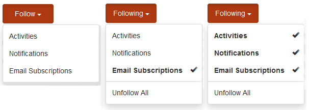
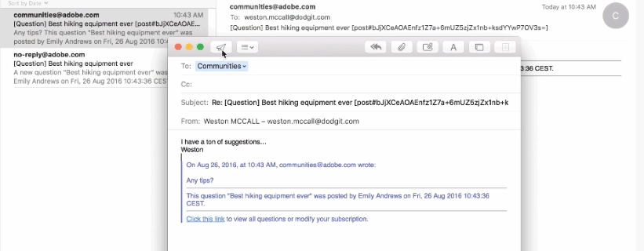
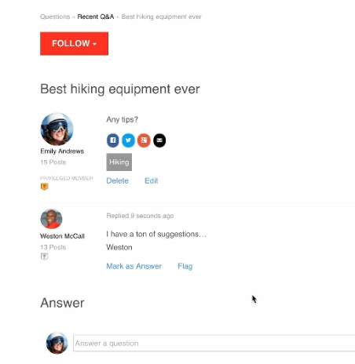

# Abonnements des communautés {#communities-subscriptions}

## Vue d’ensemble {#overview}

Depuis Communities [FP1](deploy-communities.md#latestfeaturepack), les membres de la communauté peuvent interagir avec la communauté par e-mail en utilisant une fonctionnalité appelée abonnements.

Les abonnements sont similaires aux [notifications](notifications.md) car les membres peuvent s’abonner lorsqu’ils suivent des articles de blog, des sujets de forum ou des questions QnA.

Ce qui distingue les abonnements des notifications, c’est :

* Les membres ne peuvent pas s&#39;abonner s&#39;ils suivent d&#39;autres membres.
* La seule action que les membres doivent effectuer consiste à sélectionner `Email Subscriptions` lors du suivi.
* Lorsque la réponse par e-mail est configurée, les membres peuvent effectivement publier du contenu en répondant simplement à l’e-mail reçu.

### Exigences {#requirements}

**Configurer l’e-mail**

Les courriers électroniques doivent être configurés pour que les abonnements soient fonctionnels et pour que les membres puissent répondre par courrier électronique.

Pour obtenir des instructions sur la configuration des e-mails, voir [Configuration des e-mails](email.md).

**Activer les abonnements et suivre**

Les composants doivent être configurés pour activer les abonnements *et* suivants. Les fonctionnalités qui permettent les abonnements sont [blog](blog-feature.md), [forum](forum.md) et [QnA](working-with-qna.md).

## Subscriptions from Suivants {#subscriptions-from-following}

Le bouton **Suivre** permet de suivre les entrées sous forme d’activités, d’abonnements et/ou de notifications. Chaque fois que le bouton **Suivre** est sélectionné, il est possible d’activer ou de désactiver une sélection.

Si l’une des méthodes suivantes est sélectionnée, le texte du bouton devient **Suivant**. Pour des raisons pratiques, il est possible de sélectionner `Unfollow All` pour désactiver toutes les méthodes.

Le bouton **Suivre** inclut l’option `Email Subscriptions` uniquement lorsqu’un forum, un QnA ou un blog est configuré pour activer les abonnements par e-mail. Ce bouton s’affiche :

* Sur la page principale des fonctionnalités du forum activé, QnA ou le blog enverra un e-mail pour toutes les activités sous cette fonctionnalité.

* Pour une entrée spécifique, telle qu’un sujet de forum, une question ou un article de blog, envoie un e-mail lorsqu’il y a une activité pour cette entrée spécifique.

## Répondre par e-mail {#reply-by-email}

Lorsque l’adresse e-mail est [ configurée pour répondre par e-mail](email.md#configure-polling-importer), le membre qui s’est abonné reçoit un e-mail contenant le contenu publié et un lien vers le contenu en ligne.

S’ils répondent à l’e-mail, le contenu qu’ils saisissent dans la réponse s’affiche en tant que contenu en ligne.

Le temps nécessaire à la publication d’une réponse est contrôlé par l’[intervalle de mise à jour de l’importateur d’interrogations](email.md#configure-polling-importer).

