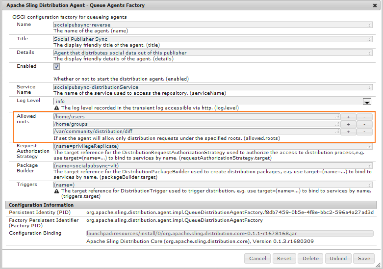
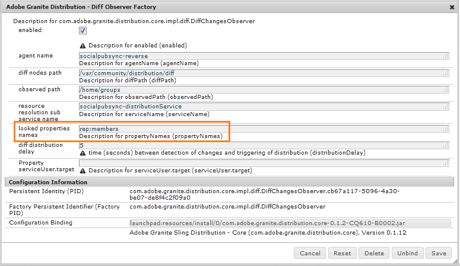
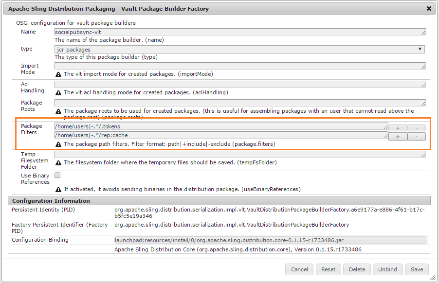

# Synchronisation des utilisateurs de Communities {#communities-user-synchronization}

## Présentation {#introduction}

Dans les communautés Adobe Experience Manager (AEM), à partir de l’environnement de publication (en fonction des autorisations configurées), les *visiteurs du site* peuvent devenir *membres*, créer des *groupes d’utilisateurs* et modifier leur *profil de membre* .

*Données utilisateur* fait référence aux *utilisateurs*, *profils utilisateur* et *groupes d’utilisateurs*.

Les *membres* font référence aux *utilisateurs* enregistrés dans l’environnement de publication par opposition aux utilisateurs enregistrés dans l’environnement de création.

Pour plus d’informations sur les données utilisateur, consultez [Gestion des utilisateurs et des groupes d’utilisateurs](/help/communities/users.md).

## Synchronisation des utilisateurs sur une batterie de publication {#synchronizing-users-across-a-publish-farm}

Par défaut, les données utilisateur créées dans l’environnement de publication n’apparaissent pas dans l’environnement de création.

La plupart des données utilisateur créées dans l’environnement de création sont destinées à rester dans l’environnement de création et ne sont ni synchronisées ni répliquées sur les instances de publication.

Lorsque la [topologie](/help/communities/topologies.md) est une [ferme de publication](/help/sites-deploying/recommended-deploys.md#tarmk-farm), l’enregistrement et les modifications effectués sur une instance de publication doivent être synchronisés avec d’autres instances de publication. Les membres doivent pouvoir se connecter et voir leurs données sur n’importe quel nœud de publication.

Lorsque la synchronisation des utilisateurs est activée, les données utilisateur sont automatiquement synchronisées sur les instances de publication de la batterie de serveurs.

### Instructions de configuration de la synchronisation des utilisateurs {#user-sync-setup-instructions}

Pour obtenir des instructions détaillées sur la manière d’activer la synchronisation sur une batterie de publication, voir [Synchronisation des utilisateurs](/help/sites-administering/sync.md).

## Synchronisation des utilisateurs en arrière-plan {#user-sync-in-the-background}


* **package vlt**

  Il s’agit d’un fichier zip contenant toutes les modifications apportées sur un éditeur, qui doit être distribué entre les éditeurs. Les modifications apportées à un éditeur génèrent des événements sélectionnés par l’écouteur d’événement de modification. Cela crée un package vlt contenant toutes les modifications.

* **package de distribution**

  Elle contient des informations de distribution pour Sling. Il s&#39;agit d&#39;information sur l&#39;endroit où le contenu doit être distribué et sur la date de sa dernière distribution.

## Que se passe-t-il lorsque... {#what-happens-when}

### Publier le site à partir de la console Sites de communautés {#publish-site-from-communities-sites-console}

En mode de création, lorsqu’un site communautaire est publié à partir de la [console Sites de communautés](/help/communities/sites-console.md), l’effet est de [répliquer](/help/sites-deploying/configuring.md#replication-reverse-replication-and-replication-agents) les pages associées et Sling distribue les groupes d’utilisateurs de la communauté créés dynamiquement, y compris leur appartenance.

### L’utilisateur est créé ou modifie le profil sur l’instance de publication {#user-is-created-or-edits-profile-on-publish}

Par défaut, les utilisateurs et les profils créés dans l’environnement de publication (par exemple, par auto-enregistrement, connexion au réseau social, authentification LDAP) n’apparaissent pas dans l’environnement de création.

Lorsque la topologie consiste en une [batterie de publication](/help/communities/topologies.md) et que la synchronisation des utilisateurs a été correctement configurée, l’*utilisateur* et le *profil utilisateur* sont synchronisés dans la batterie de publication à l’aide de la distribution Sling.

### Le nouveau groupe de la communauté est créé sur Publier . {#new-community-group-is-created-on-publish}

Bien qu’elle soit lancée à partir d’une instance de publication, la création du groupe de la communauté, qui entraîne la création de nouvelles pages de site et d’un nouveau groupe d’utilisateurs, se produit en fait sur l’instance de création.

Dans le cadre du processus, les nouvelles pages du site sont répliquées sur toutes les instances de publication. Le groupe d’utilisateurs de la communauté créé dynamiquement et son appartenance sont des Sling distribués à toutes les instances de publication.

### La création d’utilisateurs et d’utilisatrices ou de groupes d’utilisateurs et d’utilisatrices s’effectue dans la console de sécurité. {#users-or-user-groups-are-created-using-security-console}

Par défaut, les données utilisateur créées dans l’environnement de publication n’apparaissent pas dans l’environnement de création, et inversement.

Lorsque la console [Administration et sécurité des utilisateurs](/help/sites-administering/security.md) est utilisée pour ajouter de nouveaux utilisateurs dans l’environnement de publication, la synchronisation des utilisateurs synchronise les nouveaux utilisateurs et leur appartenance à un groupe sur d’autres instances de publication, si nécessaire. La synchronisation des utilisateurs et des utilisatrices synchronise également les groupes d’utilisateurs et d’utilisatrices créés via la console de sécurité.

### L’utilisateur publie du contenu en mode de publication {#user-posts-content-on-publish}

Pour le contenu généré par l’utilisateur, les données saisies sur une instance de publication sont accessibles via le [SRP configuré](/help/communities/srp-config.md).

## Bonnes pratiques {#bestpractices}

Par défaut, la synchronisation des utilisateurs est **désactivée**. L’activation de la synchronisation des utilisateurs et utilisatrices implique de modifier les configurations OSGi *existantes*. Aucune nouvelle configuration ne doit être ajoutée suite à l’activation de la synchronisation des utilisateurs et utilisatrices.

La synchronisation des utilisateurs repose sur l’environnement de création pour gérer les distributions de données utilisateur, même si les données utilisateur ne sont pas créées en mode de création.

**Conditions préalables**

1. Si les utilisateurs et les groupes d’utilisateurs ont déjà été créés sur un éditeur, il est recommandé de [synchroniser manuellement](/help/sites-administering/sync.md#manually-syncing-users-and-user-groups) les données utilisateur sur tous les éditeurs avant de configurer et d’activer la synchronisation des utilisateurs.

   Une fois la synchronisation des utilisateurs activée, seuls les utilisateurs et utilisatrices et les groupes nouvellement créés sont synchronisés .

1. Assurez-vous que la dernière version du code a été installée :

   * [Mises à jour de la plateforme AEM](https://helpx.adobe.com/fr/experience-manager/kb/aem62-available-hotfixes.html)
   * [Mises à jour d’AEM Communities](/help/communities/deploy-communities.md#latestfeaturepack)

Les configurations suivantes sont nécessaires pour activer la synchronisation des utilisateurs sur AEM Communities. Assurez-vous que ces configurations sont correctes pour empêcher l’échec de la distribution de contenu sling.

### Agent de distribution Apache Sling - Fabrique d’agents de synchronisation {#apache-sling-distribution-agent-sync-agents-factory}

Cette configuration récupère le contenu à synchroniser dans les éditeurs. La configuration se trouve sur l’instance d’auteur . L’auteur doit conserver une trace de tous les éditeurs qui s’y trouvent et où synchroniser toutes les informations.

Les valeurs par défaut de la configuration concernent une seule instance de publication. Comme la synchronisation des utilisateurs et utilisatrices est utile pour synchroniser plusieurs instances de publication, par exemple pour une ferme de publication, des instances de publication supplémentaires doivent être ajoutées à la configuration.

**Comment le contenu est-il synchronisé ?**

L’instance d’auteur envoie un ping au point d’entrée de l’exportateur des éditeurs. Chaque fois qu’un utilisateur est créé ou mis à jour sur des éditeurs spécifiques (n), l’auteur récupère le contenu à partir des points d’entrée de l’exportateur et [&#x200B; transmet le contenu](/help/communities/sync.md#main-pars-image-1413756164) à d’autres éditeurs (n-1, distinct des éditeurs à partir desquels le contenu est récupéré).

Pour configurer les agents de synchronisation Apache Sling, procédez comme suit :

1. Connectez-vous avec des droits d’administrateur sur votre instance d’auteur AEM.
1. Accédez à la [console web](/help/sites-deploying/configuring-osgi.md). Par exemple, [:4502/system/console/configMgr](https://localhost:4502/system/console/configMgr).
1. Recherchez **Agent de distribution Apache Sling - Fabrique d’agents de synchronisation**.

   * Sélectionnez la configuration existante à ouvrir pour modification (icône de crayon).

     Vérifier le nom : **socialpubsync.**

   * Cochez la case **Activé**.
   * Sélectionnez **Utiliser plusieurs files d’attente.**
   * Spécifiez **Points d’entrée de l’exportateur** et **Points d’entrée de l’importateur** (vous pouvez ajouter d’autres points d’entrée de l’exportateur et de l’importateur).

     Ces points d’entrée définissent l’emplacement d’où vous souhaitez obtenir le contenu et l’emplacement où vous souhaitez placer le contenu. L’auteur récupère le contenu à partir du point d’entrée de l’exportateur spécifié et transmet le contenu aux éditeurs (autres que l’éditeur à partir duquel il a récupéré le contenu).

   

### Distribution Granite Adobe - Fournisseur De Secret De Transport Avec Mot De Passe Chiffré {#adobe-granite-distribution-encrypted-password-transport-secret-provider}

Il permet à l’auteur d’identifier l’utilisateur autorisé comme étant autorisé à synchroniser les données utilisateur de l’auteur à la publication.

L’[&#x200B; utilisateur autorisé créé](/help/sites-administering/sync.md#createauthuser) sur toutes les instances de publication aide les éditeurs à se connecter à l’auteur et à configurer la distribution Sling sur l’auteur. Cet utilisateur autorisé dispose de toutes les [listes de contrôle d’accès](/help/sites-administering/sync.md#howtoaddacl) requises.

Chaque fois que des données doivent être installées ou récupérées auprès d’éditeurs, l’auteur se connecte aux éditeurs à l’aide des informations d’identification (nom d’utilisateur et mot de passe) définies dans cette configuration.

Pour connecter l’auteur aux éditeurs à l’aide d’un utilisateur autorisé :

1. Connectez-vous avec des droits d’administrateur sur votre instance d’auteur AEM.
1. Accédez à la [console web](/help/sites-deploying/configuring-osgi.md).

   Par exemple, [:4502/system/console/configMgr](https://localhost:4502/system/console/configMgr).
1. Recherchez **La Distribution Adobe Granite - Fournisseur Du Secret De Transport Du Mot De Passe Chiffré.**
1. Sélectionnez la configuration existante à ouvrir pour modification (icône de crayon).

   Vérifiez la propriété **socialpubsync** - **publishUser.**

1. Définissez le nom d’utilisateur et le mot de passe sur [utilisateur autorisé](/help/sites-administering/sync.md#createauthorizeduser).

   Par exemple, **usersync - admin**


### Agent de distribution Apache Sling - Fabrique d’agents de file d’attente {#apache-sling-distribution-agent-queue-agents-factory}

Cette configuration est utilisée pour configurer les données que vous souhaitez synchroniser entre les éditeurs. Lorsque des données sont créées/mises à jour dans des chemins spécifiés dans **Racines autorisées**, la variable « var/community/distribution/diff » est activée et le réplicateur créé récupère les données d’un éditeur et les installe sur d’autres éditeurs.

Pour configurer les données (chemins de nœud) à synchroniser :

1. Connectez-vous avec des droits d’administrateur sur votre instance de publication.
1. Accédez à la [console web](/help/sites-deploying/configuring-osgi.md).

   Par exemple, [:4503/system/console/configMgr](https://localhost:4503/system/console/configMgr).

1. Recherchez **Agent de distribution Apache Sling - Fabrique d’agents de file d’attente**.
1. Sélectionnez la configuration existante à ouvrir pour modification (icône de crayon).

   Vérifier le nom : **socialpubsync -reverse**

1. Cochez la case **Activé** et enregistrez.
1. Spécifiez les chemins d’accès aux nœuds à répliquer dans **Racines autorisées**.
1. Répétez l’opération pour chaque instance **publication**.

   

### Distribution Adobe Granite - Fabrique d’observateurs Diff {#adobe-granite-distribution-diff-observer-factory}

Cette configuration synchronise l’appartenance à un groupe entre les éditeurs.
Si la modification de l’appartenance d’un groupe dans un éditeur ne met pas à jour son appartenance sur d’autres éditeurs, assurez-vous que la :members&#x200B;**&#x200B;** ref est ajoutée aux noms de propriétés **regardés**.

Pour assurer la synchronisation des membres :

1. Connectez-vous avec des droits d’administrateur sur votre instance de publication.
1. Accédez à la [console web](/help/sites-deploying/configuring-osgi.md).

   Par exemple, [:4503/system/console/configMgr](https://localhost:4503/system/console/configMgr).

1. Recherchez **Distribution Adobe Granite - Fabrique d’observateurs diff**.
1. Sélectionnez la configuration existante à ouvrir pour modification (icône de crayon).

   Vérifiez **nom de l&#39;agent : socialpubsync -reverse**.

1. Cochez la case **Activé**.
1. Spécifiez **rep:members** comme description pour propertyName dans les champs **noms des propriétés consultées** et Enregistrer.

   

### Déclencheur de distribution Apache Sling - Fabrique de déclencheurs planifiés {#apache-sling-distribution-trigger-scheduled-triggers-factory}

Cette configuration vous permet de configurer l’intervalle d’interrogation (après lequel les éditeurs sont interrogés et les modifications sont extraites par l’auteur) pour synchroniser les modifications entre les éditeurs.

L’auteur sonde les éditeurs toutes les 30 secondes (par défaut). Si des packages figurent dans le dossier `/var/sling/distribution/packages/  socialpubsync -  vlt /shared`, il les récupère et les installe sur d’autres éditeurs.

Pour modifier l’intervalle d’interrogation :

1. Connectez-vous avec des droits d’administrateur sur votre instance d’auteur AEM.
1. Accédez à la [console web](/help/sites-deploying/configuring-osgi.md) par exemple, [https://localhost:4502/system/console/configMgr](https://localhost:4502/system/console/configMgr)
1. Recherchez **Déclencheur de distribution Apache Sling - Fabrique de déclencheurs planifiés**

   * Sélectionnez la configuration existante à ouvrir pour modification (icône de crayon).

     Vérifiez **socialpubsync -scheduled-trigger**

   * Définissez l’Intervalle en secondes à l’intervalle souhaité, puis enregistrez.

   

### Listener de synchronisation des utilisateurs AEM Communities {#aem-communities-user-sync-listener}

Pour les problèmes dans la distribution Sling où il existe une incohérence entre les abonnements et ce qui suit, vérifiez si les propriétés suivantes sont définies dans **Listener de synchronisation des utilisateurs** les configurations sont définies :

* NodeTypes
* IgnorableProperties
* IgnorableNodes
* DistributedFolders

Pour synchroniser les abonnements, les abonnements et les notifications

Sur chaque instance de publication AEM :

1. Connectez-vous avec des droits d’administrateur.
1. Accédez à la [console web](/help/sites-deploying/configuring-osgi.md). Par exemple, [:4503/system/console/configMgr](https://localhost:4503/system/console/configMgr).
1. Recherchez **Listener de synchronisation des utilisateurs**.
1. Sélectionnez la configuration existante à ouvrir pour modification (icône de crayon)

   Vérifier le nom : **socialpubsync -scheduled-trigger**

1. Définissez les **NodeTypes** suivants :

   `rep:User`

   `nt:unstructured`

   `nt:resource`

   `rep:ACL`

   `sling:Folder`

   `sling:OrderedFolder`

   Les types de nœuds spécifiés dans cette propriété sont synchronisés et les informations de notification (blogs et configurations suivis) sont synchronisées entre différents éditeurs.

1. Ajoutez tous les dossiers à synchroniser dans **DistributedFolders**. Par exemple :

   `segments/scoring`

   `social/relationships`

   `activities`

1. Définissez **ignorablenodes** sur :

   `.tokens`

   `system`

   `rep:cache` (les sessions persistantes étant utilisées, il n’est pas nécessaire de synchroniser ce nœud avec différents éditeurs).

   

### ID Sling unique {#unique-sling-id}

L’instance d’auteur AEM utilise l’identifiant Sling pour identifier d’où proviennent les données et vers quels éditeurs elle doit (ou non) renvoyer le package.

Assurez-vous que tous les éditeurs d’une batterie de publication disposent d’un identifiant Sling unique. Si l’identifiant Sling est identique pour plusieurs instances de publication dans une batterie de publication, la synchronisation des utilisateurs échoue. En effet, l’auteur ne sait pas où récupérer le package et où l’installer.

Pour garantir un identifiant Sling unique des éditeurs dans la batterie de publication, sur chaque instance de publication :

1. Accédez à [:port_/system/console/status-slingsettings](https://localhost:4503/system/console/status-slingsettings).
1. Vérifiez la valeur de **ID Sling**.

   

   Si l’identifiant Sling d’une instance de publication correspond à l’identifiant Sling d’une autre instance de publication, alors :

1. Arrêtez l’une des instances de publication qui possède un identifiant Sling correspondant.
1. Dans le répertoire `crx-quickstart/launchpad/felix`, recherchez et supprimez le fichier nommé *sling.id.file.*

   Par exemple, sur un système Linux :

   `rm -i $(find . -type f -name sling.id.file)`

   Par exemple, sur un système Windows :

   Utiliser l&#39;explorateur Windows et rechercher des `sling.id.file`

1. Démarrez l’instance de publication. Au démarrage, un nouvel identifiant Sling lui est affecté.
1. Vérifiez que l’**identifiant Sling** est désormais unique.

Répétez ces étapes jusqu’à ce que toutes les instances de publication aient un identifiant Sling unique.

### Fabrique de générateur de package vault {#vault-package-builder-factory}

Pour que les mises à jour se synchronisent correctement, il est nécessaire de modifier le créateur de packages de coffre pour la synchronisation des utilisateurs.
Dans `/home/users`, un nœud de `*/rep:cache` est créé. Il s’agit d’un cache qui est utilisé pour déterminer que si nous effectuons une requête sur le nom principal d’un nœud, ce cache peut être utilisé directement.

La synchronisation des utilisateurs peut s’arrêter si `rep :cache` nœuds sont synchronisés entre les éditeurs.

Pour vous assurer que les mises à jour sont correctement synchronisées entre les éditeurs, sur chaque instance de publication AEM :

1. Accédez à la [console web](/help/sites-deploying/configuring-osgi.md)

   Par exemple, [:4503/system/console/configMgr](https://localhost:4503/system/console/configMgr).
1. Recherchez le **Package de distribution Apache Sling - Fabrique de créateurs de packages Vault**

   Nom du créateur : socialpubsync-vlt.

1. Sélectionnez l’icône Modifier .
1. Ajoutez deux filtres de nœud de package :
   * `/home/users|-.*/.tokens`
   * `/home/users|-.*/rep:cache`
1. Gestion des politiques
   * Pour remplacer les nœuds de :policy de rendu existants par de nouveaux nœuds, ajoutez un troisième filtre de package : `/home/users|+.*/rep:policy`
   * Pour empêcher la distribution des politiques, définissez : `Acl Handling: IGNORE`

   

## Dépannage de la distribution Sling dans AEM Communities {#troubleshoot-sling-distribution-in-aem-communities}

Si la distribution Sling échoue, essayez les étapes de débogage suivantes :

1. **Rechercher les [configurations ajoutées de manière incorrecte](/help/sites-administering/sync.md#improperconfig)**

   Assurez-vous que plusieurs configurations ne sont pas ajoutées ou modifiées. Au lieu de cela, les configurations par défaut existantes doivent être modifiées.
1. **Vérifier les configurations**

   Assurez-vous que toutes les [configurations](/help/communities/sync.md#bestpractices) sont correctement définies dans votre instance d’auteur AEM, comme indiqué dans la [Bonnes pratiques](/help/communities/sync.md#main-pars-header-863110628).

1. **Vérification des autorisations utilisateur autorisées**

   Si les packages ne sont pas installés correctement, vérifiez que la [personne utilisatrice autorisée](/help/sites-administering/sync.md#createauthuser) créée dans la première instance de publication dispose des listes de contrôle d’accès appropriées.

   Pour valider, au lieu de l’utilisateur autorisé [créé](/help/sites-administering/sync.md#createauthuser) modifiez la configuration [Distribution Granite Adobe - Fournisseur de secret de transport par mot de passe chiffré](/help/sites-administering/sync.md#adobegraniteencpasswrd) sur l’instance d’auteur pour utiliser les informations d’identification de l’utilisateur administrateur. Essayez à nouveau d’installer les packages. Si la synchronisation des utilisateurs fonctionne correctement avec les informations d’identification de l’administrateur, cela signifie que l’utilisateur de publication créé ne disposait pas des listes de contrôle d’accès appropriées.

1. **Vérifiez la configuration de la Fabrique d’observateurs Diff**

   Si seuls des nœuds spécifiques ne sont pas synchronisés dans la batterie de publication (par exemple, les membres du groupe ne sont pas synchronisés), assurez-vous que la configuration [Distribution Adobe Granite - Fabrique d’observateurs de comparaison](/help/sites-administering/sync.md#diffobserver) est activée et que **rep : membres** est définie dans **noms des propriétés**.

1. **Vérifiez la configuration du listener de synchronisation des utilisateurs AEM Communities.** Si les utilisateurs créés sont synchronisés, mais que les abonnements et les abonnements ne fonctionnent pas, assurez-vous que la configuration du listener de synchronisation des utilisateurs AEM Communities dispose des éléments suivants :

   * Types de nœuds : définis sur **rep:User, nt:unstructured**, **nt:resource**, **rep:ACL**, **sling:Folder** et **sling:OrderedFolder**.
   * Nœuds à ignorer : définissez sur **.tokens**, **system** et **rep:cache**.
   * Dossiers distribués : sélectionnez les dossiers que vous souhaitez distribuer.

1. **Vérifiez les journaux générés lors de la création de l’utilisateur sur l’instance de publication**

   Si les configurations ci-dessus sont correctement définies, mais que la synchronisation des utilisateurs ne fonctionne pas, vérifiez les journaux générés lors de la création de l’utilisateur.

   Vérifiez que l&#39;ordre des logs est le même, comme suit :

   ```shell
   15.05.2016 18:33:01.523 *INFO* [sling-oak-observation-7422] com.adobe.cq.social.sync.impl.PublisherSyncServiceImpl Handing these paths to the distribution subsystem: [/home/users/C, /home/users/C/Cw-5avWqilmqsNn5hCvK]
   15.05.2016 18:33:01.523 *INFO* [sling-oak-observation-7422] org.apache.sling.distribution.agent.impl.SimpleDistributionAgent [agent][socialpubsync-reverse] REQUEST-START DSTRQ2: ADD paths=[/home/users/C, /home/users/C/Cw-5avWqilmqsNn5hCvK], user=communities-user-admin
   15.05.2016 18:33:01.523 *INFO* [sling-oak-observation-7431] com.adobe.cq.social.sync.impl.PublisherSyncServiceImpl Handing these paths to the distribution subsystem: [/home/users/C/Cw-5avWqilmqsNn5hCvK, /home/users/C/Cw-5avWqilmqsNn5hCvK/profile, /home/users/C/Cw-5avWqilmqsNn5hCvK/rep:policy]
   15.05.2016 18:33:01.523 *INFO* [sling-oak-observation-7431] org.apache.sling.distribution.agent.impl.SimpleDistributionAgent [agent][socialpubsync-reverse] REQUEST-START DSTRQ3: ADD paths=[/home/users/C/Cw-5avWqilmqsNn5hCvK, /home/users/C/Cw-5avWqilmqsNn5hCvK/profile, /home/users/C/Cw-5avWqilmqsNn5hCvK/rep:policy], user=communities-user-admin
   15.05.2016 18:33:01.757 *INFO* [sling-oak-observation-7431] org.apache.jackrabbit.vault.packaging.impl.JcrPackageDefinitionImpl unwrapping package sling/distribution:socialpubsync-vlt_1463337181554_ebb27ad9-a861-4405-9342-d64c916654e2:0.0.1
   15.05.2016 18:33:01.820 *INFO* [sling-oak-observation-7422] org.apache.jackrabbit.vault.packaging.impl.JcrPackageDefinitionImpl unwrapping package sling/distribution:socialpubsync-vlt_1463337181554_58811273-5861-48fe-95d2-4aff367b99c3:0.0.1
   15.05.2016 18:33:02.023 *INFO* [sling-oak-observation-7430] com.adobe.cq.social.sync.impl.PublisherSyncServiceImpl Handing these paths to the distribution subsystem: [/home/users/C/Cw-5avWqilmqsNn5hCvK/profile]
   15.05.2016 18:33:02.023 *INFO* [sling-oak-observation-7430] org.apache.sling.distribution.agent.impl.SimpleDistributionAgent [agent][socialpubsync-reverse] REQUEST-START DSTRQ4: ADD paths=[/home/users/C/Cw-5avWqilmqsNn5hCvK/profile], user=communities-user-admin
   15.05.2016 18:33:02.273 *INFO* [sling-oak-observation-7430] org.apache.jackrabbit.vault.packaging.impl.JcrPackageDefinitionImpl unwrapping package sling/distribution:socialpubsync-vlt_1463337182039_f34f4fa6-10b9-42eb-8740-4da9d4d38f99:0.0.1
   ```

Pour déboguer :

1. Désactivez la synchronisation des utilisateurs :
1. Sur l’instance d’auteur AEM, connectez-vous avec les droits d’administrateur.

   1. Accédez à la [console web](/help/sites-deploying/configuring-osgi.md). Par exemple, [:4502/system/console/configMgr](https://localhost:4502/system/console/configMgr).
   1. Recherchez la configuration **Agent de distribution Apache Sling - Fabrique d’agents de synchronisation**.
   1. Désélectionnez la case **Activé**.

      Lors de la désactivation de la synchronisation des utilisateurs sur l’instance d’auteur (exportateur et importateur), les points d’entrée sont désactivés et l’instance d’auteur est statique. Les packages **vlt** ne sont pas analysés ni récupérés par l’auteur.

      Désormais, si un utilisateur est créé sur l’instance de publication, le package **vlt** est créé dans le nœud */var/sling/distribution/packages/ socialpubsync - vlt /data*. Et si ces packages sont transmis par l’auteur à un autre service. Vous pouvez télécharger et extraire ces données pour vérifier quelles propriétés sont transmises à d’autres services.

1. Accédez à un éditeur et créez un utilisateur sur l’éditeur. Par conséquent, les événements sont créés.
1. Vérifiez l’[ordre des journaux](/help/communities/sync.md#troubleshoot-sling-distribution-in-aem-communities) créés lors de la création de l’utilisateur.
1. Vérifiez si un package **vlt** est créé sur **/var/sling/distribution/packages/socialpubsync-vlt/data**.
1. Maintenant, activez la synchronisation des utilisateurs sur l’instance d’auteur AEM.
1. Sur l’éditeur, modifiez les points d’entrée de l’exportateur ou de l’importateur dans **Agent de distribution Apache Sling - Fabrique d’agents de synchronisation**.
Nous pouvons télécharger et extraire des données de package pour vérifier toutes les propriétés qui sont transmises à d’autres éditeurs et quelles données sont perdues.
