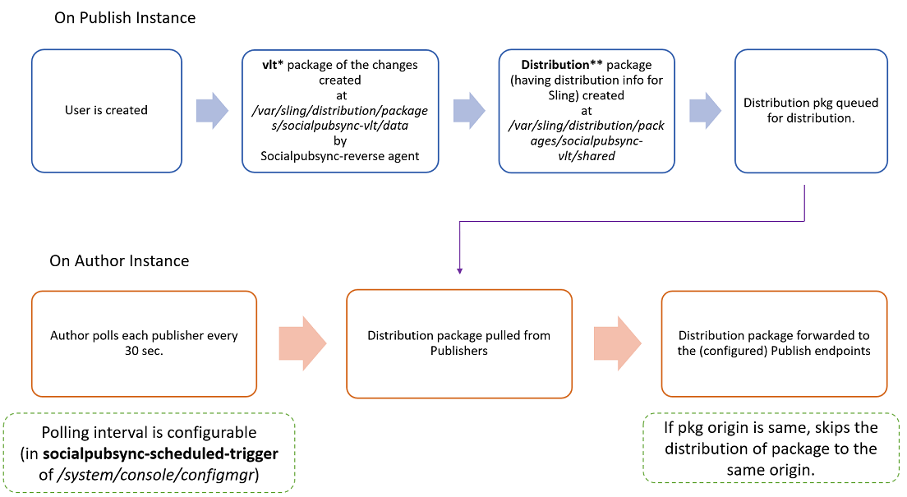

# Synchronisation des utilisateurs des communautés {#communities-user-synchronization}

## Présentation {#introduction}

Dans les communautés Adobe Experience Manager (AEM), depuis l’environnement de publication (en fonction des autorisations configurées), *visiteurs du site* peut devenir *members*, créez *groupes d’utilisateurs*, puis modifiez leurs *profil du membre* .

*Données utilisateur* fait référence à *utilisateurs*, *profils utilisateur*, et *groupes d’utilisateurs*.

*Membres* voir *utilisateurs* enregistrés dans l’environnement de publication, par opposition aux utilisateurs enregistrés dans l’environnement de création.

Pour plus d’informations sur les données utilisateur, consultez [Gestion des utilisateurs et des groupes d’utilisateurs](/help/communities/users.md).

## Synchronisation des utilisateurs sur une ferme de publication {#synchronizing-users-across-a-publish-farm}

Par conception, les données utilisateur créées dans l’environnement de publication n’apparaissent pas dans l’environnement de création.

La plupart des données utilisateur créées dans l’environnement de création sont destinées à rester dans l’environnement de création et ne sont ni synchronisées ni répliquées vers les instances de publication.

Lorsque la variable [topologie](/help/communities/topologies.md) est un [batterie de publication](/help/sites-deploying/recommended-deploys.md#tarmk-farm), l’enregistrement et les modifications effectués sur une instance de publication doivent être synchronisés avec d’autres instances de publication. Les membres doivent pouvoir se connecter et voir leurs données sur n’importe quel noeud de publication.

Lorsque la synchronisation des utilisateurs est activée, les données utilisateur sont automatiquement synchronisées dans les instances de publication de la ferme de serveurs.

### Instructions de configuration de la synchronisation des utilisateurs {#user-sync-setup-instructions}

Pour obtenir des instructions détaillées et détaillées sur la manière d’activer la synchronisation sur une ferme de publication, voir [Synchronisation des utilisateurs](/help/sites-administering/sync.md).

## Synchronisation des utilisateurs en arrière-plan {#user-sync-in-the-background}



* **package vlt**

  Il s’agit d’un fichier zip de toutes les modifications apportées à un éditeur, qui doit être distribué entre les éditeurs. Les modifications sur un éditeur génèrent des événements qui sont sélectionnés par l’écouteur d’événement change. Cela crée un module vlt contenant toutes les modifications.

* **package de distribution**

  Il contient des informations de distribution pour Sling. Il s’agit d’informations sur l’endroit où le contenu doit être distribué et la date de sa dernière distribution.

## Que se passe-t-il lorsque... {#what-happens-when}

### Publier le site à partir de la console Sites des communautés {#publish-site-from-communities-sites-console}

Sur l’auteur, lorsqu’un site communautaire est publié à partir de la variable [Console Sites Communities](/help/communities/sites-console.md), l’effet est [répliquer](/help/sites-deploying/configuring.md#replication-reverse-replication-and-replication-agents) Les pages associées et Sling distribuent les groupes d’utilisateurs de la communauté créés dynamiquement, y compris leur adhésion.

### L’utilisateur est créé ou modifie le profil lors de la publication. {#user-is-created-or-edits-profile-on-publish}

Par conception, les utilisateurs et les profils créés dans l’environnement de publication (par exemple par auto-inscription, connexion sociale, authentification LDAP) n’apparaissent pas dans l’environnement de création.

Lorsque la topologie consiste en une [batterie de publication](/help/communities/topologies.md) et que la synchronisation des utilisateurs a été correctement configurée, l’*utilisateur* et le *profil utilisateur* sont synchronisés dans la batterie de publication à l’aide de la distribution Sling.

### Un nouveau groupe de communautés est créé lors de la publication. {#new-community-group-is-created-on-publish}

Bien qu’elle ait été lancée à partir d’une instance de publication, la création d’un groupe de communautés, qui entraîne la création de pages de site et d’un nouveau groupe d’utilisateurs, a lieu dans les faits sur l’instance d’auteur.

Dans le cadre du processus, les nouvelles pages du site sont répliquées vers toutes les instances de publication. Le groupe d’utilisateurs de la communauté créé dynamiquement et ses membres sont Sling distribués à toutes les instances de publication.

### La création d’utilisateurs et d’utilisatrices ou de groupes d’utilisateurs et d’utilisatrices s’effectue dans la console de sécurité. {#users-or-user-groups-are-created-using-security-console}

Par conception, les données utilisateur créées dans l’environnement de publication n’apparaissent pas dans l’environnement de création et inversement.

Lorsque la variable [Administration et sécurité des utilisateurs](/help/sites-administering/security.md) est utilisée pour ajouter de nouveaux utilisateurs dans l’environnement de publication. La synchronisation des utilisateurs synchronise les nouveaux utilisateurs et leur appartenance à un groupe avec d’autres instances de publication, si nécessaire. La synchronisation des utilisateurs synchronise également les groupes d’utilisateurs créés via la console de sécurité.

### L’utilisateur publie du contenu lors de la publication {#user-posts-content-on-publish}

Pour le contenu généré par l’utilisateur, les données saisies sur une instance de publication sont accessibles via le [SRP configuré](/help/communities/srp-config.md).

## Bonnes pratiques {#bestpractices}

Par défaut, la synchronisation des utilisateurs est **disabled**. L’activation de la synchronisation des utilisateurs et utilisatrices implique de modifier les configurations OSGi *existantes.* Aucune nouvelle configuration ne doit être ajoutée suite à l’activation de la synchronisation des utilisateurs et utilisatrices.

La synchronisation des utilisateurs repose sur l’environnement de création pour gérer les distributions de données utilisateur, même si les données utilisateur ne sont pas créées en mode de création.

**Conditions préalables**

1. Si les utilisateurs et les groupes d’utilisateurs ont déjà été créés sur un éditeur, il est recommandé de [synchroniser manuellement](/help/sites-administering/sync.md#manually-syncing-users-and-user-groups) les données utilisateur sur tous les éditeurs avant de configurer et d’activer la synchronisation des utilisateurs.

   Une fois la synchronisation des utilisateurs activée, seuls les utilisateurs et groupes nouvellement créés sont synchronisés .

1. Assurez-vous que la dernière version du code a été installée :

   * [Mises à jour de la plateforme AEM](https://helpx.adobe.com/fr/experience-manager/kb/aem62-available-hotfixes.html)
   * [Mises à jour d’AEM Communities](/help/communities/deploy-communities.md#latestfeaturepack)

Les paramétrages suivants sont nécessaires pour permettre la synchronisation des utilisateurs sur AEM Communities. Assurez-vous que ces configurations sont correctes pour empêcher l’échec de la distribution de contenu sling.

### Agent de distribution Apache Sling - Fabrique d’agents de synchronisation {#apache-sling-distribution-agent-sync-agents-factory}

Cette configuration récupère le contenu à synchroniser dans les éditeurs. La configuration se trouve sur l’instance d’auteur . L’auteur doit effectuer le suivi de tous les éditeurs qui sont là et où synchroniser toutes les informations.

Les valeurs par défaut de la configuration concernent une seule instance de publication. La synchronisation des utilisateurs s’avère utile pour synchroniser plusieurs instances de publication, comme pour une ferme de publication, d’autres instances de publication doivent être ajoutées à la configuration.

**Comment le contenu est-il synchronisé ?**

L’instance d’auteur envoie un ping au point de terminaison de l’exportateur des éditeurs. Chaque fois qu’un utilisateur est créé ou mis à jour sur des éditeurs spécifiques (n), l’auteur obtient le contenu à partir de ses points de terminaison d’exportateur et [Diffuse le contenu](/help/communities/sync.md#main-pars-image-1413756164) aux autres éditeurs (n-1, à l’exception des éditeurs à partir desquels le contenu est récupéré).

Pour configurer la configuration des agents de synchronisation Apache Sling :

1. Connectez-vous avec les privilèges d’administrateur sur votre instance d’auteur AEM.
1. Accédez au [Console web](/help/sites-deploying/configuring-osgi.md). Par exemple : [https://localhost:4502/system/console/configMgr](https://localhost:4502/system/console/configMgr).
1. Localiser **Agent de distribution Apache Sling - Fabrique d’agents de synchronisation**.

   * Sélectionnez la configuration existante à ouvrir pour modification (icône représentant un crayon).

     Vérifiez le nom : **socialpubsync.**

   * Cochez la case **Activé**.
   * Sélectionner **Utilisez plusieurs files d’attente.**
   * Spécifier **Points de fin de l’exportateur** et **Points de terminaison de l’importateur** (vous pouvez ajouter d’autres points de fin d’exportateur et d’importateur).

     Ces points de terminaison définissent l’emplacement d’où vous souhaitez obtenir le contenu et l’emplacement où vous souhaitez pousser le contenu. L’auteur récupère le contenu à partir du point de terminaison de l’exportateur spécifié et envoie le contenu aux éditeurs (autres que l’éditeur à partir duquel il a récupéré le contenu).

   

### Distribution Granite d’Adobe - Prestataire secret de transport de mot de passe chiffré {#adobe-granite-distribution-encrypted-password-transport-secret-provider}

Il permet à l’auteur d’identifier l’utilisateur autorisé, comme ayant l’autorisation de synchroniser les données utilisateur de l’auteur à la publication.

La variable [utilisateur autorisé créé](/help/sites-administering/sync.md#createauthuser) sur toutes les instances de publication aide les éditeurs à se connecter à l’auteur et à configurer la distribution Sling sur l’auteur. Cet utilisateur autorisé dispose de toutes les conditions requises [ACL](/help/sites-administering/sync.md#howtoaddacl).

Chaque fois que des données doivent être installées ou récupérées auprès des éditeurs, l’auteur se connecte aux éditeurs à l’aide des informations d’identification (nom d’utilisateur et mot de passe) définies dans cette configuration.

Pour connecter l’auteur aux éditeurs à l’aide d’un utilisateur autorisé :

1. Connectez-vous avec les privilèges d’administrateur sur votre instance d’auteur AEM.
1. Accédez au [Console web](/help/sites-deploying/configuring-osgi.md).

   Par exemple : [https://localhost:4502/system/console/configMgr](https://localhost:4502/system/console/configMgr).
1. Localiser **Distribution Granite des Adobes - Fournisseur secret de transport de mot de passe chiffré.**
1. Sélectionnez la configuration existante à ouvrir pour modification (icône représentant un crayon).

   Vérifier la propriété **socialpubsync** - **publishUser.**

1. Définissez le nom d’utilisateur et le mot de passe sur la variable [utilisateur autorisé](/help/sites-administering/sync.md#createauthorizeduser).

   Par exemple : **usersync - admin**


### Agent de distribution Apache Sling - Fabrique d’agents de file d’attente {#apache-sling-distribution-agent-queue-agents-factory}

Cette configuration est utilisée pour configurer les données que vous souhaitez synchroniser entre les éditeurs. Lorsque des données sont créées/mises à jour dans les chemins spécifiés dans **Racines autorisées**, &quot;var/community/distribution/diff&quot; est activé et le réplicateur créé récupère les données d’un éditeur et les installe sur d’autres éditeurs.

Pour configurer les données (chemins d’accès aux noeuds) à synchroniser :

1. Connectez-vous avec les privilèges d’administrateur sur votre instance de publication.
1. Accédez au [Console web](/help/sites-deploying/configuring-osgi.md).

   Par exemple : [https://localhost:4503/system/console/configMgr](https://localhost:4503/system/console/configMgr).

1. Localiser **Agent de distribution Apache Sling - Fabrique d’agents de file d’attente**.
1. Sélectionnez la configuration existante à ouvrir pour modification (icône représentant un crayon).

   Vérifiez le nom : **socialpubsync -reverse**

1. Sélectionnez la variable **Activé** et enregistrez.
1. Spécifier les chemins d’accès aux noeuds à répliquer dans **Racines autorisées**.
1. Répétez pour chaque **publier** instance.

   

### Distribution Granite des Adobes - Fabrique observateur diff {#adobe-granite-distribution-diff-observer-factory}

Cette configuration synchronise l’appartenance des groupes entre les éditeurs.
Si la modification de l’appartenance d’un groupe dans un éditeur ne met pas à jour son appartenance sur d’autres éditeurs, assurez-vous que **ref:members** est ajouté à **noms des propriétés look**.

Pour garantir la synchronisation des membres :

1. Connectez-vous avec les privilèges d’administrateur sur votre instance de publication.
1. Accédez au [Console web](/help/sites-deploying/configuring-osgi.md).

   Par exemple : [https://localhost:4503/system/console/configMgr](https://localhost:4503/system/console/configMgr).

1. Localiser **Distribution Granite des Adobes - Fabrique observateur diff**.
1. Sélectionnez la configuration existante à ouvrir pour modification (icône représentant un crayon).

   Vérifier **nom de l’agent : socialpubsync -reverse**.

1. Cochez la case **Activé**.
1. Spécifier **rep:members** comme description de propertyName dans **noms des propriétés look** et enregistrez.

   

### Déclencheur de distribution Apache Sling - Fabrique de déclencheurs planifiés {#apache-sling-distribution-trigger-scheduled-triggers-factory}

Cette configuration vous permet de configurer l’intervalle d’interrogation (au-delà duquel les éditeurs sont ingérés et les modifications sont extraites par l’auteur) pour synchroniser les modifications entre les éditeurs.

L’auteur interroge les éditeurs toutes les 30 secondes (par défaut). Si des modules sont présents dans le dossier `/var/sling/distribution/packages/  socialpubsync -  vlt /shared`, puis il récupère ces modules et les installe sur d’autres éditeurs.

Pour modifier l’intervalle d’interrogation :

1. Connectez-vous avec les privilèges d’administrateur sur votre instance d’auteur AEM.
1. Accédez au [Console web](/help/sites-deploying/configuring-osgi.md), par exemple : [https://localhost:4502/system/console/configMgr](https://localhost:4502/system/console/configMgr)
1. Localiser **Déclencheur de distribution Apache Sling - Fabrique de déclencheurs planifiés**

   * Sélectionnez la configuration existante à ouvrir pour modification (icône représentant un crayon).

     Vérifier **socialpubsync-scheduled-trigger**

   * Définissez l’intervalle en secondes sur l’intervalle souhaité, puis enregistrez.

   

### Écouteur de synchronisation des utilisateurs et utilisatrices d’AEM Communities {#aem-communities-user-sync-listener}

Pour les problèmes de distribution Sling où il y a une incohérence dans les abonnements et les suivants, vérifiez si les propriétés suivantes dans **Écouteur de synchronisation des utilisateurs AEM Communities** les configurations sont définies :

* NodeTypes
* IgnorableProperties
* IgnorableNodes
* DistributedFolders

Pour synchroniser les abonnements, les informations suivantes et les notifications

Sur chaque instance de publication AEM :

1. Connectez-vous avec les privilèges d’administrateur.
1. Accédez au [Console web](/help/sites-deploying/configuring-osgi.md). Par exemple : [https://localhost:4503/system/console/configMgr](https://localhost:4503/system/console/configMgr).
1. Localiser **Écouteur de synchronisation des utilisateurs AEM Communities**.
1. Sélectionnez la configuration existante à ouvrir pour modification (icône représentant un crayon).

   Vérifiez le nom : **socialpubsync-scheduled-trigger**

1. Définissez les **NodeTypes**:

   `rep:User`

   `nt:unstructured`

   `nt:resource`

   `rep:ACL`

   `sling:Folder`

   `sling:OrderedFolder`

   Les types de noeuds spécifiés dans cette propriété se synchronisent et les informations de notification (blogs et configurations suivis) sont synchronisées entre les différents éditeurs.

1. Ajoutez tous les dossiers à synchroniser dans **DistributedFolders**. Par exemple,

   `segments/scoring`

   `social/relationships`

   `activities`

1. Définissez la variable **ignorablenodes** à :

   `.tokens`

   `system`

   `rep:cache` (puisque nous utilisons des sessions persistantes, nous n’avons pas besoin de synchroniser ce noeud avec différents éditeurs).

   

### Identifiant Sling unique {#unique-sling-id}

AEM instance d’auteur utilise l’identifiant Sling pour identifier à partir de quel endroit les données arrivent et vers quels éditeurs elle doit (ou ne doit pas) renvoyer le module.

Assurez-vous que tous les éditeurs d’une ferme de publication possèdent un identifiant Sling unique. Si l’identifiant Sling est le même pour plusieurs instances de publication dans une ferme de publication, la synchronisation des utilisateurs échoue. Comme l’auteur ne sait pas où récupérer le module et où l’installer.

Pour garantir un identifiant Sling unique des éditeurs dans la ferme de publication, sur chaque instance de publication :

1. Accédez à [https://_hôte:port_/system/console/status-slingsettings](https://localhost:4503/system/console/status-slingsettings).
1. Vérifiez la valeur de **Sling ID**.

   

   Si l’identifiant Sling d’une instance de publication correspond à l’identifiant Sling de toute autre instance de publication, alors :

1. Arrêtez l’une des instances de publication ayant un identifiant Sling correspondant.
1. Dans le `crx-quickstart/launchpad/felix` répertoire, rechercher et supprimer le fichier nommé *sling.id.fi.*

   Par exemple, sur un système Linux :

   `rm -i $(find . -type f -name sling.id.file)`

   Par exemple, sur un système Windows :

   Utilisation de l’explorateur Windows et recherche `sling.id.file`

1. Démarrez l’instance de publication. Au démarrage, un nouvel identifiant Sling lui est attribué.
1. Validez que la variable **Sling ID** est désormais unique.

Répétez ces étapes jusqu’à ce que toutes les instances de publication aient un identifiant Sling unique.

### Fabrique de générateur de module vault {#vault-package-builder-factory}

Pour que les mises à jour soient correctement synchronisées, il est nécessaire de modifier le créateur de modules Vault pour la synchronisation des utilisateurs.
Dans `/home/users`, un `*/rep:cache` est créé. Il s’agit d’un cache qui permet de trouver que si nous effectuons une requête sur le nom principal d’un noeud, ce cache peut être utilisé directement.

La synchronisation des utilisateurs peut s’arrêter si `rep :cache` Les noeuds sont synchronisés entre les éditeurs.

Pour vous assurer que les mises à jour sont correctement synchronisées entre les éditeurs, sur chaque instance de publication AEM :

1. Accédez au [Console web](/help/sites-deploying/configuring-osgi.md)

   Par exemple : [https://localhost:4503/system/console/configMgr](https://localhost:4503/system/console/configMgr).
1. Recherchez la variable **Module de distribution Apache Sling - Fabrique Vault Package Builder**

   Nom du créateur : socialpubsync-vlt.

1. Sélectionnez l’icône de modification.
1. Ajoutez deux filtres de noeuds de module :
   * `/home/users|-.*/.tokens`
   * `/home/users|-.*/rep:cache`
1. Gestion des stratégies
   * Pour remplacer les noeuds rep:policy existants par de nouveaux noeuds, ajoutez un troisième filtre de module : `/home/users|+.*/rep:policy`
   * Pour empêcher la distribution des stratégies, définissez : `Acl Handling: IGNORE`

   

## Résolution des problèmes de distribution Sling dans AEM Communities {#troubleshoot-sling-distribution-in-aem-communities}

Si la distribution Sling échoue, essayez les étapes de débogage suivantes :

1. **Vérifier [des configurations mal ajoutées ;](/help/sites-administering/sync.md#improperconfig)**

   Assurez-vous que plusieurs configurations ne sont pas ajoutées ni modifiées. Les configurations par défaut existantes doivent être modifiées.
1. **Vérifier les configurations**

   Assurez-vous que tous les [configurations](/help/communities/sync.md#bestpractices) sont correctement définis dans votre instance d’auteur AEM, comme indiqué dans la section [Bonnes pratiques](/help/communities/sync.md#main-pars-header-863110628).

1. **Vérifier les autorisations d’utilisateur autorisées**

   Si les packages ne sont pas installés correctement, vérifiez que la variable [utilisateur autorisé](/help/sites-administering/sync.md#createauthuser) créé dans la première instance de publication comporte les listes ACL correctes.

   Pour valider cette opération, au lieu de la variable [utilisateur autorisé créé](/help/sites-administering/sync.md#createauthuser) modifier la variable [Distribution Granite des Adobes - Fournisseur secret de transport de mot de passe chiffré](/help/sites-administering/sync.md#adobegraniteencpasswrd) configuration sur l’instance d’auteur pour utiliser les informations d’identification de l’utilisateur administrateur. Maintenant, essayez à nouveau d’installer les packages. Si la synchronisation de l’utilisateur fonctionne correctement avec les informations d’identification de l’administrateur, cela signifie que l’utilisateur de publication créé ne disposait pas des listes de contrôle d’accès appropriées.

1. **Vérification de la configuration de l’usine Diff Observer**

   Si seuls des noeuds spécifiques ne sont pas synchronisés dans la ferme de publication (par exemple, les membres du groupe ne sont pas synchronisés), assurez-vous que la variable [Distribution Granite des Adobes - Fabrique observateur diff](/help/sites-administering/sync.md#diffobserver) la configuration est activée et **rep : members** sont définis dans **noms des propriétés look**.

1. **Vérifiez la configuration du récepteur de synchronisation des utilisateurs AEM Communities.** Si les utilisateurs créés sont synchronisés mais que les abonnements et les suivants ne fonctionnent pas, assurez-vous que la configuration du récepteur de synchronisation des utilisateurs d’AEM Communities dispose des éléments suivants :

   * Types de noeud définis sur **rep:User, nt:unstructured**, **nt:resource**, **rep:ACL**, **sling:Folder**, et **sling:OrderedFolder**.
   * Noeuds ignorables : définis sur **.tokens**, **system**, et **rep:cache**.
   * Dossiers distribués : définis sur les dossiers à répartir.

1. **Vérifier les journaux générés lors de la création de l’utilisateur sur l’instance de publication**

   Si les configurations ci-dessus sont correctement définies et que la synchronisation des utilisateurs ne fonctionne pas, vérifiez les journaux générés lors de la création de l’utilisateur.

   Vérifiez si l’ordre des logs est le même, comme suit :

   ```shell
   15.05.2016 18:33:01.523 *INFO* [sling-oak-observation-7422] com.adobe.cq.social.sync.impl.PublisherSyncServiceImpl Handing these paths to the distribution subsystem: [/home/users/C, /home/users/C/Cw-5avWqilmqsNn5hCvK]
   15.05.2016 18:33:01.523 *INFO* [sling-oak-observation-7422] org.apache.sling.distribution.agent.impl.SimpleDistributionAgent [agent][socialpubsync-reverse] REQUEST-START DSTRQ2: ADD paths=[/home/users/C, /home/users/C/Cw-5avWqilmqsNn5hCvK], user=communities-user-admin
   15.05.2016 18:33:01.523 *INFO* [sling-oak-observation-7431] com.adobe.cq.social.sync.impl.PublisherSyncServiceImpl Handing these paths to the distribution subsystem: [/home/users/C/Cw-5avWqilmqsNn5hCvK, /home/users/C/Cw-5avWqilmqsNn5hCvK/profile, /home/users/C/Cw-5avWqilmqsNn5hCvK/rep:policy]
   15.05.2016 18:33:01.523 *INFO* [sling-oak-observation-7431] org.apache.sling.distribution.agent.impl.SimpleDistributionAgent [agent][socialpubsync-reverse] REQUEST-START DSTRQ3: ADD paths=[/home/users/C/Cw-5avWqilmqsNn5hCvK, /home/users/C/Cw-5avWqilmqsNn5hCvK/profile, /home/users/C/Cw-5avWqilmqsNn5hCvK/rep:policy], user=communities-user-admin
   15.05.2016 18:33:01.757 *INFO* [sling-oak-observation-7431] org.apache.jackrabbit.vault.packaging.impl.JcrPackageDefinitionImpl unwrapping package sling/distribution:socialpubsync-vlt_1463337181554_ebb27ad9-a861-4405-9342-d64c916654e2:0.0.1
   15.05.2016 18:33:01.820 *INFO* [sling-oak-observation-7422] org.apache.jackrabbit.vault.packaging.impl.JcrPackageDefinitionImpl unwrapping package sling/distribution:socialpubsync-vlt_1463337181554_58811273-5861-48fe-95d2-4aff367b99c3:0.0.1
   15.05.2016 18:33:02.023 *INFO* [sling-oak-observation-7430] com.adobe.cq.social.sync.impl.PublisherSyncServiceImpl Handing these paths to the distribution subsystem: [/home/users/C/Cw-5avWqilmqsNn5hCvK/profile]
   15.05.2016 18:33:02.023 *INFO* [sling-oak-observation-7430] org.apache.sling.distribution.agent.impl.SimpleDistributionAgent [agent][socialpubsync-reverse] REQUEST-START DSTRQ4: ADD paths=[/home/users/C/Cw-5avWqilmqsNn5hCvK/profile], user=communities-user-admin
   15.05.2016 18:33:02.273 *INFO* [sling-oak-observation-7430] org.apache.jackrabbit.vault.packaging.impl.JcrPackageDefinitionImpl unwrapping package sling/distribution:socialpubsync-vlt_1463337182039_f34f4fa6-10b9-42eb-8740-4da9d4d38f99:0.0.1
   ```

Pour déboguer :

1. Désactivez la synchronisation des utilisateurs :
1. Sur AEM instance d’auteur, connectez-vous avec les privilèges d’administrateur.

   1. Accédez au [Console web](/help/sites-deploying/configuring-osgi.md). Par exemple : [https://localhost:4502/system/console/configMgr](https://localhost:4502/system/console/configMgr).
   1. Localisation de la configuration **Agent de distribution Apache Sling - Fabrique d’agents de synchronisation**.
   1. Désélectionnez l’option **Activé** .

      Lors de la désactivation de la synchronisation des utilisateurs sur l’instance d’auteur (exportateur et importateur), les points de terminaison sont désactivés et l’instance d’auteur est statique. La variable **vlt** les modules ne sont pas ingérés ou récupérés par l’auteur.

      Désormais, si un utilisateur est créé sur l’instance de publication, la variable **vlt** est créé dans */var/sling/distribution/packages/socialpubsync - vlt /data* noeud . Et si ces modules sont transmis par l’auteur à un autre service. Vous pouvez télécharger et extraire ces données pour vérifier toutes les propriétés qui sont transmises à d’autres services.

1. Accédez à un éditeur et créez un utilisateur sur l’éditeur. Par conséquent, des événements sont créés.
1. Vérifiez les [ordre des logs](/help/communities/sync.md#troubleshoot-sling-distribution-in-aem-communities) créé lors de la création de l’utilisateur.
1. Vérifiez si la variable **vlt** le module est créé lors de la **/var/sling/distribution/packages/socialpubsync-vlt/data**.
1. Maintenant, activez la synchronisation des utilisateurs sur l’instance d’auteur AEM.
1. Sur l’éditeur, modifiez les points de fin de l’exportateur ou de l’importateur dans **Agent de distribution Apache Sling - Fabrique d’agents de synchronisation**.
Nous pouvons télécharger et extraire des données de module pour vérifier toutes les propriétés transmises à d’autres éditeurs et les données qui sont perdues.
