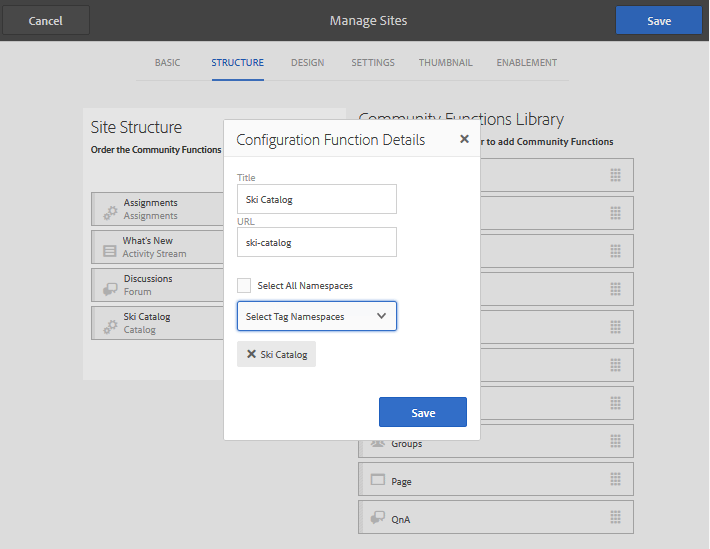

# Balisage des ressources d’activation{#tagging-enablement-resources} 

## Présentation {#overview}

Le balisage des ressources d’activation permet de filtrer les ressources et les chemins d’apprentissage lorsque les membres parcourent [des catalogues](functions.md#catalog-function).

Essentiellement :

* [Création d’un espace de nommage](../../help/sites-administering/tags.md#creating-a-namespace) de balises pour chaque catalogue

   * [Définir les autorisations de balise](../../help/sites-administering/tags.md#setting-tag-permissions)
   * Pour les membres de la communauté uniquement (communauté fermée)

      * Autoriser l&#39;accès en lecture pour le groupe de membres du site [communautaire](users.md#publish-group-roles)
   * Pour tout visiteur de site, qu’il soit connecté ou anonyme (communauté ouverte)

      * Autoriser l&#39;accès en lecture pour le `Everyone` groupe
   * [Publication des balises](../../help/sites-administering/tags.md#publishing-tags)

* [Définir la portée des balises pour un site communautaire](sites-console.md#tagging)

   * [Configurer les catalogues qui existent dans la structure du site](functions.md#catalog-function)

      * Peut ajouter des balises à l’instance de catalogue pour contrôler la liste des balises présentées dans les filtres d’interface utilisateur.
      * Peut ajouter des [pré-filtres](catalog-developer-essentials.md#pre-filters), afin de limiter les ressources incluses d’un catalogue.

* [Publication du site de la communauté](sites-console.md#publishing-the-site)
* [Appliquer des balises aux ressources](resources.md#create-a-resource) d’activation afin qu’elles puissent être filtrées de manière catégorique
* [Publication des ressources d’activation](resources.md#publish)

## Balises du site de la communauté {#community-site-tags}

Lors de la création ou de la modification d’un site communautaire, le paramètre  Balisage définit l’étendue des balises disponibles pour les fonctionnalités du site en sélectionnant un sous-ensemble d’espaces de nommage de balises existants.

Bien que des balises puissent être créées et ajoutées au site de la communauté à tout moment, il est recommandé de concevoir une taxonomie à l’avance, comme pour la conception d’une base de données. Voir [Utilisation des balises](../../help/sites-authoring/tags.md).

Lors de l’ajout ultérieur de balises à un site communautaire existant, il est nécessaire d’enregistrer la modification avant de pouvoir ajouter la nouvelle balise à une fonction de catalogue dans la structure du site.

Pour un site communautaire, une fois le site publié et les balises publiées, il est nécessaire de permettre l&#39;accès en lecture aux membres de la communauté. See [Setting Tag Permissions](../../help/sites-administering/tags.md#setting-tag-permissions).

Voici comment il apparaît dans CRXDE lorsqu’un administrateur applique des autorisations de lecture `/etc/tags/ski-catalog` au groupe `Community Enable Members`.

## Espaces de nommage de balises de catalogue {#catalog-tag-namespaces}

La fonction de catalogue utilise des balises pour se définir elle-même. Lors de la configuration de la fonction de catalogue dans un site de la communauté, l’ensemble d’espaces de nommage de balise à choisir est défini par l’étendue des emplacements de balise définis pour le site de la communauté.

La fonction Catalogue comprend un paramètre de balise qui définit les balises répertoriées dans l’interface utilisateur de filtrage du catalogue. Le paramètre &quot;Tous les Espaces de nommage&quot; fait référence à la portée des espaces de nommage de balises sélectionnés pour le site communautaire.

## Application de balises aux ressources d’activation {#applying-tags-to-enablement-resources}

Les ressources d’activation et les chemins d’apprentissage s’afficheront dans tous les catalogues une fois `Show in Catalog` cochés. L’Ajoute de balises aux ressources et aux chemins d’apprentissage permet de préfiltrer dans des catalogues spécifiques, ainsi que de filtrer dans l’interface utilisateur du catalogue.

La limitation des ressources d’activation et des chemins d’apprentissage à des catalogues spécifiques est réalisée en créant des [pré-filtres](catalog-developer-essentials.md#pre-filters).

L’interface utilisateur du catalogue permet aux visiteurs d’appliquer un filtre de balises à la liste des ressources et des chemins d’apprentissage qui apparaissent dans ce catalogue.

L’administrateur appliquant les balises aux ressources d’activation doit connaître les espaces de nommage de balises associés aux catalogues, ainsi que la taxonomie afin de sélectionner une sous-balise pour une catégorisation plus précise.

Par exemple, si un `ski-catalog` espace de nommage a été créé et défini sur un catalogue nommé `Ski Catalog`, il peut avoir deux balises enfants : `lesson-1` et `lesson-2`.

Ainsi, toute ressource d&#39;activation balisée avec l&#39;une des ressources suivantes :

* catalogue de ski:leçon-1
* catalogue de ski:leçon-2

apparaîtra dans `Ski Catalog` une fois la ressource d&#39;activation publiée.

## Affichage du catalogue lors de la publication {#viewing-catalog-on-publish}

Une fois que tout a été configuré à partir de l’environnement d’auteur et publié, l’expérience d’utilisation du catalogue pour rechercher des ressources d’activation peut être expérimentée dans l’environnement de publication.

Si aucun espace de nommage de balise n’apparaît dans la liste déroulante, assurez-vous que les autorisations ont été correctement définies dans l’environnement de publication.

Si des espaces de nommage de balises ont été ajoutés et sont manquants, vérifiez que les balises et le site ont été republiés.

Si aucune ressource d’activation n’apparaît après avoir sélectionné une balise lors de l’affichage du catalogue, assurez-vous qu’une balise de l’espace de nommage du catalogue est appliquée à la ressource d’activation.

