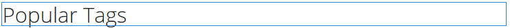
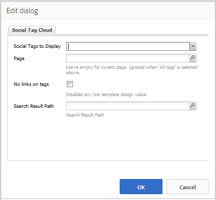
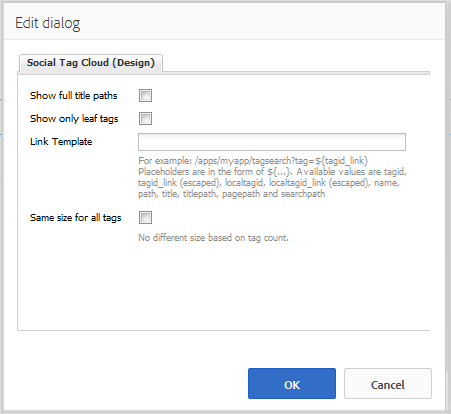

# Utilisation du cloud de balises sociales {#using-social-tag-cloud}

## Présentation {#introduction}

Le composant `Social Tag Cloud` met en surbrillance les balises appliquées par les membres de la communauté lors de la publication de contenu. Il permet d’identifier les rubriques de tendance et de localiser rapidement le contenu balisé.

Pour un autre moyen d’identifier les tendances actuelles, consultez [Tendances des activités](trends.md).

Cette page documente les paramètres de la boîte de dialogue du composant `Social Tag Cloud` et décrit l’expérience de l’utilisateur.

Pour obtenir des informations détaillées à l’intention des développeurs, voir [Tag Essentials](tag.md).

Voir [Administration des balises](../../help/sites-administering/tags.md) pour plus d’informations sur la création et la gestion des balises et sur la façon de déterminer à quel contenu elles ont été appliquées.

## Ajout d’un cloud de balises sociales {#adding-a-social-tag-cloud}

Pour ajouter un composant `Social Tag Cloud` à une page en mode création, utilisez l’explorateur de composants pour le localiser et `Communities / Social Tag Cloud` faire glisser sur une page où le nuage de balises doit apparaître.

Pour plus d’informations, consultez [Principes de base des composants de communautés](basics.md).

Lorsque les [bibliothèques côté client requises](tag.md#essentials-for-client-side) sont incluses, le composant `Social Tag Cloud` s’affiche de la manière suivante :

## Configuration du cloud de balises sociales {#configuring-social-tag-cloud}

Sélectionnez le composant de `Social Tag Cloud` placé afin de pouvoir accéder à l’icône de `Configure` qui ouvre la boîte de dialogue de modification et de la sélectionner.

Sous l’onglet **[!UICONTROL Nuage de balises sociales]**, spécifiez les balises à afficher et, si les balises sont des liens actifs, l’emplacement de la page pour les résultats de recherche :

* **[!UICONTROL Balises sociales à afficher]**
Identifiez les balises du contenu créé par l’utilisateur à afficher. Les options déroulantes sont les suivantes :

  * `From page and child pages`
  * `All tags`

  La valeur par défaut est `From page and child pages`, où « page » fait référence au paramètre **Page** ci-dessous.

* **[!UICONTROL Page]**

  (Obligatoire si ce n’est pas `All tags)` Chemin d’accès au contenu créé par l’utilisateur pour une page. La valeur par défaut est la page active si rien n’est indiqué.

* **[!UICONTROL Aucun lien sur les balises]**

  Si cette case est cochée, les balises s’affichent dans le nuage de balises en tant que texte brut. Si cette option n’est pas cochée, les balises s’affichent sous la forme de liens actifs qui effectuent une recherche sur tout le contenu auquel cette balise est appliquée. La valeur par défaut n’est pas cochée et nécessite la définition du chemin d’accès au résultat de recherche **[!UICONTROL Search]**.

* **[!UICONTROL Chemin du résultat de la recherche]**

  Chemin d’accès à une page sur laquelle a été placé un composant `Search Result`, configuré pour référencer le contenu créé par l’utilisateur qui inclut le chemin d’accès au contenu créé par l’utilisateur spécifié par le paramètre **Page**.

## Modification de l’affichage du cloud de balises sociales {#change-display-of-social-tag-cloud}

Pour modifier l’affichage du **nuage de balises sociales**, saisissez le [mode de conception](../../help/sites-authoring/default-components-designmode.md) et double-cliquez sur le composant de `Social Tag Cloud` placé pour ouvrir une boîte de dialogue avec un onglet supplémentaire.

À l’aide de l’onglet **[!UICONTROL Nuage de balises sociales (conception)]** spécifiez le mode d’affichage des balises. Une balise peut être une balise simple, un seul mot dans l’espace de noms par défaut ou une taxonomie hiérarchique :

* **[!UICONTROL Afficher les chemins de titre complets]**

  Si cette case est cochée, affiche le titre des balises parents et l’espace de noms de chaque balise appliquée.

  Par exemple :

  * Vérifié : `Geometrixx Media: Gadgets / Cars`
  * Non coché : `Cars`

  Il n’existe aucune différence pour une balise simple.

  La valeur par défaut n’est pas cochée.

* **[!UICONTROL Afficher uniquement les balises terminales]**

  Si cette case est cochée, affiche uniquement les balises appliquées qui ne contiennent pas d’autres balises.

  Par exemple, avec l’ID de balise de :

  `Geometrixx Media: Gadgets / Cars`

  Trois balises peuvent être appliquées :

  `Geometrixx Media (the namespace)`, `Gadgets` et `Cars`

  * Cochée : seules les `Cars` s’affichent, le cas échéant.
  * Décochée : `Geometrixx Media`, `Gadgets` et `Cars` sont affichés, le cas échéant.

  Une balise simple est une balise feuille.

  La valeur par défaut n’est pas cochée.

* **[!UICONTROL Modèle de lien]**

  Modèle, autre que celui par défaut, utilisé pour afficher les liens dans un nuage de balises, lorsque les liens sont activés via la boîte de dialogue de modification du composant.

* **[!UICONTROL Même taille pour toutes les balises]**

  Si cette case est cochée, tous les mots du nuage de balises ont le même style. Si cette option n’est pas cochée, les mots sont stylisés différemment selon leur utilisation. La valeur par défaut n’est pas cochée.

## Informations supplémentaires {#additional-information}

Vous trouverez plus d’informations à ce sujet sur la page [Tag Essentials](tag.md) destinée aux développeurs et développeuses.

Pour plus d’informations sur la création et la gestion des balises[&#128279;](tag-ugc.md) voir  Balisage de contenu créé par l’utilisateur (UGC) .
