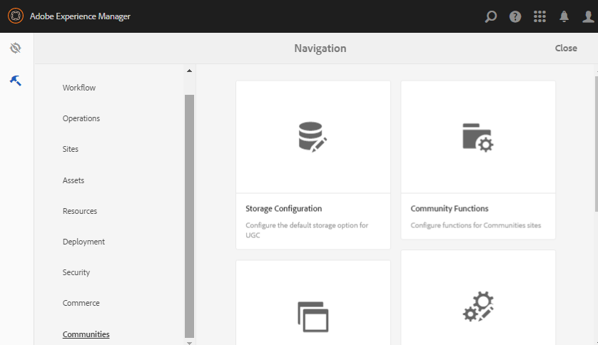

# Outils de communautés {#communities-tools}

Pour accéder à la console Outils de Communities, connectez-vous à votre instance de création :

* À partir de la navigation globale : **[!UICONTROL Outils]** > **[!UICONTROL Communautés]**.

  

* [Modèles de site](sites.md) - Console pour la création et la gestion de modèles de site.

* [Modèles de groupe](tools-groups.md) - Console pour la création et la gestion de modèles de groupe.

* [Community Functions](functions.md) - Console pour la création et la gestion de fonctions de communauté.

* [Configuration du stockage](srp-config.md) - Console de configuration et de sélection du [SRP par défaut](working-with-srp.md).

* [Guide des composants](components-guide.md) - Ouvre un site interactif qui permet de tester le fonctionnement des composants SCF et leur configuration ou personnalisation.

* [Badges](badges.md) - Console à partir de laquelle des badges personnalisés peuvent être ajoutés pour être utilisés dans les [règles de score et de badge](implementing-scoring.md)
