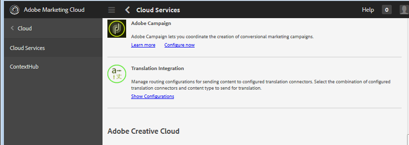
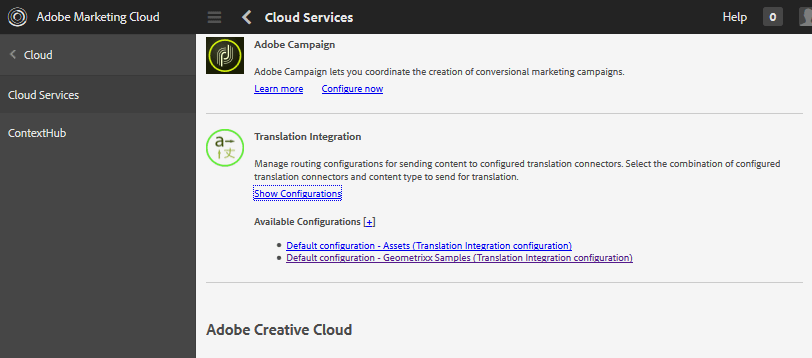
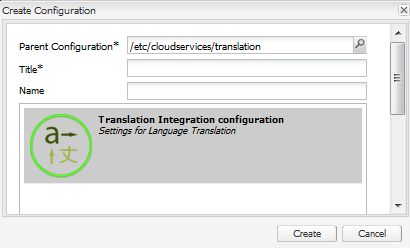
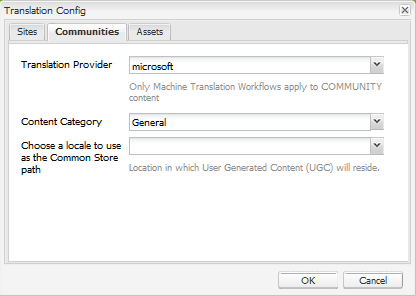
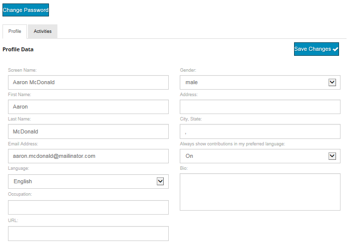

# Traduction de contenu créé par l’utilisateur {#translating-user-generated-content}

La fonctionnalité de traduction des communautés Adobe Experience Manager (AEM) étend le concept de [traduction du contenu des pages](../../help/sites-administering/translation.md) au contenu créé par l’utilisateur publié sur les sites des communautés à l’aide de [composants SCF (Social Component Framework)](scf.md).

La traduction du contenu créé par l’utilisateur permet aux visiteurs du site et aux membres de faire l’expérience d’une communauté mondiale en supprimant les barrières linguistiques.

Par exemple, supposons que :

* Un membre de France publie une recette en français sur le forum communautaire d&#39;un site de cuisine multinationale.
* Un autre membre japonais utilise la fonction de traduction pour déclencher la traduction de la recette du français vers le japonais.
* Après avoir lu la recette en japonais, le député du Japon publie ensuite un commentaire en japonais.
* Le député français utilise la fonction de traduction pour traduire le commentaire japonais en français.
* Communication globale.

## Vue d’ensemble {#overview}

Cette section explique spécifiquement comment le service de traduction fonctionne avec le contenu créé par l’utilisateur. Cela suppose également que vous compreniez comment connecter AEM à un [fournisseur de services de traduction](../../help/sites-administering/translation.md#connectingtoatranslationserviceprovider) et intégrer ce service à un site web en configurant un [framework d’intégration de traduction](../../help/sites-administering/tc-tic.md).

Lorsqu’un fournisseur de services de traduction est associé au site, chaque copie de langue du site conserve ses propres threads de contenu créé par l’utilisateur publiés par le biais de composants SCF, tels que des commentaires.

Lorsqu’une intégration de traduction est configurée en plus du fournisseur de services de traduction, il est possible que chaque copie de langue du site partage un seul thread de contenu créé par l’utilisateur, ce qui permet une communication globale entre les copies de langue. Au lieu d’un thread de discussion séparé par langue, le [magasin partagé global](#global-translation-of-ugc) configuré permet au thread entier d’être visible quelle que soit la copie de langue à partir de laquelle il est affiché. De plus, plusieurs configurations d’intégration de traduction peuvent être configurées en spécifiant différents magasins partagés globaux pour un regroupement logique de participants globaux, par exemple par régions.

## Service De Traduction Par Défaut {#the-default-translation-service}

AEM Communities comprend une [licence d’évaluation](../../help/sites-administering/tc-msconf.md#microsoft-translator-trial-license) pour un [service de traduction par défaut](../../help/sites-administering/tc-msconf.md) activé pour plusieurs langues.

Lors de la [création d’un site de la communauté](sites-console.md), le service de traduction par défaut est activé lorsque `Allow Machine Translation` est coché dans le sous-panneau [TRADUCTION](sites-console.md#translation).

>[!CAUTION]
>
>Le service de traduction par défaut est fourni uniquement à des fins de démonstration.
>
>Pour un système de production, un service de traduction sous licence est requis. Si aucune licence n’est associée, le service de traduction par défaut doit être [désactivé](../../help/sites-administering/tc-msconf.md#microsoft-translator-trial-license-geometrixx-outdoors).

## Traduction globale du contenu créé par l’utilisateur {#global-translation-of-ugc}

Lorsqu’un site web comporte plusieurs [copies de langue](../../help/sites-administering/tc-prep.md), le service de traduction par défaut ne reconnaît pas que le contenu créé par l’utilisateur saisi sur un site peut être lié au contenu créé par l’utilisateur saisi sur un autre site. C’est le cas lorsque le contenu créé par l’utilisateur est généré par le même composant (la copie de langue de la page contenant le composant).

Cela ressemble à des groupes de personnes qui discutent d’un sujet. Ils ne sont pas au courant des commentaires qui sont faits dans des groupes autres que le leur, par rapport à tous les membres d&#39;un grand groupe qui participent à une conversation.

Si « une conversation de groupe » est souhaitée, il est possible d’activer la traduction globale sur un site web avec plusieurs copies de langue, de sorte que l’ensemble du thread soit visible quelle que soit la copie de langue à partir de laquelle il est affiché.

Par exemple, si un forum a été créé sur le site de base, que des copies de langue ont été créées et que la traduction globale a été activée, une rubrique publiée sur le forum dans une copie de langue apparaît dans toutes les copies de langue. Il en va de même pour toutes les réponses, quelle que soit la copie de langue à partir de laquelle la réponse a été saisie. Ainsi, le sujet et l’ensemble du fil des réponses sont visibles, quelle que soit la copie de langue à partir de laquelle le sujet est consulté.

>[!CAUTION]
>
>Tout contenu créé par l’utilisateur qui existait avant la traduction globale n’est plus visible.
>
>Bien que le contenu créé par l’utilisateur se trouve toujours dans le [magasin commun](working-with-srp.md), il se trouve à l’emplacement du contenu créé par l’utilisateur spécifique à la langue, tandis que le nouveau contenu, ajouté après la configuration de la traduction globale, est récupéré à partir de l’emplacement du magasin partagé global.
>
>Il n’existe aucun outil de migration permettant de déplacer ou de fusionner du contenu spécifique à une langue dans le magasin partagé global.

### Configuration de l’intégration de traduction {#translation-integration-configuration}

Pour créer une intégration de traduction, qui intègre un connecteur de service de traduction au site web sur l’instance d’auteur :

* Se connecter en tant qu’administrateur
* À partir du [menu principal](http://localhost:4502/)
* Sélectionnez **[!UICONTROL Outils]**.
* Sélectionnez **[!UICONTROL Opérations]**
* Sélectionnez **[!UICONTROL Cloud]**
* Sélectionnez **[!UICONTROL Services cloud]**
* Faites défiler jusqu’à **[!UICONTROL Intégration de traduction]**

  

* Sélectionnez **[!UICONTROL Afficher les configurations]**

  

* Sélectionnez `[+]` icône en regard de **[!UICONTROL Configurations disponibles]** afin de pouvoir créer une configuration.

#### Boîte de dialogue Créer une configuration {#create-configuration-dialog}

* **[!UICONTROL Configuration du parent]**

  (Obligatoire) En règle générale, laissez le paramètre par défaut. La valeur par défaut est `/etc/cloudservices/translation`.

* **[!UICONTROL Titre]**

  (Obligatoire) Saisissez un titre d’affichage de votre choix. Pas de valeur par défaut.

* **[!UICONTROL Nom]**

  (Facultatif) Saisissez un nom pour la configuration. Par défaut, il s’agit d’un nom de nœud basé sur le titre.

* Sélectionnez **[!UICONTROL Créer]**

#### Boîte de dialogue de configuration de traduction {#translation-config-dialog}

Pour obtenir des instructions détaillées, voir [Création d’une configuration de l’intégration de traduction](../../help/sites-administering/tc-tic.md#creating-a-translation-integration-configuration).

* Onglet **[!UICONTROL Sites]** : peut laisser comme valeurs par défaut.

* Onglet **[!UICONTROL Communities]** :
  * **[!UICONTROL Fournisseur de traduction]**
    Sélectionnez le fournisseur de traduction dans la liste déroulante. La valeur par défaut est `microsoft`, le service d’évaluation.

  * **[!UICONTROL Catégorie de contenu]**
    Sélectionnez une catégorie qui décrit le contenu traduit. La valeur par défaut est `General.`

  * **[!UICONTROL Choisir Un Paramètre Régional...]**
    (Facultatif) En sélectionnant un paramètre régional pour le stockage du contenu créé par l’utilisateur, les publications de toutes les copies de langue apparaissent dans une conversation globale. Par convention, choisissez les paramètres régionaux comme [langue de base](sites-console.md#translation) pour le site web. Choisir `No Common Store` désactive la traduction globale. Par défaut, la traduction internationale est désactivée.

* Onglet **&#x200B;**&#x200B;: peut laisser comme valeurs par défaut.
* Sélectionnez **[!UICONTROL OK]**.

#### Activation {#activation}

Le nouveau service cloud d’intégration de traduction doit être activé dans l’environnement de publication. Lorsqu’il est associé à un site web, s’il n’est pas encore activé, le workflow d’activation invite à publier cette configuration de service cloud lorsque la page à laquelle il est associé est publiée.

## Gestion des paramètres de traduction {#managing-translation-settings}

>[!NOTE]
>
>**Langue Préférée**
>
>Lorsque vous détectez si la publication est dans une langue différente de la langue préférée, la langue préférée du visiteur du site doit être établie.
>
>La langue préférée est la préférence linguistique définie dans le profil d’un utilisateur, lorsque le visiteur du site est connecté et a spécifié une préférence linguistique.
>
>Lorsque le visiteur du site est anonyme ou n’a pas spécifié de préférence de langue dans son profil, la langue préférée est la langue de base du modèle de page.

### Préférence utilisateur {#user-preference}

#### Profil utilisateur {#user-profile}

Tous les sites de communautés fournissent un profil utilisateur que les membres connectés peuvent modifier pour s’identifier auprès de la communauté et définir leurs préférences.

L’un de ces paramètres indique s’il faut toujours afficher le contenu de la communauté dans la langue souhaitée. Par défaut, le paramètre n’est pas défini et correspond par défaut au paramètre système. L’utilisateur peut définir le paramètre sur Activé ou Désactivé pour remplacer le paramètre système.

Lorsque les pages sont automatiquement traduites dans la langue préférée de l’utilisateur ou de l’utilisatrice, l’interface utilisateur permettant d’afficher le texte original et d’améliorer la traduction est toujours disponible.

### Paramètres du site communautaire {#community-site-setting}

Lorsqu’un site communautaire est créé, l’option de traduction peut être activée et configurée. Le paramètre de traduction est appliqué au contenu que les visiteurs anonymes d’un site peuvent afficher, mais il est remplacé par le paramètre de profil de l’utilisateur.
