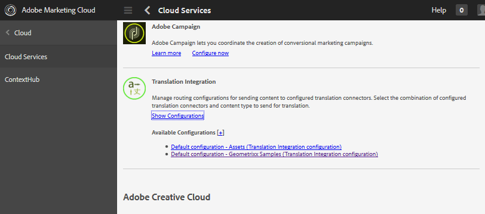

# Traduction de contenu généré par l’utilisateur {#translating-user-generated-content}

La fonction de traduction de Adobe Experience Manager (AEM) Communities étend le concept de [traduction du contenu de la page](../../help/sites-administering/translation.md) au contenu généré par l’utilisateur (contenu généré par l’utilisateur) publié sur les sites de la communauté à l’aide de [Composants SCF (Social Component Framework)](scf.md).

La traduction du contenu généré par l’utilisateur permet aux visiteurs et aux membres du site de découvrir une communauté globale en supprimant les barrières linguistiques.

Par exemple, supposons :

* Un membre de France publie une recette en français sur le forum communautaire d&#39;un site de cuisine multinational.
* Un autre membre du Japon utilise la fonction de traduction pour déclencher la traduction de la recette du français vers le japonais.
* Après avoir lu la recette en japonais, le membre du Japon a publié un commentaire en japonais.
* Le membre de France utilise la fonction de traduction pour traduire le commentaire japonais en français.
* Communication globale.

## Vue d’ensemble {#overview}

Cette section décrit spécifiquement le fonctionnement du service de traduction avec le contenu généré par l’utilisateur. Cela suppose également que vous compreniez comment vous connecter AEM à une [fournisseur de services de traduction](../../help/sites-administering/translation.md#connectingtoatranslationserviceprovider) et intégrer ce service dans un site web en configurant une [structure d’intégration de traduction](../../help/sites-administering/tc-tic.md).

Lorsqu’un fournisseur de services de traduction est associé au site, chaque copie de langue du site conserve ses propres threads du contenu généré par l’utilisateur publié via des composants SCF tels que les commentaires.

Lorsqu’une intégration de traduction est configurée en plus du fournisseur de services de traduction, il est possible pour chaque copie de langue du site de partager un seul fil du contenu créé par l’utilisateur, ce qui permet une communication globale entre les copies de langue. Au lieu d&#39;un fil de discussion séparé par la langue, le [magasin partagé global](#global-translation-of-ugc) permet à l’ensemble du thread d’être visible, quelle que soit la copie de langue affichée. En outre, plusieurs configurations d’intégration de traduction peuvent être configurées en spécifiant différents magasins partagés globaux pour un groupe logique de participants globaux, par exemple par régions.

## Service de traduction par défaut {#the-default-translation-service}

AEM Communities comprend une [licence d&#39;évaluation](../../help/sites-administering/tc-msconf.md#microsoft-translator-trial-license) pour un [service de traduction par défaut](../../help/sites-administering/tc-msconf.md) activée pour plusieurs langues.

When [création d’un site communautaire](sites-console.md), le service de traduction par défaut est activé lorsque `Allow Machine Translation` est vérifié à partir de la fonction [TRADUCTION](sites-console.md#translation) sous-panneau.

>[!CAUTION]
>
>Le service de traduction par défaut est réservé à une démonstration.
>
>Pour un système de production, un service de traduction sous licence est requis. Si elle n’est pas sous licence, le service de traduction par défaut doit être [désactivé](../../help/sites-administering/tc-msconf.md#microsoft-translator-trial-license-geometrixx-outdoors).

## Traduction globale du contenu généré par l’utilisateur {#global-translation-of-ugc}

Lorsque plusieurs sites web [copies de langue](../../help/sites-administering/tc-prep.md), le service de traduction par défaut ne reconnaît pas que le contenu généré par l’utilisateur entré sur un site peut être lié au contenu saisi sur un autre. C’est le cas lorsque le contenu généré par l’utilisateur est généré par le même composant (la copie de langue de la page contenant le composant).

C&#39;est similaire à des groupes de personnes discutant d&#39;un sujet. Ils ne sont pas au courant des commentaires faits en groupes autres que les leurs, par rapport à tous ceux qui participent à un grand groupe à une conversation.

Si &quot;une conversation de groupe&quot; est souhaitée, il est possible d’activer la traduction globale sur un site web avec plusieurs copies de langue, de sorte que l’ensemble du thread soit visible, quelle que soit la copie de langue affichée.

Par exemple, si un forum a été établi sur le site de base, que des copies de langue ont été créées et que la traduction globale a été activée, un sujet publié sur le forum dans une copie de langue apparaît dans toutes les copies de langue. Il en va de même pour toute réponse, quelle que soit la langue à partir de laquelle la réponse a été saisie. Le résultat serait que le sujet et l’ensemble de son fil de réponses soient visibles, quelle que soit la langue à partir de laquelle la copie de la rubrique est affichée.

>[!CAUTION]
>
>Tout contenu créé par l’utilisateur qui existait avant la traduction globale n’est plus visible.
>
>Bien que le contenu généré par l’utilisateur figure toujours dans la variable [magasin commun](working-with-srp.md), il se trouve sous l’emplacement du contenu généré par l’utilisateur spécifique à la langue, tandis que le nouveau contenu, ajouté après la configuration de la traduction globale, est récupéré à partir de l’emplacement de stockage partagé global.
>
>Il n’existe pas d’outil de migration pour déplacer ou fusionner du contenu spécifique à une langue dans le magasin partagé global.

### Configuration de l’intégration de traduction {#translation-integration-configuration}

Pour créer une intégration de traduction qui intègre un connecteur de service de traduction au site web sur l’instance d’auteur :

* Connexion en tant qu’administrateur
* Dans la [menu principal](http://localhost:4502/)
* Sélectionnez **[!UICONTROL Outils]**.
* Sélectionner **[!UICONTROL Opérations]**
* Sélectionner **[!UICONTROL Cloud]**
* Sélectionnez **[!UICONTROL Services cloud]**
* Faites défiler jusqu’à **[!UICONTROL Intégration de traduction]**

  

* Sélectionner **[!UICONTROL Afficher les configurations]**

  

* Sélectionner `[+]` en regard de **[!UICONTROL Configurations disponibles]** pour créer une configuration.

#### Boîte de dialogue Créer une configuration {#create-configuration-dialog}

* **[!UICONTROL Configuration du parent]**

  (Obligatoire) Laissez généralement le paramètre par défaut. La valeur par défaut est `/etc/cloudservices/translation`.

* **[!UICONTROL Titre]**

  (Obligatoire) Saisissez le titre d’affichage de votre choix. Pas de valeur par défaut.

* **[!UICONTROL Nom]**

  (Facultatif) Saisissez un nom pour la configuration. La valeur par défaut est un nom de noeud basé sur le titre.

* Sélectionnez **[!UICONTROL Créer]**

#### Boîte de dialogue de configuration de traduction {#translation-config-dialog}

Pour obtenir des instructions détaillées, voir [Création d’une configuration d’intégration de traduction](../../help/sites-administering/tc-tic.md#creating-a-translation-integration-configuration).

* **[!UICONTROL Sites]** tab : peut laisser comme valeur par défaut.

* **[!UICONTROL Communautés]** tab :
   * **[!UICONTROL Fournisseur de traduction]**
Sélectionnez le fournisseur de traduction dans la liste déroulante. Par défaut : `microsoft`, le service d’évaluation.

   * **[!UICONTROL Catégorie de contenu]**
Sélectionnez une catégorie qui décrit le contenu en cours de traduction. La valeur par défaut est `General.`

   * **[!UICONTROL Sélectionnez Un Paramètre Régional...]**
(Facultatif) En sélectionnant un paramètre régional pour le stockage du contenu créé par l’utilisateur, les publications de toutes les copies de langue apparaissent dans une conversation globale. Par convention, choisissez la langue locale comme [langue de base](sites-console.md#translation) pour le site web. Choix `No Common Store` désactive la traduction globale. Par défaut, la traduction internationale est désactivée.

* **[!UICONTROL Ressources]** tab : peut laisser comme valeur par défaut.
* Sélectionnez **[!UICONTROL OK]**

#### Activation {#activation}

Le nouveau service cloud d’intégration de traduction doit être activé dans l’environnement de publication. Lorsqu’il est associé à un site web, s’il n’est pas encore activé, le workflow d’activation invite à publier cette configuration de service cloud lorsque la page à laquelle il est associé est publiée.

## Gestion des paramètres de traduction {#managing-translation-settings}

>[!NOTE]
>
>**Langue préférée**
>
>Lors de la détection de la publication dans une langue différente de la langue préférée, la langue préférée du visiteur du site doit être définie.
>
>La langue préférée est la préférence linguistique définie dans le profil d’un utilisateur, lorsque le visiteur du site est connecté et a spécifié une préférence linguistique.
>
>Lorsque le visiteur du site est anonyme ou n’a pas indiqué de préférence linguistique dans son profil, la langue préférée est la langue de base du modèle de page.

### Préférences utilisateur {#user-preference}

#### Profil utilisateur {#user-profile}

Tous les sites de communautés fournissent un profil utilisateur que les membres connectés peuvent modifier pour s’identifier à la communauté et définir leurs préférences.

L’un de ces paramètres consiste à toujours afficher le contenu de la communauté dans la langue de leur choix. Par défaut, le paramètre n’est pas défini et utilise le paramètre système par défaut. L’utilisateur peut définir le paramètre sur Activé ou Désactivé pour remplacer le paramètre système.

Lorsque les pages sont automatiquement traduites dans la langue préférée de l’utilisateur, l’interface utilisateur permettant d’afficher le texte d’origine et d’améliorer la traduction reste disponible.

### Paramètre du site de communauté {#community-site-setting}

Lorsqu’un site communautaire est créé, l’option de traduction peut être activée et configurée. Le paramètre de traduction est appliqué au contenu que les visiteurs anonymes du site peuvent afficher, mais il est remplacé par le paramètre de profil de l’utilisateur.
