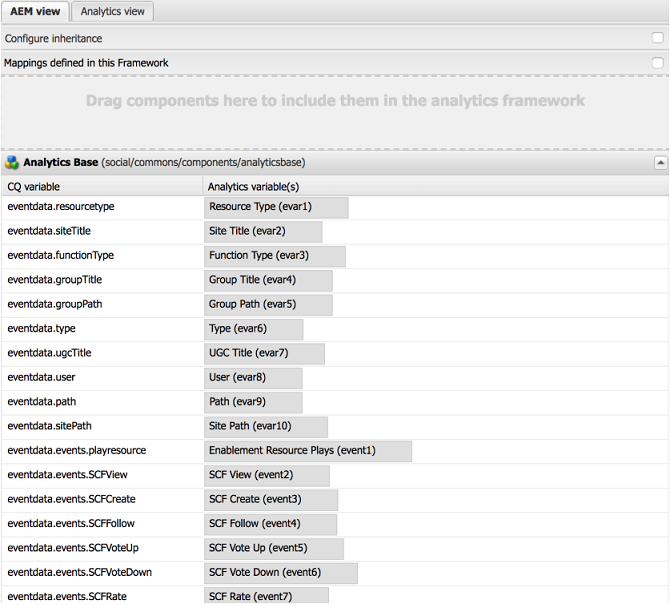

# Service de gestion des utilisateurs et du contenu créé par l’utilisateur dans AEM Communities {#user-and-ugc-management-service-in-aem-communities}

>[!IMPORTANT]
>
>Le RGPD est utilisé comme exemple dans les sections ci-dessous, mais les détails couverts sont applicables à toutes les réglementations de protection des données et de confidentialité, comme le RGPD, le CCPA, etc.

AEM Communities expose des API prêtes à l’emploi pour gérer les profils utilisateur et gérer en masse le contenu généré par l’utilisateur. Une fois activé, le service **UserUgcManagement** permet aux utilisateurs privilégiés (administrateurs de communauté et modérateurs) de désactiver les profils utilisateur et de supprimer ou d’exporter en masse du contenu créé par l’utilisateur pour des utilisateurs spécifiques. Ces API permettent également aux contrôleurs et aux processeurs des données clients de se conformer au Règlement général sur la protection des données (RGPD) de l’Union européenne et à d’autres mandats de confidentialité inspirés du RGPD.

Pour plus d’informations, consultez la [page consacrée au RGPD du centre de confidentalité d’Adobe](https://www.adobe.com/fr/privacy/general-data-protection-regulation.html).

>[!NOTE]
>
>Si vous avez configuré le site [Adobe Analytics dans AEM Communities](/help/communities/analytics.md), les données utilisateur capturées sont envoyées au serveur Adobe Analytics. Adobe Analytics fournit des API qui vous permettent d’accéder, d’exporter et de supprimer des données utilisateur et de respecter le RGPD. Pour plus d’informations, voir [Soumettre les demandes d’accès et de suppression](https://experienceleague.adobe.com/docs/analytics/admin/data-governance/gdpr-submit-access-delete.html?lang=fr).

Pour utiliser ces API, vous devez activer le point d’entrée `/services/social/ugcmanagement` en activant le service UserUgcManagement. Pour activer ce service, installez l’ [exemple de servlet](https://github.com/Adobe-Marketing-Cloud/aem-communities-ugc-migration/tree/main/bundles/communities-ugc-management-servlet) disponible sur [GitHub.com](https://github.com/Adobe-Marketing-Cloud/aem-communities-ugc-migration/tree/main/bundles/communities-ugc-management-servlet). Ensuite, accédez au point de terminaison sur l’instance de publication de votre site Communities avec les paramètres appropriés à l’aide d’une requête http, semblable à :

`https://localhost:port/services/social/ugcmanagement?user=<authorizable ID>&operation=<getUgc>`. Cependant, vous pouvez également créer une interface utilisateur (interface utilisateur) pour gérer les profils utilisateur et le contenu généré par les utilisateurs dans le système.

Ces API permettent d’exécuter les fonctions suivantes.

## Récupération du contenu généré par un utilisateur {#retrieve-the-ugc-of-a-user}

**getUserUgc(ResourceResolver resourceResolver, String user, OutputStream outputStream)** aide à exporter tout le contenu généré par un utilisateur du système.

* **user** : ID autorisable d’un utilisateur.
* **outputStream** : le résultat est renvoyé en tant que flux de sortie, qui est un fichier zip comprenant le contenu généré par l’utilisateur (en tant que fichier json) et les pièces jointes (qui incluent des images ou des vidéos téléchargées par l’utilisateur).

Par exemple, pour exporter le contenu généré par un utilisateur nommé Weston McCall, qui utilise weston.mccall@dodgit.com comme ID autorisable pour se connecter au site Communities, vous pouvez envoyer une demande de GET http similaire à ce qui suit :

`https://localhost:port/services/social/ugcmanagement?user=weston.mccall@dodgit.com&operation=getUgc`

## Suppression du contenu généré par un utilisateur {#delete-the-ugc-of-a-user}

**deleteUserUgc(ResourceResolver resourceResolver, String user)** aide à supprimer du système tout le contenu généré par un utilisateur.

* **user** : ID autorisable de l’utilisateur.

Par exemple, pour supprimer le contenu généré par un utilisateur disposant d’un ID autorisable weston.mccall@dodgit.com par le biais d’une demande de POST HTTP, utilisez les paramètres suivants :

* user = `weston.mccall@dodgit.com`
* operation = `deleteUgc`

### Suppression du contenu généré par l’utilisateur d’Adobe Analytics {#delete-ugc-from-adobe-analytics}

Pour supprimer les données utilisateur d’Adobe Analytics, suivez le [ workflow Analytics RGPD ](https://experienceleague.adobe.com/docs/analytics/admin/data-governance/an-gdpr-workflow.html?lang=fr), car l’API ne supprime pas les données utilisateur d’Adobe Analytics.

Pour les mappages de variables Adobe Analytics utilisés par AEM Communities, reportez-vous à l’image suivante :

## Désactivation d’un compte d’utilisateur {#disable-a-user-account}

**deleteUserAccount(ResourceResolver resourceResolver, String user)** aide à désactiver un compte utilisateur.

* **user** : ID autorisable de l’utilisateur.

>[!NOTE]
>
>La désactivation d’un utilisateur supprime tout le contenu généré par l’utilisateur sur le serveur.

Par exemple, pour supprimer le profil d’un utilisateur ayant un ID autorisable `weston.mccall@dodgit.com` par le biais d’une requête de POST HTTP, utilisez les paramètres suivants :

* user = `weston.mccall@dodgit.com`
* operation = `deleteUser`

>[!NOTE]
>
>L’API deleteUserAccount() désactive uniquement un profil utilisateur dans le système et supprime le contenu généré par l’utilisateur. Cependant, pour supprimer un profil utilisateur du système, accédez à **CRXDE Lite**: [https://&lt;serveur>/crx/de](https://localhost:4502/crx/de), recherchez le noeud utilisateur et supprimez-le.
