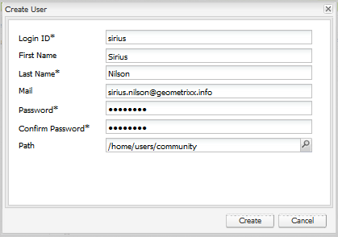

# Gestion des utilisateurs et des groupes d’utilisateurs {#managing-users-and-user-groups}

## Présentation {#overview}

En AEM Communities, dans l’environnement de publication, les utilisateurs peuvent s’enregistrer et modifier leurs profils. Compte tenu des autorisations appropriées, ils peuvent également :

* Créez des sous-communautés dans le site communautaire (voir [groupes communautaires](creating-groups.md)).

* [Contenu généré par l’utilisateur ](moderation.md) modérateur (UGC).

* Soyez [contact ressource d&#39;activation](resources.md).

* Soyez [privilégié](#privileged-members-group) pour créer des entrées pour les blogs, calendriers, QnA et forums.

Les utilisateurs enregistrés dans l’environnement de publication sont généralement appelés *membres de la communauté (membres)* pour les distinguer de *utilisateurs* dans l’environnement d’auteur.

Les autorisations sont accordées en attribuant des membres à l&#39;un des groupes [membres (utilisateur)](#publish-group-roles) créés dynamiquement lorsque le site communautaire est [créé](sites-console.md) ou [modifié](sites-console.md#modifying-site-properties) à partir de l&#39;environnement auteur. Lorsque vous travaillez depuis l’environnement auteur, les membres sont visibles depuis l’environnement de publication au moyen du service de tunnel [](#tunnel-service).

Par conception, les membres et les groupes de membres créés dans l’environnement de publication ne doivent pas apparaître dans l’environnement d’auteur. Les utilisateurs et les groupes d’utilisateurs créés dans l’environnement d’auteur sont également destinés à rester dans l’environnement d’auteur.

Lorsque les utilisateurs sur l’auteur et les membres sur la publication proviennent de la même liste d’utilisateurs, tels que synchronisés depuis le même annuaire LDAP, ils ne sont pas considérés comme le même utilisateur avec les mêmes autorisations et l’appartenance au groupe dans les environnements d’auteur et de publication. Le ou les rôles des membres et des utilisateurs doivent être établis séparément lors de la publication et de l&#39;auteur, selon le cas.

Pour une [batterie de publication](topologies.md), l’enregistrement et les modifications effectués sur une instance de publication doivent être synchronisés avec d’autres instances de publication afin qu’elles aient accès aux mêmes données utilisateur. Pour plus de détails, voir [Synchronisation des utilisateurs](sync.md), qui inclut une section décrivant [Ce qui se passe quand...](sync.md#what-happens-when).

### Limites de contribution {#contribution-limits}

Afin de protéger contre le spam, il est possible de limiter la fréquence des publications de contenu par les membres. En outre, il est possible de limiter automatiquement les contributions des nouveaux membres inscrits.

Pour plus de détails, voir [Limites de contribution des membres](limits.md).

### Groupes d’utilisateurs créés dynamiquement {#dynamically-created-user-groups}

Lorsqu’un nouveau site communautaire est créé, de nouveaux groupes d’utilisateurs sont créés dynamiquement avec des identifiants uniques (uid) et des autorisations appropriées pour diverses fonctions administratives nécessaires à la gestion du site communautaire, soit dans l’environnement d’auteur (voir [Rôles du groupe d’auteurs](#author-group-roles)), soit dans l’environnement de publication (voir [Rôles du groupe de publication](#publish-group-roles)).

Les noms des groupes sont générés à partir du nom donné au site lors de la création [du site communautaire](sites-console.md#step13asitetemplate). Les identifiants uniques évitent de nommer des conflits pour des sites communautaires et des groupes communautaires portant le même nom sur le même serveur.

Par exemple, si le nom du site était &quot;*engager*&quot; pour un site intitulé &quot;We.Retail Engage&quot;, l’un des groupes d’utilisateurs créés serait :

* Communauté *Interagir* Membres

## Environnement de création {#author-environment}

### Service de tunnel {#tunnel-service}

Lorsque vous utilisez l’environnement d’auteur pour [créer des sites](sites-console.md), [modifier les propriétés du site](sites-console.md#modifying-site-properties) et [gérer les membres de la communauté et les groupes de membres](members.md), il est nécessaire d’accéder aux utilisateurs et aux groupes d’utilisateurs enregistrés dans l’environnement de publication.

Le service tunnel fournit cet accès à l&#39;aide de l&#39;agent de réplication sur l&#39;auteur.

* Pour plus d’informations, voir [instructions de configuration](deploy-communities.md#tunnel-service-on-author) dans la page de déploiement.

Les consoles [Communautés Membres et groupes](members.md) ont pour seul objectif de gérer les utilisateurs (membres) et les groupes d&#39;utilisateurs (groupes de membres) enregistrés uniquement dans l&#39;environnement de publication.

Pour gérer les utilisateurs et les groupes d’utilisateurs enregistrés dans l’environnement d’auteur, utilisez la [console de sécurité](../../help/sites-administering/security.md).

### Rôles du groupe d’auteurs {#author-group-roles}

| Si membre du groupe... | Rôle Principal |
|---|---|
| administrators | Le groupe Administrateurs comprend les administrateurs système qui disposent de toutes les capacités d’un administrateur de communauté ainsi que de la capacité de gérer le groupe Administrateurs de communauté. |
| Administrateurs de la communauté | Le groupe Administrateurs de la communauté devient automatiquement membre de tous les sites de la communauté et de tous les groupes de la communauté créés sur le site. Un membre initial du groupe Administrateurs de la communauté est le groupe Administrateurs. Dans l’environnement de l’auteur, les administrateurs de la communauté peuvent créer des sites communautaires, gérer des sites, gérer des membres (ils peuvent interdire les membres de la communauté) et modérer le contenu. |
| Communauté &quot;a0/>nom du site&lt;a1/&quot; Sitecontentmanager ** | Le Gestionnaire de contenu du site de la communauté est en mesure d&#39;effectuer la création AEM contenu, la création de contenu et la modification de pages d&#39;un site de la communauté. |
| Gestionnaires d’activation de la communauté | Le groupe Gestionnaires d’activation de la communauté est composé d’utilisateurs qui peuvent être affectés à la gestion du groupe Gestionnaires d’activation d’un site communautaire. |
| Communauté &quot;a0/>nom du site *> gestionnaires d&#39;implémentation du site* | Le groupe Gestionnaires d&#39;activation du site communautaire est composé d&#39;utilisateurs qui ont été chargés de gérer l&#39;activation [ressources](resources.md) d&#39;un site communautaire. |
| Aucune | Un visiteur de site anonyme ne peut pas accéder à l&#39;environnement de l&#39;auteur. |

### Administrateurs système {#system-administrators}

Les membres du groupe administrateurs sont des administrateurs système qui peuvent effectuer la configuration initiale d’une installation AEM pour les environnements d’auteur et de publication.

À des fins de démonstration et de développement, le groupe d’administrateurs a un membre dont l’ID utilisateur est *admin* et le mot de passe est *admin*.

Pour les environnements de production, le groupe d’administrateurs par défaut doit être modifié.

Veillez à suivre la [liste de contrôle de sécurité](../../help/sites-administering/security-checklist.md).

## Environnement de publication {#publish-environment}

### Devenir membre {#becoming-a-member}

Dans l’environnement de publication, selon les [paramètres](sites-console.md#user-management) du site communautaire, un visiteur de site peut devenir membre de la communauté :

* Lorsque le site communautaire est privé (fermé) :
   * Par invitation
   * Par les actions d’un administrateur

* Lorsque le site communautaire est public (ouvert) :
   * Par auto-inscription
   * Par connexion sociale avec Facebook et Twitter

>[!NOTE]
>
>Si un visiteur de site s&#39;inscrit en tant que membre d&#39;un site communautaire ouvert, il devient automatiquement membre d&#39;autres sites communautaires ouverts sur le même environnement de publication.

### Publier les rôles de groupe {#publish-group-roles}

| Si membre du groupe... | Rôle Principal |
|---|---|
| Membres de la communauté &quot;a0/>nom du site&lt;a1/&quot;** | Un membre du site communautaire est un utilisateur enregistré. Ils peuvent se connecter, modifier leur profil, rejoindre un groupe communautaire ouvert, publier du contenu pour la communauté, envoyer des messages à d&#39;autres membres et suivre les activités du site. |
| Communauté &quot;a0/>nom du site&lt;a1/&quot; Modérateurs ** | Un modérateur de site communautaire est un membre de la communauté de confiance capable de modérer le contenu UGC en bloc, à l’aide de la console de modération ou dans son contexte, sur la page où le contenu est publié. |
| Communauté &quot;a0/>nom du site&lt;a1/&quot; &quot;a2/>nom du groupe&lt;a3/&quot; Membres **** | Un membre du groupe communautaire est un membre de la communauté qui a soit rejoint un groupe communautaire ouvert, soit été invité à un groupe communautaire fermé. Ils ont les capacités d&#39;un membre pour ce groupe communautaire au sein du site. |
| Communauté &quot;a0/>nom du site&lt;a1/&quot; Administrateurs de groupes ** | Un administrateur de groupe de sites communautaires est un membre de communauté de confiance qui est chargé de créer et de gérer des sous-communautés (groupes) au sein d&#39;un site communautaire. La possibilité de fournir une modération dans le contexte est incluse. |
| *Groupe de sécurité des membres privilégiés* | Groupe d’utilisateurs créé et conservé manuellement dans le but de limiter la création de contenu. Voir [Groupe de membres privilégiés](#privileged-members-group). |
| Aucune | Un visiteur de site anonyme, qui découvre le site, peut vue et rechercher des sites communautaires qui autorisent l&#39;accès anonyme. Pour participer et publier du contenu, l’utilisateur doit s’enregistrer (s’il y a lieu) et devenir membre de la communauté. |

### Affectation de membres aux rôles de groupe de publication {#assigning-members-to-publish-group-roles}

Lorsque [la création d&#39;un site communautaire](sites-console.md) dans l&#39;environnement d&#39;auteur ou lorsque [la modification des propriétés du site,](sites-console.md#modifying-site-properties) les membres peuvent se voir attribuer divers rôles exécutés dans l&#39;environnement de publication, tels que des modérateurs, des administrateurs de groupe, des contacts de ressources ou des membres privilégiés.

[L’activation des ](sync.md#accessingpublishusersfromauthor) services de tunnel entraîne la présentation des choix d’affectation par les membres lors de la publication et non par les utilisateurs lors de l’auteur.

Les membres sélectionnés seront automatiquement affectés au [groupe approprié](#publish-group-roles) et leurs adhésions seront incluses lorsque le site communautaire sera (republié).

### Groupe de membres privilégiés {#privileged-members-group}

Le but d&#39;un groupe de sécurité des membres privilégiés est de restreindre la création de contenu pour certaines fonctions communautaires à un sous-ensemble privilégié des membres d&#39;un site communautaire.

Le groupe de membres privilégiés est un groupe de membres créé et géré à l&#39;aide de la console [Groupes de communautés](members.md).

Après la création d&#39;un groupe de membres privilégiés et l&#39;activation du service de tunnel [](sync.md#accessingpublishusersfromauthor), la structure d&#39;un site communautaire existant peut être [modifiée](sites-console.md#modify-structure) pour modifier la configuration de ses fonctions communautaires en &#39;Autoriser les membres privilégiés&#39; et ajouter le groupe créé.

Les fonctions communautaires qui permettent de définir un ou plusieurs groupes de membres privilégiés sont les suivantes :

* [Fonction](functions.md#blog-function)  de blog - Pour restreindre la création de nouveaux articles.
* [Fonction](functions.md#calendar-function)  de calendrier - Pour restreindre la création de nouveaux événements.
* [Fonction](functions.md#forum-function)  du forum - Pour restreindre la création de nouvelles rubriques.
* [Fonction](functions.md#qna-function)  QnA - Pour restreindre la création de nouvelles questions.

Lorsqu&#39;une fonction de communauté n&#39;est pas sécurisée (aucun groupe de membres privilégiés n&#39;est affecté), tous les membres du site de la communauté sont autorisés à créer du contenu de fonction (articles, événements, sujets, questions).

>[!NOTE]
>
>Ajouter un utilisateur à un groupe de membres privilégiés pour un site communautaire ne lui accordera des privilèges de création que s&#39;il est également membre de ce même site communautaire.

## Création de membres de la communauté {#creating-community-members}

### Emplacement du référentiel {#repository-location}

Pour que certaines fonctionnalités fonctionnent correctement, il est nécessaire de créer des utilisateurs et des groupes d’utilisateurs disposant des privilèges appropriés.

Lorsque des membres sont créés dans `/home/users/community`, ils héritent des listes de contrôle d&#39;accès appropriées qui donnent des privilèges de lecture aux profils des membres.

De même, les groupes d’utilisateurs de communauté personnalisés (tels que les groupes de membres privilégiés) doivent être créés dans `/home/groups/community`.

L&#39;utilisation des consoles [Membres et groupes des communautés](members.md) créera des utilisateurs et des groupes dans ces chemins.

Pour spécifier un chemin personnalisé, vous devez utiliser l’interface utilisateur de sécurité classique, accessible à l’adresse [https://&lt;serveur>:&lt;port>/useradmin](http://localhost:4503/useradmin).

Pour accorder des privilèges de lecture pour les chemins de membres personnalisés, sur toutes les instances de publication, définissez des ACL similaires à `/home/users/community` :

```xml
<allow
  jcr:primaryType="rep:GrantACE"
  rep:principalName="everyone"
  rep:privileges="{Name}[jcr:read]" >
  <rep:restrictions
    jcr:primaryType="rep:Restrictions"
    rep:glob="*/profile*" />
</allow>
```

Pour accorder les privilèges appropriés aux chemins d&#39;accès aux groupes de membres personnalisés, tels que /home/groups/mycompany, sur toutes les instances de publication, définissez des ACL similaires à `/home/groups/community` :

```xml
<allow
  jcr:primaryType="rep:GrantACE"
  rep:principalName="community-administrators"
  rep:privileges="{Name}[jcr:read]"  />
```

### Consoles {#consoles}

Quatre consoles distinctes sont disponibles uniquement dans l’environnement auteur :

| console | Outils, sécurité, utilisateurs | Outils, sécurité, groupes | Communautés, Membres | Communautés, groupes |
|----------|-----------------------|------------------------|------------------------------------------------------------|------------------------------------------------------------|
| gère | utilisateurs sur auteur | groupes d’utilisateurs sur l’auteur | membres sur publication | groupes de membres sur la publication |
| exige | autorisation admin | autorisation admin | autorisation d’administration, service de tunnel, synchronisation utilisateur pour la batterie de publication | autorisation d’administration, service de tunnel, synchronisation utilisateur pour la batterie de publication |

### Rôle du gestionnaire d&#39;activation de la communauté {#community-enablement-manager-role}

En règle générale, la possibilité pour un visiteur de site de s&#39;inscrire n&#39;est pas autorisée pour une [communauté d&#39;activation](overview.md#enablement-community), car il y a des coûts associés à chaque membre. Les apprenants et les ressources d&#39;activation sont gérés par un utilisateur auquel est affecté le [rôle](#author-group-roles) de `enablement manager` [lors de la création du site](sites-console.md#enablement) sur l&#39;auteur (ajouté en tant que membre du groupe `Community <site-name> Siteenablementmanagers`). Le `enablement manager` est également responsable de l&#39;[affectation de ressources d&#39;apprentissage](resources.md) aux membres de la communauté sur l&#39;auteur.

Seuls les utilisateurs membres du groupe global `Community Enablement Managers` peuvent être sélectionnés en tant que `enablement manager` pour un site communautaire spécifique.

Pour créer un utilisateur auquel le rôle `Community Site Enablement Manager` peut être attribué, utilisez la console de sécurité classique de l&#39;interface utilisateur afin de spécifier le chemin d&#39;accès :

Sur une instance d’auteur :

1. Connecté avec des droits d’administrateur, accédez à la console de sécurité classique de l’interface utilisateur.

   Par exemple, [http://localhost:4502/useradmin](http://localhost:4502/useradmin)

2. Dans le menu Edition, sélectionnez **[!UICONTROL Créer un utilisateur]**.
3. Renseignez la boîte de dialogue `Create User`.
   * Le chemin d&#39;accès doit être `/home/users/community`.
4. Sélectionnez **[!UICONTROL Créer]**.

   

* Dans le volet de gauche, recherchez l’utilisateur nouvellement créé et sélectionnez-le pour l’afficher dans le volet de droite.

   

Dans le volet de gauche :

1. Désactivez la zone de recherche et sélectionnez **[!UICONTROL Masquer les utilisateurs]**.
2. Recherchez et faites glisser `community-enablementmanagers` sur l&#39;onglet **[!UICONTROL Groupes]** du nouvel utilisateur affiché dans le volet de droite.

   

### Rôle Administrateurs de la communauté {#community-administrators-role}

Comme l&#39;indique le graphique [Rôles du groupe d&#39;auteurs](#author-group-roles), les membres du groupe Administrateurs de la communauté peuvent créer des sites communautaires, gérer des sites, gérer des membres (ils peuvent interdire les membres de la communauté) et modérer le contenu.

Suivez les mêmes étapes que pour créer et affecter un utilisateur au rôle de [gestionnaire d&#39;activation](#communitysiteenablementmanagerrole), mais ajoutez le groupe c `ommunity-administrators` sous l&#39;onglet Groupes de l&#39;utilisateur.

### Intégration LDAP {#ldap-integration}

AEM prend en charge l’utilisation du protocole LDAP pour l’authentification des utilisateurs ainsi que la création de comptes d’utilisateurs. Ceci est détaillé dans [Configuration de LDAP avec AEM 6](../../help/sites-administering/ldap-config.md).

Voici quelques détails de configuration spécifiques aux membres de la communauté et aux groupes de membres.

1. Configurez le protocole LDAP pour chaque instance de publication AEM.
2. [Fournisseur d’identité LDAP](../../help/sites-administering/ldap-config.md#configuring-the-ldap-identity-provider)

   * Aucune instruction spéciale

3. [Gestionnaire de synchronisation](../../help/sites-administering/ldap-config.md#configuring-the-synchronization-handler)

   * Définissez les propriétés suivantes :

      * **[!UICONTROL Appartenance]** automatique de l&#39;utilisateur :  `community-<site name>-<uid>-members`
      * **[!UICONTROL Préfixe]** de chemin d’accès utilisateur :  `/community`
      * **[!UICONTROL Préfixe]** de chemin de groupe :  `/community`

4. [Module de connexion externe](../../help/sites-administering/ldap-config.md#the-external-login-module)

   * aucune instruction spéciale

Ainsi, les utilisateurs sont automatiquement affectés au groupe de membres du site de la communauté et l’emplacement du référentiel est `/home/users/community` et `/home/groups/community`, de sorte qu’ils héritent des autorisations appropriées pour voir le profil de l’autre.

* La valeur `User auto membership` doit être la propriété `rep:authorizableId`, et non `givenName` (nom d’affichage) du profil.

## Synchronisation des utilisateurs entre les instances d&#39;AEM {#synchronizing-users-among-aem-instances}

Lors de l’utilisation d’une [batterie de publication](topologies.md), assurez-vous que les utilisateurs disposent du même chemin sur chaque instance de publication en important d’abord les utilisateurs sur une instance et en activant [la synchronisation des utilisateurs](sync.md) à Sling pour distribuer les utilisateurs aux autres instances de publication.

Si vous importez des groupes d’utilisateurs, pour vous assurer que les groupes d’utilisateurs disposent du même chemin sur chaque instance de publication, importez-les dans une instance, puis [créez un package](../../help/sites-administering/package-manager.md#creating-a-new-package) pour l’exportation et installez-le sur toutes les autres instances de publication.

Bien que la synchronisation des groupes d’utilisateurs par le biais de la synchronisation des utilisateurs soit incluse dans une prochaine version, actuellement, seul l’*appartenance* d’un groupe d’utilisateurs est synchronisé lors de l’exécution de la synchronisation des utilisateurs.

## À propos des groupes de communautés {#about-community-groups}

Lors de la discussion de groupes, il y a deux sujets distincts :

* **[Groupes communautaires](overview.md#communitygroups)**

   Les groupes communautaires sont les sous-communautés qui peuvent être créées dans l&#39;environnement de publication d&#39;un site communautaire qui appuie la création de groupes communautaires. La création d&#39;un groupe communautaire entraîne l&#39;ajout de plus de pages au site Web et est gérée de la même façon que le site communautaire parent. Pour plus d&#39;informations, visitez [Community Group Essentials](essentials-groups.md) pour les développeurs et [Community Group](creating-groups.md) pour les auteurs.

* **[Groupes de membres](../../help/sites-administering/security.md)**

   Les groupes de membres sont les groupes auxquels les membres peuvent appartenir et qui sont gérés via la console Groupes. Une grande partie de la discussion sur cette page a été consacrée aux groupes de membres. Les groupes de membres créés automatiquement pour un site communautaire, précédé du préfixe *`Community`*, peuvent être désignés comme un groupe communautaire, de sorte que le contexte de la discussion doit être pris en considération.
