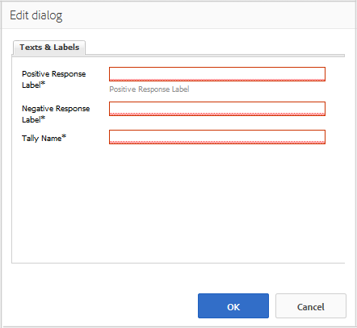

# Utilisation du vote {#using-voting}

Le composant `Voting` est un outil utile qui permet aux membres de la communauté d’évaluer un élément de contenu particulier, tel qu’une réponse dans un composant QnA. Avec le composant `Voting`, les membres sélectionnent les flèches vers le haut ou vers le bas pour indiquer leur opinion.

## Ajout d’un vote à une page {#adding-voting-to-a-page}

Pour ajouter un composant `Voting` à une page en mode Création, utilisez l’explorateur de composants. Recherchez `Communities / Voting` et faites-le glisser sur une page, par exemple une position relative à la fonction sur laquelle les utilisateurs pourront voter.

Pour plus d’informations, consultez [Principes de base des composants de communautés](basics.md).

Lorsque les [bibliothèques côté client requises](essentials-voting.md#essentials-for-client-side) sont incluses, le composant `Voting` s’affiche de cette manière.

## Configuration du vote {#configuring-voting}

Sélectionnez le composant de `Voting` placé afin de pouvoir accéder à l’icône de `Configure` qui ouvre la boîte de dialogue de modification et de la sélectionner.

Sous l’onglet **[!UICONTROL Textes et libellés]**, spécifiez les propriétés utilisées pour enregistrer les votes.

* **[!UICONTROL Libellé de réponse positive]**

  (*Obligatoire*) Nom de propriété interne d’une réponse positive.

* **[!UICONTROL Libellé de réponse négative]**

  (*Obligatoire*) Nom de propriété interne d’une réponse négative.

* **[!UICONTROL Tally Name]**

  (*Obligatoire*) Nom de propriété interne identifiable pour cette instance d’un composant votant.

## Expérience du visiteur du site {#site-visitor-experience}

### Membres {#members}

Les membres ne peuvent voter qu&#39;une seule fois, mais ils peuvent changer leur vote à tout moment.

### Anonyme {#anonymous}

Le vote anonyme n’est pas pris en charge. Les visiteurs et visiteuses du site doivent s’inscrire (devenir membre) et se connecter pour participer au vote une fois.

## Informations supplémentaires {#additional-information}

Pour plus d’informations, consultez la page [Voting Essentials](essentials-voting.md) destinée aux développeurs et développeuses.
